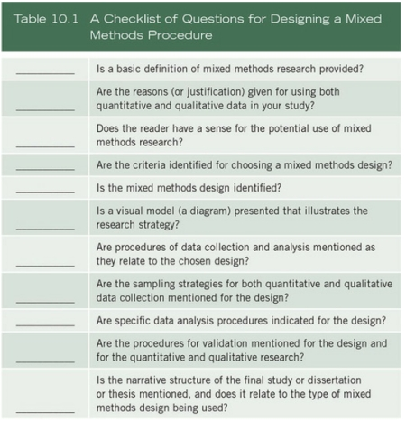

#### COM00146M Research Methods
# **Week 2 - Research Methods and Methodologies**

## **2.0 Table of Contents**

- [**2.0 Table of Contents**](#40-table-of-contents)
- [**2.1 Learning Objectives**](#21-learning-objectives)
- [**2.2 Summary**](#22-summary)
- [**2.3 Research Termingology And Definitions**](#23-research-termingology-and-definitions)
  * [**2.3.0 Reading**](#230-reading)
  * [**2.3.1 Research Terminology**](#231-research-terminology)
  * [**2.3.2 Methods And Methodologies**](#232-methods-and-methodologies)
    + [**Methodology**](#methodology)
    + [**Methods**](#methods)
    + [**Sage Resources**](#sage-resources)
  * [**2.3.3 Model For Research**](#233-model-for-research)
  * [**2.3.4 Mixed Methods Procedures**](#234-mixed-methods-procedures)
    + [**Components**](#components)
    + [**Explaining The Approach**](#explaining-the-approach)
    + [**Mixed Methods Designs**](#mixed-methods-designs)
    + [**More Complex Designs**](#more-complex-designs)
    + [**Choosing Designs**](#choosing-designs)
  * [**2.3.5 Research Strategy**](#235-research-strategy)
    + [**Quantitative Strategies**](#quantitative-strategies)
    + [**Qualitative Strategies**](#qualitative-strategies)
    + [**Mixed Methods Strategies**](#mixed-methods-strategies)
- [**2.4 Research Approaches**](#24-research-approaches)
  * [**2.4.0 Reading**](#240-reading)
  * [**2.4.1 Research Approaches**](#241-research-approaches)
    + [**Mixed Methods**](#mixed-methods)
  * [**2.4.2 The Use Of Theory**](#242-the-use-of-theory)
    + [**Quantitative Use**](#quantitative-use)
    + [**Qualitative Use**](#qualitative-use)
    + [**Mixed Methods Use**](#mixed-methods-use)
  * [**2.4.3 Theory Testing or Building**](#243-theory-testing-or-building)
    + [**Deductive**](#deductive)
    + [**Inductive**](#inductive)
    + [**Abductive**](#abductive)
  * [**2.4.4 Purpose Of Research**](#244-purpose-of-research)
- [**2.5 Understanding Research Philosophies**](#25-understanding-research-philosophies)
  * [**2.5.0 Reading**](#250-reading)
  * [**2.5.1 Research Philosophies**](#251-research-philosophies)
    + [**Assumptions**](#assumptions)
    + [**Philosophy**](#philosophy)
- [**2.6 Literature Reviews**](#26-literature-reviews)
  * [**2.6.0 Reading**](#260-reading)
  * [**2.6.1 Literature Reviews**](#261-literature-reviews)
    + [**General Approach**](#general-approach)
    + [**Organisation**](#organisation)
    + [**Outcome**](#outcome)

---
&emsp;
## **2.1 Learning Objectives**

* **MLO1, MLO2, MLO4** - Show a clear understanding of common research approaches
* **MLO1, MLO3** - Evidence knowledge on research strategies
* **MLO3** - Demonstrate an understanding of validity issues
* **MLO2, MLO4** - Understand differences between methods and methodologies

---
&emsp;
## **2.2 Summary**

Research methods include experiments, surveys, interviews, and observations, while research methodology refers to how problems are solved systematically. 

Research design considers data collection, measurement, and analysis. Approaches can be deductive, inductive, or abductive. 

Literature reviews seek to establish what is known and identify starting points for research questions. Refereed journals, books, and conference papers are preferred over dissertations.

---
&emsp;
## **2.3 Research Termingology And Definitions**

### **2.3.0 Reading**
* *Required: Chapter 10, Research Design: Qualitative, Quantitative, and Mixed Methods Approaches, Creswell and Creswell*
* *Required: Chapter 1, Research Design: Qualitative, Quantitative, and Mixed Methods Approaches, Creswell and Creswell*
* *Extension: Chapter 2, Writing for Computer Science, Zobel*
* *Extension: Chapter 3, Writing for Computer Science, Zobel*

&emsp;
### **2.3.1 Research Terminology**

Terminology used to describe research and activities, varying in degrees of abstraction and visiblity. 

**Research methods** include all the techniques adopted to conduct the research. This may be thought of the data collection methods, such as experiments, surveys, interviews, observation etc.

**Research methodology** is the way in which the problems are systematically solved. This the examines how research is conducted, the steps taken, and the logic behind those steps.

**Research approaches** relate to qualitative, quantitative, and mixed methods approach to research. 

**Research design** considers the what, when, how much etc of a research project.
* It is the conceptual structure in which the research is constructed
* It should also include the blueprint for collection, measurement, and analysis of data
* The main three types: **exploratory**, **descriptive** and **diagnostic**, and **hypothesis testing**
    
**Research philosophy** refers to the beliefs and assumptions about the development of knowledge.
* **Ontological assumptions** – relates to the nature of reality and the real world
* This includes the perceptions of the world the research is in, which influences the choices
* **Epistemological assumptions** – relating to human knowledge
* This includes how and what we accept as valid or legitimate knowledge
* **Axiological assumptions** – the way personal values influence the research process
* This includes ethics and values held and must be recognised in the research
    

  

**Research paradigms** refer to the researcher’s philosophical stance or world view.
* At its simplest level, paradigms can be split into two principal paradigms
* These are **positivism** and **interpretivism**
* Each shape and inform the views held on the research
* In turn, they affect the ontological, epistemological, and methodological choices made 

  

&emsp;
### **2.3.2 Methods And Methodologies**

Research methodology overlaps with method, logic and assumption.

  

&emsp;
#### **Methodology:**

**Research methodology** explains the method used to solve the problem or answer the question. It is an examination of the steps taken and the logic behind them.

  

Qualitative research is an approach for exploring and understanding the meaning individuals or groups assign to a social or human problem. This includes:
* **Content Analysis** – derived from interviews, focus groups, surveys, videos etc…
* **Historical** – studying and understanding past events to explain current ones
* **Ethnographic** – observing groups of people in their environments

Quantitative research is an approach for testing theories by examining relationships between variables.
* **Experimental** – research which keeps a set of variables constant and measures others
* **Quasi-experimental** – manipulation of presumed cause to discover their effects
* **Causal-comparative** – attempts to identify a cause-and-effect relationship
* **Correlational** – attempts to examine how related two or more variables are
* **Single subject** – a unique type that facilitates intervention through a particular case
* **Meta analysis** – a statistical technique for reviewing previous quantitative research
* **Survey** – a collection of information from a sample of individuals 

Mixed methods research is an approach involving both previous types of data. 
* **Research by practitioner** – participants examine their own practice to improve it

&emsp;
#### **Methods:**

**Research methods** describe the specific techniques and instruments used to answer the question.
* **Statistics** – analyse data rather than just describe it, helps tell a narrative
* **Literature reviews** – building and relating research to existing knowledge
* **Interviews** – a qualitative technique exploring perspectives on a particular idea
* **Focus groups** – like interviews but in larger groups with more participant interaction 
* **Dissertations** – a long form written method by which to deliver the results
* **Research design **– determining the needs to be able to answer the question
* **Surveys** – questioning individuals about topics and then describing their responses
* **Case studies** – analyse the specific issues within the boundaries of a specific environment
* **Experiments** – used to analyse cause and effect relationships
* **Observations** – collects data through observation

&emsp;
#### **Sage Resources:**

[Sage Research Methods](https://methods-sagepub-com.libproxy.york.ac.uk/) is an online resource for material concerning the research process. An overview video with instructions is available [here](https://youtu.be/rppKj7xHA-I).

&emsp;
### **2.3.3 Model For Research**

There is a natural order which connects key elements of the research process. Understanding these connections and which elements logically lead to others is essential to designing quality research. 

  

The process itself can be depicted as an onion, with data collection buried within the core:

  

Alternatively, the starting point for research can influence where to begin the process. Typically t his is the problem or issue, but not always:

  

Also note that research is not a linear process, even through models may depict is as such for clarity.

&emsp;
### **2.3.4 Mixed Methods Procedures**

Qualitative and quantitative data both have their own limitations and strengths. Combining the strengths of both can provide stronger understanding of the question or problem at hand.

Through doing this **mixed methods** research seeks to provide more insight into issues.

&emsp;
#### **Components:**

Mixed methods research has evolved into a set of procedures that researchers can use to plan:

  

&emsp;
#### **Explaining The Approach:**

Due to the nature of mixed methods research, it is useful to provide a basic description of the approach in the method section of a proposal. This could include describing:
* Definition – collecting and analysing both data types through merging, explaining etc…
* Terminology – sometimes it is referred to as integrating, synthesis, or multimethod
* Background – originating in the last 1980s and continues to be iterated over
* Reasons to choose – provides sophisticated, complex, contextual analysis 
* Design – explain the rationale behind its selection over others
* Challenges – extensive data collection, time intensive analysis, knowledge of data types

Additionally, illustrating the process using a diagram can be helpful for the reader.

&emsp;
#### **Mixed Methods Designs:**

There are three core mixed methods design: 
* **Convergent** – collects both quantitative and qualitative data concurrently
* **Explanatory sequential** – collects and analyses quantitative data first, then qualitative 
* **Explanatory sequential** – collects and analyses qualitative data first, then quantitative

  

The **convergent** mixed methods design is one of the most familiar of the approaches:
* It is a single-phase approach where both quantitative and qualitative data is collected
* These are analysed separately then compared to see if the findings confirm each other

The key is to collect both forms of data using the same or parallel variables, constructs, or concepts.

Data analysis in this design consists of three phases:
* Analysing qualitative data
* Analysing quantitative data
* Integrating both data sets

Deciding how to merge the two databases is a challenge, as it is not intuitive. This can be done with side-by-side comparison, transforming qualitative values to numeric ones, or joint display on a graph.

The **explanatory sequential** mixed methods design in a two-phase data collection project.
* The first phase involves collecting quantitative data and analysing the results
* These then inform the planning of the second qualitative phase
* The intent is to have the second phase data explain the initial results

Data collection involves rigorous quantitative sampling and purposeful sampling in the second. The challenge comes from selecting which quantitative results to follow up on and what participants will be needed.

The researcher brings the project together as follows:
* Both data sets are analysed separately
* They are combined by connecting quantitative results to qualitative data
* Interpretation of these results occurs in the discussion section of the study
* First phase results are reported first and then the second phase results
* The interpretation section explores how the qualitative explains the quantitative

The **exploratory sequential** mixed methods design is a three-phase approach.
* This begins with qualitative data collection and analysis
* A feature is developed to be tested in the second phase, such as a new website
* Testing occurs in the third, quantitative phase

This approach seeks to explore a sample first, to ensure the final phase can measure the needs of the sample.

Data collection occurs twice: during the initial qualitative phase, involving variables grouped into items or themes, and in the third quantitative phase. 

The analysis and integration of data occurs separately in the two datasets.
* The results from the initial dataset informs the building of a feature for analysis
* It is important to draw samples from the same population for both phases
* However, individuals should not be the same, to avoid additional factors being introduced

&emsp;
#### **More Complex Designs:**

Complex mixed methods designs involve more steps and procedures than the core designs.

A framework for complex methods has been suggested. This includes designs that:
* Intersect a secondary method within a primary quantitative or qualitative design
* Intersect mixed methods with another methodology
* Intersect mixed methods within a theoretical framework

Four examples of more complex designs include **experimental intervention**, **multi-phase**, **sequential explanatory strategy**, and **sequential transformative strategy**.

&emsp;
#### **Choosing Designs:**

The choice of which design to use is based on factors such as procedural and practical considerations.
* Choice should be based on outcomes expected 
* The integration of the datasets determines which strategy to be used
* Timing of the data collection and emphasis on each data set is also a factor

&emsp;
### **2.3.5 Research Strategy**

A **research strategy** is a plan of how to conduct the research, connecting theoretical aspects with more practical elements of how to collect and analyse data.

&emsp;
#### **Quantitative Strategies:**

**Experiments** involve making controlled changes to a variable for an experimental group with other variables being constant, and observing the effect to test a hypothesis. 

**Surveys** are a mechanism to gather primary data from a population or sample. 

&emsp;
#### **Qualitative Strategies:**

**Ethnography** is a study of a cultural group in a natural setting over a prolonged period, collecting primarily observational and interview data.

**Action research** involves close collaboration between researchers and practitioners to make a change through cycles of action and reflection, with the aim of achieving measurable benefits for a community.

**Grounded theory** derives a general, abstract theory of a process grounded in the views of those studied.

**Narrative inquiry** studies the lived experiences of individuals using story and histories.

&emsp;
#### **Mixed Methods Strategies:**

**Archival** and **documentary research** involves searching for and extracting evidence from documents and archival records.

**Case study** is an in-depth exploration of a bounded program, event, activity, process, individuals, or groups using various data collection methods over a sustained period.

---
&emsp;
## **2.4 Research Approaches**

### **2.4.0 Reading**
* *Required: Chapter 3, Research Design: Qualitative, Quantitative, and Mixed Methods Approaches, Creswell and Creswell*
* *Required: Chapter 1, Research Design: Qualitative, Quantitative, and Mixed Methods Approaches, Creswell and Creswell*
* *Extension: none*

&emsp;
### **2.4.1 Research Approaches**

Once the research question and variables have been defined, the research setting can be established.
* **Applied research** takes place in a neutral environment where people act normally
* This seeks to address practical questions
* **Basic theoretical research** is more likely to take place in a laboratory
* This expands on a theory with no direct application needed

Next, the methodology is chosen. This could include:
* Quasi-experimental approaches to see how changes affect behaviour
* Case studies to obtain a rich body of data on a few individuals
* Generally qualitative orientated research will provide more holistic approaches

Each research approach can be broadly characterised as follows:

  

&emsp;
#### **Mixed Methods:**

It is recommended to select a mixed methods approach if neither other option provides a full understanding of the research problem.

It requires skill in both quantitative and qualitative research to be successful.

A feminist mix methods study or multi-phase mixed methods designs are some of the emerging forms.

&emsp;
### **2.4.2 The Use Of Theory**

**Theories** can be used in quantitative, qualitative, and mixed methods studies.
* Quantitative research often involves testing hypothesis derived from theories
* An entire section of a proposal may be devoted to presenting the broader guiding theory
* Qualitative research generally has a more varied use of theory
* It may provide a lens that shapes the study or be generated as the final outcome 
* Mixed methods research may both test and generate theories
* This could involve a theoretical framework

&emsp;
#### **Quantitative Use:**

**Causality** means the variable X causes variable Y. 
* A **confounding variable** Z can obscure causality 
* Therefore, it must be measured to establish causal claims
* True experiments provide the best control over these confounding variables

Survey methods can be used to established hypothesized associations between variables if experiments cannot be conducted.

**Variables** refer to the characteristic or attribute of an individual or group that can be measured.
* These are distinguished by two characteristics: **temporal order** and **measurement**
* **Independent** variables influence outcomes in experimental studies
* They are independent as they are manipulated and free of other influences
* **Dependent** variables depend on independent variables
* They are the outcomes or results of the influence of independent variables
* **Predictor** variables are used to predict an outcome of interest
* They are hypothesised to affect outcomes, but cannot be systematically manipulated
* **Outcome** variables are the results of predictor variables in survey method studies
* **Intervening** or **mediating** variables stand between independent and dependent variables
* They provide a quantitative assessment of how the independent variable exerts effects
* **Moderating** variables are predictors that affect the direction and strength of relationships

A **theory** in quantitative research is an interrelated set of constructs or variables formed into propositions or hypotheses that specific the relationship among variables, in particular strength or direction.

A theoretical perspective provides an explanation for how and why one would expect the independent variable to explain or predict the dependent variable. These can vary in their breadth of coverage. 

Researchers can use different ways to state their theories in research proposals. These include:
* Interconnected hypotheses
* If-then statements 
* Visual models

Visual models can be constructed by drawing upon Blalock’s work on causal models, for example:
* Independent variables should be placed on the left, dependents on the right
* One way arrows should lead from each determining variable to each dependent on it
* Strength of relationship is indicated by valence signs on the paths
* Two headed arrows show the unanalysed relationships between variables

  

In quantitative studies, theory is used **deductively** and place towards the beginning of the study.
* The objective testing of a theory is more important than developing it
* The theory becomes a framework for the entire study, organising sections
* Hypotheses derived from the theory contain variables that need defining by literature

&emsp;
#### **Qualitative Use:**

Qualitative researchers use **theory** in several ways:
* An explanation for behaviour and attitudes
* As a theoretical lens that shapes the study, such as selecting participants to study

Some of the theoretical perspectives available to researchers include feminist perspectives, radicalised discourses, critical theory perspectives, queer theory, and disability inquiry.

Qualitative studies may also involve building broad themes from the data to form generalised theories through an **inductive** process.

Placement of the theory in the study is informed by how it is used.
* Cultural or theoretical lens studies may place the theory at the beginning
* If development of a theory or pattern is the goal, it logically appears at the end

&emsp;
#### **Mixed Methods Use:**

**Theory** use in mixed methods can be **deductive** or **inductive**, qualitative or quantitative.

Two types of overarching frameworks for mixed methods research have been derived from diverse theories.

The first is **social science** theory use:
* Theories should be from social science areas such as economics or behavioural change
* They should be placed at the beginning of the study to guide the questions and collections
* How the theory informs quantitative and qualitative components should be stated
* Diagrams of the theory should be included
* The theory should be revisited at the end of the study and reviewed

The second is **participatory social justice theory** use, which involves participants collaboratively in research to address inequalities.

Overall, using theory in mixed methods research can help explain or predict relationships between variables and provide a bridge between them.

&emsp;
### **2.4.3 Theory Testing or Building**

Deciding if research is taking a theory testing or a theory building approach is important.

The following approaches are not mutually exclusive. A research and combine different types in the same research, depending on the purpose and research question.

&emsp;
#### **Deductive:**

The **deductive approach** uses **priori** questions or hypothesis to test through experiment or observation.
* This is associated with positivism and scientific inquiry
* It relies on testing hypotheses against pre-defined indicators and objective data
* The approach is criticised for answering what is happening, not explaining how or why
* Characteristics include: theory testing, explaining causal relationships, objective data 

&emsp;
#### **Inductive:**

The **inductive approach** establishes facts from within the data to build theories or concepts.
* This is associated with interpretivism and grounded theory
* It relies on observation and empirical data to establish patterns and meanings
* Criticism derives from the risk of making erroneous inferences from subjective processes
* Characteristics include: theory building, generalisation, subjective data

&emsp;
#### **Abductive:**

The **abductive approach** uses logical inference to determine the course of the research.
* It therefore aims for the best possible explanation
* Both quantitative and qualitive data is used 
* It is used in various fields, such as AI, economics, and theology
* Characteristics include: theory modification, pragmatist paradigm, both data types

&emsp;
### **2.4.4 Purpose Of Research**

Research projects are conceived largely to inform and resolve problems.

The **research purpose** lays the foundation for the logic behind the research and affirms the reasons for it.
* It establishes the approach and the data required to achieve the answer
* **Exploratory** – gains new insights into a problem to generate future research ideas
* **Descriptive** – confirms existing understanding of a phenomenon
* **Explanatory** – explaining causal relationships to understand a phenomenon
* **Scientific** – quantitative methods to prove a formal hypothesis true or false
* There can be overlap between these categories

The **purpose statement** follows the identification of the purpose of the research by the researcher and includes the intent of the research project, explains the reason for it, and what can be expected.
* The language should be indicative of the philosophical stance of the researcher
* A good statement should be clear and concise
* It is important for communicating intentions to interested parties

These **stakeholders** have an invested interest in research and can enable or limit the process.

Multiple stakeholder perspectives can lead to different interpretations of the purpose of the research. 

Stakeholders may be present as individuals or groups formed explicitly to guide research.

---
&emsp;
## **2.5 Understanding Research Philosophies**

### **2.5.0 Reading**
* *Required: Chapter 1, Research Design: Qualitative, Quantitative, and Mixed Methods Approaches, Creswell and Creswell*
* *Extension: [Transformative Paradigm: Mixed Methods And Social Justice, Mertens](https://yorsearch.york.ac.uk/44YORK:default_scope:TN_sage_s10_1177_1558689807302811)*

&emsp;
### **2.5.1 Research Philosophies**

**Research philosophy** refers to the system to beliefs and assumptions though which we develop knowledge.
* It describes how we think about the world and how we determine truth and reality
* These influence our interpretations, how we ascribe meaning to what we encounter

In practice, these assumptions shape how we perceive the initial research problem, how we formulate the research question, our choice of methods, and how we interpret data and draw conclusions.

Research philosophy contains important assumptions about:
* Reality (ontology)
* Knowledge (epistemology)
* Held values (axiology)

  

&emsp;
#### **Assumptions:**

**Ontology** relates to how we understand our reality and existence.
* **Objectivism** – entities exist independent of any social actors
* Structures such as organisations are independent and so a singular truth can be discovered
* **Subjectivism** – social entities are constructed through perceptions and interactions
* Individuals create multiple truths from their own experiences and interactions

**Epistemology** relates to gathering, communication, and validity of knowledge.
* **Positivism** – hard objective facts free from personal values
* This links to the scientific method in that knowledge is quantifiable and empirical
* **Interpretivism** – soft facts and subjective values are intertwined and hard to separate
* There are multiple interpretations, so knowledge is subjective and context specific

**Axiology** relates to how our own values influence our decisions.
* **Value free research** – researchers should not let personal values influence research
* **Value relevant research** – researchers should acknowledge their personal values
* **Value bound research** – the researcher is part of what is being researched

  

&emsp;
#### **Philosophy:**

The interdisciplinary nature of Computer Science makes prescribing an approach difficult.

Generally, the philosophy of Computer Science is concerned with:
* The ontological
* The methodological
* Ethical issues arising from the academic principle and practice of software development
* Analysis of computer artefacts
* Human made computing systems
* Lifecycle models of evolution
* Abstract nature of computer games

---
&emsp;
## **2.6 Literature Reviews**

### **2.6.0 Reading**
* *Required: Chapter 2, Research Design: Qualitative, Quantitative, and Mixed Methods Approaches, Creswell and Creswell*
* *Required: Chapter 3, Writing for Computer Science, Zobel*
* *Extension: none*

&emsp;
### **2.6.1 Literature Reviews**

**Literature reviews** are generally conducted after deciding on a topic but before deciding on a method. 
* This may be before or after a research question is formed, which may need to be revised
* The aim is to get the right amount of information to inform the study
* Being informed means establishing what is known and using it to frame the study
* A common mistake is to frame the study in complex or erudite language
* This can help decide on the most appropriate data collection and analysis methods

In **qualitative** studies the use of literature is varied but often aims to learn from the participants, whereas in **quantitative** studies literature is used to provide direction of research questions or hypotheses.

&emsp;
#### **General Approach:**

The main approach is to search online databases using key terms and citations.
* This could include **Athens**, **Shibboleth**, **JSTOR**, **Google Scholar** and **ProQuest**
* A good start is to identify key words and notable authors in the field
* Then, skim an initial group to form a broad syntheses of the literature
* Web search tools can find grey literature, for example abstract, scans government reports
* This can reveal key sources that require more in-depth reading
* Skimmed information can then be used to design a literature map
* Draft summaries of the most relevant articles should be created at this point
* The review itself should be structured thematically

  

Refereed journals, books, and conference papers are preferred over texts like dissertations.

A definition of terms section may be found included or separately from the review to clarify terms that go beyond common language or that individuals outside the field may not understand.

&emsp;
#### **Organisation:**

Information gathered should be organised and critically reviewed.
* Read the sources and make clear notes
* Organise readings by theme, author, and theoretical concepts or arguments
* Critical review the information and construct one or more research questions

&emsp;
#### **Outcome:**

The outcome of a literature review should be that:
* The researcher gains an extensive understanding of relevant theories or concepts
* Strengths and limitations of previous research is recognised
* Critical engagement helps identify logical starting points for the research questions