#### COM00147M Computer and Mobile Networks
# **Week 1 - An Introduction to Networks**

## **1.0 Table of Contents**

- [**1.0 Table of Contents**](#10-table-of-contents)
- [**1.1 Learning Objectives**](#11-learning-objectives)
- [**1.2 Summary**](#12-summary)
- [**1.3 Network Components**](#13-network-components)
  * [**1.3.0 Reading**](#130-reading)
  * [**1.3.1 Network Design**](#131-network-design)
    + [**Physical Design**](#physical-design)
    + [**Logical Design**](#logical-design)
  * [**1.3.2 Network Edge**](#132-network-edge)
    + [**DSL Access**](#dsl-access)
    + [**Cable Access**](#cable-access)
    + [**FTTH Access**](#ftth-access)
    + [**Satellite Access**](#satellite-access)
    + [**LAN and WLAN Access**](#lan-and-wlan-access)
    + [**Physical Media**](#physical-media)
  * [**1.3.3 Protocols**](#133-protocols)
- [**1.4 Network Models**](#14-network-models)
  * [**1.4.0 Reading**](#140-reading)
  * [**1.4.1 ISO/OSI Model**](#141-isoosi-model)
    + [**TCP/IP Model**](#tcpip-model)
  * [**1.4.2 Encapsulation**](#142-encapsulation)
- [**1.5 Packet and Circuit Switching**](#15-packet-and-circuit-switching)
  * [**1.5.0 Reading**](#150-reading)
  * [**1.5.1 Packet and Circuit Switching**](#151-packet-and-circuit-switching)
    + [**Comparison**](#comparison)
  * [**1.5.2 Measuring a Network**](#152-measuring-a-network)
    + [**Problems**](#problems)
    + [**Delays**](#delays)

---
&emsp;
## **1.1 Learning Objectives**

* **MLO1** - Explain and demonstrate the fundamental concepts and components used to describe networks
* **MLO1, MLO2** - Compare the theoretical ISO/OSI network stack with the TCP/IP implementation
* **MLO1** - Discuss the benefits and limitations of packet switching over circuit switching

---
&emsp;
## **1.2 Summary**

Various components are involved in network design. The physical design portion involves the layout, resources, and media used for transmission. The logical design portion involves the selection of layer models, protocols, and routing.

The OSI model provides a reference model for how devices can communicate without error. Where the OSI model is more theoretical, the TCP/IP model is an example of a practical communication implementation. 

Networks are measured using bits for speeds and bytes for capacity. Important measures include delay, loss, and throughput.

---
&emsp;
## **1.3 Network Components**

### **1.3.0 Reading**
* *Required: Chapter 1, Computer Networking: A Top-Down Approach, Kurose and Ross*
* *Extension: none*

&emsp;
### **1.3.1 Network Design**

At the basic level, networks have two types of design: physical and logical.

&emsp;
#### **Physical Design:**

**Physical design** encompasses all the physical devices and technology that communicate in a network:
* Layout of devices and connections, called **topology**, eg star, peer-to-peer bus, mesh
* End devices forming the interface between human and network, eg printers, servers
* Intermediary devices which provide connectivity, eg switches, hubs, routers
* Network media, meaning the channels over which data travels, eg Ethernet, wireless

  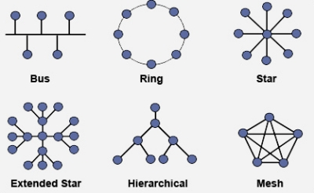

Icons denoting devices are standardised, with Cisco icons being widely used in documentation:

  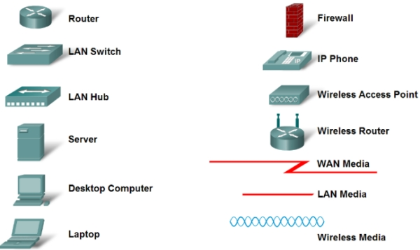

&emsp;
#### **Logical Design:**

**Logical design** refers to the configuration of devices, IP addressing schemes, and bandwidth protocols.

Such design is not technology dependent and can include:
* The set of rules to guide communication, known as protocols
* Layer models such as TCP and OSI
* IP addressing
* Network addressing
* Routing.
    
&emsp;
### **1.3.2 Network Edge**

Computers and devices connected to the internet are often referred to as **end systems**, as they sit at the edge of the internet, or **hosts**, as they host or run internet programs such as web browsers or email clients. 

Hosts can be further divided into two categories: **clients** and **servers**.

&emsp;
#### **DSL Access:**

**Digital subscriber line** (DSL) is typically provided by the telephone company (telco) providing the phone line:
* DSL modems use the existing twisted-pair copper wire to exchange data with a 
**digital subscriber line access multiplexer** (DSLAM) operated by the telco
* The modem takes digital data and translates it to high frequency tones for transmission over telephone wires, with the DSLAM translating the analogue signal back to digital
* Splitters separate incoming domestic data and phone signals, whereas the DSLAM is able to perform this function for the telco
* The maximum rate is limited by the distance between the home and the DSLAM, the gauge of the twisted pair line, and degree of electrical interference 

  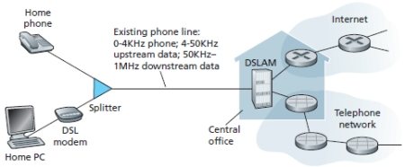

&emsp;
#### **Cable Access:**

**Cable** internet access uses existing the infrastructure used to provide cable television.
* Fibre optics connect the cable head end to the neighbourhood level junctions, from which traditional coaxial cable is used to reach individual houses
* The mixture of both fibre optic and coaxial cabling is often referred to as 
**hybrid fibre coax** (HFC)
* Special modems known as cable modems are required, like DSL modems, these are typically external devices connecting to devices through Ethernet ports
* At the cable head end, the **cable modem termination system** (CMTS) turns the analogue signal received from the cable modem back to digital 
* This is a shared broadcast medium, meaning heavy upstream use will slow transfer rates for customers on a node, and heavy downstream use will slow rates for everyone

  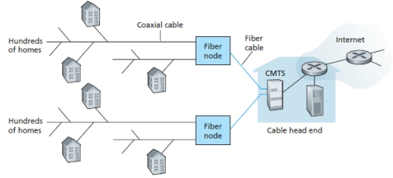

The most prevalent types of residential broadband access are digital subscriber line and cable.

&emsp;
#### **FTTH Access:**

**Fibre to the home** (FTTH) can provide much higher speeds than DSL or cable.
* FTTH provides an optical fibre path directly to the home
* The simplest type is called **direct fibre**, where one fibre is provided for each home
* More commonly, the fibre is shared and splits at a point relatively close to the home
* Two competing optical distribution network architectures exist: AON and PON
* **Active optical networks** (AONs) are essentially switched Ethernet
* **Passive optical networks** (PONs) use an optical network terminators (ONT)
* The splitter combines multiple OLTs to a single shared fibre
* This single fibre then connects to the telco’s optical line terminator (OLT)
* The user connects to the ONT and accesses the internet using a router not a modem
* All packets sent from the OLT to the splitter are replicated 

  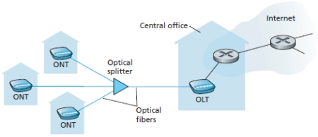

&emsp;
#### **Satellite Access:**

Internet access can also be provided through a **satellite link**. StarBand and HughesNet are example providers.

&emsp;
#### **LAN and WLAN Access:**

Corporate, university and increasingly domestic settings, a **local area network** (LAN) is used to connect an end system to the edge router.
* Many LAN technologies exist, however Ethernet is the most used
* Ethernet uses a twisted pair copper wire to connect to an Ethernet switch
* The switch is then connected to the wider internet through a router

  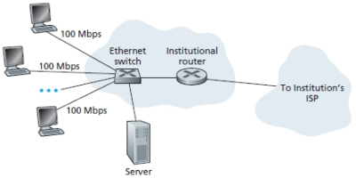

**Wireless LAN** allows users to connect to an access point which is connected to a wired internet solution.
* Such access is based on IEEE 802.11 technology, known as WiFi
* Typically, a wireless user must be within a tens of meters of the access point
* However, 3/4/5G and LTE allow users to be within tens of kilometres of access points

  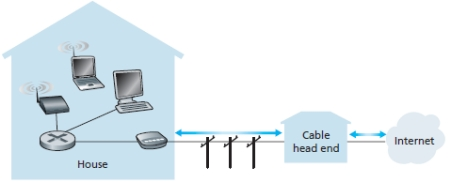

&emsp;
#### **Physical Media:**

Sending data from source to destination involves passing through a series of transmitter-receiver pairs.
* Pairs send data across a **physical medium** using electromagnetic waves or optical pulses 
* Physical media includes twisted pair copper wire, coaxial cable, or a radio spectrum
* There are two types of physical media: guided and unguided
* **Guided media** involves waves being guided along a solid medium like a cable
* **Unguided media** involves waves being sent through the atmosphere or space

**Twisted pair copper wire** is the least expensive and most used guided transmission medium.
* It consists of two insulated wires, about 1mm thick, arranged in a spiral pattern
* The wires are twisted together to reduced electrical inference from other pairs
* Multiple pairs are bundled together in a cable, wrapped in a protective outer layer
* Unshielded twisted pairs (UTP) is commonly used for networks within a building

**Coaxial cable** consists of two copper concentric conductors.
* With shielding, this construction allows for high data transmission rates
* It is commonly used in cable television systems and can be used as a guided medium

**Fibre optics** use a thin flexible medium that allows for pulse of light to be sent along the fibre.
* Each pulse represents a bit and a single fibre can support very high bit rates
* This medium is immune to electromagnetic interference and is hard to tap
* These characteristics make it preferred for overseas guided transmission

**Terrestrial radio channels** carry signals in the electromagnetic spectrum.
* Such mediums are attractive because they require no wires and can penetrate walls
* Three broad types exist: short distance (metres), local area (metres), wide area (kilometres)

**Satellite radio channels** link Earth-based microwave transmitters and receivers.
* There are two types of satellites are used in communications
* Geostationary satellites permanently remain in the same spot around the Earth
* Low Earth Orbit (LEO) satellites closely orbit the earth and may inter-communicate 

&emsp;
### **1.3.3 Protocols**

**Protocols** allow for communication between network devices to be organised and consistent.
* A protocol is an agreed set of actions in response to given situations
* In computing, this ensures data transfer occurs regardless of medium or devices used
* Translation will be needed if a connected device uses different communication protocols 

Common protocol terminology includes:
* Rules describe the instructions necessary for successful communication
* Groups of protocols operating in a communication layer are known as **protocol suites**
* Reference models refer to models like OSI and TCP/IP that standardise communication

Message **encoding** involves converting information into an acceptable form of transmission. 
* Data is changed from a human format to electrical signals as it moves across the network
* Decoding is the reverse process, allowing the data to be viewed as intended

  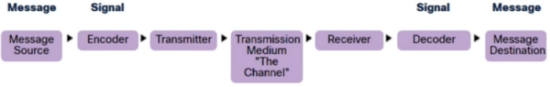

Messages sent can have a variety of delivery options:
* **Unicast** – one to one
* **Multicast** – one to multi
* **Broadcast** – one to all
* Broadcasts are used in IPv4 networks but are not an option for IPv6
* The IPv6 anycast is an additional delivery option 

---
&emsp;
## **1.4 Network Models**

### **1.4.0 Reading**
* *Required: Chapter 1, Computer Networking: A Top-Down Approach, Kurose and Ross*
* *Extension: Chapter 4, Distributed Network Systems, Weija and Wanlei*
* *Extension: Chapter 7, Computer Science: The Hardware, Software, and Heart of It, Fan Chung and Blum*

&emsp;
### **1.4.1 ISO/OSI Model**

The **Open System Interconnection** (OSI) model outlines standards for network protocols and communications.
 * It is a reference model published by the International Standards Organisation (ISO)
* The model defines 7 conceptual layers of a network
* Each layer provides a range of protocols to facilitate services to the layer above
* The top layer is closest to the user and the bottom layer is closest to the electrical signals

  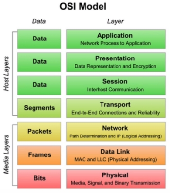

The Transport layer takes the whole message as one large data packet.
* It manages the reliable transfer of data from host to host
* Error detection is performed by the Data Link and Transport layers
* However, error correction is only done at the Transport layer
* Additionally, it is responsible for sending **Acknowledgements of Successful** transfer

Layering has conceptual and structural advantages: it provides a structured way to discuss systems components and the modularity makes it easier to update system components.

&emsp;
#### **TCP/IP Model:**

The **Transmission Control Protocol/Internet Protocol** (TCP/IP) is similar to the OSI reference model, specifically used in internet communication and similar networks.
* It contains 4 layers that overlap in functionality with the 7 layers of the OSI model
* Application layer functions as the interface between applications and the network
* Transport layer orders and assembles data packets for transmission
* Internet layer exchanges packets between networks
* Network Interface layer defines how to transfer packets between nodes

  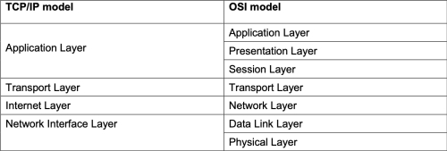

&emsp;
### **1.4.2 Encapsulation**

Data generated by the user, such as a file or email message, is referred to as **user data**. It is typically generated by an application outside the networking model.

The general process of encapsulation is illustrated below:
* User data is usually split into small sections for transmission across a network
* These are wrapped in headers, which detail destinations and the protocols applied
* At each layer of the stack, a header is added as the data is passed from layer to layer
* These **encapsulated** sections are known as packets
* At the receiving end, each header is removed as the packet is sent back up the stack 
* Note that encapsulation does not occur at the physical layer as it is raw physical cabling

  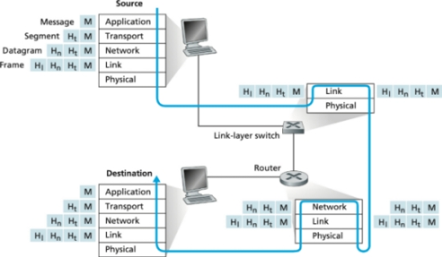

Packets that are sent a cross a network have a very particular structure regarding how the headers are arranged and what information they contain, as well as the size of the data they can hold.

---
&emsp;
## **1.5 Packet and Circuit Switching**

### **1.5.0 Reading**
* *Required: Chapter 1, Computer Networking: A Top-Down Approach, Kurose and Ross*
* *Extension: none*

&emsp;
### **1.5.1 Packet and Circuit Switching**

A packet traversing a network does not necessarily travel across a single direct line.
* Depending on the destination, it may need to travel across other networks or devices
* Some of the network devices are responsible for routing packets to their destination
* These devices are referred to as **packet switches**

Packet switched networks use a technique called **store-and-forward transmission**.
* This seeks to receive whole packets before forwarding them on
* Receiving devices have an **output buffer** to store packets as they arrive
* When there is a lot of network traffic, this buffer may hold more than one packet
* Inbound packets may arrive faster than outbound packets leave, creating a delay
* **Packet loss** occurs when a buffer exhausts its space resulting in packets being dropped 
* Some devices will drop partial packets in the buffer to make room for inbound packets

All packets have a sender and a receiver with the aim of getting the packet from one to the other.
* Packet switches need mechanisms to determine where to send incoming packets
* Two mechanisms for this are forwarding tables and routing protocols
* Each packet has a receiver address called an IP address
* When a packet arrives at a packet switch, it reads the IP address from the packet 
* This is then mapped against the internal **forwarding table** for an appropriate destination
* The system itself uses **routing protocols** to update these tables
* This is because network structure and traffic are constantly changing

**Circuit switched** networks reserve resources needed for communication for the duration of the session.
* This could include buffers or link transmission rates along the route
* A connection is established, data is transferred, and then it is disconnected
* It is not an overly efficient approach

&emsp;
#### **Comparison:**

Packet switching has several advantages over circuit switching. 
* It has minimal transmission latency 
* It is more fault tolerant as packets can use different paths if a resource is unavailable
* It is cost effective
* Thus, it is generally more efficient

However, there are also some disadvantages of using packet switching over circuit switching.
* Packet switching does not give an order to packets, but circuit switching does
* As packets are unordered, packet size is larger to hold additional sequencing data
* Complexity at each node is higher, as more information needs to be examined 
* Transmission delay is more likely due to rerouting of packets
* Therefore, for larger amounts of data, circuit switching may be better

&emsp;
### **1.5.2 Measuring a Network**

Networks are measured using **bits** for transfer speed and **bytes** for capacity, and their efficiency is determined by the flow of traffic. 

**Bandwidth** is the transmission speed of the media being used and is purchased from an ISP directly.

&emsp;
#### **Problems:**

There are three measures that are important to identifying network problems:
* **Delay** – where packets are delayed in delivery
* **Loss** – where packets are lost, resulting in re-transmission or poor-quality content
* **Throughput** – a measure of the time it takes to transmit data between two endpoints

&emsp;
#### **Delays:**

There are also four types of delay relating to packet switching:
* **Transmission delay** – the time taken to put the bits onto the medium
* **Propagation delay** – the time taken to get data from sender to recipient
* **Queuing delay** – caused by congested networks and hardware limitations
* **Processing delay** – time taken for the router to process packet headers and route them
