#### COM00147M Computer and Mobile Networks
# **Week 2 - Application Layer**

## **2.0 Table of Contents**

- [**2.0 Table of Contents**](#20-table-of-contents)
- [**2.1 Learning Objectives**](#21-learning-objectives)
- [**2.2 Summary**](#22-summary)
- [**2.3 Introduction to the Reference Model**](#23-introduction-to-the-reference-model)
  * [**2.3.0 Reading**](#230-reading)
  * [**2.3.1 Reference Model**](#231-reference-model)
    + [**Implementation**](#implementation)
  * [**2.3.2 Application Architecture**](#232-application-architecture)
    + [**Client-Server**](#client-server)
    + [**Peer-to-Peer**](#peer-to-peer)
  * [**2.3.3 Application Services**](#233-application-services)
- [**2.4 Building Applications**](#24-building-applications)
  * [**2.4.0 Reading**](#240-reading)
  * [**2.4.1 Building Applications**](#241-building-applications)
    + [**Socket Types**](#socket-types)
  * [**2.4.2 TCP Services**](#242-tcp-services)
    + [**Securing TCP**](#securing-tcp)
  * [**2.4.3 UDP Socket Programming**](#243-udp-socket-programming)
- [**2.5 Application Protocols**](#25-application-protocols)
  * [**2.5.0 Reading**](#250-reading)
  * [**2.5.1 Mail Protocols**](#251-mail-protocols)
    + [**SMTP**](#smtp)
    + [**POP3**](#pop3)
    + [**IMAP**](#imap)
    + [**HTTP**](#http)
    + [**MIME**](#mime)
  * [**2.5.2 HTTP Protocol**](#252-http-protocol)
    + [**Non-Persistent**](#non-persistent)
    + [**Persistent**](#persistent)
    + [**Response and Request**](#response-and-request)
  * [**2.5.3 Domain Name Service**](#253-domain-name-service)
    + [**Dynamic DNS**](#dynamic-dns)
    + [**Other DNS Services**](#other-dns-services)

---
&emsp;
## **2.1 Learning Objectives**

* **MLO1** - Identify and describe the application layer and its protocols and services, with reference to the OSI/ISO and TCP/IP models
* **MLO1, MLO2** - Apply application and transport layer protocols in a simple program
* **MLO1, MLO3** - Identify and compare different applications layer protocols, such as mail protocols, HTTP, DNS, and FTP
* **MLO1, MLO3** - Explain the client/server architecture from the perspective of HTTP communications

---
&emsp;
## **2.2 Summary**

The application layer is the top most layer of both the OSI and TCP/IP models. It provides network services and protocols enabling applications to communicate with other machines. Application architecture includes client-server and peer-to-peer approaches.

TCP and UDP are two common protocols used to transfer data across the internet. Where UDP is faster, TCP is more reliable and secure.

Email is an area which suitable protocols can be selected for a purpose from a range of options. Increasingly email is being accessed through web browsers using HTTP, which can utilise either persistent or non-persistent connections depending on the need.

---
&emsp;
## **2.3 Introduction to the Reference Model**

### **2.3.0 Reading**
* *Required: Chapter 2, Computer Networking: A Top-Down Approach, Kurose and Ross*
* *Extension: none*

&emsp;
### **2.3.1 Reference Model**

The **application layer** focuses on end-user applications.
* To access networks, software needs appropriate protocols included which it can initiate
* Unlike other layers, there are multiple protocols to choose from and not all are needed
* This can be seen in the different needs of email and video streaming clients

Protocols on this layer provide the initial **headers** for the user data. For example, in an email protocol space is provided to add sender and receivers email addresses.

The application layer accesses services provided by the **transport layer** below it. This determines:
* How communication between the two occurs
* Whether communication is connection orientated or connectionless
* What guarantees are made regarding to the services
* What type of security, if any, is applied

Topmost in both models are network applications and services that communicate with lower layers.
* These communicate through **TCP** and **UDP** ports
* Some layer components are utilities that collect information about network configuration
* Other components could include APIs, which provide services such as printing

  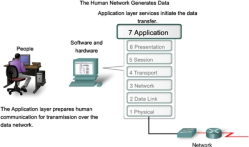

&emsp;
#### **Implementation:**

The OSI model is a theoretical approach whereas TCP/IP is an implementation of that theory. 

The **TCP/IP** implementation demonstrates not all OSI layers are required, as it merges the session, presentation, and application layers into a single layer.
* The OSI Presentation layer translates data into a neutral format
* It also handles any encryption and compression
* The OSI Session layer manages messages between applications on networked devices
* This also involves security and name recognition

  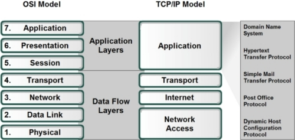

&emsp;
### **2.3.2 Application Architecture**

There are two types of architecture used to design networks involving communication between programs.

Note that network architecture refers to the organisation of communication into layers whereas application architecture relates to the broad structure of the application.

&emsp;
#### **Client-Server:**

The **client-server model** involves an end user (client) and processes performed at a centralised point (server).
* This approach enables multiple clients to use the centralised services of the server
* As the server is always on, clients do not have to be and can connect as they need to
* Thus it is clients instigate the communication and servers that respond 
* Note that clients do not communicate directly with each other 
* The server requires a known and fixed **IP address** for clients to contact
* Single server hosts are often incapable of keeping up with requests from many clients
* Thus, data centres housing many hosts are used to produce powerful virtual servers

  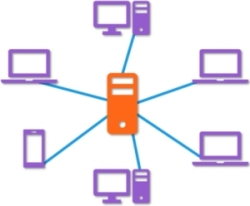

&emsp;
#### **Peer-to-Peer:**

**Peer-to-peer** (P2P) models do not require a server, instead enabling communication directly between devices.
* An application is typically used on devices that allows them to send and receive data
* These peers are not owned by service providers, rather they are **user machines**
* The approach is therefore cost effective as it doesn’t require server infrastructure
* As peers are not always on, there is no guarantee a device will be available
* A single peer is able to connect to multiple other peers, provided they are available
* This model is highly scalable, with peers generating workload and service capacity 
* However, it is hard to implement and maintain due to intermittent peer availability

  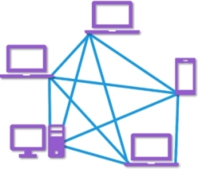

P2P applications face challenges of security, performance, and reliability due to their **decentralised** nature.

A common use is for file sharing:
* Each peer has space on their machine for files that can be shared across the network
* The application can search and catalogue the files available on other machines
* When a file that is needed is found, a direct connection between machines is established

&emsp;
### **2.3.3 Application Services**

Many of the services at this layer are network services and protocols link users to the local network.

Processes on another machine are identified using the IP address of the destination host and the port number of the socket in the destination process.

File and print services fulfil requests for file access and print services
* Print requests come from across the network 
* Requests move up the protocol stack on the host machine to the transport layer
* They are then routed through the appropriate port to the file server

**Domain Name Services** (DNS) provide name resolution for the internet and isolated TCP/IP networks.
* This runs at the application layer of the name server computer
* It communicates with other name servers to exchange name resolution information
* A user references a domain name, and the protocol software resolves it into an IP address

Redirection services intercept service requests in the host and checks the request can be fulfilled locally or needs to be forwarded to another machine on the network.

**Application Layer Interfaces** (API) are predefined collections of functions that programs can use to access other parts of the OS environment and communicate with them.

Some examples of internet applications and their layer protocols include:
* Web: HTTP
* File transfer: FTP
* Remote login: Telnet
* Email: SMTP

---
&emsp;
## **2.4 Building Applications**

### **2.4.0 Reading**
* *Required: none*
* *Extension: none*

&emsp;
### **2.4.1 Building Applications**

Programming languages need to provide APIs to allow developers to access or use the protocols at the application layer and connect to the transport layer.

These languages define a construct referred to as a **socket**, which manages the lower-level access requirements and so act as an interface between the application and transport layers for a program.

Generally, sockets have two main purposes:
* It listens to incoming requests, typically on the server side in client-server architecture 
* It is a means to send data onto the network

Sockets can be tailored to the specific environment and program requirements through several attributes.
* This includes predefined internal addresses known as **port numbers**
* Ports 0-1023 are well known or **system ports**, such as HTTP which listens to port 80
* Ports 1024-49151 are **registered ports**, preventing duplication
* Ports 49152-65535 are called **dynamic**, **private**, or **ephemeral ports**
* Socket addresses are formed from joining the host IP address and the port number

An example of communication using sockets is illustrated below:
* Computer A initiate’s connection to Computer B through its own port number
* A reply destination address is included by combining the port number and IP address
* The request also includes a data field indicating which socket to use when replying
* This is known as the PCA source socket address
* When received by B, a response is directed to the socket indicated

  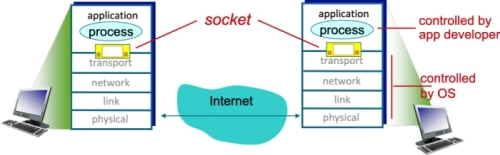

&emsp;
#### **Socket Types:**

There are two types of sockets:
* **UDP** - unreliable datagram, not secure, quicker than TCP, very little encapsulation
* **TCP** - reliable byte stream orientated, more secure, slower than UDP

Computers with server sockets usually keep a TCP and UDP port open to receive unscheduled data.

&emsp;
### **2.4.2 TCP Services**

The TCP service model includes a connection-oriented service and reliable data transfer service. When an application invokes TCP as its transport protocol, the application receives both services from TCP.

The TCP **connection-oriented service** has the client and server exchange transport layer control information with each other before application level messages can be sent.
* This is called **handshaking** and prepares the client and server for packet sending
* Once complete, a TCP connection is said to exist between the sockets of the processes
* The **full-duplex connection** lets both processes send messages at the same time
* When the application finishes sending messages, it must terminate the connection

The TCP **reliable data transfer service** ensures all data sent is without error and in the proper order.
* An application can pass a stream of bytes to a socket
* TCP will ensure the same stream is delivered to the receiving socket

&emsp;
#### **Securing TCP:**

Neither TCP nor UDP provide encryption: data passed to a socket is the same data that travels the network. This leaves data such as passwords vulnerable to packet sniffing if sent in cleartext.

Such security issues have resulted in the development of **Secure Sockets Layer** (SSL) to enhance TCP.
* SSL provides process-to-process security services 
* This includes encryption, data integrity and end point authentication
* It is an application layer enhancement to TCP, not a third internet transfer protocol

If an application wants to use SSL services, it needs to include specific SSL code in both the client and server sides of the application.

SSL has its own socket API that is similar to the traditional TCP socket API. 

When an application uses SSL:
* The sending processes passes cleartext data to the SSL socket
* SSL in the sending host encrypts the data and passes it to the TCP socket
* Encrypted data then travels over the internet to the TCP socket in the receiving process
* The receiving socket passes the encrypted data to SSL, which decrypts it
* Finally, SSL passes the cleartext data through its SSL socket to the receiving process

&emsp;
### **2.4.3 UDP Socket Programming**

UDP allows two or more processes running on different hosts to communicate.

The host IP address, the port number, and the actual data are collectively called a **packet**.

It is different from TCP in several ways:
* As a connectionless service, there is no handshaking to establish a communication pipe
* When UDP communicates, it attaches the destination address to each batch of data sent
* UDP is a **best-effort service**, meaning it does not guarantee a packet will be delivered

The following diagram shows the activity of UDP communication over a connectionless transport service:
* No handshake occurs
* The sender explicitly attaches destination IP and port number to each packet
* The receiver extracts sender IP and port number from the received packet
* Sent data may be received out of order or potentially lost
* There is no **security** or **checking mechanisms**

  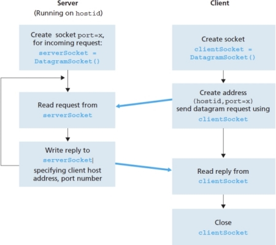

UDP may be useful for applications such as gaming, which need quick transfers with little need for security.

---
&emsp;
## **2.5 Application Protocols**

### **2.5.0 Reading**
* *Required: Chapter 2, Computer Networking: A Top-Down Approach, Kurose and Ross*
* *Extension: none*

&emsp;
### **2.5.1 Mail Protocols**

Electronic mail Is a good example of there being more than one protocol for a communication problem.

  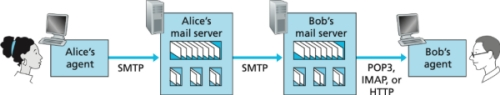

&emsp;
#### **SMTP:**

**Simple Mail Transfer Protocol** (SMTP) is the protocol that guides email communications.
* It defines how commands and responses must be sent back and forth
* It resides in the application layer of the TCP/IP stack
* It operates through port 25 on the SMTP server

Despite being ubiquitous on the internet, it is a **legacy technology** that contains some archaic features.
* Both the headers and body of the message is limited to 7-bit ASCII
* This makes modern multimedia orientated communications difficult
* As it is a push protocol, it cannot pull messages to devices 
* This means it needs a client using POP or IMAP to retrieve messages for the user

&emsp;
#### **POP3:**

**Post Office Protocol **(POP3) is an extremely simple mail access protocol with limited functionality.
* It is a pull protocol that is used by local email clients
* Clients can download and store emails from the server with an internet connection 

The POP3 process is as follows:
* A user agent (client) opens a TCP connection to the mail server on port 110
* POP3 then progresses through three phases
* **Authorisation** – sending the username and password in clear text to authenticate the user
* **Transaction** – the agent can retrieve messages, flag for deletion, or obtain statistics
* **Update** – the client sends a quit command
* When the POP3 session ends, messages marked for deletion will be deleted

The protocol can be configured to either **download and delete** or **download and keep** messages. The former can cause inconsistency in the emails available if multiple clients are used to access the server. 

The POP3 server does not carry state information across sessions, greatly simplifying implementation.

&emsp;
#### **IMAP:**

The **Internet Mail Access Protocol** (IMAP) is more complex than POP3.
* The IMAP server associates each message with a folder
* Incoming messages are usually associated with the Inbox folder
* Users can create folders and move messages for organisation 
* Messages can be browsed and searched without need for downloading them

IMAP servers use user state information across sessions, such as message-folder associations.

Additionally, a user agent can obtain components of messages. For example, only the message header can be retrieved. This is useful with low bandwidth connections or where there are security concerns.

&emsp;
#### **HTTP:**

Increasingly, users are accessing email through their web browsers, and thus **HTTP**.
* The user agent in this scenario is the web browser used 
* Communication with the remote mailbox is performed over HTTP

&emsp;
#### **MIME:**

**Multipurpose Internet Mail Extensions** (MIME) is used to identify the content of mail messages so that the correct encoding and decoding can be applied.

  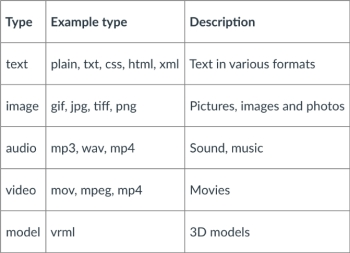

&emsp;
### **2.5.2 HTTP Protocol**

Web browsers use Hypertext Transfer Protocol to make requests for these specific types of pages. This request-response protocol uses TCP and is specifically designed for fetching web pages.

HTTP is implemented in two programs: a **client program** and a **server program**. 
* Examples of client programs include Chrome or Firefox
* Web servers implement the server side of HTTP and house Web objects
* Each is addressable through a URL

The HTTP server receives requests and sends responses through its socket interface.
* Once a message into its socket interface, it is out of reach of the sender
* These messages are controlled by TCP
* Therefore, any HTTP request or response sent will eventually arrive intact at the destination
* A strength of layer architecture: HTTP need not worry about internal functions of TCP 

It is important to note that the server sends requested files to clients without storing client state information.
* A particular client may repeatedly ask for the same object in a short time period
* The server will resend the information, forgetting about previous actions or requests
* Therefore, HTTP is said to be a **stateless protocol**

Resources intended to be accessible by HTTP need to be uniquely identified:
* Each resource resides on a server, which identifies itself with a **domain name**.
* Resources have a file name and may reside within a directory structure on the server
* Combining the domain name, directory structure, and file name gives a unique identifier
* This identifier and location access protocol is the **Uniform Resource Location** (URL)

&emsp;
#### **Non-Persistent:**

**Non-persistent** connections involve each request/response pair being sent over separate TCP connections.
* At most, one object is sent over the TCP connection
* Thus, downloading multiple objects requires multiple connections

**Round trip time** (RTT) describes the tie taken for a small packet to travel from client to server and then back to the client. It includes packet propagation delays, packet queuing delays, and packet processing delays.

  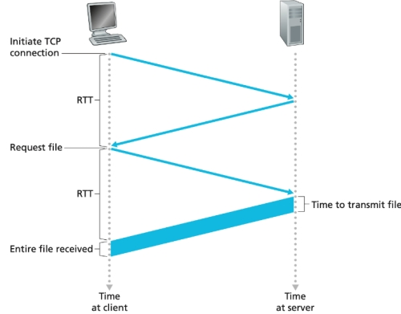

Such connections have disadvantages:
* Servers are put under increased load handling the repeated establishing of connections
* Each objects suffers a delivery delay due to the additional overheads

&emsp;
#### **Persistent:**

**Persistent connections** involve each request/response pair being sent over the same TCP connection.

The difference between persistent and non-persistent connections is illustrated below:
* The server leaves the TCP connection open after sending a response
* Subsequent requests and responses can be sent over the same connection
* Thus, multiple objects can be sent over a single TCP connection
* For example, entire web pages or multiple webpages can be sent 
* Requesting these objects back-to-back without waiting for replies is a form of **pipelining**

  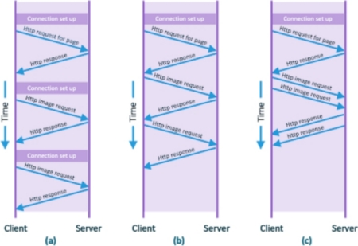

&emsp;
#### **Response and Request:**

There are two types of HTTP message: request and response.

The first line of a **request** is called the request line. Subsequent lines are called the header lines.
* The request line has three fields: method field, URL field, and HTTP version field
* The close header line indicates a persistent or non-persistent connection

  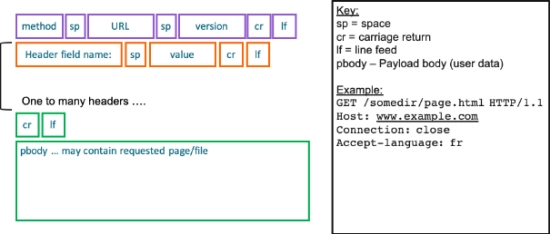

The **response** from the server may or may not contain the page requests.

It has three sections: an initial status line, six header lines, and then the entity body.

  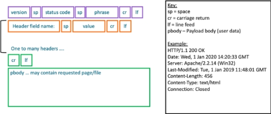

Various status codes may be sent depending on the actions taken
* 200 OK – the request succeeded, and the requested object follows
* 301 Moved Permanently – new location is given after
* 400 Bad Request – the request message was not understood
* 404 Not Found – the object was not found on the server
* 505 HTTP Version Not Supported – incompatible HTTP version used

&emsp;
### **2.5.3 Domain Name Service**

The **Domain Name Service** (DNS) acts as the internet’s directory service.
* It is an application layer protocol that uses UDP and port 53
* All DNS query and reply messages are sent within UDP datagrams to port 53
* It is not an application with which a user directly operates

Domain names need to be resolved to IP addresses that are used to route packets to destinations.
* Before an HTTP request is made, the domain name in the request needs to be resolved
* This results in separate communications to other servers providing DNS information

The DNS is a **distributed database** implemented in a **hierarchy of DNS servers**.
* DNS breaks information into manageable parts 
* This means no single server has all the information needed
* However, each server is responsible for keeping their parts up to date
* There are three classes of DNS server: **root**, **top level domain** (TLD), and **authoritative** 

  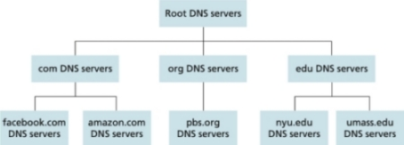

&emsp;
#### **Dynamic DNS:**

**Dynamic DNS** is a mechanism to handle domains that have dynamically changing IP addresses.
* IP addresses can be assigned by routers or servers each time a device is started
* This is performed by the hardware’s **Dynamic Host Configuration Protocol** (DHCP)
* DNS records on the router or server are updated once the IP address is allocated

This adds an additional delay, sometimes substantial, to applications that use it. To counter this, the desired IP address is often cached in a nearby DNS server to reduce DNS network traffic and delay.

&emsp;
#### **Other DNS Services:**

Hosts with complicated names can have one or more **host alias** names. 
* The hostname would be the **canonical host name**, eg relay1.west-coast.enterprise.com
* Multiple aliases can exist, eg enterprise.com, www.enterprise.com
* **Mail server aliasing** uses this to create mnemonic rather than difficult email addresses

DNS can be used for **load distribution**: distributing server load among replicated servers.