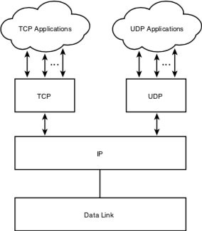
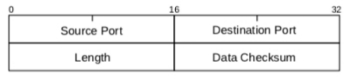
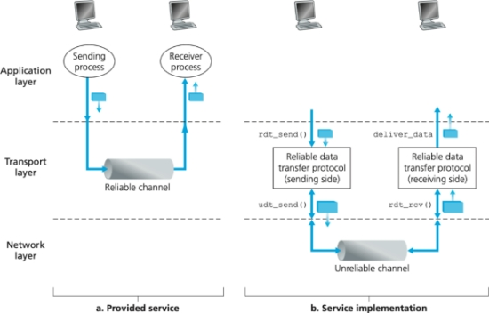
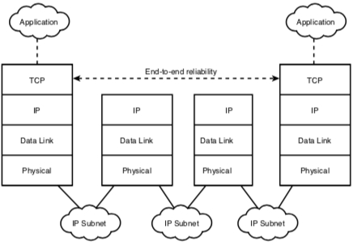
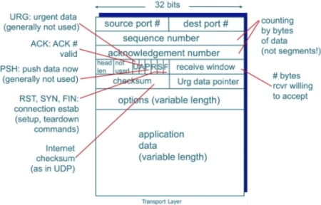
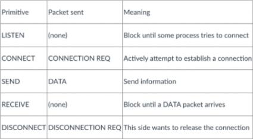
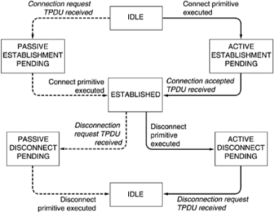
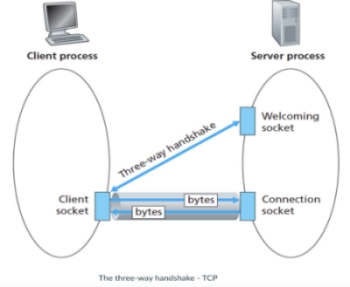
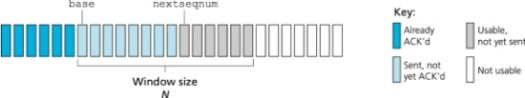

#### COM00147M Computer and Mobile Networks
# **Week 3 - Transport Layer**

## **3.0 Table of Contents**

- [**3.0 Table of Contents**](#30-table-of-contents)
- [**3.1 Learning Objectives**](#31-learning-objectives)
- [**3.2 Summary**](#32-summary)
- [**3.3 What is the Transport Layer?**](#33-what-is-the-transport-layer)
  * [**3.3.0 Reading**](#330-reading)
  * [**3.3.1 Transport Layer**](#331-transport-layer)
    + [**Implementation**](#implementation)
  * [**3.3.2 Transport Layer Protocols**](#332-transport-layer-protocols)
- [**3.4 UDP (Connectionless)**](#34-udp-connectionless)
  * [**3.4.0 Reading**](#340-reading)
  * [**3.4.1 Connections**](#341-connections)
    + [**UDP**](#udp)
    + [**Segment Structure**](#segment-structure)
  * [**3.4.2 Encapsulation**](#342-encapsulation)
- [**3.5 TCP (Connection)**](#35-tcp-connection)
  * [**3.5.0 Reading**](#350-reading)
  * [**3.5.1 TCP**](#351-tcp)
    + [**Segment Structure**](#segment-structure-1)
    + [**End-to-End Principle**](#end-to-end-principle)
    + [**Primitives**](#primitives)
    + [**Network Sockets**](#network-sockets)
    + [**Go Back N Protocol**](#go-back-n-protocol)
  * [**3.5.2 Ports and Sockets**](#352-ports-and-sockets)
    + [**Ports**](#ports)
    + [**Sockets**](#sockets)

---
&emsp;
## **3.1 Learning Objectives**

* **MLO1** - Identify and describe the transport layer, and its protocols and services, with reference to the OSI/ISO and TCP/IP models
* **MLO1, MLO2** - Apply application and transport layer protocols in a simple program
* **MLO1, MLO3** - Compare UDP and TCP (connectionless and connection-based protocols) and identify appropriate applications for each

---
&emsp;
## **3.2 Summary**

The transport layer sits below the application layer and above the network layer. Programmers generally have little control over the transport layer but can choose different protocols according to their need.

There are two prominent internet protocols. Firstly UDP, a lightweight connectionless protocol prioritising speed over security and reliability.

Secondly TCP, a connection-orientated protocol that guarantees delivery of data. Reliable data transfer is provided by protocols working with TCP, such as the sliding window Go Back N. However, these can have a negative effect on performance in some environments.

---
&emsp;
## **3.3 What is the Transport Layer?**

### **3.3.0 Reading**
* *Required: none*
* *Extension: none*

&emsp;
### **3.3.1 Transport Layer**

In a protocol architecture, the **transport layer** sits above the network layer and below the application layer.

The purpose of the transport layer is to provide a logical communication link between two end points.
* The application layer is not concerned with how it happens, the devices used, or distance
* The abstract view from the application layer is that points they communicate directly
* Transport layer protocols are typically the responsibility of the end devices

The transport layer generally does the following:
* Takes the user data from the application layer, wrapped in the relevant application protocols
* Breaks down large chunks of data into packets referred to as **segments**
* Adds transport layer headers to each of these segments
* Passes these segments to the network layer

There are multiple transport layer protocols, each one implementing the following differently:
* Reliable data transfer
* Throughput guarantees
* Timing guarantees
* Security

The focus will be on the two internet protocols, **Transmission Control Protocol** (TCP) and **User Datagram Protocol** (UDP) as examples of the different level of service provided at the transport layer.

  

&emsp;
#### **Data Transfer:**

The application layer uses sockets to pass data to and receive from the network.
* The socket acts as a door to the application itself
* The transport layer’s responsibility is to direct data to the correct socket
* It receives data from the layer below, the network layer

As data comes into the transport layer, the headers are read and removed to determine the socket the data is to be passed to. This is referred to as **demultiplexing**.

The opposite process, preparing to send data to the layer below, has the layer add headers as determined by the type of service selected (TCP/UDP). This process is referred to as **multiplexing**.

Whereas the physical network transports data between endpoints, the transport layer is abstractly delivering data between processes: from the socket of one application to another.

Each socket on a host machine has a unique identifier and the headers in the transport level protocol, which are wrapped around each segment, enable the identification of that socket.

&emsp;
### **3.3.2 Transport Layer Protocols**

Generally, a programmer has little control of the transport layer. However, they can select between different protocols which can offer different levels of service.

**Reliable data transfer** may be needed for an application, as networks can suffer from packet loss.
* Some protocols will guarantee all packets will arrive at the destination
* If selected, an application can pass its data to the socket without further concerns
* The socket will manage the rest of the process, according to the selected protocol
* Some applications, such as streaming video, are more tolerant to packet loss
* As these protocols add overheads, more tolerant applications may choose not to use them

As the volume of network traffic varies, some applications may require **throughput guarantees** to function.
* Protocols that can guarantee consistent throughput offer an advantage
* These types of applications are said to be **bandwidth sensitive**
* This could include applications such as live streaming
* Application such as email can function with more **elastic requirements** of bandwidth

Some applications have time sensitive communications that require **timing guarantees**. Defining the maximum amount of time for a communication can help ensure the real time feel of online gaming. 

Transport layer protocols can provide various types of **security** services to the application layer. These are selected when designing a program that sends data over the internet. This can include:
* Encryption
* Authentication
* Data Integrity

---
&emsp;
## **3.4 UDP (Connectionless)**

### **3.4.0 Reading**
* *Required: Chapter 3, Computer Networking: A Top-Down Approach, Kurose and Ross*
* *Extension: [A Guide to UDP in Java](https://www.baeldung.com/udp-in-java), Baeldung*
* *Extension: [A simple Java UDP Server and UDP Client](https://systembash.com/a-simple-java-udp-server-and-udp-client/), Systembash*

&emsp;
### **3.4.1 Connections**

Process to process connections come in two types: connection-orientated and connectionless.

A **connectionless protocol** does not require or enable any acknowledgements from the recipient. 
* The sender attaches the receivers address and send the data
* As there is no acknowledgement, the sender has no guarantee it has arrived
* This is used in UDP connections

A **connection-orientated protocol** does guarantee that the data has arrived at the receiver.
* The protocol initiates the connection through a handshaking process
* Data is checked for integrity and sequence, and its safe arrival is acknowledged
* This used in TCP connections

&emsp;
#### **UDP:**

**User Datagram Protocol** (UDP) is a connectionless protocol that uses the bare minimum to enable sending data between processes.

Two things need to be considered when selecting UDP:
* Is timely arrival of data more important than guarantee of arrival?
* Is the process tolerant to lost data?

UDP is mostly used for real time applications, where the programmer can have more control over how to respond to incoming/outgoing communications and manually manage lost data.
* It is much more flexible but requires more thought as to how to adapt to specific situations
* Reliability can be programmed into the application by design
* In effect, UDP leaves much of the protocol design up to the programmer

It is a lightweight protocol in terms of overhead and segment size.
* It does not maintain state information about the communication
* Potentially, an application can have communications with more clients than with TCP

UDP takes messages from the application process, attaches source and destination port number, adds two other small fields, and passes the resulting segment to the network layer.
* The network layer encapsulates the segment into an IP datagram
* It then makes a best effort attempt to deliver it to the host

&emsp;
#### **Segment Structure:**

The UDP header contains:
* Source port – the number of the application generating data
* Destination port – the port number of the receiving application
* Length – the length of the UDP header and the UDP data, in bytes
* **Checksum** – used for error checking, optional in IPv4 but mandatory in IPv6
* Note that the actual destination address (IP address) is added at the network layer.

  

One of the actions performed by the transport layer is to divide the application layer into chunks so there is a fixed size to the amount of data in each UDP segment.

&emsp;
### **3.4.2 Encapsulation**

When a host transmits data across a network to another device, the data gores through a process called **encapsulation**. This wraps the data with protocol information at each layer of the model.

To communicate and exchange information, each layer uses **Protocol Data Units** (PDU)
* These hold the control information attached to the data at each layer of the model
* They are usually attached to the header in front of the data field

At a transmitting device, the data-encapsulation method works as follows:
* User information is converted to data for transmission on the network
* Data is converted to segments and a reliable connection is established 
* Segments are converted to packets or datagrams 
* Packets or datagrams are converted to frames for transmission on the network
* Hardware addresses are used to uniquely identify hosts on the network
* Frames are converted to bits and a digital clocking scheme is used

  

---
&emsp;
## **3.5 TCP (Connection)**

### **3.5.0 Reading**
* *Required: Chapter 3, Computer Networking: A Top-Down Approach, Kurose and Ross*
* *Extension: none*

&emsp;
### **3.5.1 TCP**

**Transmission Control Protocol** (TCP) is a standard, general purpose method for reliable data delivery.
* Point to point – one server and one receiver, so doesn’t allow multicast or broadcast
* Reliable – an ordered byte steam
* Pipelined – TCP congestion and flow control set the window seize
* Full duplex data – bidirectional data flow in the same connection 
* Connection-orientated – handshaking initiates the state before the data transfer
* Flow control – sender will not be overwhelmed

Reliability is provided by adding services on top of IP, which does not guarantee delivery as it is connectionless.

  

Features of the protocol include:
* Basic data transfer
* Reliability
* Flow control
* Multiplexing
* Connections
* Precedence and security

&emsp;
#### **Segment Structure:**

The TCP header contains:
* Data is broken down into smaller chunks, appropriate for **maximum segment size** (MSS)
* Source and destination ports are needed for all transmissions 
* The header contains a checksum field, like UDP
* A sequence number is created to reflect the order of the packets created
* The acknowledge number helps provide reliable data transmission
* This is used to allow the sender to perceive the communication from the receiver’s side
* Positive (ACK) and negative (NAK) acknowledgements indicate receipt of segments 

  

TCP uses a timeout retransmit mechanism to recover lost segments.
* This timeout should be larger than the connections **round trip time** (RTT)
* This is the time taken from when the segment is sent to the when its acknowledged
* If this is too small, unnecessary retransmission occur
* If this is too big, the sender responds too slow to lost packets

TCP connections receive data in sequence and data is buffered for the application process to read from. 
* However, it can overflow if the application process is too slow to read the data
* This can also occur if too much data is received too quickly. 
* TCP has a **flow control** service to stop this occurring
* The server tells the client how much room is left in the buffer in its reply 

&emsp;
#### **End-to-End Principle:**

The **end-to-end principle** states that the transport issues are the responsibility of other endpoints and should not be delegated to the core network.

Data corruption and congestion are two issues falling under this category:
* All links on the internet have link-layer checksums to protect against data corruption
* However, TCP still adds its own checksum due to history of errors relating to routers
* TCP is essentially the only protocol that addresses congestion management

&emsp;
#### **Primitives:**

Programmers never see the network service but can see some **primitives**.

A connection-orientated transport interface must follow 5 principles:
* It must allow programs to establish, use, and release connections
* The **Transport Protocol Data Unit** (TPDU) sends messages between transport entities
* These are contained in packets for exchanging with the network layer. 

  

TPDU packets are then contained in frames for sending. 
* When a frame arrives, the data link layer processes the frame header 
* It then passes the contents of the frame payload up to the network entity
* The network entity then processes the packet header 
* It then passes the contents up to the transport entity

Execution of the protocol is shown below, where the left is the server and right is the client:

  

When a connection is no longer needed, it must be released to free up table space within the entities.

Disconnection has two varieties:
* **Asymmetric** - involves either side issuing a DISCONNECT primitive
* **Symmetric** - involves each side needing to disconnect independently of each other 
* This means a side has no more data to send but will still accept incoming data
* A connection is only released when both sides have issued a DISCONNECT

&emsp;
#### **Network Sockets:**

If the server process is running, the client can initiate a TCP connection as follows:
* The client creates a socket and specifics the address of the server process
* TCP in the client initiates a three-way handshake and established as TCP connection
* The server transfers this connection to a new socket for the specific client
* This handshake takes place at the transport layer and is transparent to the programs

  

**Unicast** communication, as above, is point to point and is used in equipment monitoring and alarms.
* Benefits include established protocols, easy of deployment, and low traffic burden
* Drawbacks include multiple messages being sent when communicating with multiple nodes

&emsp;
#### **Go Back N Protocol:**

**Go Back N** (GBN) is a sliding window recovery protocol.
* It allows a sender to transmit multiple packets without an acknowledgement.
* However, it is not allowed more than a set number, N, of unacknowledged packets

  

The receiver will only accept segments arriving in order, discarding out of order segments. It will always return an acknowledgement containing the sequence number of the last segment received.

The sender must wait for an acknowledgement once its sending buffer is full. Once received, it removes all the acknowledged segments from the buffer and uses a retransmission timer to detect segment losses.
* All unacknowledged segments are considered lost when the timer expires
* These will be retransmitted, and the timer restarted

Where packet loss occurs occasionally, this is good protocol. However, if losses are high performance drops as out of sequence segments aren’t accepted and unacknowledged segments are retransmitted.

&emsp;
### **3.5.2 Ports and Sockets**

TCP connections make use of sockets and ports.

&emsp;
#### **Ports:**

A **port** is a 16-bit number used by the host-to-host protocol to identify to which higher level protocol or application it must deliver incoming messages.

Some ports are considered **well-known**:
* These belong to standard servers, for example Telnet using port 23
* Ports in this category range from 1 and 1023
* Most servers use a single port, except for BOOTP using 68/767, and FTP using 20/21
* These ports are controlled by the ***Internet Assigned Number Authority*** (IANA)
* On most systems these can only be used by processes executed by admin users
* Well-known ports allow clients to find servers without configuration information

Other ports are considered **ephemeral**:
* Some clients communicate using the port numbers included in the TCP or UDP datagram
* Each client process is allocated a port number by the host for as long as it is needed
* Typically, these ports are in the range 1024-65535
* These are not controlled by IANA and can be used by most programs

Ports are dynamically assigned to applications requesting an available port from TCP/IP and can change each time they are run.

TCP, UDP, and ISO TP-4 all use the same principles for port management.

&emsp;
#### **Sockets:**

The socket interface is one of several application programming interfaces to the communication protocols.

A **socket** is a special type of file handle which is used by a process to request network services from the OS. 

Communications between the two processes are referred to as a **conversation**.

The **socket address** is in triple: <protocol, local address: local port>, eg <tcp, 192.168.16: 8080>.
* An **association** is the 5-tuple that completely specifies the two processes involved
* This is formatted as: <protocol, local address: local port, foreign address: foreign port>
* A **half association** specified the local or foreign part along with the protocol information
* This is also called a socket or transport address

TCP sockets provide a process with a full duplex byte stream connection to another process.

It uses the same port principle as UDP to provide multiplexing:
* Like UDP, TCP uses well-known and ephemeral ports
* Each side of a TCP connection has a socket identified by the triple address
* Two processes have a logical connection uniquely identifiable by the sockets involved
* Server processes can manage multiple conversations through a single port