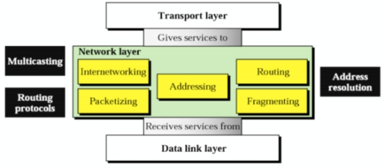
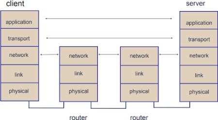
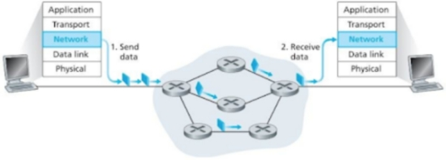
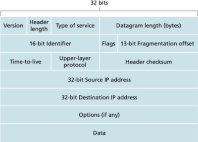
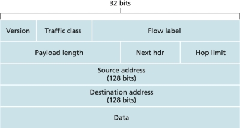
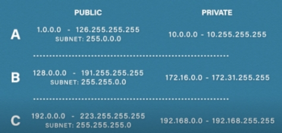
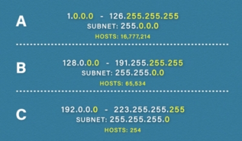
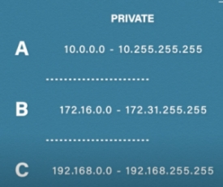
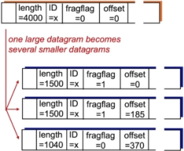
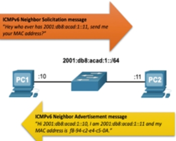

#### COM00147M Computer and Mobile Networks
# **Week 4 - Network Layer**

## **4.0 Table of Contents**

- [**4.0 Table of Contents**](#40-table-of-contents)
- [**4.1 Learning Objectives**](#41-learning-objectives)
- [**4.2 Summary**](#42-summary)
- [**4.3 What is the Network Layer?**](#43-what-is-the-network-layer)
  * [**4.3.0 Reading**](#430-reading)
  * [**4.3.1 Network Layer**](#431-network-layer)
    + [**Routing and Forwarding**](#routing-and-forwarding)
- [**4.4 IPv4 and IPv6**](#44-ipv4-and-ipv6)
  * [**4.4.0 Reading**](#440-reading)
  * [**4.4.1 Internet Protocols**](#441-internet-protocols)
    + [**IPv4**](#ipv4)
    + [**IPv6**](#ipv6)
- [**4.5 Network Addresses**](#45-network-addresses)
  * [**4.5.0 Reading**](#450-reading)
  * [**4.5.1 Network Addresses**](#451-network-addresses)
    + [**Classful Addresses**](#classful-addresses)
    + [**Private Addresses**](#private-addresses)
  * [**4.5.2 Fragmentation**](#452-fragmentation)
  * [**4.5.3 ARP**](#453-arp)
    + [**IPv6 Neighbour Discovery**](#ipv6-neighbour-discovery)

---
&emsp;
## **4.1 Learning Objectives**

* **MLO1** - Identify and describe the network layer, and its protocols and services, with reference to the OSI/ISO and TCP/IP models
* **MLO1, MLO3** - Compare and discuss IPv4 and IPv6, consider their implications on network design, and how transition between them occurs
* **MLO1, MLO3** - Critically evaluate routing algorithms in the context of a given problem
* **MLO1, MLO3** - Critically evaluate software defined networks in comparison to traditional networks

---
&emsp;
## **4.2 Summary**

The network layer attempts to get packets from the source to the destination. It is involved in forwarding packets within devices and routing packets across the whole network according to routing algorithms.

Two common protocols at the internet layer are IPv4 and IPv6. Increasingly, IPv6 is being used as it can properly support the vast numbers of devices accessing the internet, unlike IPv4 which requires additional protocols to attempt to handle this increase.

The Internet Protocol can be used to access the internet, construct networks, and may fragment data in order to handle large payloads.

---
&emsp;
## **4.3 What is the Network Layer?**

### **4.3.0 Reading**
* *Required: Chapter 4, Computer Networking: A Top-Down Approach, Kurose and Ross*
* *Extension: none*

&emsp;
### **4.3.1 Network Layer**

The **network layer** is concerned with getting packets from the source to the destination. 
* Packets may be required to make many hops across intermediate routers before arriving
* It is the lowest layer that deals with end-to-end transmission
* To achieve this, it must know about the topology of the communication network

One of the major responsibilities of the network layer protocol is **host-to-host data delivery**.
* The **Internet Protocol** (IP) governs the network layer of the internet, as above
* This means dealing with addressing, packetization, fragmentation, and routing
* Concepts such as **internetworking**, connecting various types of links together, are needed

  

There are two logical types of packet-switched networks: datagram networks and virtual circuit networks.

Some of the key roles of the network layer include:
* Encapsulating transport packets into datagrams on the sender side
* Delivering packets to the transport layer on the receiving side
* Providing protocols for routers: a router needs to examine the header fields in all packets
* **Forwarding** packets from router input to appropriate output
* Determining **routing** for packets from source to destination using **routing algorithms**

&emsp;
#### **Routing and Forwarding:**

Network functionality can be broadly divided into two planes:
* The data plane mainly involves packet **forwarding** 
* This refers to the internal transferring of packets from input interfaces to output interfaces
* The control plane mainly involves **routing** 
* This refers to the path packets take across the broader network to their destination
* Forwarding typically takes place over nanoseconds, whereas routing occurs over seconds

Before datagrams can flow, two end hosts and any intervening routers establish a **virtual connection** (VC).
* This allows the sender and receiver to set up the necessary state information
* For example, sequence numbers, initial flow control window size

  

On packet-switched computer networks, data is communicated in bit chunks called **packets**.
* Such that provide a connectionless, unreliable service are called **datagram networks**
* In datagram networks there is no concept of a session state in the network core
* Routers treat each datagram independently and their per-datagram behaviour is statistical
* The destination network address determines the choice of outgoing interface
* Therefore, different datagrams can take different paths across the network

  

---
&emsp;
## **4.4 IPv4 and IPv6**

### **4.4.0 Reading**
* *Required: Chapter 4, Computer Networking: A Top-Down Approach, Kurose and Ross*
* *Extension: none*

&emsp;
### **4.4.1 Internet Protocols**

The **internet layer** is responsible for exchanging packets over a network between identified end devices. 
* There are two common protocols to achieve this: **IPv4** and **IPv6**
* Both protocols provide devices with a unique IP address to allow for packet delivery

&emsp;
#### **IPv4:**

Due to the growth of the internet, IPv4 can no longer give unique addresses to every device. **Network Address Translation** (NAT) hides non-unique private IP addresses behind unique public IP addresses.

IPv4 can receive either TCP segments or UDP datagrams from the transport layer, which it encapsulates.

Important IPv4 header tags are noted below:
* Source address – 32-bit address assigned to the sending **network interface card** (NIC)
* Note that this is not the MAC address
* Destination address – 32-bit address of the receiving device 
* Data – the pure data payload, typically a segment or datagram from the transport layer
* Protocol – the protocol used to encapsulate the data at the transport layer
* The **service access point** (SAP) number labels TCP as 06 and UDP as 17
* This allows the packet to be delivered to the correct transport layer protocol when received
* **Header checksum** – allows checks for damages during transmission
* IPv4 does not guarantee delivery of packets and damaged packets will be dropped
* Therefore, it relies upon TCP to arrange for retransmission of the dropped packet
* **Time to live** (TTL) – lifetime of the packet, after which the packet will be dropped
* Each router forwarding the packet reduces the value of the field by 1
* Routers receiving packets with values of 1 will discard the packet to avoid endless loops

  

Encapsulating a segment or datagram within an IPv4 header adds an additional 20 bytes of data. This can sometimes be exceeded if some of the optional fields are used.

The maximum size of the payload that can be encapsulated within a data link frame is dependent on the link type and is referred to as the **Maximum Transmission Unit** (MTU).
* Ethernet has a MTU of 1550 and 802.11 WiFi 2400
* **Fragmentation** handles IP datagrams larger than the link MTU
* Individual fragments travel to the destination separately to be reassembled later 

&emsp;
#### **IPv6:**

While IPv4 is 32-bit, IPv6 is 128-bits. This means there are 228 IPv6 addresses.

The packet format is simpler than IPv4, which speeds up processing at routers. Other advantages include:
* Massively increased address space
* This removes the need for NAT and therefore simplifies router operation
* There is no header checksum, instead leaving error checking to TCP

Important IPv6 header tags are noted below:
* Version – the version of the Internet Protocol: 0110 for IPv6
* **Traffic class** – the first 6 bits are related to the **Type of Service** for the router to apply
* The last 2 bits are used for **Explicit Congestion Notification** (ECN)
* **Flow label** – used to maintain the sequential flow of the packets in the communication
* It is designed for streaming and real time media
* **Payload length** – this tells routers how much information a particular packet contains
* **Hop limit** – helps stop infinite packet loops, like TTL in IPv4. Packets are discarded at 0

  

---
&emsp;
## **4.5 Network Addresses**

### **4.5.0 Reading**
* *Required: Chapter 4, Computer Networking: A Top-Down Approach, Kurose and Ross*
* *Extension: [What is an IP Address?](https://computer.howstuffworks.com/internet/basics/what-is-an-ip-address.htm), howstuffworks.com*
* *Extension: [IP Addressing and Subnetting for New Users](https://www.cisco.com/c/en/us/support/docs/ip/routing-information-protocol-rip/13788-3.html#anc0), Cisco*

&emsp;
### **4.5.1 Network Addresses**

The **Internet Protocol** (IP) is a data-orientated, best-effort protocol for communicating across a network.
* Delivery is not guaranteed
* Packets may be duplicated or arrive out of sequence
* However, use with an upper-layer protocol, such as TCP, can protect against these

An **IP address** is a logical identifier for a device on a network.
* Such addresses can be routed across networks
* The address will be the unique identifier for that device within the domain or network
* IPv4 addresses are 32-bit numeric written as four numbers separated by full stops
* These are sometimes referred to as a **dotted quad**
* The range of each number can be from 0 to 255

  

&emsp;
#### **Classful Addresses:**

Classful addressing aims to make address allocation scalable. To do this, addresses are divided into three:
* **Class type** – identifies the class type as A, B, or C
* **Network number** – identifies the network
* **Host number** – identifies the host

  

Additionally, there is multicast (formerly Class D) and Class E which is used for experimental purposes.

The number of unassigned internet addresses is running out, so **Classless Inter-Domain Routing** (CIDR) is gradually replacing the classful addressing system and IPv6 addresses

&emsp;
#### **Private Addresses:**

Network hosts that do not need to have their addresses visible on the public internet can be assigned a private IP address. These sit behind a router or default gateway.

There are four IP address ranges reserved for private networks:
* Note that **Automatic Private IP Addressing** (APIPA) uses 169.254.0.0-169.254.255.255
* This is used when a device is unsuccessful in getting an address from a DHCP server
* A **loopback address**, 127.0.0.1, allows a device to send and receive its own data packets 
* None of these can be used to route data outside of a private network

  

While public addresses must be unique, private addresses can be reused. This saves millions of public IP addresses that would have to be otherwise be assigned.

&emsp;
### **4.5.2 Fragmentation**

IP exists at the internet layer and passes datagrams to the network access for transmission.

The various network interfaces impose a limit on the maximum payload size that can be delivered per frame. This is called the **maximum transmission unit** (MTU).
* It is common for the MTU to be smaller than the datagram
* To resolve this, the IP module must divide the datagram into smaller fragments
* Each fragment is then put into a separate IP packet for delivery across the network
* Data embedded in the IP header informs the receiving host it is part of a larger block
* The payload is then reconstructed by the host
* This is analogous to the segmentation and reassembly performed by TCP

  

&emsp;
### **4.5.3 ARP**

Every host system has a globally unique physical address, a **media access control address** (MAC).

When an IP module requests a datagram is transmitted by the network layer, either in an end system or a 
intermediate router, IP must first translate between the IP address and the MAC address using ARP.

The **Address Resolution Protocol** (ARP) translates internet and network layer addresses.

The ARP module in a computer or router maintains a translation table of the logical to physical mappings of which it is aware. This is called the **ARP cache**.

The basic steps of ARP translation, in a TCP/IP setting, are:
* ARP checks the local cache to see if it knows the mapping
* If no match, ARP broadcasts an ARP request to the local network
* This is received by every computer and router to which the host is connected
* If a computer with a matching IP address exists, it returns its MAC address
* The ARP module adds this translation to the cache for future use
* A router may be aware the IP address is outside the local network
* If so, it will send its own MAC address back, to allow datagrams to be forwarded to it

This process is also used to forward IP datagrams between routers as a packet traverses the network. When a router is designated the next hop, the MAC address of the router is provided as the translation.

**ARP poisoning** occurs when a threat actor sends a false ARP listing, indicating itself as the default gateway. 
* An unsuspecting host will then send all the messages to the actor
* The actor will forward the data, but make a copy as it does so
* This opportunity exists because ARP requests are received by every device on the LAN 
* Enterprise level switches have mitigations against ARP attacks
* They can detect attempts to insert address and close the port the actor is attached to

Note that excessive ARP broadcasts can degrade network performance.

&emsp;
#### **IPv6 Neighbour Discovery:**

The **IPv6 Neighbour Discovery** (ND) protocol provides address resolution, router discovery, and redirection.

**ICMPv6 Neighbour Solicitation** (NS) and **Neighbour Advertisement** (NA) messages are used for device-to-device messaging, such as address resolution.
* NS is also used to ensure no other device in a network has the same IPv6 address
* ICMPv6 redirect messages are used by routers for better next-hop selection

  

