#### COM00147M Computer and Mobile Networks
# **Week 5 - Link Layer**

## **5.0 Table of Contents**

- [**5.0 Table of Contents**](#50-table-of-contents)
- [**5.1 Learning Objectives**](#51-learning-objectives)
- [**5.2 Summary**](#52-summary)
- [**5.3 What is the Link Layer?**](#53-what-is-the-link-layer)
  * [**5.3.0 Reading**](#530-reading)
  * [**5.3.1 Link Layer**](#531-link-layer)
    + [**Network Access Layer**](#network-access-layer)
    + [**Frames**](#frames)
    + [**Services**](#services)
  * [**5.3.2 Switches**](#532-switches)
  * [**5.3.3 Broadcast and Collision**](#533-broadcast-and-collision)
    + [**Collisions**](#collisions)
    + [**Hubs**](#hubs)
    + [**Switches**](#switches)
    + [**Routers**](#routers)
  * [**5.3.4 Router Operation**](#534-router-operation)
    + [**IP Routing**](#ip-routing)
    + [**Routing Protocols**](#routing-protocols)
  * [**5.3.5 DHCP**](#535-dhcp)
- [**5.4 Carrier Sense Multiple Access/Collision Detection**](#54-carrier-sense-multiple-accesscollision-detection)
  * [**5.4.0 Reading**](#540-reading)
  * [**5.4.1 CSMA/CD**](#541-csmacd)
    + [**CSMA/CA**](#csmaca)
    + [**Channel Partitioning**](#channel-partitioning)
- [**5.5 Error Detection and Correction**](#55-error-detection-and-correction)
  * [**5.5.0 Reading**](#550-reading)
  * [**5.5.1 Error Overview**](#551-error-overview)
    + [**Error Types**](#error-types)
  * [**5.5.2 Error Detection**](#552-error-detection)
    + [**One Dimension**](#one-dimension)
    + [**Two Dimensions**](#two-dimensions)
    + [**Checksum Error Detection**](#checksum-error-detection)
    + [**Cyclic Redundancy Check**](#cyclic-redundancy-check)
  * [**5.5.3 Error Correction**](#553-error-correction)
    + [**Single-Bit Correction**](#single-bit-correction)

---
&emsp;
## **5.1 Learning Objectives**

* **MLO1** - Identify and describe the data layer and its protocols and services, with reference to the OSI/ISO and TCP/IP models
* **MLO1** - Identify and describe the physical layer as Ethernet
* **MLO1, MLO2, MLO3** - Analyse and describe how error detection and correction are provided
* **MLO1, MLO3** - Critically evaluate the different approaches to network configurations

---
&emsp;
## **5.2 Summary**

The datalink layer is just above the physical layer and is responsible for Ethernet protocol addressing and framing of data for transmission across networks. Devices operating at this layer include switches, bridges, and network adapters.

Ethernet uses CSMA/CD to allow multiple devices to share a communication channel by detecting collisions on the network. 

Common error detection solutions use mathematical approaches, with the resulting correction being either a retransmission of the incorrect data or automatic correction. These are known as backward and forward error correction respectively. 

---
&emsp;
## **5.3 What is the Link Layer?:**

### **5.3.0 Reading**
* *Required: Chapters 1, 4, 5, Computer Networking: A Top-Down Approach, Kurose and Ross*
* *Extension: none*

&emsp;
### **5.3.1 Link Layer**

The **datalink layer** sits at the bottom of the stack and is responsible for:
* Ethernet addressing, often referred to as **MAC addressing**
* Framing and preparation of data for transmission on a LAN

**Framing** consists of combining bits into bytes, then bytes into frames, which are then encapsulated and passed down the layer to the underlying physical layer.

Messages are passed across the LAN using the MAC addressing system. **Cyclic redundancy checks** (CRC) provide error detection at this level.

Frames sent over a media are guided by the network protocols.
* These dictate how and when they can transmit
* This referred to as **media access control** (MAC)
* The addressed used by Ethernet are named after this technique

The datalink layer provides error-free transfer of data frames over the physical layer. This includes:
* Link establishment and termination
* Frame traffic control
* Frame sequencing
* Frame acknowledgement
* Frame error checking
* Media access management 

The IEEE Ethernet datalink layer has two sublayers:
* Media Access Control (MAC)
* Logical Link Control (LLC)

Devices which work at layer 2 include switches, bridges, and network adapters.

&emsp;
#### **Network Access Layer:**

The **network access layer** is found in the TCP model and combines the OSI datalink and physical layers into one. It accepts packets from the internet layer and prepares them for transmission over physical media.
* It is therefore concerned with both software and hardware transmission
* This includes **network interface cards** (NIC) and Wi-Fi adapters
* Adapters signal the type of media used, media speed, framing, and MAC services

**Ethernet** is a family of standardised IEEE protocols that have become the most common network standard.
* These define the protocols and technology used within the network access layers
* Note that the physical cable used is often also called Ethernet 

&emsp;
#### **Frames:**

One function of Ethernet is to encapsulate internet layer packets into PDUs called frames.
* Addresses – 48-bit MAC addresses assigned to the **network interface card** (NIC)
* Unlike IP addresses, these are permanently assigned when the NIC is manufactured
* Type – the **service access point** (SAP) identifying the internet protocol encapsulation
* An SAP of 0x800 is used for IPv4 and 0x86DD for IPv6
* Data – the payload carried by the frame, with a maximum of 1500 bytes
* **Frame check sequence** (FCS) – mathematical code for transmission error checking
* If Ethernet detects damage to the frame, it drops it and relies on TCP for retransmission

  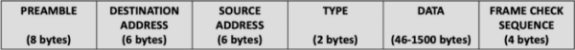

&emsp;
#### **Services:**

Various services can be offered by a datalink layer protocol.

**Framing**, which involves the encapsulation of network layer datagrams within data link layer frames.

**Link access**: a medium access control (MAC) protocol specifies the rules by which a frame is transmitted.
* The protocol is almost non-existent between a single sender and receiver
* In these cases, the sender can send a frame whenever the link is available
* Where multiple nodes share a single broadcast link, the protocol coordinates transmission

**Reliable delivery**: when a datalink protocol provides reliable delivery service, it guarantees to move each network layer datagram across the link without error.
* Like transport layer protocols, acknowledgements and retransmissions are used
* This is often used for links that are prone to high error rates, such as wireless links
* The goal is to correct the error locally, within the link where it occurs
* By doing this, full retransmission at the transport or application layers can be avoided
* However, this introduces an unnecessary overhead for low bit error links, such as fibre

**Error detection** and **error correction**: the datalink hardware in a receiving node can incorrectly decide that a bit in a frame is 0 when it was transmitted as a 1, and vice versa.
* These errors are introduced by signal attenuation and electromagnetic noise
* Transmitting nodes include error detection bits in frames for receiving nodes to check
* Detection in the datalink layer is sophisticated and implemented in hardware
* Correction determines exactly where frame errors have occurred and corrects them

&emsp;
### **5.3.2 Switches**

**Ethernet switches** are unmanaged switches in that they are not programmable and are plug and play. 
* Switches are involved in the storing and forwarding Ethernet frames
* They also examine the MAC of incoming frames
* Generally, hosts are unaware of the presence of switches

Managed switches exist, but they operate at a higher level in the stack.

Modern Ethernet LANs are typically laid out in **star** and **extended star** topologies using switches.

  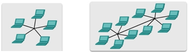

A switch is a datalink layer device that selectively forwards frames to one or more outgoing ports. 
* It uses a MAC protocol called **CSMA/CD**
* CSMA stands for carrier-sense multiple access
* CD stands for collision detection

Packets enter the switch on one port and can exit on a single or multiple port as appropriate:
* The address maybe in the switch’s forwarding table
* In this case the packet leaves the switch on the port that can access the end device
* Otherwise, the packet leaves on all ports except the one it entered on

Switches forward frames using the destination address to make switching decisions:

  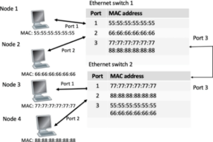

Switches **dynamically** add source MAC addresses to their MAC address tables. 
* They can also dynamically unlearn them
* This prevents the table being filled with disconnected devices
* Most switches will only maintain entries that are currently being used for frame forwarding
* Once frame forwarding ends, switches delete the MAC address, typically after 5 minutes

&emsp;
### **5.3.3 Broadcast and Collision**

A broadcast domain is a logical division of a computer network, in which all nodes can reach each other by broadcast at the datalink layer. For example:
* A workstation may be configured to retrieve an IP address from a DHCP server
* It sends a message over using a predefined broadcast address 
* This is sent over the network and retrieves the IP address from the server

The diagram below shows PC1 sending the same information to three different PCs in the same subnetwork. It uses the **Address Resolution Protocol** (ARP), which operates as a broadcast in an IP network.
* ARP creates a segment, encapsulated within a packet address 
* The IP address of PC1 is used as the source
* However, the destination is the reserved IPv4 broadcast address: 255.255.255.255
* This packet is then encapsulated by the NIC into a frame
* The destination is the MAC address FF:FF:FF:FF:FF:FF, reserved for Ethernet broadcasts
* All devices in the network recognise it as a broadcast and process it
* This is passed up the stack to IPv4 and ARP protocols in turn
* However, this creates extra traffic on the network and impacts its speed

  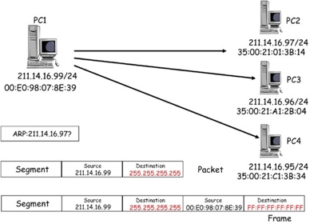

&emsp;
#### **Collisions:**

A **collision domain** is an area where collisions can occur within a network.
* Hubs exist in both the collision and broadcast domains
* Switches separate collision domains but create additional broadcast domains
* Routers separate collision and broadcast domains

  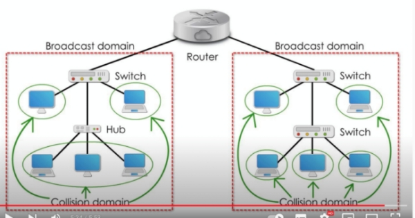

&emsp;
#### **Hubs:**

As a layer 1 device, **hubs** have no intelligence. When they receive one message from one port, it gets forwarded to all ports and receiving devices without a matching MAC simply ignore the message.
* This wastes network bandwidth and increases the chance of collision 
* Detected collisions result in all sending devices stopping their transmission 
* They restart after a random number of milliseconds, according to the **Back-Off** algorithm
* The above diagram has one broadcast and one collision domain

  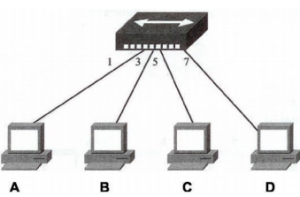

&emsp;
#### **Switches:**

Using a **switch**, a layer 2 device, divides up the available bandwidth. It is an intelligent device that allows an administrator to change the priorities of the ports in order to determine who can transmit first.
* Unlike a hub, a switch can have many simultaneous transmissions
* Switches remove single large scale collision domains into smaller ones per port
* Joining two switches does not create a collision domain as they **store and forward** data
* However, despite multiple switches being used there is still one broadcast domain
* Therefore, potential issues affecting network speed persist
* The above diagram has one broadcast and eight collision domains

  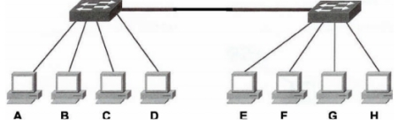

&emsp;
#### **Routers:**

To overcome persisting issues regarding network speed, **routers** can be used. These are level 3 devices which separate broadcast domains.
* Each interface port on a router is a separate broadcast domain
* Therefore, broadcast within one network will not pass to the other
* The above diagram has two broadcast domains and eight collision domains

  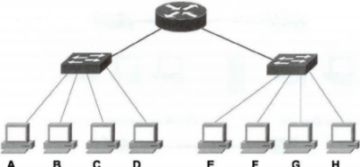

&emsp;
### **5.3.4 Router Operation**

If a router connects two IP networks, it needs interfaces with IP addresses within the IP networks to which it is connected. This allows the router to forward packets between them.

Routers record all IP networks they are aware of within an IP routing table, rather than tracking single addresses. This is a fundamental difference from the ARP table. 

When a router forwards a packet:
* The source and destination IP addresses are not changed 
* A packet is encapsulated in two different frames during its transmission
* The MAC address used within frames are all different

A packet will only be forwarded by a router if it can find a matching IP address in the routing table.
* If there is no entry, the packet will be dropped
* However, if the MAC address isn’t in the ARP table, the packet is forwarded to all ports

&emsp;
#### **IP Routing:**

Each router than IP packet passes through is referred to as a **hop**.

Routers need access to the network layer so they can physically retrieve packets. The network layer then passes the IP datagram up to the router IP layer.
* The router processes the destination address contained in the IP header
* It then determines which device to send the IP packet to
* As transport and user lever data is not needed, it is not unpacked from the IP datagram
* Unpacking only the necessary information helps with speed

&emsp;
#### **Routing Protocols:**

A router only needs to know the addresses of the routers to which it is directly connected.

When a router examines the IP address of an incoming datagram, it accesses a database or table to determine which router should form the next hop in the path.

Routers communicate using various protocols to set up tables and route packets:
* Router Information Protocol (RIP)
* Open Shortest Path First (OSPF)
* Interior Gateway Routing Protocol (IGRP)
* Enhanced IGRP (EIGRP)
* Border Gateway Protocol (BGP)
* Intermediate System to Intermediate System (IS-IS)
* Constraint Shorted Path First (CSPF)
* Routers operate on packets at the internet layer 
* They use transport layer services such as UDP and TCP to communicate 

All routing methods have some overheads in terms of processing and transmission.

Routes are usually based on some kind of performance criteria, such as minimum hops or minimum cost.

  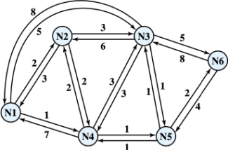

&emsp;
### **5.3.5 DHCP**

The **Dynamic Host Configuration Protocol** (DHCP) is primarily involved in issuing IP addresses. It can:
* Allocate IP addresses
* Announce default gateway addresses
* Provide the domain name a client must use
* Announce DNS server addresses

DHCP is also involved in managing **IP scopes**, managing different scopes for different departments and assigning subsets to each scope.

As well as leased IP addresses, DHCP also maintains reserved and fixed IP addresses.

---
&emsp;
## **5.4 Carrier Sense Multiple Access/Collision Detection:**

### **5.4.0 Reading**
* *Required: Chapter 5, Computer Networking: A Top-Down Approach, Kurose and Ross*
* *Extension: none*

&emsp;
### **5.4.1 CSMA/CD**

Standard Ethernet networks use **Carrier Sense Multiple Access/Collision Detection** (CSMA/CD) to monitor traffic on subnetworks and manage **collisions**: devices attempting to use a data channel simultaneously.

CSMA/CD can be divided up into its various functions as follows:
* **Carrier sense** – the network listens to traffic on its medium to establish if data is currently being transmitted; no network noise leads a device to assume it’s safe to send
* **Multiple access** – multiple devices are prevented from sending simultaneously, as they are both able to listen for traffic, hear nothing, and attempt to send at the same time
* **Collision detection** – after a device sends a packet, it listens to the network for collisions. If one occurs, the device waits and resends after a random period

  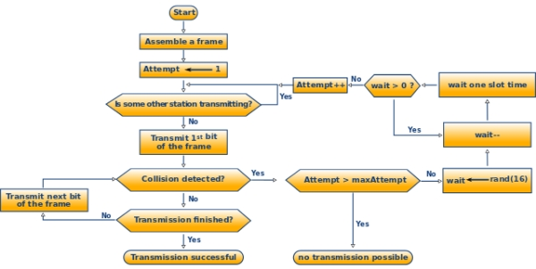

As transmissions are terminated as soon as a collision is detected, time required before a retry can be attempted is shortened and overall performance is increased.

As networks grow, traffic increases and packets collide constantly. When this happens, the network needs **subnetting** into smaller logical networks.

&emsp;
#### **CSMA/CA:**

CSMA/CA is a variation used on wireless networks that involves **Collision Avoidance**. Nodes must listen to detect if a network is busy before sending.

&emsp;
#### **Channel Partitioning:**

A broadcast channel shared by many nodes needs **partitioning** for fairness of transmission to all nodes.

As well as CSMA/CD, different access methods exist to allow devices to share communication channels.
* **Time Division Multiple Access** (TDMA) – access is via rounds, with each node allocated a time slot. It is inefficient as unused slots will go idle
* **Frequency Division Multiple Access** (FDMA) – the spectrum is divided into frequency bands and each node is assigned a band on which to transmit 
* Both are frequently used in satellite, cellular, and analogy radio systems
* These can be considered fair, as each node gets the same share
* However, important packets cannot be prioritised
* Therefore, whereas TDMA and FDMA divide available time and frequency, CSMA/CD dynamically shares the communication channel based on the detection of collisions

**Code Division Multiple Access** (CDMA) is an example of multiple access, where several transmitters can send information simultaneously over a single communication channel. 
* This allows several uses to share a band of frequencies
* Interference is prevented through spread-spectrum technology and a special coding scheme

---
&emsp;
## **5.5 Error Detection and Correction:**

### **5.5.0 Reading**
* *Required: Chapters 5, 6, Computer Networking: A Top-Down Approach, Kurose and Ross*
* *Extension: none*

&emsp;
### **5.5.1 Error Overview**

**Error coding** uses formulas to encode data bits at the source into longer bit words for transmission.
* A codeword is an n bit frame, with m-data bits and r-check bits: n = m + r
* These codewords can then be decoded at the destination to retrieve information
* The extra bits in the codeword provide redundancy 
* This allows the decoding process to determine if the medium introduced errors

Error coding schemes are chosen depending on the types of errors expected, the communication medium’s expected error rate, and whether or note data retransmission is possible.

Advances in processors and communication technologies, more complex coding schemes with better error detection and correction capabilities are now possible for smaller, even embedded systems.
* However, there are trade-offs between bandwidth and coding overheads
* Coding complexity and coding delay must be considered for each application

After detection, error correction can occur in one of two ways:
* **Backward error correction** - the receiver can have the sender retransmit the data
* **Forward error correction** – error correcting code automatically corrects certain errors

There are two basic strategies for dealing with errors:
* Include enough redundant information with each block to allow forward error correction
* Include only enough redundancy to allow a receiver to detect an error, but not what error
* This then allows backward error correction to be attempted
* The former strategy uses **error correcting codes** and the latter **error detecting codes**

Given two codewords, it is possible to determine how many corresponding bits differ.
* XOR can be used on the codewords and the number of 1s counted
* The resulting number of bits which differ is called the **Hamming distance**
* Successful error correcting can depend on the size of this distance

&emsp;
#### **Error Types:**

Errors due to interference can be one of two types.

Firstly, **single bit errors** involve only one bit changing. 
* Sending data at 10 Mbps means each bit lasts only 0.1 μs
* This for an error to occur, any noise must have the duration of only 0.1 μs, which is rare
* Thus, these are the least likely type in serial data transmission.
* However, in parallel transmissions, just one noisy wire can corrupt a bit in the word

  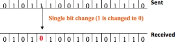

**Burst error** – this means two or more bits in the data unit have changed.
* The length of the burst is measured between the first and last corrupted bit
* Some bits in between may not be corrupted but still fall within this window
* Such errors are most likely to happen in serial transmission

  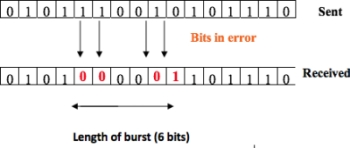

&emsp;
### **5.5.2 Error Detection**

The basic approach used for **error detection** is the use of redundancy. Popular methods include:
* Simple parity checks
* Two-dimensional parity checks
* Checksum
* Cyclic redundancy checks (CRC)

&emsp;
#### **One Dimension:**

**Simple parity checks** identify errors in asynchronous transmissions and byte orientated protocols. A redundant bit, called a parity bit, is added to every data unit so that the number of 1s in the unit is even.

At the receiving end, the **parity bit** calculated from the data bits and compared to the received parity bit. 
* Even parity means the number of 1s in the data unit must be even
* Thus, the added parity bit may be a 0 or a 1 depending on the contents of the data unit
* If there are two errors, these may cancel each other out and faulty data accepted

  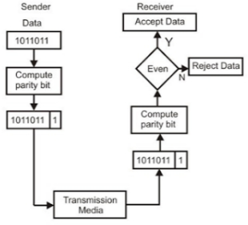

&emsp;
#### **Two Dimensions:**

Performance can be improved using a **two-dimensional parity check**.
* Blocks of bits are arranged in the form of a table or matrix
* Parity check bits are calculated for the rows and the columns
* This method increases the chance of detecting burst errors
* However, errors occurring in the exact same position in two units can undetectable

  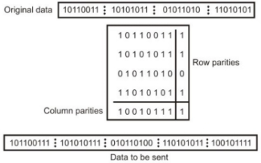

&emsp;
#### **Checksum Error Detection:**

**Checksum error detection** schemes divide data into k segments of m bits and place them into a 2D block.
* A parity bit is added to each character, and thus the block may contain an error
* However, a parity bit is also added for each bit position in all characters
* Segments are added using **Ones’ complement** to get the sum
* The sum is complemented to get the checksum value which is send with the data
* The receiver uses One’s complement to get the sum of the data, including the checksum
* This is then complemented and if the result is 0 the data is accepted 

  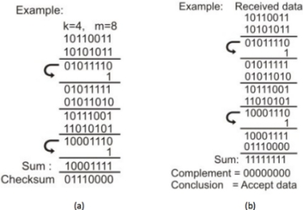

Checksum detects all errors involving an odd number of bits and most errors involving an even number.

&emsp;
#### **Cyclic Redundancy Check:**

The **cyclic redundancy check** (CRC) is the most powerful and easy to implement technique.

Where checksum is based on addition, CRC is based on binary division. 
* The sender generates a sequence of bits known as a frame check sequence (FCS)
* This is done in such a way that the resulting frame is exactly divisible by a set number
* A sequence of redundant bits, CRC bits, are added to the end of the data unit
* This makes the data unit divisible by a second set number
* The receiver divides the data unit by the same number, and if no remainder, it is accepted

  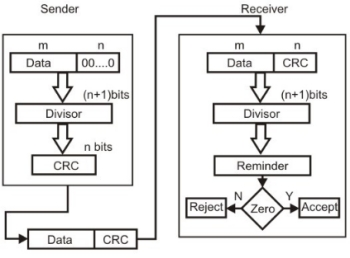

CRC is a very effective detection technique and can detect:
* All single bit errors
* All double bit errors
* Any odd number of errors
* All burst errors, with larger burst errors having a very high probability of detection

&emsp;
### **5.5.3 Error Correction**

**Error correcting codes** are more sophisticated than those used to detect and require more redundant bits.

As the number of bits required to correct multiple bit or burst errors is so high and inefficient, most error correction is limited to 1 to 3-bit errors.

&emsp;
#### **Single-Bit Correction:**

For 1-bit error correction, **Hamming code** means the number of redundant bits r for bit data d is found as 2r = d + r+1, eg for d=4 means r >=3.

The basic approach for error detection using Hamming code is as follows:
* Divide the information bits into groups of m bits
* Add k parity bits to each group of m bits to form a codeword with m + k bits
* Assign decimal values to the location of each of the m + k digits in the codeword
* Place the k parity bits in positions 1, 2, ..., 2k-1 in the codeword
* Perform k parity checks on the selected digits of each codeword
* At the receiver end, recalculate the parity bits and compare them with the codeword
* Discrepancy gives a decimal value, used to identify the position of the bit error

  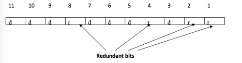

