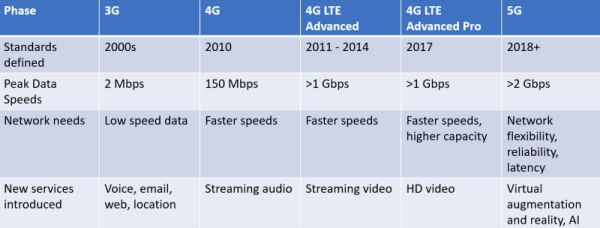
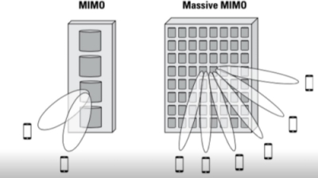
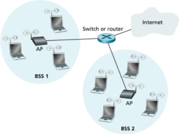

#### COM00147M Computer and Mobile Networks
# **Week 6 - Mobile and Satellite Technologies**

## **6.0 Table of Contents**

- [**6.0 Table of Contents**](#60-table-of-contents)
- [**6.1 Learning Objectives**](#61-learning-objectives)
- [**6.2 Summary**](#62-summary)
- [**6.3 Cellular Wireless Technologies**](#63-cellular-wireless-technologies)
  * [**6.3.0 Reading**](#630-reading)
  * [**6.3.1 Cellular Technologies**](#631-cellular-technologies)
    + [**5G**](#5g)
    + [**Frequencies**](#frequencies)
    + [**Internet of Things**](#internet-of-things)
    + [**IEEE 802.11**](#ieee-80211)
  * [**6.3.2 Wireless Security**](#632-wireless-security)
    + [**Rogue APs**](#rogue-aps)
    + [**Ad Hoc Networks**](#ad-hoc-networks)
    + [**Denial of Service**](#denial-of-service)
    + [**Passive Attacks**](#passive-attacks)
- [**6.4 802.11 Wireless Standards**](#64-80211-wireless-standards)
  * [**6.4.0 Reading**](#640-reading)
  * [**6.4.1 Wireless Standards**](#641-wireless-standards)
    + [**Wireless Antennas**](#wireless-antennas)
    + [**Signal Degradation**](#signal-degradation)
- [**6.5 Open and Secured Access**](#65-open-and-secured-access)
  * [**6.5.0 Reading**](#650-reading)
  * [**6.5.1 Open and Secured Access**](#651-open-and-secured-access)
    + [**Remote Authentication Dial-In User Service**](#remote-authentication-dial-in-user-service)
    + [**Temporal Key Integrity Protocol**](#temporal-key-integrity-protocol)
    + [**Extensible Authentication Protocol**](#extensible-authentication-protocol)
    + [**EAP Transport Layer Security**](#eap-transport-layer-security)
  * [**6.5.2 UK Mobile Networks**](#652-uk-mobile-networks)

---
&emsp;
## **6.1 Learning Objectives**

* **MLO1** - Identify and describe a range of wireless technologies with reference to current standards
* **MLO1, MLO3** - Analyse and describe various security issues with IoT devices and identify potential solutions
* **MLO1, MLO5** - Consider the potential legal and ethical implications of mobile technologies and their current applications

---
&emsp;
## **6.2 Summary**

Wireless networks are facilitated either through WiFi (802.11) or cellular signals (5G). Their prevalence has resulted in the emergence of various threats to security of the networks. This includes actions by well-intended employees, malicious actors, and compromised devices.

Two different types of antennas exist, allowing devices to access wireless networks. Broadly these are directed and omnidirectional.

Devices, such as routers, are capable of open or secured access modes. When in an open mode, almost all the security features are disabled, simplifying the connection process but exposing the network to unwanted access. This is discouraged for homes and businesses.

---
&emsp;
## **6.3 Cellular Wireless Technologies**

### **6.3.0 Reading**
* *Required: Chapters 6, 8, Computer Networking: A Top-Down Approach, Kurose and Ross*
* *Extension: none*

&emsp;
### **6.3.1 Cellular Technologies**

There are two parts to any cellular network: the **access network** and **core network**.
* The increase and performance of mobile devices rely on the access network
* Demands on the network from these devices is increasing constantly 
* However, changes to the core network have been slower and more incremental

Whether the range of the IP protocols will cope of address the needs of changing architecture is unclear.

Next generation applications will have strict resource requirements and networks will need to work closely with application requirements. If TCP/IP isn’t sufficient, new protocols may be needed for 5G and beyond. 

  

&emsp;
#### **5G:**

**5G** was designed to provide higher speeds with improved capacity, scale, latency, and reliability. However, all 5G devices needed to have new compatible hardware. 

IEEE have produced a [video](https://www.youtube.com/watch?v=GEx_d0SjvS0) covering the important details of 5G.

&emsp;
#### **Frequencies:**

The bandwidth that is available within a spectrum determines the network performance available for users.
* **Low band spectrums** typically have limited bandwidth, so data rates are low
* **High band spectrums** the bandwidth is many times greater, thus data rates are higher

The full frequency spectrum has licensed and unlicensed sections.
* The licensed sections are authorised by the government
* They are purchased at auctions and managed by operators
* As they are managed, interference is reduced significantly
* However, the unlicensed sections are freely available for use in WiFi and similar

**Low-band frequencies** are categorised as <2.5 GHz. This includes devices such as TVs.
* It allows for wide area coverage
* Has the ability to penetrate walls and so works well indoors
* However, there is limited bandwidth available
* This leads to lower data rates and congestion
* Nearly all frequencies in this range have been allocated

**Mid-band frequencies** are categorised as being between 2.5 and 6 GHz.
* This range offers greater capacity and speed
* It is less congested, and more frequency is available
* However, it has a shorter range
* Additionally, the signal cannot go through objects 
* It requires signal enhancement 

**High-band frequencies** are categorised as being >6 GHz and is found in some 5G solutions.
* It offers high capacity and speed
* However, it is short range, typically only a few 100 metres
* Therefore, it is suitable for fixed users
* Smaller aerials are used due to the limited range

**Multiple-input and multiple-output** (MIMO) is a method for multiplying the capacity of a radio link
* It uses multiple transmission and receiving antennas to exploit multipath propagation
* Additionally, it incorporates complex algorithms 
* **Massive MIMO** is the key component of 5G
* More aerials are present in the base stations
* The result in improved throughput

  

&emsp;
#### **Internet of Things:**

Some of the technologies used by devices in the **Internet of Things** (IoT) include:
* **Z-Wave** – a WiFi mesh topology on the 900MHz ISM band which doesn’t collide with 802.11 networks and doesn’t need a license. This is used by general home devices
* **Ant+** - a wireless protocol for monitoring sensor data, such as tire pressures and heart rates, but can be used for other activities such as lighting control
* **RFID** – objects are typically given an RFID tag so that the object is uniquely identifiable and accessible wirelessly

Truly smart objects will be embedded with both and RFID tag and a sensor to measure data.

&emsp;
#### **IEEE 802.11:**

IEEE **802.11** is part of a set of technical standards for implementing **wireless LAN** (WLAN) communication.

Common terminology includes:
* AP – access point
* STA – station
* BSS – Basic Service Set, where multiple STAs are connected to an AP
* IBSS – Independent BSS are not linked to any other BSS
* ESS – an extended service network, multiple APs appear as a single wireless network
* DS – a distributed system where a central point, like a router, connects multiple BSS

**Access points** (AP) are both bridges and a relay points and work in a star topology rather than mesh.

  

All 802.11 MAC frames fall under one of the three types: management, control, and data.

**Management frames** are used to manage the **Basic Service Set** (BSS) of devices.
* This includes probing, associating, roaming, and disconnecting clients from the BSS
* APs periodically send beacons to advertise the SSIDs they service
* Authentication frames are used to join the BSS as part of open system authentication
* Disassociation frames are used to terminate the stations association: it is a notification
* Deauthentication frames are used to reset the state machine for an associated client

**Control frames** are used to control access to the medium and used for frame acknowledgement.
* These frames only contain headers and trailers
* **PS-Poll frames** are used in the legacy 802.11-1997 power save method
* They request frames buffered in the AP while the client was sleeping
* Other subtypes include RTS, CTS, ACK, CF-END, CF-END+CD-ACK

&emsp;
### **6.3.2 Wireless Security**

Many threats exist to wireless security. 

&emsp;
#### **Rogue APs:**

**Rogue access points** are access points that have been installed on a secure network without authorisation of the local network administrator. 
* These might be added by an employee or by malicious actors to infiltrate the network
* Employees may be acting innocently, but the AP is likely broadcasting without security 

An **evil twin** is a copy of a legitimate access point, not necessarily giving it access to the network but instead allowing devices to connect to it and traffic to be intercepted, redirected, or altered by the hacker.
* Devices identify APs by SSID rather than MAC address/Basic Service Set Identifier (BSSID)
* A device advertising the same SSID on a different channel can lead to devices connecting

With the right DHCP software, a hacker can issue clients an IP address. Consequently, they have moved all the clients over to a network under their control and can perform peer-to-peer attacks.

The threat of rogue APs can be mitigated by using **wireless LAN controllers** (WLC) to manage APs.
* These use Lightweight Access Point Protocols (LWAPP) to share messages
* APs are made to monitor all channels by briefly switching from their configured channel
* This lets them collect packets to check for rogue activity
* If an AP is detected that isn’t managed by the controller it is flagged as rogue
* This can then be tracked and located

&emsp;
#### **Ad Hoc Networks:**

**Ad hoc networks** are created peer-to-peer or directly between stations, not through an AP.

This can be a dangerous configuration because there’s no corporate security in place, and since such networks are often created by unsophisticated users, peer-to-peer attacks are possible.

These networks can be identified by the types of frames they send.
* These are different from those in an infrastructure network
* If identified, a network can send **deauthentication** frames to prevent stations association

&emsp;
#### **Denial of Service:**

Some hackers intend to cause disruption rather than steal data. This can be accomplished through a **denial of service** (DoS) attack, jamming the frequency on which the WLAN resides.

Dealing with attacks involving frequency jamming is difficult, however many DoS attacks 
* Man-in-the-middle attacks operate by deauthenticating stations from their networks
* Compromised devices can potentially be identified by network administrators
* Other attacks simply flood the wireless network with ping requests or association frames
* These types of management frames are sent unauthenticated and unencrypted
* The **Management Frame Protection** (MFP) mechanism can be used to prevent these

There are two types of MFP which can be used:
* **Infrastructure mode** – this requires configuration on the AP
* Wireless LAN controllers generate a specific signature for each WLAN
* This is added to each frame they send
* Any attempt to alter this is detected by the Message Integrity Check (MIC) in the frame
* Any frame from an unknown SSID is reported to the controller 
* **Client mode** – all management frames between APs and station are protected
* This is because clients can detect and drop spoofed or invalid management frames

&emsp;
#### **Passive Attacks:**

Passive attacks usually involve **wireless sniffing**. During a passive attack the hacker captures large amounts of raw frames to analyse online with sniffing software to try and discover a key to decrypt it.

Some systems exist to help protect against passive attacks:
* **Intrusion detection systems** (IDS) – detects types of malicious behaviour
* This can include network attacks, data-driven attacks, host-based attacks, and malware
* **Intrusion protection systems** (IPS) – involves security devices monitoring networks
* These allow for real time responses to malicious and unwanted behaviours

---
&emsp;
## **6.4 802.11 Wireless Standards**

### **6.4.0 Reading**
* *Required: Chapter 6, Computer Networking: A Top-Down Approach, Kurose and Ross*
* *Extension: [CDMA vs GSM: What's the Difference?](https://uk.pcmag.com/news-analysis/11593/cdma-vs-gsm-whats-the-difference), PC Mag*
* *Extension: [Cellular Networks and Technology](https://www.ofcom.org.uk/spectrum/information/cellular-networks-and-technology), Ofcom*
* *Extension: [Fundementals of Communication Access Technologies: FDMA, TDMA, CDMA, OFDMA, and SDMA](https://www.electronicdesign.com/technologies/communications/article/21802209/fundamentals-of-communications-access-technologies-fdma-tdma-cdma-ofdma-and-sdma), Electronic Design*

&emsp;
### **6.4.1 Wireless Standards**

WiFi signals are half duplex two-way communications: only one node can transmit information at a time.

The terms wireless and mobile are often confused.
* **Wireless** means communication over a wireless network
* **Mobile** refers to handling connections of users who change points of network attachment

WLANS use radio frequencies that are transmitted from their antennas, creating radio waves.
* These can be absorbed, refracted, or reflected by walls, water, and metal surfaces
* This results in low signal strength
* Using higher frequencies gives better data rates but decreased distance
* Lower frequencies are the reverse, slower speeds but greater coverage

Most people use devices that use the older 802.11a (5GHz) and 11b (2.4GHz) standards or more modern 11g (2.4GHz) and 11ac (5GHz) standards.

&emsp;
#### **Wireless Antennas:**

Wireless antennas act as both transmitters and receivers. There are two classes of antennas on the market:
* **Omnidirectional** antennas are point-to-multipoint
* **Yagi** antennas are directional point-to-point
* This means Yagi antennas provide greater range as all their power is concentrated
* However directional antennas require much more precise and accurate alignment 

&emsp;
#### **Signal Degradation:**

Signal strength can vary according to many factors. The weaker the signal, the less reliable the connection.

Factors affecting strength include:
* Distance – the further from the WAP the weaker the signal. APs have a very limited range
* Barriers – namely walls, with thicker walls interrupting more of the signal
* Protocols – the various wireless 802.11 protocols have different ranges
* Interference – devices using radio frequencies near the bands used by 802.11 protocols

---
&emsp;
## **6.5 Open and Secured Access**

### **6.5.0 Reading**
* *Required: none*
* *Extension: none*

&emsp;
### **6.5.1 Open and Secured Access**

**Open access mode** refers to the security features of a wireless device, such as a router, being turned off for ease of initial connection and set up. This mode is not recommended for businesses or homes.

802.11 basic security includes the use of:
* **Service Set Identifiers** (SSID)
* Open or shared-key authentication
* **Static wired equivalent privacy** (WEP)
* Optional **Media Access Control** (MAC) authentication or filtering

&emsp;
#### **Remote Authentication Dial-In User Service:**

**Remote Authentication Dial-In User Service** (RADIUS) is a networking protocol that offers security benefits:
* Authorisation
* Centralised access
* Recording of users and computers that access network services
* The provision of authentication, authorisation, and account is called **AAA** or **triple A**
* RADIUS is in the IEEE 802.1x security standard, and AAA servers are increasingly needed

&emsp;
#### **Temporal Key Integrity Protocol:**

As WEP was compromised, IEEE developed the **Temporal Key Integrity Protocol** (TKIP):
* Originally it was released as WPA, but improvements led to a rebranding as WPA2
* This envelopes the pre-existing WEP encryption key
* By doing so, it upgrades it to more resilient 128-bit encryption
* Each packet is uniquely identified, cancelling the collision attacks seen with WEP
* Portions of the packets serial number is used as an initialisation vector
* This helps prevent so called replay attacks

&emsp;
#### **Extensible Authentication Protocol:**

**Extensible Authentication Protocol** (EAP) is used by WPA2 for authentication.
* It is a framework that includes 802.1x
* A **Public Key Infrastructure** (PKI) must be present in the network
* This means a certificate server is able to issue certificates to users and devices
* The certificate consists of public and private key pairs, installed on all devices
* This is asymmetric as different keys are used for encryption and decryption
* As long as two parties trust the **certificate authority** (CA), certificates can be trusted 

Using certificates to identify entities is considered the highest form of authentication and authorisation

&emsp;
#### **EAP Transport Layer Security:**

**EAP Transport Layer Security** (EAP-TLS) is the most secure method but is difficult to setup and maintain.
* It requires a certificate to be installed on both the authentication server and client
* To do this, each needs a pair of keys to be generated and signed using a PKI
* Authentication involves exchanging certificates and identifying each other
* This mutual authentication ensures both devices identify the other is valid
* Random session keys are created for encryption
* A pre-shared key can be used to secure wireless transmissions
* This requires all devices use the same key as the AP, changing regularly for security

&emsp;
### **6.5.2 UK Mobile Networks**

There are only four main corporations in the UK mobile phone network:
* EE, O2, Three, and Vodaphone
* All others operate on top of these networks

The following technologies are used in the network system:
* **Global System Mobile** (GSM) – a type of cell phone that contains a SIM chip, which must be present for the phone to function. Sim card cloning is a security and privacy danger
* **Frequency Division Multiple Access** (FDMA) – one of the modulation techniques used in the network and divides the frequency range into bands for subscriber use
* **Time Division Multiple Access** (TDMA) – increase the speed of FDMA by dividing channels into time slots and assigning slows to calls. This helps prevent eavesdropping
* **Code Division Multiple Access** (CDMA) – assigns a unique code to each transmission and spreads the data across the spectrum