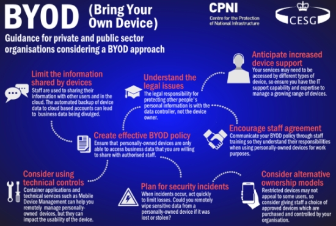
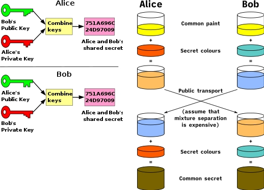
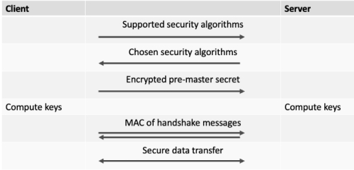
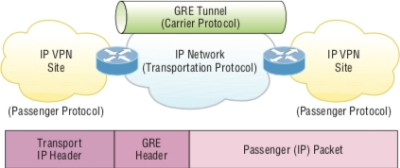

#### COM00147M Computer and Mobile Networks
# **Week 7 - Security and Cryptography**

## **7.0 Table of Contents**

- [**7.0 Table of Contents**](#70-table-of-contents)
- [**7.1 Learning Objectives**](#71-learning-objectives)
- [**7.2 Summary**](#72-summary)
- [**7.3 Network Security Requirements**](#73-network-security-requirements)
  * [**7.3.0 Reading**](#730-reading)
  * [**7.3.1 Secure Systems**](#731-secure-systems)
  * [**7.3.2 Bring Your Own Devices**](#732-bring-your-own-devices)
  * [**7.3.3 Ethics and Legality**](#733-ethics-and-legality)
- [**7.4 Cryptography**](#74-cryptography)
  * [**7.4.0 Reading**](#740-reading)
  * [**7.4.1 Cryptography Overview**](#741-cryptography-overview)
    + [**Symmetric Cryptography:**](#symmetric-cryptography)
    + [**Asymmetric Cryptography:**](#asymmetric-cryptography)
  * [**7.4.2 Symmetric Algorithms**](#742-symmetric-algorithms)
  * [**7.4.3 Asymmetric Algorithms**](#743-asymmetric-algorithms)
    + [**Diffie-Hellman Key Exchange:**](#diffie-hellman-key-exchange)
    + [**RSA vs DSA:**](#rsa-vs-dsa)
- [**7.5 Secure Socket Layer**](#75-secure-socket-layer)
  * [**7.5.0 Reading**](#750-reading)
  * [**7.5.1 SSL**](#751-ssl)
  * [**7.5.2 Tunneling**](#752-tunneling)
    + [**GRE:**](#gre)
    + [**6to4:**](#6to4)
  * [**7.5.3 VPN**](#753-vpn)

---
&emsp;
## **7.1 Learning Objectives**

* **MLO1, MLO3** - Evaluate the network security requirements in the context of different scenarios
* **MLO1, MLO3** - Evaluate different security solutions and justify their application in different contexts
* **MLO1, MLO5** - Consider the potential legal and ethical implications of network technologies and their current applications

---
&emsp;
## **7.2 Summary**

There are several criteria a network must meet to be considered secure. These help ensure an organisation can meet legal and ethical concerns regarding privacy, provide data security, and prevent computer misuse. 

Cryptography offers protection for vulnerable information that may be sent over unsecure channels. Symmetric options are commonly used for fast moving data, such as internet traffic. Asymmetric algorithms have uses in key management and authentication.

Remote workers can connect to networks using application or web-based VPNs, which simulate their presence in a network.

---
&emsp;
## **7.3 Network Security Requirements**

### **7.3.0 Reading**
* *Required: Chapter 8, Computer Networking: A Top-Down Approach, Kurose and Ross*
* *Extension: none*

&emsp;
### **7.3.1 Secure Systems**

There are different types of attacks a network may encounter. These include malware attacks, denial of service, packet sniffing, source masquerading, and message modification.

Cryptographic algorithms such as encryption and hash function are both important in managing threats.

The main security requirements of a secure system are:
* **Confidentiality** – information is not made available to unauthorised entities
* Cryptographic algorithms can allow data to be sent safely over insecure channels
* **Integrity** – information is not altered during transmission in an unauthorised manner
* Digital signatures can help ensure the data sent is the same as the data received
* **Accountability** – users must authenticate themselves before accessing the system
* **Availability** – the network is available, and attacks like Denial of Service (DoS) are prevented
* **Integrity** – information is trustworthy and not modified in an unauthorised fashion
* **Authentication** – the ability to confirm the claimed identity of a user or system
* Public key cryptography can be used to create certificates to provide authentication 
* **Non-repudiation** – allowing message recipients to prove authenticity of sent messages
* This could possibly be to a third party, with digital signatures proving the message is real

The principles of confidentiality, integrity, and availability form the base of the **CIA triad**: a common model that forms the basis for the development of security systems.

&emsp;
### **7.3.2 Bring Your Own Devices**

**Bring Your Own Devices** (BYOD) is a relatively new and increasingly common policy. It allows employees to use their personal devices for work purposes.

  

BYOD may save money, as devices used for work do not have to be purchased. However, additional costs may be incurred by the need to train helpdesk staff and develop management systems. 

Companies must also be aware of the associated legal issues. 
* Users’ **privacy** needs to be maintained in line with the law
* However, there may be an obligation to report **illegal activities** exposed by network admin
* Additionally, employees may end up with **sensitive** or **confidential** data on personal devices

To reduce these risks, policies need to be written which outline acceptable use and actions, encrypt sensitive data, and mandate the use two-factor authentication.

However, there are positives to BYOD:
* Reducing spending on devices
* Improving productivity
* Helping staff embrace modern mobile and cloud centric workflows

While business networks are frequently planned with a one device per user ration, unexpected strain on infrastructure may occur if users bring multiple devices for use. 

&emsp;
### **7.3.3 Ethics and Legality**

Ethics has a very broad definition in computing use. Areas for consideration include:
* Charges for financial transactions and who decides what is fair 
* Interactive applications gathering data from children
* Principles of libraries and access for all transferring to technological equivalents
* Automation of information gathering and data ownership
* Societal depended on technology

Legal concerns could include:
* BYOD / WiFi hopping 
* Software ownership and liability
* Intellectual ownership copyright
* Social impacts of distributed databases
* Consequences of AI instruction and action
* Different laws in different countries

Some of the main legislative acts which cover legal computing use include:
* Computer Fraud and Abuse Act 1984
* Right of Privacy Act
* Anticybersquatting Act 1999

Policy standards and Acts cover the legislation that needs to be adhered to. This includes:
* Data Protection and GDPR 2018 updated in 2021
* Computer Misuse Act 1990
* Communications Act 2003
* Investigatory Powers Act 2016
* Privacy and Electronic Communications (EC Directive) 2003 amended in 2019

---
&emsp;
## **7.4 Cryptography**

### **7.4.0 Reading**
* *Required: Chapter 8, Computer Networking: A Top-Down Approach, Kurose and Ross*
* *Extension: none*

&emsp;
### **7.4.1 Cryptography Overview**

**Cryptography** is the science of transmitting information securely. This relies on cryptographic algorithms to add security to communications that could be vulnerable to:
* Eavesdropping through interception of messages
* Active insertion of messages into the connection
* Impersonation by faking or spoofing fields in a packet
* Hijacking by removing the sender or recipient and assuming their role
* Denial of Service (DoS) leading to preventing service to legitimate users

Therefore, these algorithms work to fulfil four goals:
* Confidentiality 
* Integrity
* Authentication
* Non-repudiation

Cryptographic techniques allow a sender to disguise data so that an intruder can gain no information from any data intercepted, while allowing genuine receivers to be able to recover the original data.

&emsp;
#### **Symmetric Cryptography:**

In **symmetric** cryptography, both the sender and the recipient use the same key to encrypt and decrypt.

This means the **shared secret key** must be securely exchanged prior to the communication.

Symmetrical encryption is commonly used to encrypt traffic sent over a communication link directly, as asymmetric algorithms are generally too slow. Potentially suitable algorithms include:
* Advanced Encryption standard (AES)
* 3-Fold Data Encryption Standard (3DES) for blocks of information
* Rivest Cipher 4 (RC4) for streams of information

&emsp;
#### **Asymmetric Cryptography:**

In **asymmetric** cryptography, the sender and receiver use different, but mathematically related keys.

Each participant in the communication has a pair of keys: a **public key** and a **private key**:
* The private key is kept a secret by the owner of the key pair
* The public key is freely distributed to anyone wanting to communicate with the owner
* Anything encrypted with one key from a pair can be decrypted with the other key 

**Rivest–Shamir–Adleman** (RSA) is a common type of asymmetric algorithm.

However, asymmetric cryptography is susceptible to **man in the middle** attacks, where the interceptor obtains the public keys of two communicating individuals.
* This is known as a **key distribution problem**
* To mitigate against this, key fingerprints of exchanged keys could be verified over the phone 

&emsp;
### **7.4.2 Symmetric Algorithms**

**Data Encryption Standard** (DES) is an older symmetric algorithm.
* It uses a 56-bit key encrypted phrase which can be decrypted by brute force in a day
* Therefore, it is no longer considered secure
* 3-fold DES (3DES) is a modern update, which is more secure 
* It encrypts the message with three different keys

**Advanced Encryption Standard** (AES) is currently used in secure communications and e-commerce.
* It uses a 128-bit block with 128, 192, or 256-bit keys
* Brute force decryption would take trillions of years, so it is considered secure

&emsp;
### **7.4.3 Asymmetric Algorithms**

The are various asymmetric algorithms suitable for a variety of purposes. Some examples include:
* RSA: key management and authentication
* DSA: only authentication, no key management
* Diffie Hellman: only key management, no authentication 
* AES, 3DES, RC4: encryption
* MD5, SHA1: integrity protection
* Anti-replay protection: removes the possibility of replaying the same message sequence 

&emsp;
#### **Diffie-Hellman Key Exchange:**

A **Diffie-Hellman key exchange** establishes a shared secret between two parties that can be used for secret communication or exchanging data over a public network.

  

An example sequence can be illustrated using the principle of colour mixing:

* Both parties publicly agreeing on an arbitrary starting colour
* This does not need to be secret but should change each time
* A second, secret colour is also selected and combined with the public colour
* This mixture is exchanged, and the recipient adds their secret colour 
* The result is a mixture that is identical for both parties and can be used as a shared key
* It is expensive and time consuming for an interceptor to deduce the secret colours used

&emsp;
#### **RSA vs DSA:**

The complexity of **Rivest–Shamir–Adleman** (RSA) lies in finding an appropriate method to generate mathematically related but secure public and private key pairs.

RSA does this by relying upon the difficult of factoring the products of large prime numbers.
* This is known as a **key-transport algorithm**
* Even with modern computing, this Is still considered secure

In addition, RSA offers authentication using digital signatures.
* The **Digital Signature Algorithm** (DSA) offers an alternative 
* For this purpose, the asymmetric key pair is used in the opposite way of encryption
* A sender signs a message by encrypting it with their private key
* The recipient then decrypts, thereby authenticating it, with the sender’s public key

---
&emsp;
## **7.5 Secure Socket Layer**

### **7.5.0 Reading**
* *Required: Chapter 8, Computer Networking: A Top-Down Approach, Kurose and Ross*
* *Extension: none*

&emsp;
### **7.5.1 SSL**

**Secure Socket Layer** (SSL) is a transport layer protocol that offers security features for applications.
* For example, HTTP over SSL (HTTPS)

Due to flaws in the early version of SSL, **Transport Layer Security** (TLS) 1.0 was developed.
* This is still broadly used today
* SSL and TSL are often used as interchangeable terms, with TLS often the correct term
* TSL is an encryption protocol based on RSA
* It is used to provide secure communication over networks to protect web traffic

Severs usually offer both TLS on port 443 and non-SSL on port 80.
* This allows servers to provide both encrypted and clear text communication
* **Datagram Transport Layer Security** (DTLS) is used for datagram-based protocols
* This provides TLS like security for them 

Before data transport can take place over a secure SSL connection, a handshaking procedure is required to establish the connection. This is illustrated below:
* The client and server agree on the algorithms to be used to protect the data
* The server public key is sent to the client in a signed certificate
* This allows the client to authenticate the server using RSA or DSA
* A pre-master secret is generated by the client, encrypted using the server’s public key
* Both client and server use this secret to general keys for symmetrical encryption
* The message authentication code (MAC) is calculated for the handshake information
* Data exchange can now begin

  

SSL guards against replay attacks by using random nonces in the handshake.

Asymmetric encryption is used for key exchanges and establishing secure connections, while symmetric encryption is used for transmitting data.

&emsp;
### **7.5.2 Tunneling**

**Tunnelling** refers to encapsulating one protocol within another protocol.
* This allows data to be sent securely and privately over a public network. 
* At the tunnel endpoint, the packet is de-encapsulated
* The contents are then processed in its native form

Overlay tunnelling encapsulates IPv6 packets in IPv4 packets for delivery across an IPv4 network. These can be configured between border routers or between a border router and a host capable of IPv6 and IPv4.

&emsp;
#### **GRE:**

**Generic Routing Encapsulation** (GRE) is a general purpose encapsulation that allows for transporting packets from one network through another network using a VPN.
* The ability to use a routing protocol is notable advantage
* Additionally, it can carry non-IP traffic and can potentially support encryption
* Tunnel interfaces on both ends must be in the same subnet

  

&emsp;
#### **6to4:**

**6to4 tunnelling** is useful for carrying IPv6 data over a network that is still IPv4.
* This can occur when using portions of networks that are controlled by someone else
* Essentially the IPv6 packet is placed in an IPv4 packet for transportation  

&emsp;
### **7.5.3 VPN**

**A Virtual Private Network **(VPN) is a secured connection between two systems that would otherwise have to connect to each other through a non-secured network.

These configurations can be used within a public telecommunication infrastructure to provide remote offices or individual users with secure access to their organisation’s network.

Different types of VPN exist, named after the role they play in real-world business situations:
* **Client to Site** (remote access) – allows remote users to access a corporate network
* **Host-to-Host** – protects the information sent between two users
* **Site-to-Site** – allows remote networks to be connected to corporate networks
* **Extranet** – suppliers and customers can have limited connection to a corporate network 

VPN concentrators allow remote users to securely connect to them and then provide secure encrypted communications between he remote machine and the organisations network by building a secure tunnel.

There are two major options for these VPN sessions
* IPSec VPNs - operate at the OSI network layer, meaning the connecting workstation appears as part of the network where the concentrator resides
* SSL VPNs – use the clients web browser to connect, meaning there are no additional overheads, but limits the user to web-based applications 