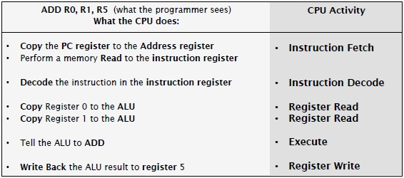

#### COM00145M Computer Architecture and Operating Systems
# **Week 1 - Fundamentals of Computer Architecture**

## **1.0 Table of Contents**

- [**1.1 Learning Objectives**](#11-learning-objectives)
- [**1.2 Summary**](#12-summary)
- [**1.3 The Fundamentals**](#13-the-fundamentals)
  * [**1.3.0 Reading**](#130-reading)
  * [**1.3.1 Terminology and Concepts**](#131-terminology-and-concepts)
    + [**Measurements**](#measurements)
    + [**Computer Systems**](#computer-systems)
    + [**Software**](#software)
    + [**Electronics**](#electronics)
    + [**Adder Circuits**](#adder-circuits)
    + [**Binary and Hexadecimal**](#binary-and-hexadecimal)
- [**1.4 Processors: The Heart of The Machine**](#14-processors-the-heart-of-the-machine)
  * [**1.4.0 Reading**](#140-reading)
  * [**1.4.1 Processor Performance**](#141-processor-performance)
    + [**Power and Heat**](#power-and-heat)
    + [**Computation**](#computation)
    + [**Performance**](#performance)
    + [**Optimisation**](#optimisation)
  * [**1.4.2 Microarchitecture**](#142-microarchitecture)
    + [**Microinstructions**](#microinstructions)
    + [**Microsequences**](#microsequences)
  * [**1.4.3 Processors and Programming**](#143-processors-and-programming)
- [**1.5 Specialising Systems**](#15-specialising-systems)
  * [**1.5.0 Reading**](#150-reading)
  * [**1.5.1 Computer System Types**](#151-computer-system-types)
    + [**General Purpose**](#general-purpose)
    + [**Application Specific**](#application-specific)
    + [**Advanced Systems**](#advanced-systems)
    + [**Low Power Systems**](#low-power-systems)
  * [**1.5.2 Parallelism**](#152-parallelism)

---
&emsp;
## **1.1 Learning Objectives**

* **MLO1** - Demonstrate understanding of a basic computer model and essential components capabilities, attributes, and terminology
* **MLO1** - Understand what defines performance, how programs translate into instructions
* **MLO1** - Investigate and find data and specifications for processors from relevant sources

---
&emsp;
## **1.2 Summary**

Accurately describing and understanding a computer system and its functions requires specific terminology for the components, measurements, software, and electronics. 

At the heart of a computer lies the processor. Fitting more transistors onto the chips has improved performance, however this also generates unwanted heat. Further performance gains have been made with overlapping and batching the instructions to be carried out.

Additional processors also improve performance; however certain calculations can be used to show the upper limits of this increase.

---
&emsp;
## **1.3 The Fundamentals**

### **1.3.0 Reading**
* *Required: Chapter 2, From Architectures to Operating Systems, Crispin-Bailey*
* *Extension: none*

&emsp;
### **1.3.1 Terminology and Concepts**

The following terms are **definitions** of basic concepts of software and hardware to help clarify further study.

Key elements and characteristics of **hardware**:
* Includes electronics, chips, circuit boards, cables, and connectors
* Also includes **peripherals** such as keyboards
* Electronic devices **consume power** and **generate heat**
* Digital electronics operate on the level of **binary numbers** and **binary signals**
* Performance relates to the manipulation of binary signals and moving binary information

Key elements and characteristics of **software**:
* Includes **applications** bought and installed or utilities as part of an operating system
* Also includes the **operating system** and **firmware**: software embedded in peripherals 
* A computer motherboard has low level software called **BIOS** (basic input/output system)
* Software can also be present as part of webpages, compilers, and even viruses

&emsp;
#### **Measurements:**

**Power** is simply the power consumed by a computer component or system. It is often measures in **watts** (W), **milliwatts** (mW), **microwatts** (uW), and **nanowatts** (nW)

**Frequency** is a measure of how often an activity happens in a second. Although **Hertz** (Hz) is a basic measure, most computers operate at high frequencies measured in **MegaHertz** (MHz) and **GigaHertz** (GHz).

**Clock cycle** is frequency regulated by a clock signal: a repetitive **pulse** that dictates new even cycles.

**Data capacity** describes the number of data items a device or system can store in large bits or bytes.

**Data rate** describes the quantity of data that can be transferred: eg 100 million bytes per second.

**Bit** and **bytes** are commonly expressed as much higher multiples. Standard values are:
* **Bits**: single binary values
* **Bytes**: a group of 8 bits
* **Kilobytes** (KB): 1024 bytes
* **Megabyte** (MB): 1024x1024 bytes
* **Gigabyte** (GB): 1024 megabytes
* MB refers to **megabytes**, whereas Mb denotes **megabits**

&emsp;
#### **Computer Systems:**

**General purpose computers** are designed to perform acceptably across a range of purposes, whilst a need for high performance in niche areas results in an **application specific system** being used.

A general-purpose computer can be illustrated in a block diagram, consisting of:
* A **Central Processing Unit** (CPU), commonly referred to as a **processor**
* Connection to a **system bus** with modules such as **memory** and **input/output devices**
* This CPU, memory, i/o model is referred to as the **von Neumann model**
* The cache was not part of the original model but has subsequently been included
* The **cache** is a special kind of faster memory, boosting computer performance

  

The **von Neumann model** describes the connecting of individual computer modules to a system bus.
* A **bus** is a group of wires that provide a communication route for multiple devices
* The **bus master** controls the bus, allowing only one device to control the bus at one time
* A **system bus** is a type of bus, with some wires designating address, data, and signals
* The **von Neumann bottleneck** describes devices being unable to access a bus due to the activities of another component. There are multiple modern solutions

&emsp;
#### **Software:**

At the simplest level, software is either a series of binary numbers called **machine code** or **source code**.

**Modern high-level languages** (HLL), such as Java and Python, are one of two types:
* **Compiled languages** use a compiler to convert statements to low level machine code
* **Interpreted languages** use an interpreter to execute low level code as it reads through
* **Assembly language** is still an option, writing textual representations of low-level code

&emsp;
#### **Electronics:**

**Transistors** are a kind of switch used as binary signals: on and off representing one and zero.

They are used to construct **logic gates** to control the flow of signals.
* These gates can be logical **NOT**, **AND**, **OR**, and **XOR**
* XOR is an exclusive OR function, allowing input when one but not both inputs are 1
* **Truth tables** illustrate the combination of inputs and their resulting outputs
* Combining with an inverter gives the opposite gate with the opposite function, eg **NAND**

  

Logic gates can be used to build **control circuits**, allowing a computer chip to control sequences of events.
* These circuits require a time pulse to control their behaviour, known as the clock signal

**Clock signals** are simply a repetitive on-off signal:
* The binary signal of is usually caused by voltage changes
* A clock cycle is the process of going from 0 to 1, back to 0, illustrated in blue above 
* The amount of time for the cycle to complete is known as the clock period t
* This allows the clock frequency f to be calculated: f = 1 / t, eg 1 / 0.01 seconds = 100 Hz
* As these circuits use a clock to synchronise behaviour, they are called **synchronous circuits**

  

Logic gates can also be constructed to loop their **outputs** into their **inputs**, thus keeping a signal circulating.
* This allows information to be retained
* This is called a **data latch** or **flip flop**, which can store a 1 or a 0 and can be combined

&emsp;
#### **Adder Circuits:**

A **half adder** is a combinational logic circuit, consisting of an **XOR** and an **AND** gate. It adds two inputs together, producing a **sum** and a **carry bit**.

  

A **full adder** is a combinational logic circuit, consisting of **two XOR gates**, **two AND gates**, and **one OR gate**. It adds three inputs together, producing a **sum** and a **carry bit**.

  

&emsp;
#### **Binary and Hexadecimal:**

**Binary** is a **base-2** numbering system, using only 1 and 0 to represent numbers. **Hexadecimal** is a **base-16** numbering system but uses 0-9 A-F to represent large numbers with fewer digits than binary.

  

---
&emsp;
## **1.4 Processors: The Heart of The Machine**

### **1.4.0 Reading**
* *Required: Chapter 3, From Architectures to Operating Systems, Crispin-Bailey*
* *Required: Chapter 2, Computer Architecture and Organisation, Stallings*
* *Required: Chapter 4, Computer Systems: A Programmer's Perspective, Bryant et al*
* *Extension: [Intel Multicore Processor Layout](https://tinyurl.com/y62lv8wy), Intel*

&emsp;
### **1.4.1 Processor Performance**

Progress in computer systems has been characterised by continuous **miniaturisation**, particularly processors.

In the simplest form, a CPU is a **digital electronic circuit** built from thousands of **transistors**. It can perform sequences of **mathematical operations** on **temporary data**, dictated by **instructions** in the memory.

&emsp;
#### **Power and Heat:**

Processor power consumption depends on various factors:
* **Dynamic power** describes the consumption of power from transistors switching on or off
* The faster these transitions occur, the more power is used
* One of the unwanted by-products of this process is **heat**
* Modern silicon chips also consume power when idle, known as **static power**

**Moore’s Law** states that the number of transistors on a chip area doubles every two years: this can only be achieved by halving the dimensions of transistors and has been successfully done for decades.
* The **dimensions** are known as the **feature size**
* The incremental advance in silicon technology is known as a **technology node**

Despite the transistors decreasing in size and drawing less power, two problems remain:
* **Power density**: more transistors on a single chip consume more power 
* **Thermal density**: the more power consumed increases the heat generated
* Excessive heat can permanently damage chips
* These are serious problems and needing large metal heat sinks with forced cooling fans

Thus, digital circuits are what make CPUs work, at the cost of heat and power.

&emsp;
#### **Computation:**

CPU computational operations are known as **instructions**. Multiple instructions form a **program sequence**:
* Data is held in temporary storage CPU components called **registers**
* Many operations are **mathematical**: add, subtract, multiple, divide etc
* Other instructions are **logical**: Boolean logic operations

A CPU must **fetch** the instruction from memory and **execute** each in turn: this is the **fetch-execute cycle**.
* A linear program sequence executes one instruction after another
* Program flow instructions use test conditions to form non-linear instructions sequences

&emsp;
#### **Performance:**

To assess the cost of using a CPU to achieve a goal, multiple **performance metrics** exist. This can involve using millions of instructions per second (mips) and prices to form criteria such as:
* Most processing per hour
* Most cost efficient for power
* Most performance per £/$
* Least expensive yearly running cost at 1 mips
* Worst and best power density at peak use

[Benchmarks](https://cpu.userbenchmark.com/) can give an indication as to how well a CPU performs.

&emsp;
#### **Optimisation:**

Endlessly improving transistor efficiency to solve power and heat issues is beyond the current understanding of physics. Instead, **optimisation** strategies are used to make the best use of components.
* **Processor clock frequencies** can be reduced for light load and ramped up when needed
* **Sleep modes** involving very low clock frequencies can be used when not being used
* Note there are drawbacks and penalties for changing clock frequencies on the fly
* Reducing the **dynamic power** use will still incur costs through **static power** use

A simple method to improve performance can be made by not waiting for previous instructions to be completed before executing the next. **Overlapping** of instructions is known as **pipelining**:
* This is effectively like a cafeteria line being able to have multiple customers
* This allows more instructions to be executed with few clock cycles, reducing CPI
* Generally, this increase throughput but may increase **latency** 
* Obviously, this is only possible where instructions do not rely on previous ones
* This is called a **pipeline hazard** and **pipeline bubbles** can be introduced to space instructions 

  

Slightly more advanced is the **superscalar execution model**, which involves instructions being issued in groups even if they will complete at different times.

Finally, a modern solution involves multiple processors being placed on a single chip to produce **multicore processors**. These can outperform single core processors even if they have a higher clock rate.

However, **non-linear programs** have conditions dictating which instruction is next and progress halts until it the condition is completed. This waiting reduces system performance and is known as a **branch penalty**.
* This can be solved using branch prediction
* **Static branch predictions** primitively assume certain branches are always followed and can be hardwired into the circuitry directly
* **Dynamic branch predictions** track how often branches are followed and uses that historic information to decide whether to choose that branch or not
* Either way, it allows the next instruction to be guessed and overlapped with currently executing ones, meaning the instruction may have to be discarded if wrong
* The balance between correct and incorrect branch choice is the **performance tradeoff**

**Speculative execution** is an extension of branch prediction. 
* It allows execution to progress beyond the next predicted instruction
* Instructions executed are therefore speculative
* They must be capable of being discarded and effects reversed if the prediction is wrong
* While the **performance gains** are higher, the penalties for wrong predictions are as well

&emsp;
### **1.4.2 Microarchitecture**

The term **microarchitecture** can refer to the internal organisation of a processor. This is typically only to a level that is relevant to the programmer.

A typical simplified microarchitecture could look like:
* The **arithmetic logic unit** (ALU) does the actual arithmetic or logical computation
* **Registers** store binary elements, described as 8-bit, 16-bit etc. There are specific types
* The **program counter** (PC register) tracks the memory location of the next instruction
* The **register file** contains general registers and typically 8 or 16 registers are present
* The data, address, and instruction registers are usually not visible to the programmer 
* Accessing a memory location involves placing an address in the **address register**
* **Instruction fetch** places the retrieved value from the address register into instruction register
* **Data fetch** places the retrieved value from the address register into the data register
* A **control unit** controls these activities by generating sequences of control signals

  

&emsp;
#### **Microinstructions:**

Instructions can be referred to as **in flight**, in that it is in progress and processed through various stages.

A single instruction from the programmer is actually a sequence of **micro-instructions**, exemplified below:

  

&emsp;
#### **Microsequences:**

Complex operations need the control unit to generate the right internal signals at the right times to make the **micro-sequences** of operations happen.
* Where **IF** is instruction fetch, **ID** is instruction decode, **RR** is register read, WB is write back
* Instructions can be overlapped, reducing **cycles per instruction** (CPI), here CPI = 6
* Overlap between the write of instruction 1 and read of instruction 3 is a **data hazard**
* Either a delay is needed, or different registers are involved for each operation

  

&emsp;
### **1.4.3 Processors and Programming**

A list of instructions is referred to as an **instruction set**. Possible instructions could include:

  

To make program behaviour more understandable, a **program trace** can be used. This shows the step-by-step effects of each instruction on the **processor**, **program counter**, and **registers**. 
* This tedious **low level machine code** is one of the reasons why programs are written in **high level languages** such as Java or Python, as these provide a level of abstraction

  

Translating these high-level languages into machine compatible sequences involves:
* **Source code** – code that is understandable by humans, typically a programming language
* **Machine code** – binary numbers only really interpretable by a machine
* **Compilers** – convert all source code into machine code
* **Interpreters** – pairs sections of source code with low level machine code

**Linear execution paths** only allow for code to be executed in order. Complex behaviours are facilitated by **conditional execution paths**, which include comparisons (CMP) of registers and jumps (JMP) to instructions.

Common code snippets, such as adding 1, can be hard coded to increase code efficiency.

---
&emsp;
## **1.5 Specialising Systems**

### **1.5.0 Reading**
* *Required: Chapter 4, From Architectures to Operating Systems, Crispin-Bailey*
* *Required: Chapter 2, Computer Architecture and Organisation, Stallings*
* *Extension: [What is Quantum Computing](https://www.youtube.com/watch?v=7HXTt7HMDE8), BBC Click*
* *Extension: [Google Claims it has Finally Reached Quantum Supremecy](https://tinyurl.com/y5llbeuv), New Scientist*

&emsp;
### **1.5.1 Computer System Types**

It is important to note that there is no one single kind of computer systems that suits all purposes.

&emsp;
#### **General Purpose:**

**General purpose computers** can do many things for many customers cost effectively. Typically, these have:
* Relatively large amounts of memory and disk space
* Off the shelf mass market components
* Ability to run a variety of software and operation systems
* A moderately inexpensive cost

While they are noticeably **less efficient** at specific or specialised tasks, modern computers are so powerful they can perform these specialised tasks reasonably adequately if needed. 

&emsp;
#### **Application Specific:**

Consequently, this creates the need for a category of **application-specific systems** that are engineered to be **highly efficient** in a set task.

Many **embedded systems** belong in this category, such as microwave ovens with safety critical programming.

Examples of application specific systems include those involved in:
* Weather forecasting (mathematical computations in set timescales)
* Web search engines (high volumes of simple requests)
* Graphics, media, and gaming (fast processing of specialised components)

&emsp;
#### **Advanced Systems:**

**Mainframes** allowed multiple users to access the same system resources in a staggered fashion.
* Access was provided through terminals with minimal hardware
* Time slicing divided up the processor time to give the illusion of simultaneous use
* This concept persists today with cloud computing, thin clients, and servers

**Supercomputers** are effectively the opposite concept. Rather than sharing small slices of processor time for general use, huge complex computational tasks with masses of data was made possible.
* These involve huge storage devices, multiple processors, and vast memory
* Consequently, they are very expensive to run
* To reduce costs, SETI allows volunteers to provide their spare desktop CPU capacity 

&emsp;
#### **Low Power Systems:**

In the **internet of things** (IoT), processors are embedded in everyday items and data aggregated to provide improved interactivity or enhanced reactions that seem intelligent.
* For example, hot water can be prepared when it is predicted to be needed
* Low power processors and connectivity components are required
* However, this provides increased security risks

Low power systems are increasingly implanted into the user to track vital information like glucose.

&emsp;
### **1.5.2 Parallelism**

**Parallelism** can be applied to processors themselves as well as the simultaneous execution of instructions.
* **Loosely coupled systems** feature multiple processors working simultaneously on different projects with some independence, such as repeating algorithms on different data
* **Tightly coupled systems** involve processors collaborating often with dedicated communication links, typically on the same task such as weather simulation

**Amdahl’s Law** predicts the maximum speed up S possible through parallelism. For any given workload, a portion can be run in parallel P and the remainder 1-P is serially constrained. Anything over 1 is an increase:
* S = 1 / (1 - P)
* eg if 50% was parallelisable, 2.0 would be the maximum speed up
* Note this is an upper limit

One of the consequences is that parallel processors will almost certainly not deliver a speed up of n when n processors are used. **True Speedup** predicts the speedup for a parallel processing system:
* Sn = 1 / (1 - P) + (P / n)
* eg, p=90% with 1000 processors is disappointingly only 9.9 times speedup

High degrees of speedup are only possible when the workload has a high degree of **parallelisable** work.