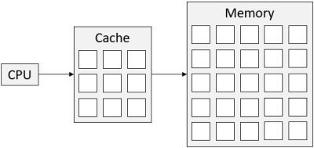

#### COM00145M Computer Architecture and Operating Systems
# **Week 2 - Memory and Systems**

## **2.0 Table of Contents**

- [**2.0 Table of Contents**](#20-table-of-contents)
- [**2.1 Learning Objectives**](#21-learning-objectives)
- [**2.2 Summary**](#22-summary)
- [**2.3 Making Memories**](#23-making-memories)
  * [**2.3.0 Reading**](#230-reading)
  * [**2.3.1 Memory Types**](#231-memory-types)
    + [**Non-Volatile Memory**](#non-volatile-memory)
    + [**Volatile Memory**](#volatile-memory)
  * [**2.3.2 Memory Performance**](#232-memory-performance)
- [**2.4 The Performance Challenge**](#24-the-performance-challenge)
  * [**2.4.0 Reading**](#240-reading)
  * [**2.4.1 Caches**](#241-caches)
    + [**Multi-level Caches**](#multi-level-caches)
  * [**2.4.2 Cache Management**](#242-cache-management)
    + [**Mapping Policies**](#mapping-policies)
    + [**Cache Replacement Policies**](#cache-replacement-policies)
    + [**Write Back Policies**](#write-back-policies)
- [**2.5 More About Memory**](#25-more-about-memory)
  * [**2.5.0 Reading**](#250-reading)
  * [**2.5.1 Avoiding Errors**](#251-avoiding-errors)
  * [**2.5.2 Programming and Memory**](#252-programming-and-memory)
  * [**2.5.3 Future of Memory**](#253-future-of-memory)

---
&emsp;
## **2.1 Learning Objectives**

* **MLO1** - Demonstrate awareness of concepts of memory as a system component
* **MLO1** - Understand and evaluate given memory configurations for performance
* **MLO1** - Identify suitable components for a memory system with a given degree of performance

---
&emsp;
## **2.2 Summary**

There are many different types of memory. One major category is that of non-volatile memory, such as ROM and PROM, and volatile memory, such as SRAM and DRAM. These are memory types defined by their ability or inability to maintain data without power. 

Additionally, quick SRAM caches and be combined with slower DRAM memory to provide quick access to repeatedly accessed files. Algorithms exist for the tracking of main memory data into the cache for retrieval and replacement of cache contents as needed.

Memory maps are a type of diagram that can help visualise memory distribution and addresses in a system for use by programmers.

---
&emsp;
## **2.3 Making Memories**

### **2.3.0 Reading**
* *Required: Chapter 5, From Architectures to Operating Systems, Crispin-Bailey*
* *Required: Chapter 6, Computer Systems: A Programmer's Perspective, Bryant et al*
* *Extension: none*

&emsp;
### **2.3.1 Memory Types**

In its simplest form, computer **memory** retains information for a period of time.
* This should not be confused with **storage devices**
* Such devices are typically non-volatile, in that they retain information when disconnected
* Memory is usually less removable and can be either **volatile** or **non-volatile**

Memory can be present in two physical types, which can allow it to run multiple programs simultaneously:
* **Physical memory** - the components that physically hold required data whilst the computer operates
* **Virtual memory** - where data is temporarily held on a storage device and moved into physical memory when needed, giving the impression of more memory in the system

&emsp;
#### **Non-Volatile Memory:**

One major category of memory is **non-volatile memory**, which can retain data indefinitely even without power:
* **Non-programmable memory** (ROM) - manufacturers with permanent data content
* **One-time programmable memory** (PROM) - structure is predefined and values added later 
* **Programmable non-volatile memory** – repeatably programmable, such as EPROM, EEROM, EAROM, and flash memory

**ROM** is used where mass production of permanent data is required, such as implanted medical devices to ensure functionality is reliable. Large upfront design costs can be avoided by using PROM instead.

**PROM** is blank when manufactured and data is permanent once programmed. This allows customers to buy in bulk, program current data for immediate use, and have spares for potential future updates to the data.

Less safety critical applications can make use of memory chips that act as if they are permanent but can be altered under very specific circumstances. **EPROM** is such an example, only erasable by UV light. The data is therefore relatively secure from remote hackers or rogue commands.

**EEROM**, **EAROM** and **flash memory** are all erased by electrical signals and are therefore less secure if those signals can be accessed. These types are semi-permanent and facilitate updates of firmware.
* These types of memory are typically slow to read and write data
* However, flash memory can operate at high speeds but still slower than volatile memory 

&emsp;
#### **Volatile Memory:**

**Volatile memory** can only retain data when powered and operating correctly. There are two main types.

The first type is **static random access memory** (SRAM), which operates using digital circuits.  
* Even a momentary loss of power is enough to lose the memory content held
* Therefore, more important systems may need **uninterruptable power supplies**
* Additionally, it has a lower storage density than DRAM, as the required size means it is more expensive per bit 

The second type is **dynamic random access memory** (DRAM), which uses smaller capacitor bit cells.
* The smaller components result in higher storage density and higher capacity
* However, it is slower than SRAM due to **refresh cycles** being needed to top up capacitors
* It comprises the bulk of physical memory in a computer due to its lower cost
* The most popular forms are small circuit boards known as **SIMM** and **DIMM** modules, which can be socketed and removed easily from motherboards for system upgrading

&emsp;
### **2.3.2 Memory Performance**

Performance in a system can be impacted by CPUs waiting for memory. **SRAM** is less of a problem as it is typically only 1 to 3 times slower than modern clock frequencies compared to **DRAM** at 5 to 20.

Both SRAM and DRAM have two types of **timing properties**:
* **Access time** - the time it takes to read a data vale onto the system bus after requesting it from memory, ideally less than a clock cycle. Any wait is described as a wait state
* **Cycle time** - describes the time required for a memory chip to set up the request, access the data, and recover internally ready for the next access

For a **memory device** to provide a data value it must be told what address to read. This involves:
* The CPU placing an address on the address line of the system bus
* The CPU asserting the correct timing signals to instigate a read operation
* This is called the **memory access protocol** and requires at least two clock cycles

A CPU requesting data from DRAM may get a response in 3 clock cycles. However, if the DRAM has a full cycle time of 5 clocks cycles, another data request cannot be processed for a further 2 clock cycles.
* Thus, **cycle time** is the true indicator of performance, not **access time**

The **memory bandwidth** is the amount of data accessed per second through the memory bus width. 
* Modern computer systems have been moving to **64-bit architectures** 
* This is partly due to the increases in memory bus width and thus memory bandwidth
* However, diminishing returns and increased complexity will limit such improvements

Accessing data in DRAM can involve a CPU sending a **row address** and **column address**, the memory locating the data, providing the result, and taking time to prepare for a new request.
* This can be described as single cycle access
* This example returns 1 value every 5 cycles
* Going through the process, including wait times, for each address needed is wasteful 

  

**Burst mode** boosts memory performance and overcomes some of these time penalties.
* DRAM is instructed to read a **consecutive** number of memory contents onto the bus
* Therefore, it only requires the first row and column address
* End of cycle wait times are only encountered once for the set of addresses read
* This example returns 4 values every 10 clock cycles, an average of 2.5 cycles per read
* Although useful in **linear sequences**, any jumps will force the burst to terminate early

  

**Page mode access** (FPM) is a variation of burst mode and another way of speeding up slow DRAM access. 
* The row address is only transmitted the first time a new row is encountered
* Column addresses in the page sequence are assumed to be part of the same row 
* However, the CPU can send the columns in any order, not necessarily **sequential**
* This is closer to the semi random nature of **program code** with jumps etc
* This example returns 4 values every 13 clock cycles, 3.25 cycles per read
* Any inefficiency is caused by having to send column addresses for every data item

  

---
&emsp;
## **2.4 The Performance Challenge**

### **2.4.0 Reading**
* *Required: Chapter 5, From Architectures to Operating Systems, Crispin-Bailey*
* *Required: Chapter 5, Computer Architecture and Organisation, Stallings*
* *Required: Chapter 6, Computer Systems: A Programmer's Perspective, Bryant et al*
* *Extension: none*

&emsp;
### **2.4.1 Caches**

There is a general concept that **10%** of program code is accessed **90%** of the time.
* This is due to the way programs are structured, eg subroutines and loops
* Programs may access data stored in adjacent locations, known as **spatial locality**
* Or, data is accessed multiple times in a short period, known as **temporal locality**
* This pattern is similar for data held in memory

The portion of memory content that is accessed frequently is called the **working set**.

A **cache** is a small amount of fast **SRAM** which interacts with the slower main memory **DRAM**.
* If the CPU wants data from memory, the SRAM cache is accessed
* A **cache hit** occurs if the data is present and is returned quickly to the CPU
* A **cache miss** occurs when the data is not present and the DRAM memory is accessed
* The **cache controller** copies the data into SRAM so next time it results in a cache hit

  

In a scenario where the SRAM has a 1 clock cycle, the DRAM has a 3 clock cycle, and both require row and column address cycles, an expected 90% cache hit rate results in:
* Small amounts of cache memory speeds up access significantly: 3.5 compared to 5 cycles
* It provides the most performance with a cost relatively close to the cheapest option

  

&emsp;
#### **Multi-level Caches:**

A system can have **multiple caches** to increase performance and alleviate **von Neumann bottlenecks**.
* The system cache and memory structures described previously still exist
* However, the CPU chip itself has an inbuilt cache, called an **on-chip cache**
* This cache may be split into two parts: **instruction cache** and **data cache**
* A bottleneck only occurs if both caches miss simultaneously
* Also, on-chip cache use also allows other components to use main memory in parallel
* This structure is called a **two-level cache hierarchy**, with the chip cache being level 1

  

The benefits of using an on-chip cache include:
* Optimising the cache to work with CPU circuitry to reduce clock cycles
* Width of the cache can be matched to the internals of the CPU to maximise performance
* The instruction and data caches can be accessed simultaneously
* Reduces any bottleneck imposed by the data bus

Adding the on-chip cache to the results of the previous system cache calculation results in:
* Performance approaching 1 clock cycle: optimal performance 

  

&emsp;
### **2.4.2 Cache Management**

**Cache replacement policies** determine what is most useful to store and how to exploit temporal locality, whilst **cache mapping policies** enhance spatial locality 

&emsp;
#### **Mapping Policies:**

A cache needs to keep track of which locations have been copied as well as the content. There are three types of addressing algorithms that allow a cache to track elements from main memory:
* Fully associative
* Set associative 
* Direct associative 

A **fully associative cache** holds values in a table, split between main memory addresses and copied data:
* The **tag** is a portion of the full main memory address
* The more complete the address, the fewer data items will be held and vice versa
* Where multiple data words are held, they form a **cache block**
* A **cache line** is made from the tag and the data words related to that locality
* Using a shared tag rather than each separate address reduces needed storage and circuitry, consequently reducing power consumption

  

A **direct mapped cache** identifies part of the main memory address and associates lines with it. 
* This uses **cache sets** as well as **cache lines** to speed up performance
* A fixed part of the main address directly maps to the set number 
* Consequently, the tag can be made smaller 
* This is generally quicker, as the location of the data is consistent

  

A **set associative cache** is a logical extension of the direct mapped cache. 
* A set has multiple lines instead of just one
* Thus, a direct mapped cache is actually a set associative cache with a set limit of 1 line

  

&emsp;
#### **Cache Replacement Policies:**

A **cache replacement policy** is a **cache controller algorithm** used to decide what data should be stored. This may result in existing content needing to be discarded to make space for new, more relevant data:
* **Least Recently Used** (LRU) – use of each item needs to be tracked
* **Least Frequently Used** (LFU) – use of each item needs to be tracked
* **First In, First Out** (FIFO) – age of items needs to be tracked
* **Random Replacement** – no need for circuits to track additional data

&emsp;
#### **Write Back Policies:**

Some policies relate to the writing of data to memory rather than reading it. Two significant variations exist:
* **Delayed write-back** – the cache captures memory writes by the CPU and the new value is only sent to the main memory when the item is discarded from the cache
* **Cache write-through policy** – every write to a location in the cache is written to the main memory at the same time. This is less efficient but ensures the memory is always correct

**Memory coherency** describes the accuracy of the main memory content in relation to that in the cache. With a write-through policy it is always 100%, however this is not the case for write-back policies.
* Whether this matters depends on the type of system being used
* Multiple components may rely on accurate main memory values that have not been provided by the CPU as the output is held in a cache and not updated
* Similarly, a CPU may be provided with out-of-date values by the cache if other components are updating the main memory

---
&emsp;
## **2.5 More About Memory**

### **2.5.0 Reading**
* *Required: Chapter 5, From Architectures to Operating Systems, Crispin-Bailey*
* *Required: Chapter 5, Computer Architecture and Organisation, Stallings*
* *Extension: [World's Smallest DRAM Cell Promises Low-Power Memory in Future Mobile Devices](https://www.ibm.com/blogs/research/2019/09/worlds-smallest-dram/), IBM*

&emsp;
### **2.5.1 Avoiding Errors**

Systems where errors are unacceptable require **error detection** and **correction** to be explicitly considered.

To avoid or reduce errors, different approaches can be taken:
* **Parity checking**, a relatively simpler technique
* Using modified RAM called **Error Correcting Code memory** (ECC)
* **Power-on self tests**, where a system will write test patterns to detect unusable areas

&emsp;
### **2.5.2 Programming and Memory**

A **memory map** represents the memory structure as it may be accessed by a programmer:
* **Hexadecimal** is used to describe memory locations, eg FFFFh = (216 - 1) 
* IO devices include storage locations for values for device configuration or monitoring status
* These appear as memory locations to the CPU through the system bus 

  

Some OS will designate some areas of memory to be **non-cacheable** to avoid unwanted actions, like IO key presses, to be stored in the cache. Consider the dangers of an IO device monitoring gas levels and the CPU missing alert thresholds due to reading previously cached data rather than the changing data.

Alternatively, some processors will have **separate address space** for IO devices, allowing them to exist in memory outside of the caching scope.

Memory maps allow such issues to be visible during the design phase.

&emsp;
### **2.5.3 Future of Memory**

Advances in **silicon chip** manufacturer have resulted in components being present on a chip: whereas early chips had components measured in microns, modern chips have components in nanometres.

However, further improvements are likely to slow soon:
* Devices are reaching a point where individual atoms and electrons impact performance
* As chip transistor numbers increase, so too does the chances of defective hardware

The increase in faults have somewhat been circumvented by stacking less dense chips together. 
* Relative size does not increase too much
* However, power density and therefore thermal density increase within the package
* This has resulted in high performance modules having heatsinks to ensure reliability
* Ultimately, it will not be possible to fit more chips into a module unless power and heat are reduced further. This barrier to progress is known as the power wall