#### COM00145M Computer Architecture and Operating Systems
# **Week 3 - Building the System**

## **3.0 Table of Contents**

- [**3.0 Table of Contents**](#30-table-of-contents)
- [**3.1 Learning Objectives**](#31-learning-objectives)
- [**3.2 Summary**](#32-summary)
- [**3.3 Building the System**](#33-building-the-system)
  * [**3.3.0 Reading**](#330-reading)
  * [**3.3.1 Bus Architecture**](#331-bus-architecture)
    + [**Bus Types**](#bus-types)
    + [**Concurrency**](#concurrency)
    + [**Data Rate Matching**](#data-rate-matching)
  * [**3.3.2 A System Bus Example**](#332-a-system-bus-example)
  * [**3.3.3 Bus Standards**](#333-bus-standards)
    + [**PCI**](#pci)
    + [**USB**](#usb)
    + [**Daisy Chaining**](#daisy-chaining)
    + [**Industrial Busses**](#industrial-busses)
- [**3.4 Storage Technologies**](#34-storage-technologies)
  * [**3.4.0 Reading**](#340-reading)
  * [**3.4.1 Data Storage**](#341-data-storage)
    + [**Modern Disks**](#modern-disks)
    + [**Fragmentation**](#fragmentation)
  * [**3.4.2 Disk Cache**](#342-disk-cache)
  * [**3.4.3 Solid State Drives**](#343-solid-state-drives)
    + [**Memory Wear**](#memory-wear)
  * [**3.4.4 Reliability and Faults**](#344-reliability-and-faults)
  * [**3.4.5 Remote Data Storage**](#345-remote-data-storage)
- [**3.5 Peripherals and Interfaces**](#35-peripherals-and-interfaces)
  * [**3.5.0 Reading**](#350-reading)
  * [**3.5.1 Input / Output**](#351-input-output)
    + [**Input Devices**](#input-devices)
    + [**Output Devices**](#output-devices)
    + [**Novel Devices**](#novel-devices)
  * [**3.5.2 Networks**](#352-networks)
    + [**Wired Networks**](#wired-networks)
    + [**Wireless Networks**](#wireless-networks)
    + [**Protocols**](#protocols)

---
&emsp;
## **3.1 Learning Objectives**

* **MLO1** - Show core knowledge of system integration concepts and design choices
* **MLO1** - Demonstrate awareness of data storage systems function and theory
* **MLO1** - Appreciate the principles of encryption, RAID, remote storage, and servers
* **MLO1** - Understand the role and capabilities peripherals
* **MLO1** - Select suitable storage components and estimate their performance characteristics
* **MLO1** - Select interfaces and components to achieve compatibility and evaluate efficiency

---
&emsp;
## **3.2 Summary**

In addition to the system bus, multiple auxiliary buses can be added to the computer system. These can be optimised to increase performance by their placement in the architecture and their compliance with the bus standards.

Permanent data storage tends to be either be on HDDs or increasingly SDDs, which avoid the mechanical costs through use of flash memory. Data fragmentation affects HDDs and can be addressed using applications.

Peripherals to the system can include input, output, and network devices. Sometimes these require bespoke connections to function.

---
&emsp;
## **3.3 Building the System**

### **3.3.0 Reading**
* *Required: Chapter 6, From Architectures to Operating Systems, Crispin-Bailey*
* *Required: Chapter 6, Computer Systems: A Programmer's Perspective, Bryant et al*
* *Extension: none*

&emsp;
### **3.3.1 Bus Architecture**

The base of a modern computer system is a self-contained circuit board called the **motherboard**. 
* Connections between components are formed by metal tracks built into or onto the board
* However, **high frequency signals **travel poorly through longer connecting wires
* Due to the large size of motherboards, **component location** must be carefully designed 
* Signals can be sent at **lower frequencies** to avoid issues, but this lowers the system speed
* To avoid forcing the entire system to run at the frequency of its slowest component, **local busses** can be added to the system

  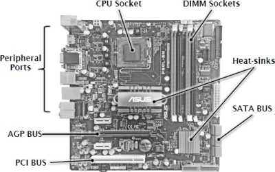

&emsp;
#### **Bus Types:**

In simple terms, the **system bus** is a collection of signal wires connecting basic components together.
* The **von Neumann model** would be expected to visible on this bus
* Alternative names are **host bus**, **local bus**, or **main bus**

Data can either be sent directly from one device to another or **broadcast** from multiple devices.
* In both scenarios, there is a **bus master** and a **bus slave**
* The master controls the **bus transaction**: when to start, what is transferred, when to end

As well as a system bus, there may be **secondary busses**. These connect to the system through an interface called the **bus bridge** or directly to the CPU through a **dedicated bus**.
* It shows a possible bus **hierarchy**: a tiered structure with the system bus at the top level
* Direct connections can be described as **point to point** and are not traditionally buses
* Devices on the **auxiliary bus** can communicate with each other without the CPU
* Therefore, the bus bridge encourages compartmentalisation and cooperation
* Dedicated busses allow continuous operation without interfering with system bandwidth

  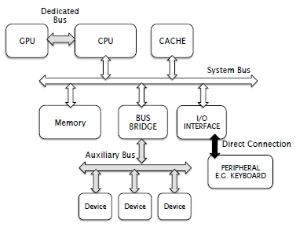

&emsp;
#### **Concurrency:**

Depending on their design, multiple buses can allow **concurrency**. 
* The **system bus** can operate one transaction at a time 
* However, an **auxiliary bus** can be performing transactions between its local devices too
* Potentially, the busses can run concurrently without hindering other’s performance. 
* The faster auxiliary buses above are not limited by the slower system bus

  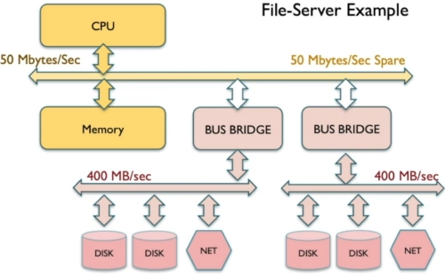

&emsp;
#### **Data Rate Matching:**

Two devices connected through a bus may have different capabilities and speeds.
* Here, the sender is considered a **producer** and the recipient a **consumer**
* A **local buffer** is used by the consumer if the producer sends data faster than it can handle
* While the buffer is not full, the producer can continue sending data through the bus
* If the situation is reversed, the consumer will spend time idle

&emsp;
### **3.3.2 A System Bus Example**

A generic example of a **system bus** found in a modern computer system can be illustrated as:
* This represents the origin, destination, and information flow in the bus
* The **clock driver** is the circuit that sends the on-off signal that represents the system clock
* All devices in the system use this clock for synchronisation, even the master device
* The **address lines** are a group of wires that represent memory locations 
* In a system with 10 address lines, these would usually be named A0 through to A9
* Addresses are binary, so the address range a would be 2a, eg 210 = 1024 locations
* The **data lines** D0 – DN represent the size of data values that can be transferred across
* RAS and CAS are the row and column address selects needed by memory chips
* Some processors generate these, but some need an additional memory controller chip
* **Multiplexed addressing** reduces address lines by alternating sending of rows and columns
* However, this does increase the clock cycles needed to send a complete address
* **RD** and **WR** signals control the direction data is being transferred
* Master sending data is a write transaction, master receiving data is a read transaction

  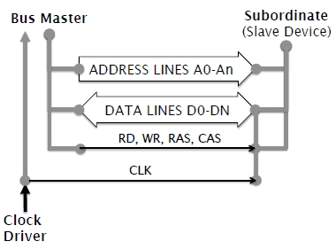

&emsp;
### **3.3.3 Bus Standards**

The development of recognised **bus standards** has established the operating principles for different types of bus. This allows different manufacturers to develop their own devices that are **bus compatible**.

When a standard becomes outdated or less frequently used, it is referred to as a **legacy bus standard**.
* Support for these is limited or removed completely

&emsp;
#### **PCI:**

The **PCI bus standard** is complex but a common and successful example of auxiliary bus architecture:
* 33 MHz Bus Frequency
* 32 bit Data Width
* 32 bit Address Range
* Bus Arbitration requires 5 clock cycles
* Bus Turnaround requires 1 clock cycle

It uses **bus multiplexing**, but rather than splitting addresses into rows and columns it uses a single bus to transfer address and data values. This is called the **address-data bus**.
* Consequently, address lines and data lines can actually be the same wires
* This is because they will not be used simultaneously 

A simplistic value for **raw bandwidth** of the bus can be calculated as:
* bus frequency * data width = bandwidth, 33,000,000 * (32 / 8) = 126 Megabytes/sec
* This is generally correct, however there are bus standards that affect functionality
* **Bus arbitration** involves a controller deciding which system device is given bus ownership
* **Bus turnaround** is the time taken for a device to finish using the bus and availability
* Therefore, one 32-data word requires 7 cycles: arbitration, data, turnaround
* This **protocol overhead** reduces raw bandwidth by 1/7, down to only 18-19 Megabytes/sec
* Transferring data as block transfers, like DRAM burst mode, mitigates this somewhat:
* Increasing transferred words to 16 takes 22 cycles but increases rate to 92 Megabytes/sec
* However, large transfer blocks are not always needed and longer block sizes mean other devices must wait to use the bus

  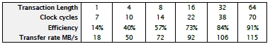

&emsp;
#### **USB:**

**Universal Serial Bus** (USB) is ideal for external connectivity and can power low usage devices.

While USB 1.0 had data rates of up to 12 Mbits/sec, its effective data rate was limited by its standards:
* Data transmission begins with a SYNC signal sequence, roughly about 8 bits
* Every packet begins with a **packet identifier** (PID), equivalent to 8 bits
* Every packet ends with an **end of packet** (EOP) sequence, equivalent to 3 bits
* Every pack also includes an error check, a 16 bit CRC code
* Thus, every packet contains 35 bits before data is included

The **USB protocol** uses bit **stuffing**. As it has no bus clock, data bits themselves allow a clock to be recovered, using a special circuit which detects the zero-one and one-zero transitions in the bit stream.
* However, actual data being sent through a USB device is not controlled by the system
* If too many consecutive bits are the same, the recovery circuit may lose synchronisation 
* USB hardware will insert an extra bit when this scenario is approached to avoid it
* As it after 6 consecutive unchanged bits, data transfer times may increase up to 1/6th 

Like PCI, USB is more efficient if sending longer blocks with the same negatives.

There are two further important aspects of USB:
* It has **legacy compatibility**, allowing a USB 1.0 device to work in a USB 2.0/3.0 bus
* **Plug and play** support allows devices to be hot swapped during system operation

&emsp;
#### **Daisy Chaining:**

Often storage devices such as IDE and SATA involve **daisy-chaining**: using individual connectors to loop from one device to the next, forming a bus in the process. This reduces the number of wires needed.

&emsp;
#### **Industrial Busses:**

**Embedded** and **industrial computing systems** may require power levels or fault tolerance beyond what is necessary in domestic systems.

An example of this is the **I2C bus system**. The example below shows the beginning of a boiler controller:
* Only two wires are needed for an I2C bus: a small hardware cost
* **Serial Clock Line** (SCL) protocol provides synchronisation, generated by the bus master
* **Serial Data Line** (SDL) provides means to transmit data bits, one bit per clock pulse
* Any device can be the master, but the Bus Master resolution protocol prevents conflicts
* This is a back off and retry arbitration system, often used where there is no central controller. It allows devices to attempt to be the master and retreat if unsuccessful

  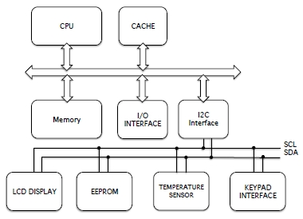

A further example is that of the **Controller Area Network** (CAN) bus, designed for the automotive industry. A single two-wire bus runs from one device to another, streamlining the wiring needed.
* It employs **differential signalling**: one wire using positive voltages, the other negative
* Each wire transmits a mirror of the data patterns,
* This ensures patterns are not distorted in a factory environment 

---
&emsp;
## **3.4 Storage Technologies**

### **3.4.0 Reading**
* *Required: Chapter 7, From Architectures to Operating Systems, Crispin-Bailey*
* *Required: Chapter 6, Computer Organisation and Architecture, Stallings*
* *Extension: [The Dual Actuator/Head Hard Drive](https://www.tomshardware.com/news/seagate-hdd-harddrive,8279.html), Tom's Hardware*
* *Extension: [Seagate's New Multi-Actuator Could Double Hard Drive Speeds](https://www.extremetech.com/computing/260946-seagates-new-multi-actuator-technology-double-hard-drive-speeds), Extreme Tech*

&emsp;
### **3.4.1 Data Storage**

Due to the small size and volatile limitations of memory, disk storage developed to back up system data.

Early systems progressed through various iterations since the 1960s:
* **Punched cards** and **tapes**, using holes to represent data
* **Magnetic tapes**, replacing holes with magnetically manipulated signals
* This led to **magnetic disks**, which form the basis for most recent storage systems

Recording data onto **magnetic tape systems** was like recording audio onto tapes:
* One or more magnetic recording heads
* Data was recorded onto the tape as it spooled through the read/write assembly
* However, this **serialisation** meant the tape needed to be spooled to retrieve specific data
* Therefore, there are two time factors involved: seek time and transfer time
* Transfer time could be quite high, but seek time was slow
* Due to their capacity and robustness, tape is still used by companies for data back ups

&emsp;
#### **Modern Disks:**

A modern **Hard Disk Drive** (HDD) consists of multiple disks known as **platters**, which can be double sided. Typically, these have a single **armature** each, which reads or writes data.
* Locating data involves a request for a data block and track being received
* **Seek time** is the time taken for the armature to move to the required track 
* This can be reduced by adding more tracks or having more platters
* However, this requires increased precision of the head positioning systems
* **Rotational latency** is the time it takes to rotate the disk to the required section

  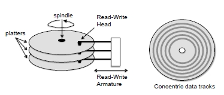

The smallest data block that can be read or written to is based on the **sector size**. If a sector is 512 bytes:
* A 300 byte file can fit into one sector
* Since data cannot be stored in smaller blocks, a 5000-byte file would need 10 sectors
* As a file is unlikely to fill the sector completely, there will always be some wasted space
* The best case is 0 wastage; the worst is n-1 where n is the size of the sector
* Large sector sizes are not efficient for large numbers of small files

The **rotational speed** of the disk dictates how fast the required bits can be rotated into position to be read or written. It is measures in **revolutions per minute** (RPM).
* eg 7200 / 60 = 120, 1/120 = 0.0083 seconds, 8.3 milliseconds
* Common speeds are 5400rpm, 7200rpm, and even 15000 rpm for high performance
* Higher speeds can shorten drive lifetime and increase power consumption
* Lower RPM leads contributes to larger access latencies

  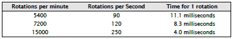

**Rotational latency**, **sectors per track**, and **bytes per sector** allows for the data rate can be calculated:
* Modern drives use zoned bit recording
* This means the outer tracks have more sectors than the inner tracks
* Data transfer from the outer tracks may be higher since a rotation delivers more bits

  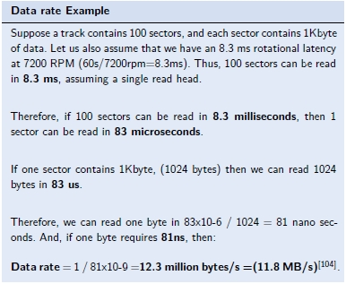

Data transfer rates can therefore be increased by:
* Rotating the disk faster
* More bytes into a sector
* More sectors per track
* Multiple read heads reading tracks in parallel

An example worst, best, and average case access time for a drive with a speed of 5400rpm, read rate of 100 Megabytes/sec, a sector size of 2KB, and 3KB of data being accessed can be calculate as:
* This assumes 2 milliseconds to move the head to the correct track, as per manufacturer
* 5400rpm = 90 times per second, so a full rotation is completed in 11.1 ms
* Average performance assumes files are spread equally across the disk, but they may be clustered together. This may improve average performance, but cannot guarantee it

  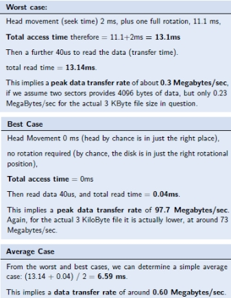

&emsp;
#### **Fragmentation:**

The spreading of file data across the disk is known as **fragmentation**. 
* **Contiguous files** have their sectors on the same track and in the right order, with no gaps
* **Fragmented files** are the opposite, distributed inconsistently. It is a spectrum

  

A fragmented file would affect the previous example, as the head and rotation mechanics need to be duplicated for each sector holding the fragmented data:

  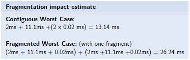

This can be solved using a **defragmentation utility**, which attempts to make every file contiguous.

&emsp;
### **3.4.2 Disk Cache**

Most modern disks have an inbuilt **cache memory module**, acting as a data buffer and optimising function.
* This helps avoid the mechanical access times involved with repeat reading of files
* **Interleaved seek operations** of a program jumping between files can be eliminated
* Badly fragmented files no longer suffer the associated consequences once cached
* Note that caches only improve successive, not initial disk access speeds

&emsp;
### **3.4.3 Solid State Drives**

**Solid State Drives** (SSD) are a recent development, more costly than HDDs but much faster.
* Simply, it uses flash memory in place of disks, along with a memory controller
* Although appearing like an HDD to the CPU, an SSD has no mechanical complications
* SSDs have fast read times, even with non-contiguous files and interleaved access
* Writing to an SSD is fairly slow due to the flash memory involved

Due to their increased cost, they are best used sparingly to maximise benefit. An appropriate use is for storing the OS, as the associated data is frequently read from but infrequently read to.

&emsp;
#### **Memory Wear:**

SSDs are limited to a certain number of reliable writes over their lifetime due to the flash memory used. Near this limit, data integrity may be lost. However, this takes place over years. Reads are unlimited.
* **Wear levelling** involves writing evenly across the drive to avoid excessive aging of an area
* **Caches** are still present, helping to avoid premature wear on the device

&emsp;
### **3.4.4 Reliability and Faults**

**Data integrity** can be critically important and is vulnerable from:
* **Mechanical failure** – physical failure of an HDD part. Partial recovery may be possible
* **File corruption** – unpredictable and can affect HDD and SDDs

Typically, file corruption chance is so small it is not enough to concern most standard usage. Data can be stored with extra information, called an **error correction code** (ECC), which can help identify errors.

Mechanical failures can be mitigated against using **redundant storage arrays**: two disks storing the same data, so if one fails the other provides a full copy.

High degrees of data integrity can involve **redundant array of independent disks** (RAID) disk systems:
* **RAID** standards are vast, but notable examples include RAID0 and RAID1
* **RAID0** – multiple drives acting in parallel as one to increase performance
* **RAID1** – uses disk mirroring, so two or more drives have identical content

&emsp;
### **3.4.5 Remote Data Storage**

**Remote data storage** has become a popular source of data storage.
* Modern operating systems support **network**, **cloud**, or **remote** drives
* **Server Latency** is an additional time involved in accessing a file on a remote server 
* This is often small, providing the data transfer rates of the network are high
* Consequently, this is a good solution for small files and files that can be streamed

---
&emsp;
## **3.5 Peripherals and Interfaces**

### **3.5.0 Reading**
* *Required: Chapter 8, From Architectures to Operating Systems, Crispin-Bailey*
* *Extension: none*

&emsp;
### **3.5.1 Input / Output**

Peripherals are devices that plug into the system to extend its capabilities.

  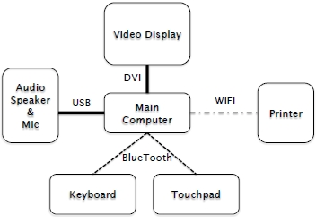

&emsp;
#### **Input Devices:**

**Input peripherals** usually support user interaction: either information input or system control. This includes:
* Keyboards 
* Mouse
* Touchpads – permits more sophisticated inputs than a mouse
* Touchscreens – typically integrated into the device rather than being a true peripheral
* Stylus – used directly on the screen or a graphics tablet
* Microphone – can enable the use of voice commands
* Camera – can also scan QR codes and enable gesture recognition

  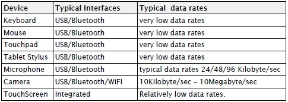

&emsp;
#### **Output Devices:**

**Output devices** are less numerous, since human communication is primarily done with vision and sound. Additionally, print, video and audio can be demanding on file storage space:
* Video – requires specialised connectors, such as HDMI, due to high data rates
* Video projectors
* GPUs – created to offload increasing video processing demands from the CPU
* Printers – modern devices are toner or inkjet based and increasingly wireless
* Audio – also offloaded but much less sophisticated than GPUs

  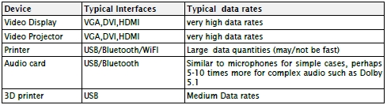

&emsp;
#### **Novel Devices:**

Future interfaces may involve peripherals currently less mainstream, including:
* **Haptics** – a type of feedback involving touch, such as vibration
* **Data gloves** – permits physical interaction in VR systems
* **Mocap** – motion capture input to a system

&emsp;
### **3.5.2 Networks**

Network connectivity is almost essential in modern systems, even present in devices such as lightbulbs.

&emsp;
#### **Wired Networks:**

The most common wired network connection is **Ethernet**, connecting a single system to a network. **Asynchronous Transfer Mode** (ATM) is less popular but is used in certain scenarios.
* The shared **Ethernet bus **can lead to unpredictable service when in demand by devices
* However, ATM reserves fixed time slices of the network for each device

An Ethernet controller is a chip which enacts the data transfer protocol, possibly integrated into a processor chip to reduce circuit board size and increase coupling of Ethernet to memory.
Ethernet controllers use a technique called **Carrier Sense Multiple Access / Collision Detection** (CSMA/CD), which allows devices to transmit at any time without central control. Collisions are defined as several devices attempting to transmit at the same time and are minimised by the CMSA/CD protocol:
* Devices must first check if the Ethernet bus is in use
* If the bus is not busy, multiple devices can transmit
* The transmitting device checks the bus to see if received data is the same as that sent
* If it is not the same, another device might be trying to transmit as well
* If a collision occurs, all devices stop and wait a random period before trying again
* The more devices connect to the network, the chance of collisions increases
* CSMA/CD is non-deterministic and there is no guarantee a device will ever get to transmit

  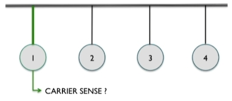

Wired networks are limited by the speed and length of the cable as well as the competing devices.

&emsp;
#### **Wireless Networks:**

**WiFi** networks use radio frequency data transmissions in place of physical wires. This removes the need for cabling infrastructure and facilitates wider device connectivity, but radio signals are prone of interference.

Typically, these work well over short distances, but can be boosted and extended.

&emsp;
#### **Protocols:**

**Bluetooth** is another wireless data networking standard, but over much shorter distances than WiFi. Its low power use makes it ideal for battery devices and its low bandwidth makes it suitable for keyboards.

Maximum bit rate is dictated by electrical behaviour and network connections, but in these are rarely reached.
* Low level hardware requirements of a network may introduce additional bits of cycles
* Transmitted data may be sent in patterns, known as **packets**, with extra information 
* eg a payload of 128 bytes sent on a network using 8 byte headers = 128 / 128 + 8 = 94%

  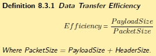

Therefore, the parameters of the most common Ethernet format, Frame Type-II, would result in:
* Header: 6 bytes source address, 6 bytes destination address, 2 bytes control field
* Payload: minimum 46 bytes, maximum 1500 bytes
* CRC: 4 byte error checksum

  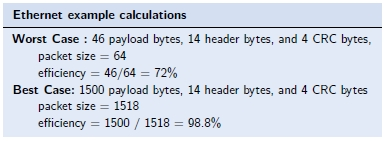

While longer payloads result in higher efficiency, it delays transmission of other devices on the network.
* As payload size increase, data transfer increases up to the maximum bandwidth
* However, delay increases as well
* If bandwidth was the primary concern, a payload size of 500-1000 may be sensible
* If reducing delay was most important, a payload size of no more than 500 is appropriate

  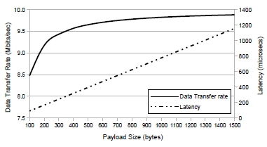

Sending multiple **packets** can be beneficial, as it allows the CPU to process the earlier packets while the others are being sent, like pipelining.