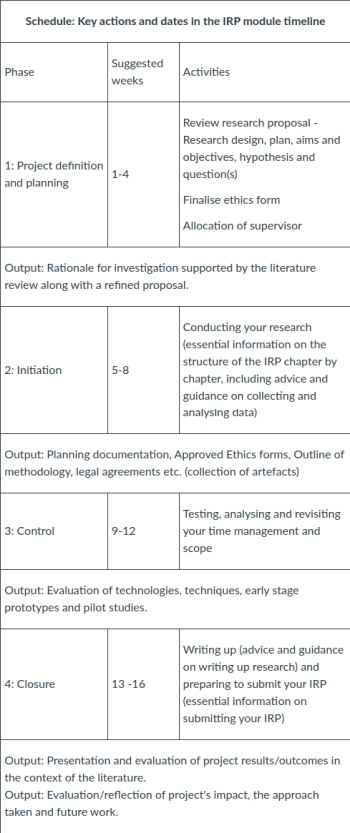
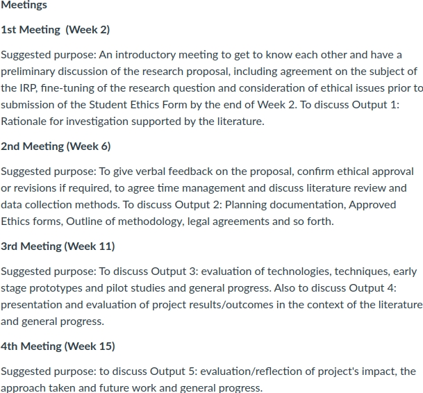
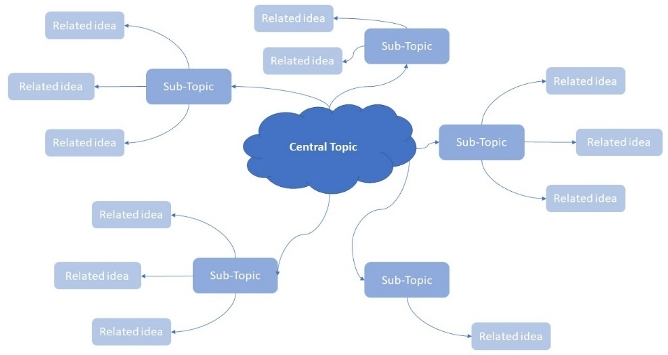
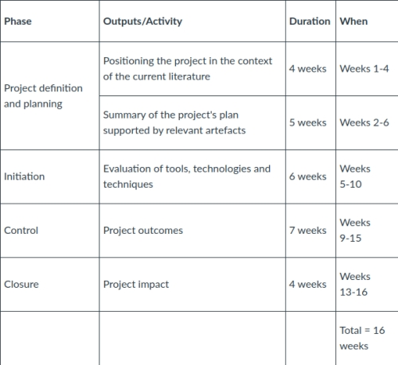
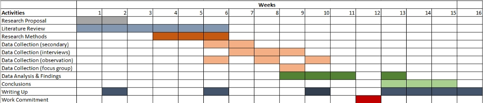
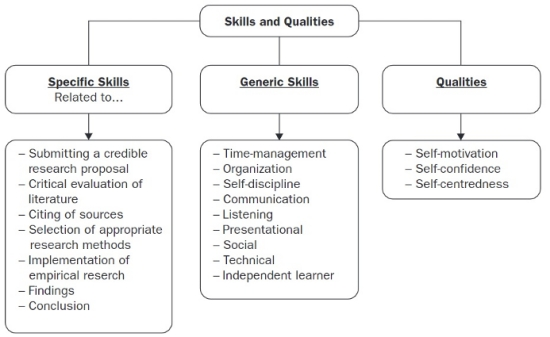

#### COM00151M Independent Research Project
# **Unit 1 - Project Definition and Planning**

## **1.0 Table of Contents**

- [**1.0 Table of Contents**](#10-table-of-contents)
- [**1.1 Learning Objectives**](#11-learning-objectives)
- [**1.2 Summary**](#12-summary)
- [**1.3 Aims of the Independent Research Project**](#13-aims-of-the-independent-research-project)
  * [**1.3.0 Reading**](#130-reading)
  * [**1.3.1 The Independent Research Project**](#131-the-independent-research-project)
    + [**Essential Information**](#essential-information)
- [**1.4 Phase 1 - Literature, Ethics, and Supervision**](#14-phase-1-literature-ethics-and-supervision)
  * [**1.4.0 Reading**](#140-reading)
  * [**1.4.1 Research Proposal**](#141-research-proposal)
  * [**1.4.2 Literature Review**](#142-literature-review)
    + [**Refining the Review**](#refining-the-review)
  * [**1.4.3 Ethics Approval**](#143-ethics-approval)
    + [**Completing the Ethics Form**](#completing-the-ethics-form)
  * [**1.4.4 IRP Supervisor**](#144-irp-supervisor)
    + [**Contact**](#contact)
    + [**Expectations**](#expectations)
- [**1.5 Later Phases of the IRP**](#15-later-phases-of-the-irp)
  * [**1.5.0 Reading**](#150-reading)
  * [**1.5.1 Phase 2 - Initiation**](#151-phase-2-initiation)
  * [**1.5.2 Phase 3 - Control**](#152-phase-3-control)
  * [**1.5.3 Phase 4 - Closure**](#153-phase-4-closure)
- [**1.6 Advice and Support**](#16-advice-and-support)
  * [**1.6.0 Reading**](#160-reading)
  * [**1.6.1 Communication**](#161-communication)
  * [**1.6.2 Resources, Management, and Organisation**](#162-resources-management-and-organisation)
    + [**Time Management**](#time-management)
    + [**Module Support**](#module-support)
  * [**1.6.3 Academic Integrity**](#163-academic-integrity)
    + [**Turnitin**](#turnitin)

---
&emsp;
## **1.1 Learning Objectives**

* **MLO1** - Defining and planning a project
* **MLO1** - Understanding how to start a project
* **MLO1, MLO3** - Understanding later phases of the IRP
* **MLO1, MLO2** - Identify the advice and support available

---
&emsp;
## **1.2 Summary**

An Independent Research Project (IRP) at the master's level comprises four structured phases including initiation, control, and closure, managed by the student under the supervision of a faculty member. 

The student's responsibilities encompass project planning, conducting research, and organisation, while the supervisor provides advice and reviews progress. 

Key success factors for the project include effective communication, time management, resource utilisation, and maintaining academic integrity by avoiding plagiarism, with tools like Turnitin available to verify originality.

---
&emsp;
## **1.3 Aims of the Independent Research Project**

### **1.3.0 Reading**
* *Required: [The ‘Campus Imaginary’: Online Students’ Experience Of The Masters Dissertation At A Distance](https://www-tandfonline-com.libproxy.york.ac.uk/doi/full/10.1080/13562517.2017.1319809), Ross and Sheail*
* *Extension: none*

&emsp;
### **1.3.1 The Independent Research Project**

The **Independent Research Project** (IRP) is the implementation and write up of the plan submitted in the previous **Research Proposal** (RP) module. It could include:
* Software or hardware engineering
* Scientific method of hypothesis generation and experiment
* Or other suitable and accepted proposals

The **skills** required to complete this longer piece of sustained research and writing have been developed across the course:
* Critical analytical skills
* Ability to gather and synthesise literature and data from a range of sources
* Academic writing skills
* Subject specific knowledge
* Self management
* Working to deadlines

The nature of **distance independent self study** can feel isolating. Being aware of this prior to starting can help prepare for the upcoming experiences.

&emsp;
#### **Essential Information:**

The information for this module is presented in four **phases** over 16 weeks, rather than the weekly structure of previous modules:

  

While the material for all phases should be read within the first five weeks, it is expected that the information will be **revisited** and **reviewed** as needed during the project itself.

---
&emsp;
## **1.4 Phase 1 - Literature, Ethics, and Supervision**

### **1.4.0 Reading**
* *Required: none*
* *Extension: none*

&emsp;
### **1.4.1 Research Proposal**

Every **research project** requires a **research proposal** explaining the relevant literature, methodology, and methods.

It is expected to use the submission from the previous **Research Proposal** (RP) module, although these initial proposals usually require **refinement** before proceeding.
* This will be reviewed with the assigned supervisor
* Changes may relate to the **question**, **scope**, or **approach**
* The process is iterative and multiple changes are expected
* The result from this process is part of the **output** from Phase 1

It is possible to submit a new research proposal, although this will result in a condensed research proposal being submitted to the supervisor as soon as possible.

As explained in the RP module, the **research proposal** should include:
* An **introduction** explaining the field of study, unit of analysis and objectives
* A **literature review** providing relevant context
* A specific **research question** or problem
* Identification adn explanation of the intended **methodology**
* An outline of **data sources**
* A statement of the **ethical implications** and fast track approval form if needed
* The intended **timeframe**, ideally displayed as a Gantt Chart or a timetable
* A full **reference list**

&emsp;
### **1.4.2 Literature Review**

The **literature review** should be an account of what other people have done in this field before. It includes:
* A description of relevant literature 
* A review of previously published findings
* Historical information necessary to place the investigation in context

Good literature reviews organise the material into **themes** and draw out the main points on which previous writers agree or disagree.

It is more than a a **chronological account** of what was done and when. Rather, it should lay the **foundation** for the study by identifying significant issues arising from previous work.
* It **should not** be a summary of who has written what
* It **should** be a commentary on different authors and their work

The **conclusion** of the review should summarise the findings and explain how they informed the development of the study's research question.

Correct and consistent **referencing** demonstrates academic integrity. Note that an over reliance on **direct quotations** should be avoided.

&emsp;
#### **Refining the Review:**

As a recap: 
* **Research Methods** (RM) - covered literature types, source evaluation, and critical review
* **Research Proposal** (RP) - covered the role of the review,  and how to write it up

A good literature review is defined by the presence of **critical evaluation**:
* Weighing arguments from **multiple perspectives**
* Evaluating held **ideas** and those of others
* Considering **strengths** and **weaknesses** of arguments
* Identifying **gaps** and **limitations** in existing literature

There are specific chapters in the core texts useful for reference when writing the literature review:
* *Chapter 5, Projects in Computing and Information Systems: A Student's Guide, Dawson*
* *Chapter 9, Dissertations and Project Reports: A Step by Step Guide, Cottrell*
* *Chapter 5, Succeeding With Your Master's Dissertation, Biggam*
* *Chapter 2, Research Design, Qualitative, Quantitative and Mixed Methods Approaches, Cresswell and Cresswell*
* *Chapter 3, Writing for Computer Science, Zobel*

&emsp;
### **1.4.3 Ethics Approval**

**Research ethics** were considered in both the previous **Research Methods** (RM) and **Research Proposal** (RP) modules.

All research undertaken by university students and staff require **ethical approval**, which is particularly important for **primary research** involving real people.

It is mandatory for all students on the **Independent Research Project** (IRP) module to have completed a fast track **Research Ethics form** and, if necessary, a **full ethics form**.
* The supervisor will discuss whether a full ethics form is needed
* Data should not be collected prior to recieving **ethics approval**

The end of week 3 is the **deadline** for submission of full ethics forms.

&emsp;
#### **Completing the Ethics Form:**

A **pilot survey** or **interview** may be needed to demonstrate testing for unexpected ethical issues.

All **data** collected through research needs to be **securely stored**:
* Hard copies should be locked away
* Electronic data should be on an encrypted, password protected computer
* Back ups should be made regularly on encrypted hard drives

The main ethical issues relating to this project are **informed consent**, **confidentiality** and **anonymisation of data**.
* Informed consent for participants requires an information sheet and consent form
* This will detail basic information about the research and their role within it
* Participants should be informed they have the right to withdraw at any time
* Participants also need to be guaranteed anonymity and confidentiality 
* A copy of the form should be included in the **appendix** of the proposal, if needed

The design of any **survey questionnaires** or **interview guides** must be submitted to the supervisor for approval before use. These should also be added to the **appendix**, if used.

A model **information sheet** and **consent form** can be found [here](https://docs.google.com/document/d/1iELyOFFvjY75zvzlRCSDTEUiERb43BJTehyAo9mUCfE/edit?usp=sharing).

&emsp;
### **1.4.4 IRP Supervisor**

Supervisors are allocated according to the topic area detailed on the **Research Proposal** (RP) summative. This attempts to match supervisors with specific expertise to the area of study.

Supervision is primarily about guiding students through the process of a conducting research project and presenting the findings from a position of experience.

The **first meeting** should be arranged to occur before the end of Week 2. A copy of the previously submitted proposal should also be made available.

&emsp;
#### **Contact:**

The minimum level of contact with the supervisor can be expected to be:

  

Additionally, the supervisor can be contacted by **email** with an expected response within 3 working days.

It is the responsibility of the **student** to contact their **supervisor** and arrange meeting times and dates suitable for both parties. It is recommended to set dates for the next meeting at the end of each meeting.

&emsp;
#### **Expectations:**

The supervisor is **expected** to:
* Advise on appropriate forms of **research methods**
* Regularly review **work** and **progress**
* Offer **constructive criticism** of ideas and writing
* Advise on the **standard** necessary to pass the project
* Help navigate university **rules** and **regulations**

However, the supervisor is **not expected** to:
* **Proof read** or correct use of English
* **Direct** what to research or to write

The expectation of the student centres around the **planning**, **conduct**, and **organisation**. Therefore, a successful student should be:
* Actively **engage** in the IRP process
* **Self-disciplined** and **hard working**
* Prepared for **meetings** and **discussions**
* Willing to listen and take **advice**
* Seek **help** when needed

**Significant problems** or **set backs** should be shared with the supervisor at the earliest opportunity.

---
&emsp;
## **1.5 Later Phases of the IRP**

### **1.5.0 Reading**
* *Required: none*
* *Extension: none*

&emsp;
### **1.5.1 Phase 2 - Initiation**

With feedback on the previous module submission, adjustments suggested by the supervisor, and ethical approval, the proposed research can be started.

This stage relies heavily upon **independent study skills**: the student will lead and manage the project. A research plan and timetable will help organise **what** is required, **how**,  and by **when**.

Depending on the type of project, it is likely that this phase will involve:
* **Data collection** and **analysis** activities as the primary activity
* Starting the build of any **artefacts** or **models**
* The **literature review** as an iterative process 
* **Writing** sections for the final submission

Remember that the process is **fluid** and it is common to revisit earlier work as progress is made.

&emsp;
### **1.5.2 Phase 3 - Control**

This phase focuses on **testing**, **analysis**, **advancing** the project, and an **evaluation** of the tools and techniques used thus far. This may include:
* Reflection on progress
* Consideration of pilot study results
* Further literature review
* Prototype testing

**Five elements** also need reviewing:
* Time
* Resources
* Money
* Scope
* Quality

Completion of these activities should allow the researcher to identify and present any **dead ends** and minor **directional adjustments** needed.

&emsp;
### **1.5.3 Phase 4 - Closure**

Althought is is the final stage, it is highly encouraged to begin writing earlier in the project: previously **drafted sections** will remove pressure and stress from this phase.

Note that the supervisor will not proofread or help edit drafts.

---
&emsp;
## **1.6 Advice and Support**

### **1.6.0 Reading**
* *Required: none*
* *Extension: none*

&emsp;
### **1.6.1 Communication**

The **clear communication** of ideas, intentions, relevance, and findings is an important skill for the IRP project. 

**Mind maps **are one way to effectively collect and organise thoughts and ideas through visual representation. At the centre is the main idea and subtopics and connections are drawn radiating from it.

  

A video suggesting such an approach is available [here](https://www.youtube.com/watch?v=u5Y4pIsXTV0&t=203s).

This approach can help communication in **supervisor meetings**.

&emsp;
### **1.6.2 Resources, Management, and Organisation**

**Poor marks** are commonly awarded because the student has not used their time wisely.

It is recommended to keep a **steady pace** and finish a draft of the **literature review** early; it can always be added to as the research progresses.

&emsp;
#### **Time Management:**

It is standard practice to include a **timetable** in the research proposal illustrating the sequence and timings of activities across the allowed time period.
* What **activities** are needed
* When these will **start**
* The estimated **duration**

A basic timetable is illustrated below, however:
* It provides an overview rather than allowing for overlapping or concurrent activities. 
* It doesn't appropriately mirror the 4 week structure provided by the module
* Therefore, it is useful as a starting point rather than a practical guide

  

A **Gantt chart** is one way to address these issues:

  

Further information on using Gantt charts can be found [here](https://researchwhisperer.org/2011/09/13/gantt-chart/).

&emsp;
#### **Module Support:**

Support can be found from the appropriate sources:
* **IRP Supervisor** - project advice, complying with university requirements
* **Module Lead** and **Tutors** - upto date information, concerns and queries about the module
* **Student Success Team** - difficulties affecting progress such as health and financial issues

Working independently at a distance can bring additional **pressures**. To alleviate the stress of these, it is encouraged to:
* Spend time on activities that promote physical and mental well-being
* Focus on the process of learning rather than the fear of failure 
* Accept own limitations and focus on strengths
* Share concerns with friends and family
* Be aware of feelings and thoughts, and engage with emotions
* Pace yourself and set bespoke targets
* Have regular contact with the supervisor 

The **skills** needed to be successful in master's level research are suggested below. There is also a range of university resources available to support these:
* [Skills Guides](https://subjectguides.york.ac.uk/skills)
* [Practical Guides](https://subjectguides.york.ac.uk/practical-guides)
* [Study Skills](https://www.york.ac.uk/students/studying/skills/)

  

&emsp;
### **1.6.3 Academic Integrity**

It is expected that students at master's level display high standards of **academic integrity**. This is particularly relevant when developing substantial pieces of writing, such as the IRP. 

Academic integrity includes being aware of and avoiding:
* **Misconduct**
* **Plagiarism**
* **Collusion**

&emsp;
#### **Turnitin:**

**Turnitin checkpoints** allow for production of an **Originality Report**: not a direct plagiarism detection, but a comparison of the content to sources in a database. 

This allows for an academic judgement to be made as to whether any **matches** may be considered **plagiarism** and action taken before submission.

It is expected any university summative submission will have been submitted to Turnitin by the student.