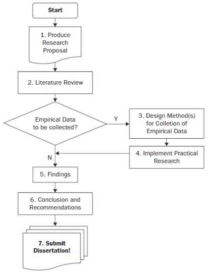

#### COM00151M Independent Research Project
# **Unit 2 - Initiation**

## **2.0 Table of Contents**

- 

---
&emsp;
## **2.1 Learning Objectives**

* **MLO1, MLO2, MLO3** - Preparing the research project
* **MLO1, MLO2, MLO3, MLO4** - Planning methodology and methods
* **MLO1, MLO3** - Understanding project Management methodologies
* **MLO1, MLO3** - Data collecting and analysis

---
&emsp;
## **2.2 Summary**

---
&emsp;
## **2.3 Research Project Lifecycle**

### **2.3.0 Reading**
* *Required: none*
* *Extension: none*

&emsp;
### **2.3.1 Stages**

The lifecycle for a academic large project comprises of various **stages**: planning, research proposal, literature review, data collection, data analysis, and reporting conclusions.

  

The project can only 

&emsp;
#### **Essential Information:**

