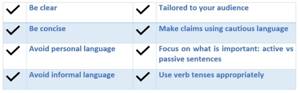
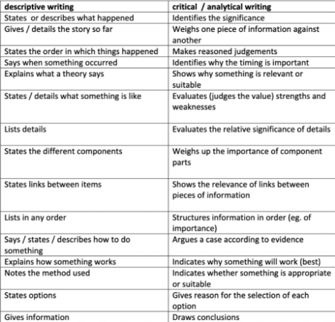
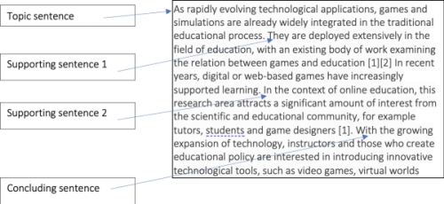
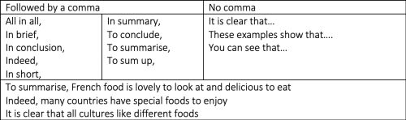
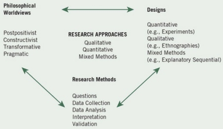
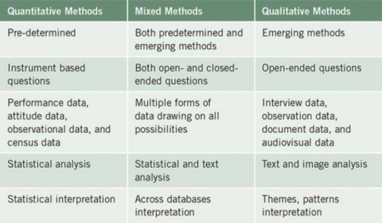
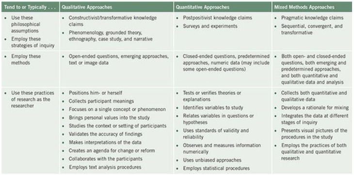
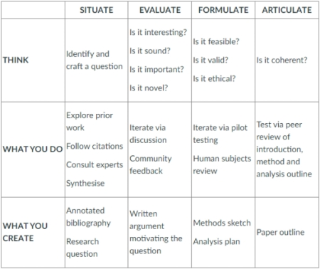
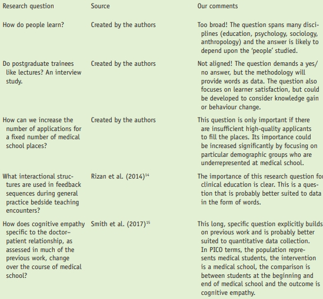

#### COM00146M Research Methods
# **Week 1 - Introduction to Research Methods**

## **1.0 Table of Contents**

- [**1.0 Table of Contents**](#10-table-of-contents)
- [**1.1 Learning Objectives**](#11-learning-objectives)
- [**1.2 Summary**](#12-summary)
- [**1.3 Academic Writing**](#13-academic-writing)
  * [**1.3.0 Reading**](#130-reading)
  * [**1.3.1 Academic Writing**](#131-academic-writing)
    + [**Common Mistakes**](#common-mistakes)
    + [**Descriptive Versus Academic**](#descriptive-versus-academic)
    + [**Paragraph Structure**](#paragraph-structure)
  * [**1.3.2 Paraphrasing**](#132-paraphrasing)
  * [**1.3.3 Analytical Writing**](#133-analytical-writing)
  * [**1.3.4 Online Resources**](#134-online-resources)
- [**1.4 The Research Process**](#14-the-research-process)
  * [**1.4.0 Reading**](#140-reading)
  * [**1.4.1 Rigor and Process**](#141-rigor-and-process)
  * [**1.4.2 Research Approaches**](#142-research-approaches)
    + [**Worldviews**](#worldviews)
    + [**Research Designs:**   ](#research-designs)
    + [**Research Methods**](#research-methods)
    + [**Research Problems and Questions**](#research-problems-and-questions)
    + [**Summary**](#summary)
  * [**1.4.3 Literature Reviews**](#143-literature-reviews)
- [**1.5 Formulating Research Questions**](#15-formulating-research-questions)
  * [**1.5.0 Reading**](#150-reading)
  * [**1.5.1 Formulating Questions**](#151-formulating-questions)
  * [**1.5.2 Validating Questions**](#152-validating-questions)
  * [**1.5.3 Questions and Hypotheses**](#153-questions-and-hypotheses)
    + [**Qualitative**](#qualitative)
    + [**Quantitative**](#quantitative)
    + [**Mixed Methods**](#mixed-methods)

---
&emsp;
## **1.1 Learning Objectives**

* **MLO3** - Show a clear understanding of what research is
* **MLO2, MLO3, MLO4** - Discuss research approaches
* **MLO3** - Demonstrate an understanding of academic writing

---
&emsp;
## **1.2 Summary**

Academic writing is a specific style of formal writing needed for reporting research. Care should be taken to ensure writing is not descriptive.

Approaches to research are influenced by the philosophical worldview, methods, and design of the study. Employing literature reviews prior to deciding on an approach is vital to avoid unnecessary repetition of knowledge and allows for extension of previous studies.

Qualitative, quantitative, and mixed methods approaches all have unique styles to the forming of research questions and accompanying information. These should be utilised to ensure reader coherence and establish the work as theoretically sound.

---
&emsp;
## **1.3 Academic Writing**

### **1.3.0 Reading**
* *Required: none*
* *Extension: none*

&emsp;
### **1.3.1 Academic Writing**

**Academic writing** is different from general writing: importance is placed on structure and referencing.

Generally, the writing should:
* Contain no colloquialisms, slang, or contractions
* Avoid personal pronouns, unless directed otherwise
* Adhere to a formal structure
* Maintain an objective tone and avoid emotive language
* Follow grammatical rules and contain accurate spelling

  

&emsp;
#### **Common Mistakes:**

Poor **referencing** is one of the most common faults in academic writing.
* External resources must be introduced and discussed to help develop a point
* However, quotes and citations should not make the point themselves
* All references need to be in support of the point being made and not be standalone

&emsp;
#### **Descriptive Versus Academic:**

Descriptive writing is informative in that it presents facts to the reader. However, it does not contain the **who**, **what**, **where**, **how**, or **why** needed in academic writing, which should be investigative, evaluative, and critical. 

  

Without evidence, statements are viewed as purely speculative. This includes indirect assumptions.

&emsp;
#### **Paragraph Structure:**

A **typical paragraph** may be constructed as follows:
* Introduce a topic 
* Make a claim and back it up with a reference
* Make another supporting claim and back it up with a reference
* Make a claim opposing your topic with evidence – this strengthens your argument
* Close your argument – bringing ideas together and possibly help paragraph transition

  

Each point should be linked to the previous and subsequent points to provide logical progression to the piece.

**Concluding** the paragraph should involve section signposting and bringing the paragraphs ideas together.
* Rephrasing the topic sentence in light of the discussion can be helpful
* New ideas should not be introduced at the end of paragraphs

  

Paragraphs should show **unity**: each sentence is directly related to the topic, giving a single focus.

Additionally, they should demonstrate **coherence**: no logical leaps, consistency of terms, and connectives.
* If nouns are used in plural, they should not suddenly become singular
* Similarly, if a gendered pronoun is used it should not switch to the another
* Tenses must also be consistent and not swapped within sentences
* Others’ opinions should be in present tense 
* Present tense is considered more assertive when introducing ideas
* This helps maintain the internal logic of the paragraph

Generally, contractions should be **avoided**.

&emsp;
### **1.3.2 Paraphrasing**

While quotation uses the source’s exact words, **paraphrasing** involves expressing them in your own words.
* Correctly paraphrasing is another common mistake in academic writing
* This must be considerably different to the original source
* You must demonstrate an understanding of their ideas and summarise them accurately
* Writing can be considered plagiarised if only a few words are changed
* Correct citation is still required

&emsp;
### **1.3.3 Analytical Writing**

Writing **analytically** is a vital part of academic writing. Unlike descriptive writing, it:
* Engages with and applies theoretical concepts
* Evaluates strengths and weaknesses of ideas
* Investigates the significance of evidence
* Synthesises and engages with sources to support and create an overall argument

This can be partly achieved through a series of self-prompts:
* What does this evidence mean?
* What is this significance of this evidence?
* How does this point relate back to my central argument?
* What is the connection between different ideas?
* What does this theory reveal about this particular topic?
* What is the relevance of this evidence or point?
* How can I link this to my work?

Further tips include:
* Evaluating evidence, not just stating it
* Unpacking the meaning of terms, ideas, and definitions
* Synthesising secondary material into an overall argument
* Evaluating the strengths and weaknesses of other arguments or studies
* Engage with theory and apply it to arguments

&emsp;
### **1.3.4 Online Resources**

The University of York provides various online resources to support academic writing:
* [Skills guide](https://subjectguides.york.ac.uk/skills)
* [Academic witing](https://subjectguides.york.ac.uk/academic-writing)
* [Writing centre](https://www.york.ac.uk/students/studying/skills/writing-centre/)
* [IEEE referencing guide](https://subjectguides.york.ac.uk/referencing-style-guides/ieee)
* [Academic skills community](https://www.york.ac.uk/students/studying/skills/community/)
* [What is academic writing?](https://subjectguides.york.ac.uk/academic-writing/general-writing)
* [Paraphrasing in academic writing](https://onlinestudy.york.ac.uk/courses/1026/files/360711?wrap=1)
* [Writing - structuring your response](https://subjectguides.york.ac.uk/skills/essay-structure)

Additionally, there are various relevant external sources on academic writing:
* [Academic phrasebank](https://www.phrasebank.manchester.ac.uk/)- a widely used bank of phrases from the University of Manchester
* [Academic word list](http://www.uefap.com/vocab/select/awl.htm) – adapted from the Cambridge Dictionary

---
&emsp;
## **1.4 The Research Process**

### **1.4.0 Reading**
* *Required: Chapter 1, Research Design: Qualitative, Quantitative, and Mixed Methods Approaches, Creswell and Creswell*
* *Extension: none*

&emsp;
### **1.4.1 Rigor and Process**

**Rigour** is a key element in the systematic process of investigation. Credible conclusions stem from:
* Careful identification of the research problem
* Methodical data collection
* Thorough analysis

Most research textbooks illustrate the research process as a series of simple logical steps. This implies that conducting research is a sequential progression in a linear direction.

Following this logic, a generic robust **research process** could look like:
* Identify a research topic – usually an interesting issue, problem, or phenomenon
* Formulate research questions – consult literature to explore the issue in depth
* Frame research questions – decide on specific, clear questions to ask
* Choose the methodology – how to conduct research and how to address the objectives
* Select data collection methods – choose how to collect and store data
* Collect data – consider sampling and ethical considerations surrounding data
* Analyse data – draw from a range of analytical approaches relevant to the data type
* Draw conclusions – identify key results and recommendations, highlight limitations
* Disseminate findings – decide an effective way to communicate findings 

The nature of the research will place emphasis on different elements of this process. 
* Academic research may focus on existing knowledge and contributing to the field
* Some areas may need another phase exploring actionable outcomes

Research also needs to be seen as **iterative**. Information gathering on an initial problem may raise more questions, leading to further investigation and refinement of ideas. This may be a messy ongoing loop.

&emsp;
### **1.4.2 Research Approaches**

**Research approaches** involves plans and procedures that encompass a range of steps, from broad assumptions to specific methods of data collection, analysis, and interpretation.

Selection of a research approach depends on several factors such as:
* The researchers’ philosophical assumptions
* Procedures of inquiry
* Specific research methods
* The nature of the research problem or issue
* Personal experiences
* The intended audience for the study

  

The three research approaches commonly used are **qualitative**, **quantitative**, and **mixed methods**. 
* These are not rigid distinctions, but rather represent different points on a continuum.
* Qualitative and quantitative approaches are not framed solely as words versus numbers
* Qualitative research explores the meaning individuals or groups assign to a problem
* Quantitative research tests theories by examining relationships between variables
* Mixed methods research integrates both data types

Researchers need to consider philosophical worldview assumptions, research design, and specific methods when planning a study.

&emsp;
#### **Worldviews:**

**Worldviews** are a basic set of beliefs that guide action and influence research practice.

Individuals should make the larger philosophical ideas they hold explicit when preparing proposals.

The **postpositivist** worldview is also known as the scientific method.
* This is generally more relevant for quantitative research than qualitative
* It is a deterministic philosophy, determining causes that influence outcomes
* Knowledge gained is based on careful observation and measurement of objective reality

The scientific method is the accepted approach to research by postpositivist: 
* A theory is created, data collected, the theory is revised, and additional tests are performed
* Researchers seek reasons to reject the hypothesis, not prove it

Information is commonly collected from instruments or from observations recorded by the researcher.

Being objective is an essential aspect of competent inquiry: researchers must examine methods and conclusions for bias.

The **constructivist** worldview is an approach to qualitative research, which believes individuals develop subjective meanings of their varied experiences. 
* Such research relies on the participants’ view of the situations being studied
* An understanding of the complexity of their views is sought

Social constructivist researchers address the interaction among individuals, focusing on the contexts in which people live and how their background shape their social interactions.

Basic generation of meaning is always social and arises out of interaction with human community.

Qualitative researchers would tend to use open ended questions to allow participants to share their views.  This is interpreted by a researcher, who also has their own experiences and backgrounds influencing them.

The **transformative** worldview arose in a response to postpositivist assumptions that did not fit marginalised individuals or issues of power. This includes critical theorists such as Marxists and feminists.

A transformative worldview believes that research needs to be linked with politics to confront oppression.

Therefore, it can provide a voice for marginalised participants, allowing their perspectives to be considered.

Key features of this perspective include a central importance on:
* The lives and experiences of diverse groups
* Inequalities based on gender, race, ethnicity, disability, sexual orientation, and class

The **pragmatist** worldview emphasises actions, situations, and consequences, rather than historic conditions.
* It is a philosophical basis for mixed methods research
* Researchers have the freedom to choose methods and techniques that best suit

&emsp;
#### **Research Designs:**   

Researchers employed this approach need to establish a purpose and rationale for their mixing of methods.

This approach may include a postmodern element: a reflection on social and political aims.

**Research designs** are the types of inquiry within qualitative, quantitative, and mixed methods approaches.

The expansion of these designs is due to access to increasingly sophisticated computer technology. 

Quantitative designs draw upon the postpositivist worldview. 
* These include true experiments, causal-comparative research, and correlational design
* Data often focuses on changes over time and explore variable relationships
* **Survey research** – quantitative description of trends across a sample population
* The intent is usually to generalise the sample to a wider population
* **Experimental research** – seeks to determine if an action influences an outcome
* This is assessed through use of control groups to be able to compare outcomes

Qualitative designs facilitate the exploring the meaning individuals or groups assign to problems.
* These may vary depending on the discipline 
* **Narrative research** – researchers study lives of individuals and asks for stories about it
* **Phenomenological research** – lived experiences of those affected by phenomenon
* **Grounded theory** – a general abstract of a process is made, grounded in participants views
* **Ethnography** – shared patterns of behaviours or languages are studied over time
* **Case studies** – researchers develop in depth analysis of a single case

&emsp;
#### **Research Methods:**

Mixed methods designs allow for the integration of both qualitative and quantitative data. 
* Qualitative is open-ended whereas quantitative is usually closed-ended
* Generally, it can be considered a process of triangulating data sources to seek agreement
* **Convergent** – data types are merged to provide a comprehensive analysis of the problem
* **Explanatory** – analysing quantitative research and explaining with qualitative research
* **Exploratory** – a qualitative research phase is used to inform a second quantitative phase

**Research methods** involves the data collection, analysis and interpretation performed by researchers.
* Data collection options include that of a predetermined nature, open or closed questioning
* Choice depends on intent: seek out specific types of values or free flow of information
* Qualitative research seeks meaning from the views of participants
* Quantitative research tests theories with narrow focused data collection
    

  

    
&emsp;
#### **Research Problems and Questions:**

A **research problem** is an issue or concern that needs to be addressed. This could be from:
* A void in the literature
* A need to lift-up marginalised participants
* Real life problems

&emsp;
#### **Summary:**

Generally, a quantitative approach is best if the problem involves identifying factors that influence an outcome, the effectiveness of an outcome, or understanding predictors of outcomes.

Qualitative approaches are useful when the concept has little research or has an understudied sample.

This can be summarised as follows:

  

&emsp;
### **1.4.3 Literature Reviews**

Performing a literature review as part of the research into a topic is vital because it:
* Helps avoid repeating research, but instead allowing it to be extended or added to
* Allows previously used methods and procedures to be evaluated for future use
* Understanding different perspectives on the problem or concept can be insightful

---
&emsp;
## **1.5 Formulating Research Questions**

### **1.5.0 Reading**
* *Required: Chapter 7, Research Design: Qualitative, Quantitative, and Mixed Methods Approaches, Creswell and Creswell*
* *Extension: [Developing Strong Research Questions](https://www.scribbr.com/research-process/research-questions/)*

&emsp;
### **1.5.1 Formulating Questions**

Work in Computer Science is generally intangible. Therefore, research must aim to make the idea **visible** by prototyping in formats that can be tested, critiqued, and edited.

The table below indicates considerations for forming research questions:

  

Students in Computer Science will often form a solution rather than a problem.
* Sometimes this will allow questions or theories to be derived
* Potential questions can also be found in the future work sections of academic work

Consideration should be given as to whether the research question is too broad, narrow, is beyond held skill levels, or requires unavailable resources. Evaluation from multiple perspectives is needed.

Interesting questions still must be **theoretically sound**, both in construction and relation to previous work.
* A simple question might be: do IDEs help students learn to code better? 
* This could be deconstructed for critique
* For example: do IDEs help? leads to only a binary response of yes and no
* Good research questions should allow for more scope than a binary answer
* For example: the phrase help students could be reframed to explore what kind of help
* This could focus on support for the activity, learning code, or error tracking and fixing

  

Therefore, a good research question:
* Sends the researcher on a journey to identify and collect data to provide new insights
* Is original and adds to existing knowledge bases or debates
* Has relevance to the stakeholders
* Demonstrates rigour, in that the question is aligned with the methods

Various online resources exist to help find Computer Science specific research questions:
* [The York Research Database](https://pure.york.ac.uk/portal/en/organisations/computer-science(e2d7acdb-0ce1-48d7-ae25-d4124313e8ed).html)
* [White Rose e-Thesis online](https://etheses.whiterose.ac.uk/cgi/search/simple?q=computer+science&_action_search=&_order=bytitle&basic_srchtype=ALL&_satisfyall=ALL)

&emsp;
### **1.5.2 Validating Questions**

Validating a research question can take the place using a series of prompt questions.

Is the research question **important**?
* Importance varies between stakeholders or audiences
* It might interest on a small or local scale, but fail to attract wider attention

Is the research question **novel**?
* It is novel is there no proven strong answer to it
* This must be established through research into the area prior to data collection or analysis
* Wide reading is required for an accurate judgement
* This should be reflected in the question structure: statement of knowledge, question 

Can the research question be **researched**?
* The question itself often implies the appropriate methods to use
* Comparing population samples would need quantitative statistical claims
* However, qualitative methods would be needed to understand views on population 
* Appropriate research methods are generated from knowing what methods exist

Is the research question **feasible**?
* Is there a method that leads to the appropriate data to answer the question?
* Do you have the skills, time, and resources to conduct it?

Is the research question **valid**?
* Construct validity refers to the way data is collected
* **Internal validity** – refers to the accuracy and soundness of the study’s methods
* **Externally validity** – the ability to generalise the findings to the wider context or population
* Most methods with high internal validity often have low external validity, and vice versa

Is the research question **coherent**?
* Coherence refers to the logic running throughout the entire study

A checklist can be produced from these ideas. Is the research question:
* Focused on a single problem or issue
* Researchable using primary and secondary sources
* Feasible to answer within the timeframe and practical constraints
* Specific enough to answer thoroughly
* Complex enough to develop the answer over a space of a paper
* Relevant to your field of study

&emsp;
### **1.5.3 Questions and Hypotheses**

Researchers use signposts to guide the reader through the purpose and intent of a study.
* The first of which is the purpose statement, which establishes the central intent
* The second is the question or hypothesis to narrow the purpose statement 

Creswell and Creswell provide research question framework and structures in chapter 7.

&emsp;
#### **Qualitative:**

Qualitative research uses research questions, not objectives or hypotheses.
* There are two types of research question: central questions and sub-questions
* A **central question** is broad and allows for exploration of the concept or phenomenon
* This should be related to the specific qualitative strategy of inquiry
* **Sub-questions** become specific questions for interviews, observations, or analysis
* These should not exceed 5-7

Generally, qualitative research questions should begin with what or how to convey open design.

**Exploratory** verbs such as report, describe, discover, seek to understand, and explore are used instead of directional words as used in quantitative research.

These questions are continually reviewed and reformulated during the study.

&emsp;
#### **Quantitative:**

Quantitative research uses research questions and hypotheses to focus the study.
* The research question inquires about the relationship between variables
* **Hypotheses** are numeric predictions of values based on data collected from samples

Guidelines for writing good quantitative research questions and hypotheses include:
* The use of variables: compare, relate, or describe each other
* Rigorous testing of theories
* Measurement of independent and dependent variables separately
* The use of non-demographic variables as mediating variables

The traditional form of hypothesis is the **null hypothesis**: this states that there is no relationship between variables. **Alternative**, **directional**, and **non-directional hypotheses** are also viable.

To aid comprehension, research questions and hypotheses should use the same order for variables. The independent should be stated first and the dependent second.

&emsp;
#### **Mixed Methods:**

A mixed methods study should have at least 3 research questions:
* A qualitative question
* A quantitative question/hypothesis
* A mixed methods question

The order of the first two questions should reflect the type of approach being used.

The **mixed methods** question represents what the researcher needs to know about the integration or combination of the quantitative and qualitative data.

A good format is to separate the questions into distinct sections.