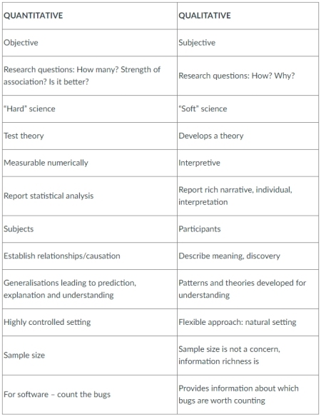
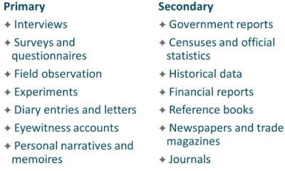
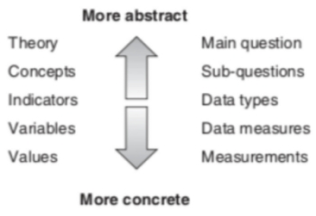
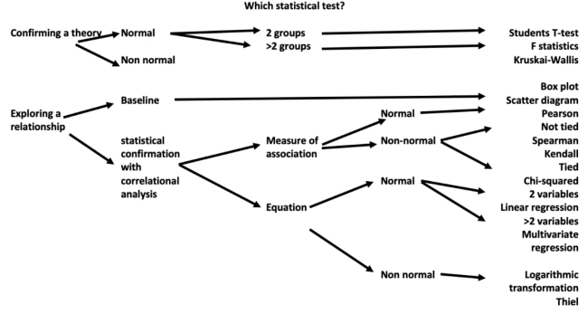

#### COM00146M Research Methods
# **Week 3 - Quantitative Research Methods**

## **3.0 Table of Contents**

- [**3.0 Table of Contents**](#30-table-of-contents)
- [**3.1 Learning Objectives**](#31-learning-objectives)
- [**3.2 Summary**](#32-summary)
- [**3.3 Research Methods in Computer Science**](#33-research-methods-in-computer-science)
  * [**3.3.0 Reading**](#330-reading)
  * [**3.3.1 Key Considerations**](#331-key-considerations)
  * [**3.3.2 Methods For Research**](#332-methods-for-research)
    + [**Method Summaries**](#method-summaries)
  * [**3.3.3 Data Types**](#333-data-types)
    + [**Analysis**](#analysis)
- [**3.4 Types Of Data**](#34-types-of-data)
  * [**3.4.0 Reading**](#340-reading)
  * [**3.4.1 Types Of Data**](#341-types-of-data)
    + [**Distinctions**](#distinctions)
    + [**Sources**](#sources)
    + [**Strengths And Weaknesses**](#strengths-and-weaknesses)
  * [**3.4.2 Sampling Techniques**](#342-sampling-techniques)
    + [**Probability**](#probability)
    + [**Non-Probability**](#non-probability)
  * [**3.4.3 Concepts And Variables**](#343-concepts-and-variables)
    + [**Levels Of Abstraction**](#levels-of-abstraction)
  * [**3.4.4 Quantitative Methods**](#344-quantitative-methods)
    + [**Surveys**](#surveys)
    + [**Experimental**](#experimental)
    + [**Analysis**](#analysis-1)
  * [**3.4.5 Quantitative Statistics**](#345-quantitative-statistics)
    + [**ANOVA**](#anova)
    + [**Uni and Bivariate Analysis**](#uni-and-bivariate-analysis)
- [**3.5 Statistical Inference**](#35-statistical-inference)
  * [**3.5.0 Reading**](#350-reading)
  * [**3.5.1 Statistical Inference**](#351-statistical-inference)
    + [**Population And Sampling**](#population-and-sampling)
    + [**Hypothesis Testing**](#hypothesis-testing)
    + [**Statistical Test Choice**](#statistical-test-choice)
  * [**3.5.2 Practical Significance**](#352-practical-significance)
    + [**Deciding Significance**](#deciding-significance)
  * [**3.5.3 Hypothesis Driven Study**](#353-hypothesis-driven-study)
    + [**Errors**](#errors)

---
&emsp;
## **3.1 Learning Objectives**

* **MLO2, MLO4** - Develop an understanding of quantitative methods
* **MLO2, MLO4** - Debate appropriate use of variables
* **MLO1, MLO2, MLO4** - Demonstrate awareness of Computer Science research methods
* **MLO3** - Argue the appropriate use of induction or deduction

---
&emsp;
## **3.2 Summary**

Computer Science requires evaluation of evidence. This could be theoretical, analytical, empirical, qualitative, or quantitative.

Data can be primary or secondary depending on who carries out the research; it can also be quantitative and qualitative. It is collected from samples of populations. These can be probabilistic and thus likely to be representative, or non-probabilistic. Either is fine if justified.

Statistical inference uses what can be observed to infer about what cannot be. While statistical significance is important, practical significance allows results to be related to real world scenarios: marginal improvements may not be enough to justify their implementation.

---
&emsp;
## **3.3 Research Methods in Computer Science**

### **3.3.0 Reading**
* *Required: none*
* *Extension: none*

&emsp;
### **3.3.1 Key Considerations**

As Computer Science is a multi-disciplinary field, research requires several factors to be considered:
* Tools, techniques, and processes to be used
* Social and cognitive processes surrounding the investigation
* Task organisation
* Assessment techniques 

Evaluation of a study requires evidence, which should be:
* **Theoretical** and **analytical** – proof oriented proving properties of abstract notions, solving mathematical problems such as coding theory or probabilities
* **Empirical** – evidence orientated extracted from observed phenomenon, controlled experiments, case studies, surveys, ethnographies, action research
* **Empirical investigations** – common tasks, identified goals and measures, research methods, planning, data collection, results, validity considerations, conclusions
* **Qualitative** and **quantitative** – these vary as shown below:

  

&emsp;
### **3.3.2 Methods For Research**

Computer Science is mainly based on logic and maths but can be regarded as an **empirical** discipline where programs are viewed as experiments, allowing their structure and behaviour to be studied.

Academically, research refers to the systematic enquiry in a particular area to gain new knowledge.

&emsp;
#### **Method Summaries:**

**Experimental methods** show what occurs from real world experiments and implementation.
* This method is used in fields like artificial neural networks, theorem proving, performance
* Results from this method should be reproducible

**Simulation methods** allow for the investigation of systems outside the experimental domain.
* Commonly used in specialised fields such as the study of virtual reality or artificial life
* Other domains, such as astronomy, will use computer simulation methodologies 

**Theoretical methods** are based on classical mythology since they are related to maths and logic.
* This is dedicated to design and algorithm analysis to find better solutions
* Some of the main techniques include iteration, recursion, and induction

&emsp;
### **3.3.3 Data Types**

Research data can be primary, secondary, or a mixture of both. It can also be quantitative or qualitative.

**Quantitative data** is based on meanings derived from numbers and results in numerical, standardised data.
* Analysis is conducted through use of diagrams and statistics
* There is a thin level of abstraction or description from the data

**Qualitative data** is based on meanings expressed through words and results in data requiring classification.
* Analysis is conducted through conceptualisation
* There is a thick layer of abstraction or description from data

&emsp;
#### **Analysis:**

Data analysis refers to the way sense is constructed from data, in relation to the research question.

Data analysis techniques are specific tools that are used to organise, categorise, and code data to find results from which we can draw conclusions.

Both the data to be collected and its subsequent analysis should be decided in the early stages of planning. It isn’t good practice to collect data without knowing what will be done with it.

---
&emsp;
## **3.4 Types Of Data**

### **3.4.0 Reading**
* *Required: Chapter 8, Research Design: Qualitative, Quantitative, and Mixed Methods Approaches, Creswell and Creswell*
* *Extension: none*

&emsp;
### **3.4.1 Types Of Data**

The quality of research conclusions is heavily dependent on the data collected and interpreted.

&emsp;
#### **Distinctions:**

The first distinction regards primary or secondary data:

* **Primary data** – original data collected by the researcher, high relevant to the specific question, involved and potentially resource intensive
* **Secondary data** – data collected by others for different purposes, might have less relevant to other research questions, less resource intensive as it already exists

The second distinction regards quantitative or qualitative data:
* **Quantitative data** – counts and quantifies variables, used in scientific, deductive research
* **Qualitative data** – textual data on experiences, used in interpretive, inductive research 

&emsp;
#### **Sources:**

Both primary and secondary data can be obtained from a variety of sources:

  

&emsp;
#### **Strengths And Weaknesses:**

Advantages and disadvantages of using primary data:
* Advantages – specific to the research problem, high degree of accuracy, control over the data collection, up to date, ownership of the data
* Disadvantages – resource intense in terms of time and cost, limitations on access available, location, sample size

Advantages and disadvantages of using secondary data:
* Advantages – cost-effective and the data already exists, easily accessible, broad coverage, long term view
* Disadvantages – potentially inaccurate or out of date, less relevant to other research problems, less control over quality and detail, may have data protection restrictions

Both data types are viable, providing there is a clear rationale for using them. 

The researcher should carefully consider which type of data is most appropriate to the question posed. 

&emsp;
### **3.4.2 Sampling Techniques**

**Sampling** is the process of selecting a subset of individuals or cases from a larger population for research. 
* This is necessary as it is impractical to study the entire population of interest
* Sampling ensures data collected is trustworthy, reliable, and relevant

Selection of sampling techniques should be informed by the research question and population of interest. 

&emsp;
#### **Probability:**

**Probability** is the first of the two main sample techniques, used when researchers want to make inferences and generalise their results.
* These ensure the chance of the selection from the population is statistically relevant
* The four main techniques: simple random, systematic random, stratified random, cluster
* Simple random – sample is selected using random numbering
* Systematic random – sample selected at regular intervals, such as third interval
* Stratified random – randomly selected from subsets based on key characteristics
* Cluster – clusters individual cases together and random selects from the clusters

&emsp;
#### **Non-Probability:**

**Non-probability** is the second of the two main sample techniques, used when it not feasible to use probability sampling.
* These cannot guarantee the sample is representative, and so may not be generalisable
* Common techniques: quota, purposive, snowball, convenience
* Quota – a particular group is deliberately represented due to a desirable characteristic 
* Purposive – purposeful focus on a subset of population, not statistically representative 
* Chain-referral – researcher identifies initial participants who identify further participants
* Convenience – ease of access informs the sample size or uses volunteers 

&emsp;
### **3.4.3 Concepts And Variables**

Explanations require the development of concepts or generalisable properties or characteristics associated with objects, events, or people.

A **construct** is an abstract concept that is specifically chosen to explain a given phenomenon.
* These have varying levels of abstraction
* It may be simple or unidimensional, such as a car’s weight
* Alternatively, it maybe multidimensional, such as a person’s communication skills
* This may involve concepts such as vocabulary, syntax, and spelling

**Variables** are often associated with constructs and are indicators which facilitate measurement.
* These are often classified as independent, dependent, moderating, mediating, and control
* Independent – explain other variables
* Dependent – explained by other variables
* Mediating – explained by independent variables while also explaining dependent variables
* Moderating – influence the relationship between independent and dependent variables

&emsp;
#### **Levels Of Abstraction:**

Data and knowledge go from the general to the particular; **abstract** to **concrete**.
* Theory – abstract statements about the world and how it works
* Concepts – building blocks of theory which are abstract and cannot be measured
* Indicators – phenomena which point to the existence of the concept
* Variables – components of the indicators which can be measured
* Values – actual units of measurement of the variables

  

&emsp;
### **3.4.4 Quantitative Methods**

Designing quantitative methods for a research study generally reflect post positivist assumptions.

Creswell and Creswell provide a detailed survey and experimental designs. A summary is provided below.

&emsp;
#### **Surveys:**

A **survey design** has two main uses: 
* Provide a quantitative description of trends or test for associations among variables
* They help researchers answer descriptive, relational, and predictive research questions
* Steps include: identifying the purpose, population, sample, survey instruments, relationship between variables, research questions, survey items, and data analysis
* The researcher should be specific about each component to ensure validity and reliability

&emsp;
#### **Experimental:**

An **experimental design** systematically manipulates one or more variables to evaluate its outcome.
* The effects of the manipulation are isolated by holding all other variables constant
* These are used to test causal hypotheses
* The researcher should identify participants, manipulated and outcome variables, and the instruments used
* The type of experiment should be identified, for example quasi-experimental
* A figure with appropriate annotation should be used to illustrate the design

Both designs help researchers make inferences about relationships among variables and how the sample results may generalise to a broader population.

&emsp;
#### **Analysis:**

After designing the study, the researcher should consider the **threats** to internal, external, statistical, and construct validity.

Statistical analyses used to test the hypotheses should be appropriate for the study and data type.

The results should be interpreted, drawing conclusions based on the analysis conducted.

&emsp;
### **3.4.5 Quantitative Statistics**

Quantitative research involves analysing and communicating meaning from numerical data.

The University of York provides [data analysis resources](https://subjectguides.york.ac.uk/skills/data-analysis) to support this module.

There are two forms of quantitative data analysis: descriptive and inferential. 
* **Descriptive statistics**– reveal patterns, frequency of occurrence, and distribution of variables within the data
* **Inferential statistics** – analyse associations between variables using statistical tests such as significance, correlation, probability, and regression analysis

Conclusions from research is only as good as the data that has been collected. Therefore, analysis must be considered at the planning stage before data collection.

**Statistical tests** run through statistical analysis software, such as SPSS, require clean data.
* This means data must have no mistakes or errors to produce accurate results
* **Missing data** can skew statistical results, making them meaningless
* These can be categorised into non-responses: such as not applicable, did not know
* This allows the researcher to have a complete set of data

Ill-considered and poor-quality data can undermine a whole study. Therefore, it is essential to consider all eventualities regarding the data at the planning and design stages.

&emsp;
#### **ANOVA:**

**Analysis of Variance** (ANOVA) is used when testing more than two group means simultaneously.
* The goal is to determine if there are significant differences on a score of variables
* The test statistic for ANOVA is the F-test
* Factorial-design ANOVA is used when multiple independent variables are examined

&emsp;
#### **Uni and Bivariate Analysis:**

**Univariate analysis** involves analysing a single variable. It includes techniques such as:
* Frequency distribution – the frequency of individual values or ranges
* Central tendency – the estimate of the centre of the values: mean, median, mode
* Dispersion – the spread around the central tendency:

**Bivariate analysis** examines the relationship between two variables.
* It is often referred to as **correlation**
* Correlation measures the strength of a relationship with values ranging from -1 to 1

---
&emsp;
## **3.5 Statistical Inference**

### **3.5.0 Reading**
* *Required: Chapter 8, Research Design: Qualitative, Quantitative, and Mixed Methods Approaches, Creswell and Creswell*
*Required: Chapter 4, Writing for Computer Science, Zobel*
* *Extension: [Discovering Statistics Using SPSS For Windows: Advanced Techniques For The Beginner, Field](https://eu.alma.exlibrisgroup.com/leganto/public/44YORK_INST/citation/40294584910001381?auth=SAML)*

&emsp;
### **3.5.1 Statistical Inference**

**Statistical inference** is the process of using what can be observed to make an educated guess about something that cannot be observed.

&emsp;
#### **Population And Sampling:**

In an experimental situation, inference is made from a sample as all human behaviour cannot be observed.
* **Sample** – the people from whom measurements are taken
* **Population** – unknowable, immeasurable set of people we wish to learn about
* Looking at the effect on the sample allows inference about the effect on the population

The essential aspects of population and sampling to describe in a research plan is listed below:
* Population – identified, including size and means of identifying individuals
* Access – explain any barriers to intended population
* Sampling design – describe, with indication if it is single or multistage
* The type of sampling – explain if random, systematic etc sampling will be used
* Stratification – addressed if the study will involve it
* Sample size determination – number of people in the sample and how that was calculated
* Power analysis – can help estimate a target sample size

&emsp;
#### **Hypothesis Testing:**

**Statistical hypotheses** testing is a method for proving a confidence about an answer.
* The hypothesis is testing using calculations for a quantity given some assumptions
* It tests whether the assumption holds true or is incorrect
* For example, you can test assuming the data has a normal distribution
* The **null hypothesis** or **H0** is the default assumption, denoting an unchanged assumption 
* An alternative **hypothesis 1** or **H1** is the opposite of H0

&emsp;
#### **Statistical Test Choice:**

A statistical test may result in two common forms: p-value and critical values.

The **p-value** is returned from a hypothesis test and is used to accept or reject the null hypothesis.
* A **significance level** needs to be chosen: it is represented by α and is commonly 5%
* The p-value is compared to the pre-chosen α value 
* If it is less then this indicates a change occurred, and the null hypothesis can be rejected 
* p value > alpha – do not reject the null hypothesis
* p value <= alpha – reject the null hypothesis, this is a significant result

Note that the p-value is probabilistic, so it shows what is likely not what is true or false.

General factors that influence the choice of statistical test include:
* The research design
* Sample size and sampling method
* Number and nature of the independent and dependent variables
* The spread and pattern of

Choice of statistical test can be aided through the flow chart below:

  

The University of York provides guides for statistics [here](https://subjectguides.york.ac.uk/maths-skills-centre/statistics).

&emsp;
### **3.5.2 Practical Significance**

Even if a result is statistically significant, **practical** or **clinical significance** needs to be considered. This indicates how important a study’s findings are likely to be in the real world.

Therefore, practical significance can be considered a so what? type of question.

&emsp;
#### **Deciding Significance:**

The **minimal clinically important difference** (MCID) is the smallest difference which patients perceive to be beneficial. In **randomised control trials** (RCT) is it the smallest difference justifying changing patient care.

Decisions regarding clinical significance is not always easy and may require specialist domain knowledge. The key concepts listed below can help in making decisions.

The **effect size** quantifies the difference between two or more groups.
* They are based on the mean and standard deviation of the outcome scores in each group
* Often, they are standardised to allow comparisons of different units or measures
* Sizes less than 0.2 are considered small, above 0.5 medium, over 0.8 large

The **odds ratio** is often used for categorial data and provides more relative measure of effect.
* This is like effect size in that it compares outcomes of control and experimental groups 
* The odds ration will be 1 when the outcome is the same group
* An odds ratio of less than 1 means the control group is better than the intervention

**Confidence intervals** are used to indicate the level of uncertainty around an effect reported in a study.
* Running a study repeatedly may provide different results each time
* Confidence intervals indicate how much these results may vary
* Upper and lower confidence limits show the value range of the likely true answer

&emsp;
### **3.5.3 Hypothesis Driven Study**

**Hypothesis driven experiments** require:
* At least one independent or control variable 
* One dependent variable that can be measured
* Establishing if the dependent variable changes is the point of the experiment

The independent variable is something that might cause a change in the dependent variable. 

Once this is chosen, the null hypothesis can be written: this states change of the independent variable will not lead to significant change in the dependent variable. The inverse would be the alternate hypothesis.

Experiments are better when the investigator controls the independent variable but is not always possible.

&emsp;
#### **Errors:**

All measurements have errors which can affect the results of a hypothesis driven experiment:
* **Type 1 error** – false positives: the researcher rejects a correct null hypothesis
* **Type 2 error** – false negatives: the researcher accepts a false null hypothesis

Noise can contribute to **random errors** in the dataset but can be eliminated by taking sufficient number of independent measurements. There are procedures to reducing the consequence of random errors.

Fault instruments can lead to **systematic errors** throughout the dataset. To counter act this, it is advised to use a certain value as a standard prior to calibration.