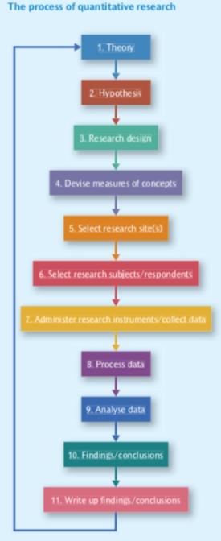
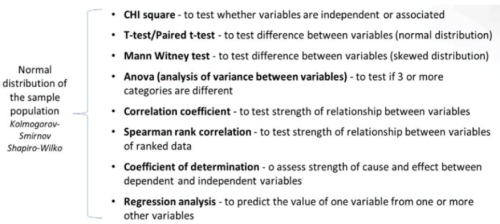
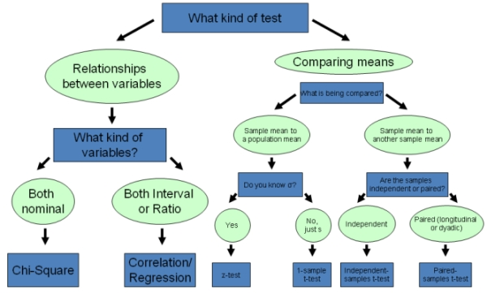
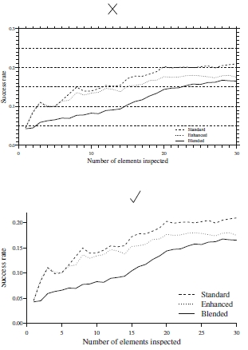
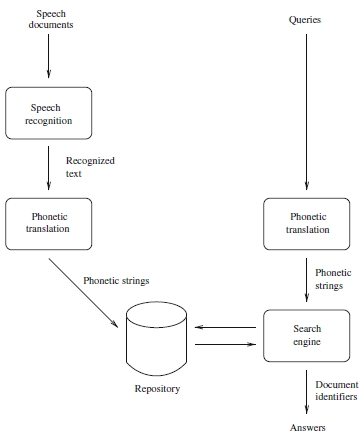
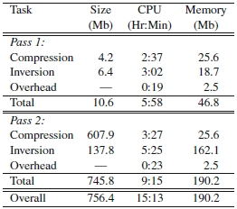
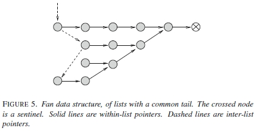

#### COM00146M Research Methods
# **Week 4 - Quantitative Methods, Collection, and Analysis**

## **4.0 Table of Contents**

- [**4.0 Table of Contents**](#40-table-of-contents)
- [**4.1 Learning Objectives**](#41-learning-objectives)
- [**4.2 Summary**](#42-summary)
- [**4.3 Quantitative Research**](#43-quantitative-research)
  * [**4.3.0 Reading**](#430-reading)
  * [**4.3.1 Research Overview**](#431-research-overview)
    + [**Methodology**](#methodology)
  * [**4.3.2 Research Steps**](#432-research-steps)
- [**4.4 Descriptive and Inferential Analysis**](#44-descriptive-and-inferential-analysis)
  * [**4.4.0 Reading**](#440-reading)
  * [**4.4.1 Descriptive and Inferential**](#441-descriptive-and-inferential)
    + [**Data Coding**](#data-coding)
    + [**Univariate Analysis**](#univariate-analysis)
    + [**Bivariate Analysis**](#bivariate-analysis)
  * [**4.4.2 Representing Data**](#442-representing-data)
  * [**4.4.3 Significance Testing**](#443-significance-testing)
- [**4.5 Inferential Statistical Analysis**](#45-inferential-statistical-analysis)
  * [**4.5.0 Reading**](#450-reading)
  * [**4.5.1 Key Concepts**](#451-key-concepts)
    + [**Test Selection**](#test-selection)
  * [**4.5.2 Graphical Representations**](#452-graphical-representations)
    + [**Graphs**](#graphs)
    + [**Diagrams**](#diagrams)
    + [**Tables**](#tables)
    + [**Captions**](#captions)

---
&emsp;
## **4.1 Learning Objectives**

* **MLO2, MLO3, MLO4** - Demonstrate an understanding of hypothesis testing
* **MLO2, MLO3, MLO4** - Be able to explain the use of t-testing
* **MLO2, MLO3, MLO4** - Be aware of the difference between inductive and deductive research

---
&emsp;
## **4.2 Summary**

Research is rarely neat and straight forward, but the process can be approximated in a series of steps. This begins with the establishing of existing theory and progressing through to data analysis and the writing up of conclusions.

Quantitative data can be analysed in a descriptive way in order to organise or visualise the data. It can also be analysed in an interpretive way, involving statistical analysis to prove a hypothesis. There are various methods and selecting the appropriate one for the study is crucial.

The use of graphs and diagrams can add perceived value to a study and should be used when appropriate to illustrate results clearly. 

---
&emsp;
## **4.3 Quantitative Research**

### **4.3.0 Reading**
* *Required: none*
* *Extension: none*

&emsp;
### **4.3.1 Research Overview**

Quantitative analysis involves data, usually numbers, being analysed and investigated:
* Levels of measurement used in collection can determine the types of analysis possible
* Quantitative data can be gathered from a variety of sources
* This could include survey results, document analysis, or record examination 
* Generally statistical results are more reliable with a greater number of results

The quantitative approach is a deductive, empirical cycle.

**Quantitative research** is based on closed questions and once the problem has been established, it should not be changed. It is possible to assess quality of the problem definition using a series of prompts:
* Is it researchable? Is the subject accessible? Is there willingness to participate?
* Is it relevant? Will the outcome be fit for purpose of the stakeholders?
* Is it informative? Does it generate new and fresh findings or regenerate existing knowledge?
* Is it reliable? Is the work consistent and does it generate the same result when repeated?
* Is it effective? Is the research method effective and does it provide an effective answer?

&emsp;
#### **Methodology:**

The development of a hypothesis plays an important role in quantitative research. These are expressed as theoretical expectations that are met by empirical results gathered during the research activities.

There are two different approaches to hypothesis testing, one based on observation and one on manipulation of variables.

**Ex post facto** research involves testing a **hypothesis** after an event or situation has occurred:
* A researcher cannot intervene or manipulate the variables as they have already occurred
* This approach often includes case studies, where the researcher observes events

**De facto** or experimental research involves conducting an experiment:
* A researcher has control over the variables and can establish cause and effect relationships
* This often involves control group and an experimental group

&emsp;
### **4.3.2 Research Steps**

Research typically does not start with a hypothesis but rather a general set of ideas around which a researcher will begin to collect facts.

Selecting a research design can impact the external validity of findings and the ability to interpret them.

Collecting research data involves the use of selected research instruments:
* Experiment – likely to pre-test subjects, manipulating variables and post testing them
* Cross-sectional – using interviews or questionnaires
* Structured observation – watching the setting and noting behaviour of each element

Information collected must be turned into usable data: in quantitative research this means it must be prepared so that it can be quantified. It can then be analysed as appropriate.

Findings should then begin to emerge. A researcher will consider whether the hypothesis is supported.

Writing up the research is more than juts relaying what has been done. Readers must be convinced that there the conclusions are important and robust.

A representation of these steps is shown below, but in practice research is rarely this neat:

  

---
&emsp;
## **4.4 Descriptive and Inferential Analysis**

### **4.4.0 Reading**
* *Required: Chapter 4, Writing for Computer Science, Zobel*
* *Extension: none*

&emsp;
### **4.4.1 Descriptive and Inferential**

Quantitative data analysis makes sense of numerical data and can also be referred to as statistical analysis.

There are two broad categories of data analysis: 
* **Descriptive** – used to organise and describe, understand, or visualise the data
* **Inferential** – this refers to the statistical testing of a hypothesis 

These can be combined with analysis techniques, such as descriptive univariate or inferential univariate analysis, to suit the research question and type of data collected.

&emsp;
#### **Data Coding:**

**Data coding** is the process of converting data or information into a numeric format so it can be analysed:
* **Likert scales** are commonly used: typically, strongly agree to strongly disagree
* Lists from 1 to x, ratio scales, and aggregated data are also viable methods
* Such coding is important for large complex studies for consistency and interpretability 

&emsp;
#### **Univariate Analysis:**

**Univariate analysis** refers to a single or set of variables that can describe the properties of one variable.
* **Frequency distribution** – the sum of occurrences of variables in a data set
* **Central tendency** – estimate of the centre is a set of variables: mean, median, mode
* **Dispersion** – the spread around the central tendency, using range and standard deviation
* The range is simply the difference between the lowest and highest values
* Standard deviation corrects outliers by calculating how far a variable is from the mean

&emsp;
#### **Bivariate Analysis:**

**Bivariate analysis** examines how closely related two variables are.
* The most common form is bivariate correlation, denoting relationship strength as -1 to +1
* Hypothesis testing is used to determine the significance of the correlation
* H0: r=0 is the null hypothesis meaning no correlation 
* H1: r≠0 is the alternative hypothesis stating there is correlation
* These form a single hypothesis as they are the direct opposite of each other 
* The p-value is used to determine the probability that inference is caused by chance 
* This is compared to the significance level: the minimum risk that inference is wrong

The **degree of freedom** is the number of values that can freely vary in any calculation of a statistic.

&emsp;
### **4.4.2 Representing Data**

The two main approaches to analysing quantitative data are categorical and numerical.

**Categorical data** can be put into categories or ranked but cannot be quantified numerically. These types are useful for describing statistics that report frequency, distribution, and patterns.
* **Nominal data** refers to labels ascribed to specific sets or categories of data
* **Ordinal data** is generated through questions that seek ordering or ranking

**Numerical data** are values that are quantified and measured; each point of data can be positioned on a scale. These types are useful for both descriptive and inferential statistical analysis. 
* **Interval data** – equal intervals between points, allowing for meaningful calculations
* **Ratio data** – has an absolute zero point, allowing for meaningful operations
* **Continuous data** – has no limit to the measurement other than the range
* **Discrete data** – measures things that can be counted

The University of York provides a [statistics guide](https://subjectguides.york.ac.uk/maths-skills-centre/statistics).

&emsp;
### **4.4.3 Significance Testing**

There is a base guideline for **significance testing**. 
* A statistical result is considered significant if the rejection chance is 5% or less
* In inferential statistics, this probability is the p-value
* 5% is the significance level, denoted with α
* The significance level is the maximum risk one is willing to accept as a price of inference
* Therefore, the desired p-value and α relationship is denoted as p≤0.05

There are three important concepts to related statistics:
* **Sampling distribution** – the theoretical distribution of an infinite number of samples
* **Standard error** – the error level in the sample, if small then the sample mean is good
* **Confidence interval** – defines the precision of the sample 
* For example, 95% confidence means the parameter is within two standard deviations

---
&emsp;
## **4.5 Inferential Statistical Analysis**

### **4.5.0 Reading**
* *Required: Chapter 11, Writing for Computer Science, Zobel*
* *Extension: none*

&emsp;
### **4.5.1 Key Concepts**

**Statistical analysis** is a technique used to examine the relationships between variables in quantitative data.

Its purpose is to test research hypotheses and determine the extent to which associations or differences observed in the data are **statistically significant**: unlikely to have occurred by chance.

Key concepts that underpin this type of analysis include probability, hypotheses, distribution, tests, and errors.

**Probability** is the chance of a particular event occurring. This is relevant to quantitative research, as it allows for hypothesis testing.
* This is measures on a scale from 0 to 1
* Values closer to 0 indicate a low likelihood, and 1 indicating a high likelihood
* A statistically relevant result would be equal to or less than 0.05

**Null hypotheses** are statements that something will not occur. 
* Data is collected and analysed to determine if the results are consistent with the hypothesis
* If so, the extent of which is due to chance

Errors are faulty conclusions that can occur when interpreting statistical significance. 
* **Type I** – occur when the null hypothesis is wrongly rejected 
* **Type II** – occur when the null hypothesis is wrongly accepted

**Normal distribution** describes an assumption that the sample population data follows a normal pattern. 
* This looks like a peak in the centre flattening at the extremes
* On large data sets, Kolmogorov–Smirnov or Shapiro–Wilk tests can be used

**Statistical significance** is the level of confidence that associations or differences observed in the data are unlikely to have occurred by chance.
* This only reports the statistical likelihood of an event occurring by chance
* It does not disprove a null hypothesis

**Parametric tests** are used for continuous and discrete numerical data, while **non-parametric tests** are used for nominal and ordinal categorical data.
* Parametric tests are generally perceived to be more robust due to their numerical base
* However, this assumption relies upon appropriate sampling and collection techniques

&emsp;
#### **Test Selection:**

Statistical test can be used in four ways. To test the significance of:
* The independence or association between variables
* The difference between variables
* The strength of the relationship between variables
* The predicted values between variables

  

A statistical test decision tree can help identify the type of data held and the corresponding options for analysis. One example is shown below, another can be found [here](http://www.peggykern.org/uploads/5/6/6/7/56678211/edu90790_decision_chart.pdf). 

  

&emsp;
### **4.5.2 Graphical Representations**

Well-chosen illustrations bring a paper to life and help highlight the central results and ideas.

Overall, abbreviations can be used when space is limited but they mut be explained in full in the text.

&emsp;
#### **Graphs:**

**Graphs** are often the best way to present numerical results. 
* They clearly summarise numbers
* Additionally, they make behaviours and trends obvious to the reader

Readers can get confused by scaling of axes, so indicating typical values in the text aids comprehension.

Stylistically, they should be:
* Simple with minimum clutter: avoid elements such as legends and large captions
* Where legends are needed, they should be rectangular and placed in spare space
* No more than a few plotted lines
* Discrete data should always have points marked by distinctive marks
* Greys are emotionally neutral and avoid subconscious messages of colours
* Axes should be inconspicuous

  

Many commonly used graphing tools provide unnecessary features and care should be taken. 

&emsp;
#### **Diagrams:**

Generally, **diagrams** are broadly used to show structures, processes, relationships, or states. Mistakes occur when trying to combine these purposes inappropriately.

It is possible for a diagram being the result presented in the paper, such as in entity relationship models.

The style should be:
* Not too dark and as sparse as possible
* Fine details should be clarified in the supporting text
* Labels should be meaningful and presented horizontally where possible
* Lines should not be too heavy, at most a little thicker than the font
* Shades of grey can be used to distinguish lines, but not as well as styles of lines
* Pictorial elements should be consistent, eg arrows should have the same meaning

  

Poor diagrams can detract from the clarity of the paper.

&emsp;
#### **Tables:**

**Tables** are use when exact values of data is important and the information is unsuitable for graphs. They can still be used even when only a few values will be shown.

Well-designed tables should be:
* Displayed with logical hierarchical structure
* Uncluttered, with ample white space
* Lines used to group items that belong together
* Aligned logically, with values aligned on the decimal point

  

Generally, tables should not be used to show function values at different points, as graphs are more suited.

&emsp;
#### **Captions:**

**Captions** and **labels** should be informative and fully describe the figures major elements. 

Labels should include units where appropriate to avoid confusion.

They should be styled to:
* Aid skim reading
* Minimise capitalisation 
* Italicised to distinguish them from other text
* Placed below figures but above tables
* Include a logical numbering system to facilitate referencing

  

It is important to introduce and discuss the accompanying figures and tables in the main text itself.

If there is nothing to say about the figure or table, it should not be included.