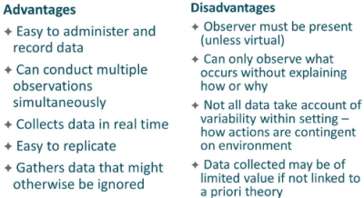
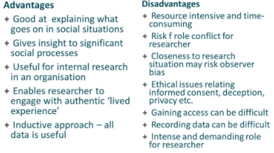
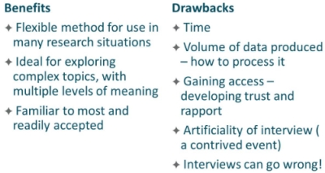
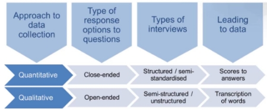

#### COM00146M Research Methods
# **Week 5 - Qualitative Research Methods**

## **5.0 Table of Contents**

  * [**5.0 Table of Contents**](#50-table-of-contents)
  * [**5.1 Learning Objectives**](#51-learning-objectives)
  * [**5.2 Summary**](#52-summary)
  * [**5.3 Qualitative Research Methods**](#53-qualitative-research-methods)
    + [**5.3.0 Reading**](#530-reading)
    + [**5.3.1 Qualitative Data Sources**](#531-qualitative-data-sources)
      - [**Desk Based Research**](#desk-based-research)
    + [**5.3.2 Qualitative Methods**](#532-qualitative-methods)
      - [**Characteristics**](#characteristics)
      - [**Designs**](#designs)
      - [**Reflexivity**](#reflexivity)
      - [**Data Collection**](#data-collection)
  * [**5.4 Typical Strategies for Collecting Primary Data**](#54-typical-strategies-for-collecting-primary-data)
    + [**5.4.0 Reading**](#540-reading)
    + [**5.4.1 Typical Strategies**](#541-typical-strategies)
      - [**Case Studies**](#case-studies)
      - [**Survey**](#survey)
      - [**Action Research**](#action-research)
      - [**Ethnography**](#ethnography)
      - [**Grounded Theory**](#grounded-theory)
  * [**5.5 Methods for Primary Data Collection**](#55-methods-for-primary-data-collection)
    + [**5.5.0 Reading**](#550-reading)
    + [**5.5.1 Method Overviews**](#551-method-overviews)
      - [**Structured**](#structured)
      - [**Participant**](#participant)
      - [**Interviewing**](#interviewing)

---
&emsp;
## **5.1 Learning Objectives**

* **MLO2, MLO3, MLO4** - Ensure a good understanding of qualitative methodologies
* **MLO3** - Evidence examples of when a mixed model approach is appropriate
* **MLO3** - Identify instances of case studies

---
&emsp;
## **5.2 Summary**

Qualitative research can use primary data or secondary data. The latter is commonly referred to as desk-based research and makes use of censuses, reports, and other similar documents to research a topic in a cost-effective manner.

Primary data is commonly collected using case studies, surveys, action research, ethnography, or grounded theory approaches. Each have their own strengths and weaknesses. Therefore, it is important to select data collection methods that best suit the research problem.

Data collection through observations can be structured, participatory, or through interviews.

---
&emsp;
## **5.3 Qualitative Research Methods**

### **5.3.0 Reading**
* *Required: Chapter 9, Research Design: Qualitative, Quantitative, and Mixed Methods Approaches, Creswell and Creswell*
* *Extension: none*

&emsp;
### **5.3.1 Qualitative Data Sources**

**Qualitative research** uses words in its data collection:
* It is broadly inductivist, constructionist, and interpretivist, but not necessarily all of these
* Generally, it is inductive in that it views theory as being generated out of research
* Research is based on experiences not measurements, and therefore interpretivist 
* Finally, it is constructionist as properties are outcomes of interactions between people

Researchers tend to use documents as **secondary data** to supplement the **primary data** collected:
* This could be in the form of government reports, public records, and even diaries
* More contemporary forms include internet pages, digital images, and videos
* Secondary data is considered relatively easy to access 
* However, consideration needs to be given to its authenticity, credibility, representation
* Reading documents is an interpretive act that involves subjectivities in reader and author

&emsp;
#### **Desk Based Research:**

Synonymous with qualitative research, **desk-based research** focuses on the review of existing data from documentary sources rather than collecting empirical data from the field.

This can be viewed as proximal to a literature review, almost becoming the research process itself.

This research strategy can be useful when there are issues preventing collection of new data, such as:
* Ethical concerns
* Accessibility to field sites
* Resource constraints, such as time and money

A common factor across all types of secondary research is the emphasis on systematic collection, analysis, and reporting of the data.

There must be a clear rationale for doing desk-based research. This could be methodological, ethical, or pragmatic reasons. Additionally, the researcher must assess the data by asking:
* **Reliable** – who collected it, what were the sources of data, how and when was the data collected, were there any measurement biases, what level of accuracy was achieved?
* **Suitable** – how was the data defined, what units of collection were used, what was the scope, nature, and purpose of the original research
* **Adequate** – is the level of accuracy adequate for the present enquiry, what alternate sources are there?

If there is lack of agreement on any of these points and the new research, there is a risk that the secondary data may invalidate the new study. 

&emsp;
### **5.3.2 Qualitative Methods**

The purpose of qualitative research is to understand a particular social situation, event, role, group, or interaction through an investigative process.

Research occurs in natural settings and theories; hypothesis are not established a priori.

The focus is to understand perceptions and experiences and the way these make sense of phenomenon.

&emsp;
#### **Characteristics:**

Qualitative research is well established in social sciences but less so in other areas. It may be necessary to explain it within a study if the intended audience is not knowledgeable about it.

It is broadly characterised by:
* Data collection in a natural setting
* Using the researcher as a key instrument
* Gathering multiple sources of data
* Employing **inductive** and **deductive** data analysis 

Additional characteristics may include:
* A focus on participants meanings
* A holistic account of the phenomenon under study

&emsp;
#### **Designs:**

Qualitative research has specific approaches for inquiry, primarily originating from social sciences.
* Narrative
* Phenomenology
* Ethnography
* Case study
* Grounded theory

Researchers should choose an approach that is appropriate for the research being conducted.

&emsp;
#### **Reflexivity:**

The researcher is often in close and prolonged contact with participants, which raises strategic, ethical, and personal issues.

**Reflexivity** is an important aspect of qualitative research: if involves identifying and commenting on the researcher’s bias, values, and personal background that may influence the study. This could involve:
* Addressing past experiences that could influence interpretations
* Maintaining notes or journals to capture thoughts, hunches, and concerns 
* Be aware of potential connections between the researcher and participants

However, researchers should limit discussions of their personal experiences as to not overshadow the study.

&emsp;
#### **Data Collection:**

Qualitative research involves purposefully selecting participants or sites that will best help understand the problem and the research question.

Strategies to recruit individuals are challenging, but may include:
* Informing appropriate participants about the study
* Citing actual requirements 
* Providing incentives for individuals to participate

Types of data to be collected may include:
* Qualitative observation
* Interviews
* Documents
* Qualitative audio-visual and digital materials
* Unusual types beyond typical observations, such as taste, could capture important data

Good qualitative research involves drawing on multiple sources of qualitative data to make interpretations.

Sample **observation** and **interview protocols** exist and should be used to record the information.

---
&emsp;
## **5.4 Typical Strategies for Collecting Primary Data**

### **5.4.0 Reading**
* *Required: none*
* *Extension: none*

&emsp;
### **5.4.1 Typical Strategies**

Commonly used research strategies and corresponding appropriate data collection methods are listed below.

&emsp;
#### **Case Studies:**

Case studies are deductive and inductive inquiries within a bounded real-life setting. It can be characterised as exploratory, explanatory, and descriptive research
* Data collection: interviews, observation, questionnaires, document analysis
* Benefits: allows for complexity, context, and ‘messiness’ of a social setting
* Limitations: Not useful for single theme or short time-frame research

&emsp;
#### **Survey:**

**Survey** research is a deductive approach that describes trends, attitudes, and opinions of a population. It can be characterised as explanatory and descriptive research.
* Data collection: questionnaire, structured observation, structured interviews.
* Benefits: cost-effective gathering of large amounts, potential for generalisations 
* Limitations: reliance on single instrument, lack of depth from explaining the what not why

&emsp;
#### **Action Research:**

**Action research** is a pragmatic participatory social approach, allowing for a feedback loop to occur. It can be characterised as a pragmatic form of research in action.
* Data collection: observation, interviews, questionnaires, document analysis
* Benefits: focuses on practical solutions, allows for reflection on issues as they arise
* Limitations: difficult to manage feedback loop, knowing when to stop collecting data

&emsp;
#### **Ethnography:**
**Ethnography** consists of an exploratory and descriptive observation in a natural setting. The researcher is immersed within research site, resulting in first hand interaction with the lived experience.
* Data collection: participant observation, interviews, field notes, digital and visual media
* Benefits: in depth knowledge of the phenomenon, gives an account of social complexities 
* Limitations: difficult to generalize from findings, risk of bias, requires rapport and trust 

&emsp;
#### **Grounded Theory:**

**Grounded theory** is an inductive exploratory approach with no preconceptions on what will be discovered. It is therefore a genuine and authentic reflection of issues important to the participants.
* Data collection: interviews, focus groups, observations, storytelling
* Benefits: produces data driven by the participants, fresh possibly unexplored perspectives 
* Limitations: provides qualitative and subjective data, resource intensive, protracted 

---
&emsp;
## **5.5 Methods for Primary Data Collection**

### **5.5.0 Reading**
* *Required: none*
* *Extension: [Strengths And Limitations Of Qualitative And Quantitative Research Methods](https://www.calameo.com/read/004705816d2c2e2577576)*

&emsp;
### **5.5.1 Method Overviews**

There are four types of **observation**: structured, participant, internet mediated, and videography.

&emsp;
#### **Structured:**

**Structured observation** is a direct or indirect quantitative approach with a high level of predetermination in that the researcher will have a thorough checklist of what to observe.

  

&emsp;
#### **Participant:**

**Participant observation** involves the researcher being covert or overt and involved or observing. Some of these combinations may cause ethical issues. It is a key method in ethnographic research. 

  

&emsp;
#### **Interviewing:**

**Interviews** can be seen as purposeful conversations between individuals or groups, either to deductively confirm predetermined ideas or inductively gaining insight from people:
* These can be face to face, over telephone, or via the internet
* There are three types of interview: structured, unstructured, and semi structured
* **Structured** interviews follow a standardised questionnaire-based format
* **Unstructured** interviews are undirected, with topics emerging from the discussion
* **Semi structured** interviews allow a researcher to steer a dialogue among topics

  

Interview design should involve consideration of the purpose of the research, who to speak to, how to conduct the interview, what data is required, and what will be done with the data.

  

A good interviewer must be knowledgeable, clear, structured, critical, gentle, sensitive, and able to steer.