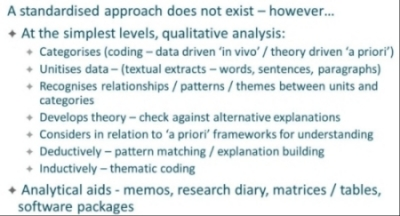
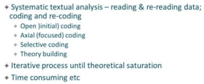
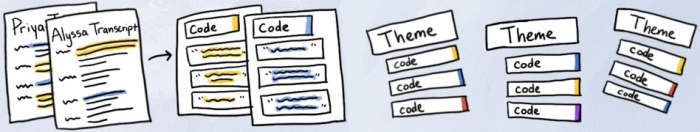

#### COM00146M Research Methods
# **Week 6 - Qualitative Data Collection and Analysis**

## **6.0 Table of Contents**

- [**6.0 Table of Contents**](#60-table-of-contents)
- [**6.1 Learning Objectives**](#61-learning-objectives)
- [**6.2 Summary**](#62-summary)
- [**6.3 Qualitative Research Method**](#63-qualitative-research-method)
  * [**6.3.0 Reading**](#630-reading)
  * [**6.3.1 Overview**](#631-overview)
    + [**Grounded Theory**](#grounded-theory)
  * [**6.3.2 Analysing and Presenting**](#632-analysing-and-presenting)
    + [**Interpretation**](#interpretation)
    + [**Validity and Reliability**](#validity-and-reliability)
    + [**Writing Reports**](#writing-reports)
  * [**6.3.3 Thematic Analysis**](#633-thematic-analysis)
- [**6.4 Drawing Valid Conclusion From Research Data**](#64-drawing-valid-conclusion-from-research-data)
  * [**6.4.0 Reading**](#640-reading)
  * [**6.4.1 Drawing Conclusions**](#641-drawing-conclusions)
    + [**Process**](#process)
    + [**Pitfalls**](#pitfalls)

---
&emsp;
## **6.1 Learning Objectives**

* **MLO1, MLO2, MLO4** - Compare methods of data gathering
* **MLO2** - Demonstrate a clear understanding of qualitative analysis methods

---
&emsp;
## **6.2 Summary**
Qualitative research provides a deep understanding of human behavior and avoids incorrect assumptions made from quantitative analysis. It involves categorizing data, recognizing patterns and themes, developing theory, and considering results in relation to existing frameworks. 

Grounded theory is a popular methodology that involves coding and recoding data to achieve saturation of themes. Software programs can be used to sort and search databases. Thematic analysis is flexible and accessible for novice researchers. 

Valid conclusions are essential for reliability and credibility, requiring a methodical approach to revisiting the research purpose, triangulating data sources, and drafting focused conclusions with recognized limitations.

---
&emsp;
## **6.3 Qualitative Research Method**

### **6.3.0 Reading**
* *Required: Chapter 9, Research Design: Qualitative, Quantitative, and Mixed Methods Approaches, Creswell and Creswell*
* *Extension: [How Qualitative Methods Support Better Data Science](https://medium.com/indeed-engineering/qualitative-before-quantitative-how-qualitative-methods-support-better-data-science-d2b01d0c4e64)*
* *Extension: [Doing A Themeatic Analysis: A Practical Step-By-Step Guide](https://ojs.aishe.org/index.php/aishe-j/article/view/335/553)*
* *Extension: [How To Do Thematic Analysis](https://delvetool.com/blog/thematicanalysis)*

&emsp;
### **6.3.1 Overview**
 
The volume and characteristics of qualitative data can make analysis appear overwhelming 

Qualitative methods are useful for gaining a deep understanding of human behaviour. They can help prevent incorrect assumptions being made from quantitative analysis.

**Qualitative analysis** deductively or inductively seeks to:
* Categorise and unitise data 
* Recognise relationships, patterns, and themes between these divisions
* Develop theory
* Consider results in relation to a priori frameworks for understanding 

  

There are many qualitative analysis techniques available to researchers, such as **thematic**, **discourse**, **hermeneutics**, **semiotics**, and **conversation analyses**. 

Each analysis type shares fundamental principles of:
* Organising data into categories
* Identifying key pieces of text to become units of analysis
* Identifying relationships, patterns, theme shared across units of analysis
* Reflecting on these to elicit findings
* Deriving explanations for the phenomenon being studies
* Develop new theories

A researcher may choose to make use of analytical aids, such as research diaries and software packages.

&emsp;
#### **Grounded Theory:**

Grounded theory is an archetypal methodology in qualitative research.

It is an interpretive methodology approach that provides a comprehensive analytical framework for:
* Gathering data
* Coding data – **open** initially for eliciting themes with **axial** and **selective** in later iterations
* Theorising to achieve saturation of themes through coding and recoding iteration

  

Generally, grounded theory is a protracted, rigorous, and detailed analytical approach.

&emsp;
### **6.3.2 Analysing and Presenting**

Qualitative data analysis involves making sense of text and image data by **segmenting** and **reassembling** it.

This process is often simultaneous with data collection and writing up findings: interviews may be proceeding while older data is being analysed or memos being processed.
	
Researchers need to **winnow** the data to allow closer focus on select parts:
* Winnowing involves sifting through large data sets to identify important elements
* Redundant data can be eliminated, condensing the data into a more manageable form
* This allows data to be aggregated into a small number of themes

Software programs can assist in the analysing of data, as they can organise, sort, and search databases.

&emsp;
#### **Interpretation:**

Interpretation of results generally involves:
* Summarising findings
* Comparing to literature and theories
* Discussing the researcher’s personal view
* Stating limitations
* Indicating future research

&emsp;
#### **Validity and Reliability:**

The process of checking for accuracy from the standpoint of the researcher, participant, or reader is known as **qualitative validity**.

Researchers should actively incorporate validity strategies into the study. Using multiple validity procedures is recommended, including:
* Triangulating different sources
* Clarifying researcher’s bias
* Presenting negative or conflicting information
* Using peer debriefing or an external auditor

**Qualitative Reliability:** means checking for consistency or stability of the approach. This can be done by documenting procedures and setting up a detailed case study protocol and database where appropriate.

&emsp;
#### **Writing Reports:**

The basic procedure for reporting qualitative research involves:
* Developing descriptions and themes from data
* Presenting these in a way that conveys multiple perspectives from participants
* It should also include descriptions of the setting or individuals 

Writing strategies that may be used include quotes, dialogue, varied narrative forms, first person pronouns, metaphors, and narrative forms associated with specific strategies. 

&emsp;
### **6.3.3 Thematic Analysis**

**Thematic analysis** is a type of analysis in qualitative research for generating rich, complex data descriptions.

It is a flexible, foundational method of analysis often used by researchers less familiar with the more complex types of analysis used in qualitative or quantitative research. 

The basic steps include:
* Familiarisation with the data
* Generating initial codes, either manually or through software
* Searching for themes – usually quantity over quality at this stage
* Reviewing, removing, and defining themes
* Producing the final report

  

The advantages of thematic analysis lie in its flexibility and accessibility for novice researchers. However, by nature it will overlook phenomena that occur in in individual records.

---
&emsp;
## **6.4 Drawing Valid Conclusion From Research Data**

### **6.4.0 Reading**
* *Required: none*
* *Extension: [When It Comes To Data, Skepticism Matters](https://hbr.org/2014/10/when-it-comes-to-data-skepticism-matters)*

&emsp;
### **6.4.1 Drawing Conclusions**

Drawing valid **conclusions** is essential to ensure reliability and credibility of research results.

Valid and credible conclusions report data accurately, without stretching or weakening findings.

The methodological rationale needs to be explained and validated, and the data analysis process should identify key themes and validated results. 

&emsp;
#### **Process:**

A methodical approach is therefore necessary to produce robust conclusions: 
* **Revisit** the research purpose and question – ensure conclusions address each component part of the question
* **Triangulate** data sources – ensures data validity by cross referencing findings from each source and seeking convergence and corroboration
* **Consider** the audience – tailored reports should be issues to different stakeholder groups, based on their expectations of the research 
* **Draft** conclusions, ensuring coherence and narrative flow – present claims and assumptions supported with evidence from the data which leads to a logical conclusion 
* **Review** and recognise limitations – any limitations within sampling, data collection, analysis, or constraints on the research should be acknowledged
* **End** conclusions in a focused, succinct, and appropriate way – over and under interpretation of data should be avoided and areas for further research indicated

&emsp;
#### **Pitfalls:**

While doing this, several pitfalls should be avoided:
* Avoid over or under interpreting the data
* Report actual findings, not desired ones
* Avoid broad generalisations from narrow data
* Avoid inconsistencies in argument