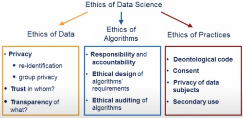
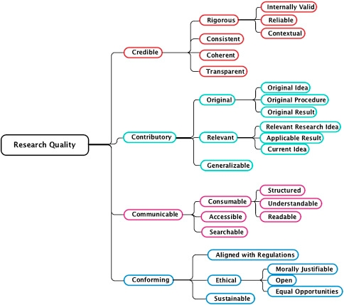

#### COM00146M Research Methods
# **Week 7 - Evaluation**

## **7.0 Table of Contents**

- [**7.0 Table of Contents**](#70-table-of-contents)
- [**7.1 Learning Objectives**](#71-learning-objectives)
- [**7.2 Summary**](#72-summary)
- [**7.3 Validity And Ethics**](#73-validity-and-ethics)
  * [**7.3.0 Reading**](#730-reading)
  * [**7.3.1 Validity**](#731-validity)
  * [**7.3.2 Ethics**](#732-ethics)
    + [**Ethics In Practice:**](#ethics-in-practice)
    + [**Ethical Considerations In Research:**](#ethical-considerations-in-research)
- [**7.4 Evaluation In Research**](#74-evaluation-in-research)
  * [**7.4.0 Reading**](#740-reading)
  * [**7.4.1 Evaluation Theory**](#741-evaluation-theory)
  * [**7.4.2 An Evaluation Framework**](#742-an-evaluation-framework)
  * [**7.4.3 Reflexivity**](#743-reflexivity)
  * [**7.4.4 Personal Reflection**](#744-personal-reflection)

---
&emsp;
## **7.1 Learning Objectives**

* **MLO3, MLO4** - Appreciate good quality research in both practice and published work
* **MLO2, MLO4** - Reflect on the influence ways of thinking and types of actions have on situations
* **MLO2, MLO4** - Identify what research skills are held or needed for your individual research project

---
&emsp;
## **7.2 Summary**

---
&emsp;
## **7.3 Validity And Ethics**

### **7.3.0 Reading**
* *Required: [Introduction To Data Ethics – A Lecture By Dr. Brent Mittelstadt](https://onlinestudy.york.ac.uk/courses/1026/files/360703?wrap=1)*
* *Required: [Turing’s Data Ethics Group Supports The Development Of The NHS Code Of Conduct For Data Driven Health And Care Technology](https://www.turing.ac.uk/research/research-programmes/public-policy/programme-articles/turings-data-ethics-group-supports-development-nhs-code-conduct-data-driven-health-and-care)*
* *Extension: none* 

&emsp;
### **7.3.1 Validity**

Literature stresses that research design must ensure data and results are relevant, reliable, valid, and credible.

The method of **data collection** must be carefully designed both in terms of content and structure.
* Language should be self explanatory, unambiguous and clear
* Questions asked should be specific and clearly articulated 
* Together, these help avoid bias and increases validity

The researcher must also be proficient in use of the **data collection instrument**.
* Lack of technical skill could affect results
* Inconsistent verbal and non verbal actions could introduce bias

**Data validity** is achieved through sampling.
* Sampling is a balance between practicalites of access and research purpose
* If a study requires generalisation of findings, the sampling approach must support this

&emsp;
### **7.3.2 Ethics**

**Research ethics** involve conducting research in a responsibile and morally defensible way.

While it seems straightforward to do the right thing, it can be particularly complex when research involves interactions with human subjects.

&emsp;
#### **Ethics In Practice:**

Dr Mittelstadt used the term **data ethics** to describe the moral principles that govern how we should collect, use, and share data:
* The proliferation of digital technologies has increased concern around data ethics
* Ethical considerations include **privacy**, **fairness**, **transparency**, **accountability**, and **impact**
* There is potential for bias in data collection and analysis that needs to be controlled
* Ethical frameworks such as consequentialism and deontology can mitigate concerns
* Some professions provide ethical codes and guidelines which should, or must, be adhered to 

  

The Alan Turing Institute's Data Ethics Group commented on the ethical use of data within the NHS.
* Technology can improve service and alleviate budgetary pressures
* However, a code of conduct is needed for data-driven health care technology
* This code must comply with regulatory obligations and bioethical principles
* The wider social implications of data and AI drive health services must be explicitly considered
* The code must be practically implemented and compliance demonstrated in order to have the desired impact

&emsp;
#### **Ethical Considerations In Research:**

Ethical issues can potentially arise at each stage of the research process.

There are three areas that underpin ethical research practice:
* **Obligations** - non-negotiable legal, professional, cultural, and personal norms that must be adhered to
* **Responsibilities** - the safety of particpants, stakeholders, and society must be ensured, including the effect of any power dynamics  
* **Expected standards** - includes avoiding hard, obtaining informed consent, respecting privacy, and avoiding deception

Avoiding harm includes being aware of potential **physical**, **mental**, or **emotional** harm.

Good informed consent provides participants with sufficient information about the research and allowing consent to be withdrawn at any time.

Agreed views regarding respecting privacy may be superseded by local laws, such as **GDPR**.

Ethical practice is important for maintaining reputation of researchers and institutions.

---
&emsp;
## **7.4 Evaluation In Research**

### **7.4.0 Reading**
* *Required: [Evaluating Evaluation: Implications For Assessing Quality, McCoy and Hargie](https://www.proquest.com/docview/229615504)*
* *Required: [Evaluating Research: A Multidisciplinary Approach To Assessing Research Practice And Quality, Martensson et al](https://www.sciencedirect.com/science/article/pii/S0048733315001845)*
* *Required: [Reflexivity, Positionality And Rigor In The Context Of Big Data Research, Ricker](https://papers.ssrn.com/sol3/Delivery.cfm/SSRN_ID2911652_code2648887.pdf)*
* *Extension: none* 

&emsp;
### **7.4.1 Evaluation Theory**

McCoy and Hargie argue that understanding the evaluation process is important before attempting to evalute. 

They also highlight that truth in evaluation is complex and subjective.

The three significant trends in **evaluation theory** are:
* **Tyler** - an objective oriented evaluation, involving comparing performance with objectives
* **Campbell** - a scientific approach, focuses on establishing cause-and-effect relationships with data
* **Cronbach** - a pragmatic type of evaluation, designing evaluations to meet the needs of the stakeholders

&emsp;
### **7.4.2 An Evaluation Framework**

Martensson et al describe a hierarchial model to be used to evaluate research practice.
* Four aspects of quality are identified: **credible**, **contributory**, **communicable**, and **conforming**.
* These key areas provide structure for branch and leaf concepts
* Potentially, these areas could be weighted to reflect th specific context
* This framework is generic and **multi-disciplinary**

  

&emsp;
### **7.4.3 Reflexivity**

Researchers make **subjective** decisions about what is to be extracted from data, what meaning to be placed on it, and the choice of mathematical methods used to interrogate it.

Therefore, it is important to ensure the process is done with consideration and documentation of the perspectives and positions of those involved.

Acknowledging the relationship between researcher and data can provide quality and accuracy in the analysis.

&emsp;
### **7.4.4 Personal Reflection**

**Reflection** should be actively planned as part of the research journey. 

Bespoke templates can be developed to facilitate the capturing of thoughts, actions, and progress at each stage of the research process.

Cameron and Price suggest using the following prompts during reflection activities:
* How did that go?
* What was happening there?
* How did I feel about it?
* What might I have done differently?
* What can I learn from this?
* What did not fit?
* Why was I surprised?
* What was I expecting?
* What was I thinking?
* How did that affect how I acted?
* How might I have thought differently?
* What impact might that have had?