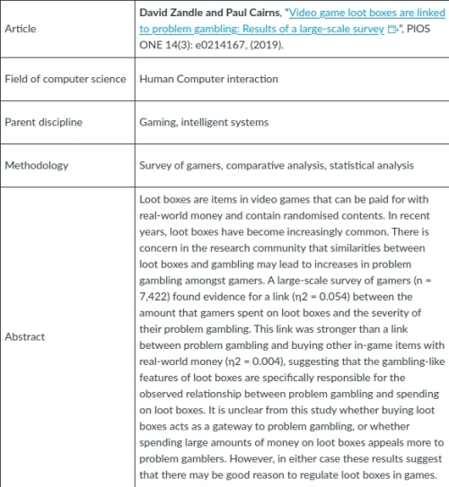

#### COM00150M Research Proposal
# **Week 1 - Introduction to Research Proposals**

## **1.0 Table of Contents**

- 

---
&emsp;
## **1.1 Learning Objectives**

* **MLO1** - Identify interests, strengths, development areas and previous experience
* **MLO1** - Critically reflect on interests, strengths, development areas and previous experience
* **MLO1, MLO3** - Select a unit of analysis or object of research

---
&emsp;
## **1.2 Summary**

---
&emsp;
## **1.3 Academic Strengths and Developmental Areas**

### **1.3.0 Reading**
* *Required: none*
* *Extension: none*

&emsp;
### **1.3.1 Academic and Research Skills**

Research projects are not solely concerned with the specific interests of the researcher: they need to be **viable** in terms of:
* Existing researcher **knowledge**
* Existing researcher **skills**
* Potential to raise these to the required level
* **Time** available
* **Resources** available

Realistic proposals stem from being critical but also embracing confidence in particular areas.

Self reflection on existing skills using limited, acceptable, competent, and excellent labels:
* Academic reading - competent
* Academic writing - competent
* Academic referencing - excellent
* Using reference tools - excellent
* Searching for literature - competent
* Making research notes - competent
* Planning and meeting deadlines - excellent
* Using feedback to improve - competent
* Communicating - excellent

&emsp;
### **1.3.2 Quantitative, Qualitative, Mixed Methods**

**Research methodologies** need to fit both the problem being investigated and the researcher's skill set.

**Quantitative** methods skills recap:
* Hypothesis testing
* Survey design
* Data analysis 
* Data visualisation
* Time series analysis
* Machine learning approaches
* Experimental design

**Qualitative** methods skills recap:
* Interviews
* Content analysis
* Ethnography
* Grounded theory
* Case study analysis
* Narrative analysis
* Participant observation

Self reflection on the above skills:
* “My strengths are mainly in quantitative methods” - Agree
* “My strengths lie mainly in qualitative methods” - Disagree
* “I am strong in both qualitative and  quantitative research methods” - Somewhat agree
* “I need to develop my skills in both qualitative and  quantitative research methods” - Somewhat disagree

---
&emsp;
## **1.4 Areas of Interest**

### **1.4.0 Reading**
* *Required: Chapters 1, 3, Projects In Computing And Information Systems: A Student's Guide, Dawson*
* *Extension: none*

&emsp;
### **1.4.1 Fields and Disciplines**

Computer Science includes a wide variety of fields and disciplines:
* **Academic fields** relate to the area covered, such as cyber security
* **Academic disciplines** relate to the way of developing knowledge

Research in Computer Science draws upon a range of techniques from parent academic disciplines, such as mathematics, engineering, psychology, and philosophy.

Inspiration can be drawn from existing work completed by academic researchers at the University of York. This includes, but is not limited to:
* 3D image analysis - [Towards a Complete 3d morphable model of the human head](https://ieeexplore.ieee.org/document/9082178)
* Human computer interaction - [Video game loot boxes are linked to problem gambling](https://journals.plos.org/plosone/article?id=10.1371/journal.pone.0206767)
* Artificial intelligence - [Automatically improving constraint models in Savile Row](https://www.sciencedirect.com/science/article/pii/S0004370217300747?via%3Dihub)
* Robotic systems - [Modelling and verification of the functional behaviour of robotic applications](https://link.springer.com/article/10.1007/s10270-018-00710-z)
* Cryptography - [High-rate measurement device independent quantum cryptography](https://www.nature.com/articles/nphoton.2015.83?cacheBust=1507838897366)
* Web navigation - [Effects of menu organisation and visibility on web navigation for people with dyslexia](https://link.springer.com/chapter/10.1007/978-3-030-29381-9_8)
* Pattern recognition - [Graph embedding using frequency filtering](https://ieeexplore.ieee.org/document/8778695)
* Cyber security - [A smart contract for boardroom voting with maximum voter privacy](https://link.springer.com/chapter/10.1007%2F978-3-319-70972-7_20)
* Computing theory - [When does a physical system compute](https://royalsocietypublishing.org/doi/full/10.1098/rspa.2014.0182)

An example in the human interaction field, indicating academic discipline and methodology, is shown below:

  

Many of these topics combine disciplinary fields. This is referred to as **interdisciplinarity** and is increasingly common.
* This is partly due to the wide variety of disciplines that make up Computer Science
* However, it is also due to the need to combine approaches in order to address modern societal challenges

&emsp;
### **1.4.2 Potential Project Consideration**

Considering the range of potential projects that match both interests and skills is one of the most difficult stages of a study.

**Programming** may be involved in computing projects, but it is important to recognise not all computing projects require it.

Unlike research degree projects, those for taught degrees do not need to make significant breakthroughs or be necessarily be publishable.

The different types of Computer Science projects have been suggested to be:
* **Research based**
* **Development**
* **Evaluation**
* **Industry based**
* **Problem solving**

Similarly, the different areas for Computer Science projects include:
* Algorithms and data structures
* Applied computer science
* Artificial intelligence
* Computer architectures and hardware
* Databases
* Formal methods
* Graphics and visualisation
* Human computer interaction
* Image processing, vision, pattern recognition
* Information systems
* Networking
* Security and cryptography
* Software engineering
* Theoretical computer science

&emsp;
#### **Choosing a Project:**

Identifying areas of interest and basing projects around them can help maintain motivation throughout the research process.

Identifying existing skills and knowledge, as done previously, can help determine how reasonable a research project is.

Investigating [previous university projects](https://www.cs.york.ac.uk/library/onlineprojlib/) and conducting wider reading can provide inspiration or ideas for building upon existing work.

Two recommended techniques for revealing potential areas for research include:
* **Clustering** - listing keywords related to areas of interest and logically grouping them together
* **Brainstorming** involves listing ideas quickly and without judgement, evaluating and assessing them after

  

Asking **"so what?"** can help add depth and ensure a project is meaningful or at least interesting.
