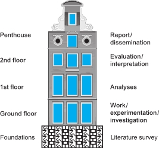
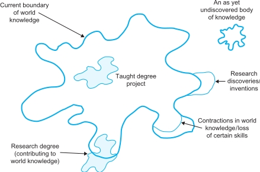
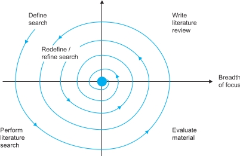

#### COM00150M Research Proposal
# **Week 2 - Literature Review: Establishing Relevance**

## **2.0 Table of Contents**

- 

---
&emsp;
## **2.1 Learning Objectives**

* **MLO3** - Undertake a literature search
* **MLO3** - Identify relevant texts from a literature search
* **MLO3** - Critique and summarise relevant texts
* **MLO3** - Utilise reference management tools
* **MLO3** - Write a draft proposal title 

---
&emsp;
## **2.2 Summary**

.

---
&emsp;
## **2.3 Academic Strengths and Developmental Areas**

### **2.3.0 Reading**
* *Required: Chapter 5, Projects In Computing And Information Systems: A Student's Guide, Dawson*
* *Extension: none*

&emsp;
### **2.3.1 Research Process**

The initial investigative work is crucial in any project and can be the determining factor between a good project and failure.

Good projects are built on a **literature survey**, which consists of two primary components:
* The **literature search** represents the mechanics of looking for, sorting, managing, and digesting the available research material
* The **literature review** represents written understanding, critical evaluation, and conceptualisation of the research material

  

Performing this survey justifies that the project is worth doing, establishes wider context for the project, and helps future researchers understand how the project evolved.

  

It also helps establish the relevance of the topic by answering these questions:
* Has it been researched before?
* Is the topic important, and if so, to which fields of research?
* What methodologies have been used to study it before?

As it is rare to find a topic that has never been researched previously, there should be a vast amount of published academic research that can be used to frame research projects. 

Insights gained may illustrate suitable **methodologies** and **methods** for the topic, but could also result in replicating previous methods in favour of something new. 

It is possible to study the same topic or research object by altering the **unit of analysis**.

The university provides support for this proceess:
* [Skills guide](https://subjectguides.york.ac.uk/skills/home)
* [Finding and researching](https://subjectguides.york.ac.uk/skills/find)

&emsp;
#### **Literature Survey Process:**

The **literature survey** is made up of concurrent searches and reviews. It is:
* An ongoing, iterative process
* Constantly refined and redefined depending on material found

  

The process starts with the intended literature search being **defined**: identifying the boundaries of the search and the topics of interest.
* This could start as a personal and subjective understanding of the field
* A more focused start could be to limit searches to key authors or publications
* Or conceptual maps, such as relevance trees, could be used to help identify a starting point

With the boundaries defined, a **literature search** can be undertaken, according to the definition previously established.

Any material found requires critical evaluation. This provides the basis for the **literature review**.

Having completed a cycle of the spiral, more questions or influencing factors may have been uncovered. Similarly, it may be apparent that the focus was too broad or too narrow and requires adjustment. The cycle should, therefore, start again.

It is difficult to know when to stop the literature review. While it is impossible to read everything published in an area, the **validity** of the resulting study will be enchanced by undertaking a systematic process.

