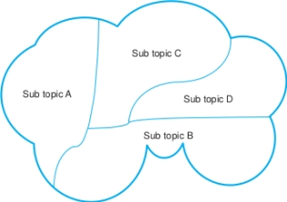

#### COM00150M Research Proposal
# **Week 2 - Literature Review: Establishing Relevance**

## **2.0 Table of Contents**

- [**2.0 Table of Contents**](#20-table-of-contents)
- [**2.1 Learning Objectives**](#21-learning-objectives)
- [**2.2 Summary**](#22-summary)
- [**2.3 Academic Strengths and Developmental Areas**](#23-academic-strengths-and-developmental-areas)
  * [**2.3.0 Reading**](#230-reading)
  * [**2.3.1 Research Process**](#231-research-process)
  * [**2.3.2 Literature Survey Process**](#232-literature-survey-process)
- [**2.4 Literature Searching**](#24-literature-searching)
  * [**2.4.0 Reading**](#240-reading)
  * [**2.4.1 Understanding Literature Searching**](#241-understanding-literature-searching)
    + [**Resources**](#resources)
    + [**Tips for Performing a Literature Search**](#tips-for-performing-a-literature-search)
  * [**2.4.2 Reading Articles and Books**](#242-reading-articles-and-books)
    + [**Critical Reading**](#critical-reading)
    + [**SQ3R Model**](#sq3r-model)
- [**2.5 Writing a Literature Review**](#25-writing-a-literature-review)
  * [**2.5.0 Reading**](#250-reading)
  * [**2.5.1 Review Overview**](#251-review-overview)
    + [**Structure**](#structure)
  * [**2.5.2 Critical Evaluation**](#252-critical-evaluation)
- [**2.6 Reference Management Tools**](#26-reference-management-tools)
  * [**2.5.0 Reading**](#250-reading-1)
  * [**2.5.1 Managing Information**](#251-managing-information)
    + [**Physical Organisation**](#physical-organisation)
    + [**Digital Organisation**](#digital-organisation)

---
&emsp;
## **2.1 Learning Objectives**

* **MLO3** - Undertake a literature search
* **MLO3** - Identify relevant texts from a literature search
* **MLO3** - Critique and summarise relevant texts
* **MLO3** - Utilise reference management tools
* **MLO3** - Write a draft proposal title 

---
&emsp;
## **2.2 Summary**

Research projects require thorough literature surveys and critical evaluation. The process begins with a literature search and review to justify the project's worth and establish its relevance. Various resources, such as university skills guides and online databases, aid in finding credible sources. 

Critical reading skills are essential to evaluate evidence, identify gaps, and understand limitations. The SQ3R model is a common approach to effectively summarise, absorb, and recall information.

Writing a literature review involves presenting a coherent argument, referencing past and current literature, and justifying the proposed project. Proper citation and referencing are crucial. Finally, managing information and using reference management tools streamline the research process.

---
&emsp;
## **2.3 Academic Strengths and Developmental Areas**

### **2.3.0 Reading**
* *Required: Chapter 5, Projects In Computing And Information Systems: A Student's Guide, Dawson*
* *Extension: none*

&emsp;
### **2.3.1 Research Process**

The initial investigative work is crucial in any project and can be the determining factor between a good project and failure.

Good projects are built on a **literature survey**, which consists of two primary components:
* The **literature search** represents the mechanics of looking for, sorting, managing, and digesting the available research material
* The **literature review** represents written understanding, critical evaluation, and conceptualisation of the research material

  

Performing this survey justifies that the project is worth doing, establishes wider context for the project, and helps future researchers understand how the project evolved.

  

It also helps establish the relevance of the topic by answering these questions:
* Has it been researched before?
* Is the topic important, and if so, to which fields of research?
* What methodologies have been used to study it before?

As it is rare to find a topic that has never been researched previously, there should be a vast amount of published academic research that can be used to frame research projects. 

Insights gained may illustrate suitable **methodologies** and **methods** for the topic, but could also result in replicating previous methods in favour of something new. 

It is possible to study the same topic or research object by altering the **unit of analysis**.

The university provides support for this proceess:
* [Skills guide](https://subjectguides.york.ac.uk/skills/home)
* [Finding and researching](https://subjectguides.york.ac.uk/skills/find)

&emsp;
### **2.3.2 Literature Survey Process:**

The **literature survey** is made up of concurrent searches and reviews. It is:
* An ongoing, iterative process
* Constantly refined and redefined depending on material found

  

The process starts with the intended literature search being **defined**: identifying the boundaries of the search and the topics of interest.
* This could start as a personal and subjective understanding of the field
* A more focused start could be to limit searches to key authors or publications
* Or conceptual maps, such as relevance trees, could be used to help identify a starting point

With the boundaries defined, a **literature search** can be undertaken, according to the definition previously established.

Any material found requires critical evaluation. This provides the basis for the **literature review**.

Having completed a cycle of the spiral, more questions or influencing factors may have been uncovered. Similarly, it may be apparent that the focus was too broad or too narrow and requires adjustment. The cycle should, therefore, start again.

It is difficult to know when to stop the literature review. While it is impossible to read everything published in an area, the **validity** of the resulting study will be enchanced by undertaking a systematic process.

---
&emsp;
## **2.4 Literature Searching**

### **2.4.0 Reading**
* *Required: Chapter 5, Projects In Computing And Information Systems: A Student's Guide, Dawson*
* *Required: Chapter 3, Writing For Computer Science, Zobel*
* *Extension: none*

&emsp;
### **2.4.1 Understanding Literature Searching**

With the topic identified, a systematic search for relevant and credible literature can begin. Activities, such as relevance trees, will provide various key areas, phrases, and words with which to start.

The purpose of literature searching is to be well informed about existing research on a topic, identify gaps in current knowledge, and avoid duplicating previous work.

It is important to develop effective reading skills in order to identify the **contributions**, **value**, and **flaws** of research papers.

As papers are read, the reesarcher should attempt to establish:
* Novelty
* Theories
* Debates
* New directons
* Alternative perspectives

Note that it is recommended to seperate the searching and reading of papers: gather material uncritically, and analyse subsequently.

The types of literature suitable for examination are:
* **Primary** - original research reports
* **Secondary** - reviews, surverys, and evaluations of primary literature
* **Tertiary** - encyclopedias and textbooks that summarise secondary literature

It would not be expected to use sources like lab notebooks or survey responses in the search.

&emsp;
#### **Resources:**

Generally, **credible** sources will have been published and peer reviewed.

The literature ultimately relied upon should primarily consist of refereed and published papers, theses examined at reputable institutions, and books based on refereed sources.

A possible starting point if the university library webpages:
* [University of York Library](https://www.york.ac.uk/library/)
* [E-resources guide](https://subjectguides.york.ac.uk/az.php)

**Abstracts** appear at the beginning of academic papers and provide a concise summary of the research conducted. Searching **abstract databases** can be an efficient approach. However, it is important to read the actual papers when relevant.

Similarly, specialised **internet search engines**, such as Google Scholar, can be used to locate resources. The university provides some [guidance](https://subjectguides.york.ac.uk/searching/skills) on using search engines.

**Reference lists** at the end of academic papers contain lists of sources used by the authors in their research. These can be used to direct a literature search.

**Wikipedia** can be useful for general overviews, but caution is needed due to the lack of academic refereeing. 

Resources specific to Computer Science include:
* [ACM](https://dl.acm.org/) - digital library of all material published by the ACM
* [IEEE Computer Society](https://www.computer.org/publications) - online biblographic database
* [IngentaConnect](https://www.ingentaconnect.com/) - collection of academic and professional research articles
* [HCI Bibliography](https://hcibib.org/) - focus on human computer interaction research
* [Journal of Digital Information](https://jodi-ojs-tdl.tdl.org) - focus on digital information management

&emsp;
#### **Tips for Performing a Literature Search:**

Several tips have been suggested to help the search process:
* Note interesting quotes and references as the search progresses
* Use review articles and books to help the search
* Reference correctly from the start
* Know when to stop based on the plan and research boundaries
* Organise and catalogue the read material effectively
* Read recognised leaders and original theorists in the field
* Start with a broad search before focusing
* Be honest if the research idea is not as original as first thought

&emsp;
### **2.4.2 Reading Articles and Books**

Most academic publications come in three forms: articles, edited chapters, and books.

&emsp;
#### **Critical Reading:**

**Critical reading** goes beyond understanding a text. It involves:
* Evaluating evidence and arguments
* Understanding research limitations
* Identifying explicit or implicit influences
* Personal agreement or disagreement
* Identifying emerging themes across various texts

An important first step is the source: ideally **peer-reviewed** journal articles.

Evaluating sources is a key part of critical reading. Factors to consider include:
* Authority of the author
* Intended audience
* Purpose of the work
* Quality of the argument
* Relevance of the content
* Accuracy of the content

  

Questions that can aid a critical reading are presented below:

  

However, critical thinking should not be confused with general criticism: the former is about evaluation strength and validity of arguments, not finding fault in a derogatory way.

  

&emsp;
#### **SQ3R Model:**

Several models exist to help read and review literature. The **SQ3R model** is one such example, which can be used for effective reading and information absorption:
* Survey
* Question
* Read
* Recite
* Review

  

The first step is to **survey** the document by looking at the title, authors' names, abstract, table of contents, and headings.

Next, **questions** should be created based on these areas. These should be specific queries.

The **reading** process involves reading the document selectively, section by section, and using annotations to summarise key information. This should allow answerable questions from the previous stage to be identified.

**Reciting** or rewording the information is essential for understanding and paraphrasing the key points.

After some time has passed, perhaps a day, the notes can be **reviewed** for clarity. 

Once this process is complete, revisiting questions and reviewing answers aids both retention and comprehension.

Further supporting resources are [available](https://subjectguides.york.ac.uk/skills/critical-reading) through the university.

---
&emsp;
## **2.5 Writing a Literature Review**

### **2.5.0 Reading**
* *Required: Chapters 2, 5, Projects In Computing And Information Systems: A Student's Guide, Dawson*
* *Chapters 9, 10, Dissertations and Project Reports: A Step by Step Guide, Cottrell*
* *Extension: none*

&emsp;
### **2.5.1 Review Overview**

The purpose of a **literature review** is to refine research questions, explore gaps in current knowledge, avoid repeating past work, and identify useful research methods.

Generally, it should provide:
* A coherent argument leading to a description of the proposed study
* References to past and current literature in the field
* Indicate areas where previous researchers agree
* A discussion of current **omissions** and identified **biases**

The field should be presented as a series of inter-related subtopics, with references supporting arguments and explaining the topics covered. However, references should not be used to pad out the report or simply prove key texts have been read.

The research field can provide a framework for the literature review, as illustrated below:

  

  

Three common ways to present literature reviews are:
* Presented as a single cohesive chapter
* Divided into a series of smaller chapters
* Raised within the report as relevant issues arise

It is important that the review is **selective**, not just a report on the content of each article.

Every literature review should implicitly incorporate these points:
* Arrange relevant literature in the field
* Critically evaluate past and current research
* Identify the proposed project within a wider context
* Justify the proposed project by showing how it will fill a gap in the field

Proper **citation** and **referencing** is critical to avoid plagiarism and properly acknowledge the work of others.

&emsp;
#### **Structure:**

The review should be structured logically. This is usually **thematic** or **chronological**, as in the example structure below:
* An introduction justifying the content
* Demonstrating how the subject area has evolved
* Expanding on the area of study
* Discussing recent developments
* Highlighting current limitations in the field
* Justifying the relevance of the paper

&emsp;
### **2.5.2 Critical Evaluation**

**Critical evaluation** involves comprehensive analysis of research articles. 

This goes deeper than that of the SQR3 model in the **literature search**, providing the required depth for the writing of the **literature review**.

Suggested steps, collated from various sources, include:
* Considering the type of article: review paper, theory paper etc...
* Identify useful ideas, techniques, or quotes from the article
* Evaluate the author's credibility and recognition in the field
* Determine the contribution of the article to the field
* Check if the conclusions flow logically from the work presented
* Check if the arguments are logical and supported
* Differentiate fact from unsubstantiated opinion
* Assess if there are counter arguments
* Consider if the article contradicts or supports other viewpoints
* Check the references are appropriate, relevant, and up to date
* Evaluate the methodology, design, measures, and generalisations

It is important to note that critical evaluation goes beyond understanding and repeating content: it requires awareness of **boundaries**, **developing areas**, **dead-ends**, **limitations**, and **contradictions**.

---
&emsp;
## **2.6 Reference Management Tools**

### **2.5.0 Reading**
* *Required: Chapter 5, Projects In Computing And Information Systems: A Student's Guide, Dawson*
* *Required: Chapter 8, Dissertations and Project Reports: A Step by Step Guide, Cottrell*
* *Extension: [Reference Management: A Practical Guide](https://subjectguides.york.ac.uk/reference-management), University of York*

&emsp;
### **2.5.1 Managing Information**

Research will involve a large numbers of articles, periodicals, and books being read and it is important to have a system to organise and manage the resulting information.

A **conceptual model**, like a relevance tree or spider diagram, can help identify and link topics of interest.

&emsp;
#### **Physical Organisation:**

Articles could be oranised into plastic wallets or folders, with appropriate labels for quick information retrieval.

During reading, highlighting key phrases, sentences, and paragraphs is a useful approach. A colour coding scheme can be adopted, such as using separate colours for quotes, topic explanations, ideas, and contraditions.

Making summary notes on the front pages of articles and using **post-it-notes** to identify important pages are both potentially useful.

&emsp;
#### **Digital Organisation:**

**Index systems** can be created digitially, allowing for information on articles and books read to be maintained and easily updated.

**Reference management software** can help manage references, simplifying managing citations. Among other benefits, this allows references to be in the correct format from the beginning.

  

The university supports four reference management software: EndNote, Mendeley, Zotero, and Paperpile. It provides a [practical guide](https://subjectguides.york.ac.uk/reference-management) to using these.