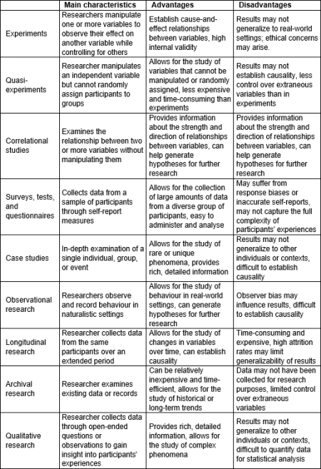

#### COM00150M Research Proposal
# **Week 3 - Research Design: Making The Project Achievable**

## **3.0 Table of Contents**

- 

---
&emsp;
## **3.1 Learning Objectives**

* **MLO2** - Transform a research topic into a research design
* **MLO2** - Consider the design implications of different modes of computer science research
* **MLO4** - Critically reflect on time and resource limits in relation to research projects
* **MLO4** - Develop a research plan for a researchable problem

---
&emsp;
## **3.2 Summary**

---
&emsp;
## **3.3 Revisiting Research Methods**

### **3.3.0 Reading**
* *Required: Chapters 2, 3, Projects In Computing And Information Systems: A Student's Guide, Dawson*
* *Required: Chapters 1, 7, Research Design: Qualitative, Quantitative, and Mixed Methods Approaches, Creswell and Creswell*
* *Extension: none*

&emsp;
### **3.3.1 Methodologies and Methods**

The advantages and disadvantages of various research methodologies were detailed in the **Research Methods** module:

  

Research methods can be classified according to their timeframe. Which to choose depends on the nature of the research and the intended outcome.
* **Cross-sectional** studies provide a snapshot of a situation or event as a particular point in time
* **Longitudinal** studies provide a long term picture, where data is gathered over a period of time

&emsp;
### **3.3.2 Research Design, Questions, and Hypotheses**

Research design, questions, and hypotheses are all crucial components of academic research process. 

&emsp;
#### **Purpose of Research Design:**

Simply, **research design** is a blueprint for research: a strategy that guides the researcher in planning and implementing a study in a way most likely to achieve the intended goal.

It outlines:
* What data to gather
* How to collect it
* How to analyse it

In **mixed methods** research, the design will ensure that both **qualitative** and **quantitative** aspects complement each other in understanding the investigated phenomenon.

&emsp;
#### **Research Questions and Hypotheses:**

A **research question** is a clearly defined question that the study seeks to answer. It could be:
* Open ended
* Exploratory
* Qualitative or quantitative in nature

However, **hypotheses** are specific predictions about the possible outcomes of the research. 
* In quantitative studies, hypotheses are often statements about the expected relationships between variables
* Mixed methods research may have both quantitative and qualitative hypotheses

&emsp;
#### **Role in the Research Process:**

Research is iterative and rarely neat, however the process can broadly be represented as:

  

A **research project** should start with a clearly defined research questions or hypothesis.
* The **question** should be specific and narrow the focus of the study
* Generally, qualitative research questions start with words like *how* and *what*
* Mixed methods research questions should directly address the integration both elements
* **Hypotheses** should be testable predictions about the expected outcomes
* These are generally articulated as either alternative or null hypotheses

Both questions and hypotheses should be directly linked to the context of the study. 

**Research symmetry** implies that irrespective of what the findings are, they should have a similar value. This means that every hypothesis should be framed in a way that it yields meaningful and valuable insight.

---
&emsp;
## **3.4 Looking Forward**

### **3.4.0 Reading**
* *Required: Chapter 7, Projects In Computing And Information Systems: A Student's Guide, Dawson*
* *Required: Chapters 1-6, Dissertations and Project Reports: A Step by Step Guide, Cottrell*
* *Required: [Toward Principles of Construct Clarity: Exploring the
Usefulness of Facet Theory in Guiding Conceptualization](https://www.researchgate.net/publication/294108825_Toward_Principles_of_Construct_Clarity_Exploring_the_Usefulness_of_Facet_Theory_in_Guiding_Conceptualization), Zhang et al*
* *Extension: Chapters 7, 8, Projects In Computing And Information Systems: A Student's Guide, Dawson*

&emsp;
### **3.4.1 Balancing Requirements**

Undertaking a research project involves balancing competing requirements:
* What is **possible** - conceptually and theoretically possible
* What is **practical** - real world limitations on time and resources
* What is **required** - degree requirements, career development etc...

Time is an important resource and effective **time management** is important throughout long term research projects:
* **Personal time** - identify issues that may arise, such as a lack of routine or everyday commitments
* **Allocating time** - consider the broad project processes involved and use planning tools for scheduling
* **Pacing work** - working little and often, contingency planning, and realistic mini-goal setting can help
* **Maintaining momentum** - motivation can be maintained through strict routines and acknowledging achievements

Procrastination in writing up projects is common. Therefore, it is important to plan for writing early on. **Good enough** standards and section deadlines should be decided on. 

It is important to understand the role of a **supervisor** in the project: they provide guidance, direction, and feedback, but not day to day supervision. Establishing good everyday habits is down to the researcher.

&emsp;
### **3.4.2 Independent Research Project (IRP) Outline**

The **Independent Research Project** (IRP) is a module wherein the student will produce an individual piece of research under the guidance of a supervisor.

The Research Proposal (RP) module is 8 weeks and the Independent Resarch Project is 16: a total of 24 weeeks working on the project. This is divided into 5 phases:
* Phase 1 - definition (RP)
* Phase 2 - planning (RP)
* Phase 3 - initiation (IRP)
* Phase 4 - control (IRP)
* Phase 5-  closure (IRP)

The IRP requires the submission of a final **research proposal**. It is expected that this will be the proposal developed for the assessment in the preceding Research Proposal module, however this can be updated, adapated, or changed. 

The timetable for submitting a proposal is constrained by the time it takes to get **ethical approval**, if needed.

&emsp;
#### **IRP Control Phase:**

The **control** phase involves managing and controlling five project elements: time, scope, quality, resources, and cost.

  

**Time**, **scope**, and **quality** should be monitored closely to ensure tasks are completed according to the project plan and objectives.

Project management involves making tradeoffs between elements as the project progresses. These are summarised below, with the exception of cost which is not within the control of the project:

  

The goal is to ensure the project is completed on time, with the best possible effort.

&emsp;
#### **IRP Closure Phase:**

The **closure** phase refers to the point where all research activities are completed and the project itself needs to be finalised.

Data collection and analysis needs to be checked to ensure that all data has been collected and analysed according to the research design.

Similarly, the conclusions based on the data analysis needs to be finalised. This may involve going through several drafts before considering this section completed.

The final report needs to be written, conforming to the relevant standards. This should include the research question or hypothesis, methodology, data analysis, results, conclusion, and recommendations.

&emsp;
### **3.5.3 Defining Constructs**

With units of analysis and research objects previously discussed, the **construct** of the research needs to be considered. This relates to:
* The key concepts and topics of the research
* These are not directly observable
* However, they can be inferred from observed and measured data

**Construct clarity** refers to the practice of carefully identifying strong categories that condense concepts and processes as distinctly as possible.

Clear constructs are important for other researchers: they enable the identification fo problems, potential links to background concepts, and concepts deserving further investigation.

Therefore, for clarity, the **research domain** and the techniques employed should be stated as early as possible in the proposal and paper. For example, *"this research project aims at investigating possible solutions to extract usable work from a physical system, quantifying the performance studying variations of the entropy of the system"* identifies the domain in a physics paper clearly.

&emsp;
#### **Facet Theory:**

To aid in achieving construct clarity, **Facet Theory** can be employed. This is a meta-theoretical framework that provides structure to complex, multidimensional concepts: 
* A facet of habitat would result in the frog and duck being grouped together
* However, a zoological classification would result in the duck and hen being together
* Careful consideration of the topic and expected outcomes is therefore important

  

Facet Theory can be applied to research using the following phases: 
* Identify the **domain** - determine the conceptual universe to be investigated, eg customer satisfaction
* Determine the **facets** - within this domain, exhaustively identify the facets that can be studied independently, eg product quality, customer service, price
* Identify the **elements** - determine the elements within each facet, eg product quality may be made up of durability, functionality, aesthetics
* Create a **mapping sentence** - a comprehensive statement that outlines the structure of the concept according to the facets, elements, and their interactions
* Generate a **data collection instrument** - create a data collection instrument, such as a survery or questionnaire, that captures data on all facets and elements
* Analyse **data** - use statistical methods to analyse the data, taking into accountt he structure provided by the facets and elements
* Verify **model** - verify the theory using empirical data, potentially through comparing the model's predictions with the observed data or coherence with theories

