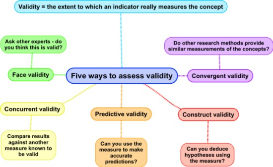

#### COM00150M Research Proposal
# **Week 4 - Methodology, Sources, and Data**

## **4.0 Table of Contents**

- 

---
&emsp;
## **4.1 Learning Objectives**

* **MLO2** - Critically evaluate the empirical and theoretical requirements of a research topic
* **MLO2** - Evaluate different methodologies and assess their suitability in relation to a research topic
* **MLO2** - Apply knowledge of research philosophy and methods to justify an appropriate approach for a specific research question
* **MLO2, MLO3** - Identify different kinds of data
* **MLO2, MLO3** - Critically evaluate the limitations and strengths of different kinds of data

---
&emsp;
## **4.2 Summary**

---
&emsp;
## **4.3 Validity, Reliability, and Verifiability**

### **3.3.0 Reading**
* *Required: Chapter 2, Projects In Computing And Information Systems: A Student's Guide, Dawson*
* *Required: Chapter 1, Research Design: Qualitative, Quantitative, and Mixed Methods Approaches, Creswell and Creswell*
* *Required: [Essential Ingredients of a Good Research
Proposal for Undergraduate and
Postgraduate Students in the Social
Sciences](https://journals.sagepub.com/doi/pdf/10.1177/2158244014548178), Abdulai and Owusu-Ansah*
* *Extension: none*

&emsp;
### **4.3.1 Importance of Validity, Reliability, and Verifiability**

The function of the **methodology** section of a proposal is to explain, in detail, how data will be generated. This allows the reader to assess whether any conclusion made will be based on **valid**, **reliable** and **verifiable** data.

These concepts are essential in both **quantitative** and **qualitative** research frameworks, although they are applied differently in each.

&emsp;
#### **Validity:**

**Validity** in research refers to the degree which a study accurately assesss the concepts the researcher is attempting to **measure**. Essentially, a valid study measures what it intends to measure.

  

* This involves the application of correct procedures to find answers to the research question
* In **quantitative** research, the validity of results may depend on various aspects, such as demonstrating efforts to establish the validity of the instrument used
* In **qualitative** research, validity is harder to attain due to subjective data. It refers to the checking the accuracy of a finding and providing arguments for the approach

Validity is important as it:
* Ensures the study accurately measures what it intends to, adding **credibility** and **depth**
* Is key to drawing accurate and meaningful **conclusions**
* Enables other researchers to **trust** and **build** upon the findings
* Prevents misinterpretation of the data and false conclusions, supporting field **integrity**

&emsp;
#### **Reliability:**

**Reliability** in research relates to the **consistency** of a research study or the measurements. It is a judgement on the quality of the specific measurement procedures, concerning accuracy and repeatability.
* If a study or method produces the same results when repeated under the same conditions, it is reliable
* This involves the replication of the study's findings across time, observers, and parts of the test itself
* In **quantitative** research, reliability corresponds to how consistent the instrument is, enabling reproducibility of outcomes
* In **qualitative** research, reliability referst to the consistency of outcomes and procedures across the wider research community

  

This is crucial it:
* Guarantees **consistency** and **precision** in the findings
* Ensures **stability** and **reproducibility** of the results
* Enhances the **credibility** of the research and fosters generalisation
* Signifies that the findings are not random or due to chance

&emsp;
#### **Verifiability:**

**Verifiability** in research refers to the ability to **check**, **authenticate**, or **confirm**, the correctness of the research findings.
* This involves ensuring a study's findings can be reproduced by others, either by data analysis or repeating the experiment
* Therefore, it is also related to transparency of research methodology and data collection
* In both **quantitative** and **qualitative**  research, verifiability reflects the ability to check accuracy of a finding using appropriate procedures

This means it is essential for:
* Upholding **transparency** and **integrity** in research
* Allowing other researchers to **replicate**, **confirm**, or **challenge** the findings
* Preventing the propagation of false or misleading information

Verifiability is a fundemental principle in scientifict research and is cruical for ensuring trust in any research findings.