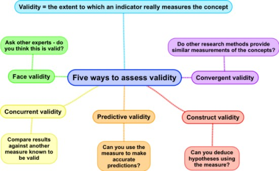
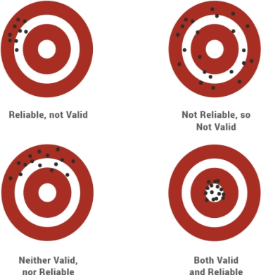
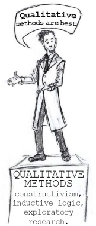
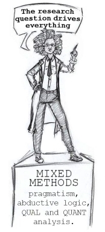

#### COM00150M Research Proposal
# **Week 4 - Methodology, Sources, and Data**

## **4.0 Table of Contents**

- 

---
&emsp;
## **4.1 Learning Objectives**

* **MLO2** - Critically evaluate the empirical and theoretical requirements of a research topic
* **MLO2** - Evaluate different methodologies and assess their suitability in relation to a research topic
* **MLO2** - Apply knowledge of research philosophy and methods to justify an appropriate approach for a specific research question
* **MLO2, MLO3** - Identify different kinds of data
* **MLO2, MLO3** - Critically evaluate the limitations and strengths of different kinds of data

---
&emsp;
## **4.2 Summary**

---
&emsp;
## **4.3 Validity, Reliability, and Verifiability**

### **4.3.0 Reading**
* *Required: Chapter 2, Projects In Computing And Information Systems: A Student's Guide, Dawson*
* *Required: Chapter 1, Research Design: Qualitative, Quantitative, and Mixed Methods Approaches, Creswell and Creswell*
* *Required: [Essential Ingredients of a Good Research
Proposal for Undergraduate and
Postgraduate Students in the Social
Sciences](https://journals.sagepub.com/doi/pdf/10.1177/2158244014548178), Abdulai and Owusu-Ansah*
* *Extension: none*

&emsp;
### **4.3.1 Importance of Validity, Reliability, and Verifiability**

The function of the **methodology** section of a proposal is to explain, in detail, how data will be generated. This allows the reader to assess whether any conclusion made will be based on **valid**, **reliable** and **verifiable** data.

These concepts are essential in both **quantitative** and **qualitative** research frameworks, although they are applied differently in each.

&emsp;
#### **Validity:**

**Validity** in research refers to the degree which a study accurately assesss the concepts the researcher is attempting to **measure**. Essentially, a valid study measures what it intends to measure.

  

* This involves the application of correct procedures to find answers to the research question
* In **quantitative** research, the validity of results may depend on various aspects, such as demonstrating efforts to establish the validity of the instrument used
* In **qualitative** research, validity is harder to attain due to subjective data. It refers to the checking the accuracy of a finding and providing arguments for the approach

Validity is important as it:
* Ensures the study accurately measures what it intends to, adding **credibility** and **depth**
* Is key to drawing accurate and meaningful **conclusions**
* Enables other researchers to **trust** and **build** upon the findings
* Prevents misinterpretation of the data and false conclusions, supporting field **integrity**

&emsp;
#### **Reliability:**

**Reliability** in research relates to the **consistency** of a research study or the measurements. It is a judgement on the quality of the specific measurement procedures, concerning accuracy and repeatability.
* If a study or method produces the same results when repeated under the same conditions, it is reliable
* This involves the replication of the study's findings across time, observers, and parts of the test itself
* In **quantitative** research, reliability corresponds to how consistent the instrument is, enabling reproducibility of outcomes
* In **qualitative** research, reliability referst to the consistency of outcomes and procedures across the wider research community

  

This is crucial it:
* Guarantees **consistency** and **precision** in the findings
* Ensures **stability** and **reproducibility** of the results
* Enhances the **credibility** of the research and fosters generalisation
* Signifies that the findings are not random or due to chance

&emsp;
#### **Verifiability:**

**Verifiability** in research refers to the ability to **check**, **authenticate**, or **confirm**, the correctness of the research findings.
* This involves ensuring a study's findings can be reproduced by others, either by data analysis or repeating the experiment
* Therefore, it is also related to transparency of research methodology and data collection
* In both **quantitative** and **qualitative**  research, verifiability reflects the ability to check accuracy of a finding using appropriate procedures

This means it is essential for:
* Upholding **transparency** and **integrity** in research
* Allowing other researchers to **replicate**, **confirm**, or **challenge** the findings
* Preventing the propagation of false or misleading information

Verifiability is a fundemental principle in scientifict research and is cruical for ensuring trust in any research findings.

&emsp;
### **4.3.2 Quantitative Research**

Three examples of quantiative methodology are explored: experimental design, non-experimental design, and longitudinal designs.

  

&emsp;
#### **Experimental Design:**

**Experimental** design is appropriate when aiming to precisely determine the role of **variables** in outcomes, typically for observational studies.
* Strengths: allows for **control** and **manipulation** of variables to observe effects
* Weakenesses: can be difficult to **isolate** variables and resutls may not reflect the complexity of the real world
* Theory is often used to **predict** the outcomes of variable manipulation
* Data is primarily from controlled observations or experiments
* Ethical considerations include **proper treatment** of subjects, especially in medical contexts

&emsp;
#### **Non-Experimental Design:**

**Non-experimental** design is appropriate for gathering information about **connections** between variables in a system, especially when an experimental approach isn't feasible.
* Strengths: can reach a **large population** and is flexible with time and place
* Weaknesses: reliance on **self reported data** with possible low response rates, also it might not be possible to draw **cause-effect conclusions**
* Theory helps **frame** the research and expected relationships
* Data is typically collected through phone calls, mail, internet, and personal interviews
* Ethical considerations include **privacy** and **informed consent**

&emsp;
#### **Longitudinal Design:**

**Longitudinal** design is appropriate to track changes over a period of **time**.
* Strengths: detects **changes** over time and allows examination of event sequences
* Weaknesses: is time consuming, costly, and possibly has a high attrition rate
* Theory helps predict the expected **patterns** or changes that occur over time
* Data is collected through repeated observations or surveys over a specified period
* Ethical considerations include maintaining **privacy** and **commitment** over extended periods

&emsp;
### **4.3.3 Qualitative Research**

Five examples of quantiative methodology are explored: narrative research, phenomenology, grounded theory, ethnographics, and case studies.

  

&emsp;
#### **Narrative Research:**

**Narrative research** is appropriate when studying individual experiences or life stories.
* Strengths: **rich** and **detailed** data from a personal perspective
* Weaknesses: time consuming and suffers from **generalisability** problems
* Theory facilitates the **interpretation** and **analysis** of narratives
* Data is collected from individual stories or life histories
* Ethical considerations include **respect** for personal experiences and **informed consent**

&emsp;
#### **Phenomenology:**

**Phenomenology** is appropriate when the aim is to understand shared experiences around a particular phenomenon.
* Strengths: provides a **deep** understanding of phenomena from participants' **perspectives**
* Weaknesses: data may be **subjective** and not **generalisable**, making interpretation difficult
* Theory helps to **interpret** and **understand** these shared experiences
* Data is collected from detailed interviews describing personal experiences
* Ethical considerations include **privacy** and **emotional safety**

&emsp;
#### **Grounded Theory:**

**Grounded theory** is appropriate when a theory needs to be developed about a process.
* Strengths: creation of new theories, **grounded** in data
* Weaknesses: time consuming, requires deep familiarity with **context** and **data**
* Theory **emerges** from the data rather than preceding it
* Data is usually collected through interviews, observations, and documents
* Ethical considerations include **privacy** and **respect** for participants' perspectives

&emsp;
#### **Ethnographics:**

**Ethnography** is appropriate for understanding specific cultural groups.
* Strengths: provides **rich** cultural insights and **deep** understanding of cultural phenomena
* Weaknesses: requires extensive fieldwork and data interpretation may be biased
* Theory **guides** the interpretation of cultural behaviour and language
* Data is collected through observation, interviews, and document review
* Ethical considerations include respect for **cultural differences** and **informed consent**

&emsp;
#### **Case Study:**

**Case studies** are appropriate when examining a specific case or context in depth.
* Strengths: **rich** and **detailed** data in a real world context
* Weaknesses: findings may not be **generalisable** and are open to reseacher **bias**
* Theory helps **frame** the case and interpret findings
* Data comes from a variety of sources, like archival records, observations, and interviews
* Ethical considerations include **privacy**, **informed consent**, and potential for **harm** to individuals or groups

&emsp;
### **4.3.3 Mixed Methods Research**

Four examples of quantiative methodology are explored: convergent, explanatory sequential, exploratory sequential, and complex designs.

  

&emsp;
#### **Convergent:**

**Convergent** design is appropriate when both types of data are needed to fully understand a research problem.
* Strengths: this combines strengths of both methods, providing more **comprehensive** data
* Weaknesses: more time consuming and complex
* Theory helps **merge** the two types of data for analysis
* Data is collected **simultaneously** from both qualitative and quantitative sources
* Ethical considerations include interpreting complex and diverse data sources **responsibly**

&emsp;
#### **Explanatory Sequential:**

**Explanatory Sequential** design is appropriate when quantitative data needs explanation with qualitative data.
* Strengths: allows **in depth** understanding of initial quantitative results
* Weaknesses: time consuming and the sequential nature may **limit** the data integration
* Theory helps interpret the results of the quantitative analysis and **guide** the subsequent qualitative phase
* Data is collected **sequentially**: first quantiatively and then qualitatively
* Ethical considerations include the accurate **interpretation** and **application** of findings

&emsp;
#### **Exploratory Sequential:**

**Exploratory sequential** design is appropriate when qualitative data can help inform subsequent quantiative data collection.
* Strengths: allows **refinement** of tools or procedures for the quantitative phase
* Weaknesses: time consuming and the initial qualitative phase may bias the quantitative
* Theory is used to guide the design and optimisation of the quantitative phase
* Data is collected **sequentially**: first qualitatively and then quantiatively
* Ethical considerations include the potential for **bias** and **informed consent**

&emsp;
#### **Complex Designs:**

**Complex** designs are appropriate when qualitative data can enhance the analysis of experimental data.
* Strengths: **enriches** conclusions and helps propose further developments
* Weaknesses: may be challenging to **integrate** and **interpret** both types of data
* Theory helps in interpreting the experimental data
* Data is primarily collected from experiments, then qualitative data is collected
* Ethical considerations include careful **analysis** and **interpretation** of the complex data

---
&emsp;
## **4.4 Exploring Data Collection Methods**

### **4.4.0 Reading**
* *Required: Chapter 2, Projects In Computing And Information Systems: A Student's Guide, Dawson*
* *Extension: none*

&emsp;
### **4.4.1 Collecting Qualitative Data**

**Qualitative methods**, including interviews, focus groups, content analysis, and case studies, aim for depth and detail. These generally involve talking to people and recording what they have to say.

&emsp;
#### **Interviews, Focus Groups, and Workshops:**

**Interviews** can be conducted face to face, over the phone, or electronically.
* These are frequently used alongside **questionnaires**
* Careful design is required to avoid researcher bias or leading questions

**Focus groups and workshops** are essentially group interviews and are common in marketing research.
* The key difference with interviews is **participant interaction**
* The unit of analysis is therefore likely to be both the **individual** and the **group** 

&emsp;
#### **Content Analysis:**

**Content analysis** is a tool for **classifying** and **categorising** any form of communication.
* The goal is to identify the words anc concepts that **convey** the content of the text
* Content is a broad term, and can reflect the author, culture, and time period
* Analysis can be conducted manually or through computer assistance
* Steps could include identifying word occurrence rate, composite words, association between words, and the use of typical or peculiar words

&emsp;
#### **Case Studies:**

**Case studies** are used to explore a limited but relevant set of events, scenarios, assumptions, or conditions.
* Different types include **explorative**, **explicative** and **descriptive**

&emsp;
### **4.4.2 Collecting Quantitative Data**

**Quantitative methods**, such as statistics, experiments, and surveys, provide numerical data for statistical analysis

&emsp;
#### **Statistics:**

**Statistics** involves the collection, analysis, and elaboration of data.
* The aim is to identifies rules or patterns that regulate the behaviour of the data
* This requires the definition of one or more reference variable
* Obviously, this involves the statistical analysis of collected data

&emsp;
#### **Experiments:**

**Experiments** involves three main areas: **participants**, **procedures**, and **measures**.
* Details about **sample size** and **characteristics** required
* Procedures for recruiting and grouping subjects need to be described clearly
* Identification and manipulation of variables is required
* Measures of outcomes are collected for use in data analysis

&emsp;
#### **Surveys:**

**Surveys** are an observational research method based on asking questions.
* They are complementary to **systematic experimental observations**
* Effective surveys require clear understanding of the doman, thoughtful design, and planning of questions
* Typical stages include: problem definition, drafting of inquiring items, pondering objectives, variables and questions, review and final form of the survey.
* Once collected, data can be processed using **statistical programs**