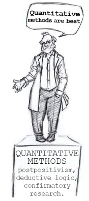

#### COM00150M Research Proposal
# **Week 4 - Methodology, Sources, and Data**

## **4.0 Table of Contents**

- [**4.0 Table of Contents**](#40-table-of-contents)
- [**4.1 Learning Objectives**](#41-learning-objectives)
- [**4.2 Summary**](#42-summary)
- [**4.3 Validity, Reliability, and Verifiability**](#43-validity-reliability-and-verifiability)
  * [**4.3.0 Reading**](#430-reading)
  * [**4.3.1 Importance of Validity, Reliability, and Verifiability**](#431-importance-of-validity-reliability-and-verifiability)
    + [**Validity**](#validity)
    + [**Reliability**](#reliability)
    + [**Verifiability**](#verifiability)
  * [**4.3.2 Quantitative Research**](#432-quantitative-research)
    + [**Experimental Design**](#experimental-design)
    + [**Non-Experimental Design**](#non-experimental-design)
    + [**Longitudinal Design**](#longitudinal-design)
  * [**4.3.3 Qualitative Research**](#433-qualitative-research)
    + [**Narrative Research**](#narrative-research)
    + [**Phenomenology**](#phenomenology)
    + [**Grounded Theory**](#grounded-theory)
    + [**Ethnographics**](#ethnographics)
    + [**Case Study**](#case-study)
  * [**4.3.4 Mixed Methods Research**](#434-mixed-methods-research)
    + [**Convergent**](#convergent)
    + [**Explanatory Sequential**](#explanatory-sequential)
    + [**Exploratory Sequential**](#exploratory-sequential)
    + [**Complex Designs**](#complex-designs)
- [**4.4 Exploring Data Collection Methods**](#44-exploring-data-collection-methods)
  * [**4.4.0 Reading**](#440-reading)
  * [**4.4.1 Collecting Qualitative Data**](#441-collecting-qualitative-data)
    + [**Interviews, Focus Groups, and Workshops**](#interviews-focus-groups-and-workshops)
    + [**Content Analysis**](#content-analysis)
    + [**Case Studies**](#case-studies)
  * [**4.4.2 Collecting Quantitative Data**](#442-collecting-quantitative-data)
    + [**Statistics**](#statistics)
    + [**Experiments**](#experiments)
    + [**Surveys**](#surveys)
- [**4.5 Different Types of Data**](#45-different-types-of-data)
  * [**4.5.0 Reading**](#450-reading)
  * [**4.5.1 Primary and Secondary Data Summary**](#451-primary-and-secondary-data-summary)
  * [**4.5.2 Issues with Secondary Data**](#452-issues-with-secondary-data)
    + [**Common Issues**](#common-issues)
    + [**Privacy and Confidentiality**](#privacy-and-confidentiality)
    + [**Educational Use**](#educational-use)
  * [**4.5.3 Content Analysis**](#453-content-analysis)
    + [**Source Criticism**](#source-criticism)
    + [**Interpretation**](#interpretation)
    + [**Future of Content Analysis**](#future-of-content-analysis)
  * [**4.5.4 Data Availability**](#454-data-availability)
- [**4.6 Expected and Unexpected Data**](#46-expected-and-unexpected-data)
  * [**4.6.0 Reading**](#460-reading)
  * [**4.6.1 Handling Unexpected Data**](#461-handling-unexpected-data)

---
&emsp;
## **4.1 Learning Objectives**

* **MLO2** - Critically evaluate the empirical and theoretical requirements of a research topic
* **MLO2** - Evaluate different methodologies and assess their suitability in relation to a research topic
* **MLO2** - Apply knowledge of research philosophy and methods to justify an appropriate approach for a specific research question
* **MLO2, MLO3** - Identify different kinds of data
* **MLO2, MLO3** - Critically evaluate the limitations and strengths of different kinds of data

---
&emsp;
## **4.2 Summary**

Good research design requires understanding the distinction between primary and secondary data, along with the potential issues surrounding secondary data usage. Similarly, it is important to appreciate the need for validity, reliability, and verifiability in research, as these elements enhance the credibility of findings. 

Content analysis is a valuable approach for interpreting important sources of secondary data, such as documents, online text, and images.

It is necessary to prepare early for data availability issues, posssibly by forming contingency plans. Pilot studies can help validate the research process ahead of employing it on a larger scale. Any changes to the research design in light of unexpected data should be handled systematically.

---
&emsp;
## **4.3 Validity, Reliability, and Verifiability**

### **4.3.0 Reading**
* *Required: Chapter 2, Projects In Computing And Information Systems: A Student's Guide, Dawson*
* *Required: Chapter 1, Research Design: Qualitative, Quantitative, and Mixed Methods Approaches, Creswell and Creswell*
* *Required: [Essential Ingredients of a Good Research
Proposal for Undergraduate and
Postgraduate Students in the Social
Sciences](https://journals.sagepub.com/doi/pdf/10.1177/2158244014548178), Abdulai and Owusu-Ansah*
* *Extension: none*

&emsp;
### **4.3.1 Importance of Validity, Reliability, and Verifiability**

The function of the **methodology** section of a proposal is to explain, in detail, how data will be generated. This allows the reader to assess whether any conclusion made will be based on **valid**, **reliable** and **verifiable** data.

These concepts are essential in both **quantitative** and **qualitative** research frameworks, although they are applied differently in each.

&emsp;
#### **Validity:**

**Validity** in research refers to the degree which a study accurately assesss the concepts the researcher is attempting to **measure**. Essentially, a valid study measures what it intends to measure.

  

This involves the application of correct procedures to find answers to the research question.
* In **quantitative** research, the validity of results may depend on various aspects, such as demonstrating efforts to establish the validity of the instrument used
* In **qualitative** research, validity is harder to attain due to subjective data. It refers to the checking the accuracy of a finding and providing arguments for the approach

Validity is important as it:
* Ensures the study accurately measures what it intends to, adding **credibility** and **depth**
* Is key to drawing accurate and meaningful **conclusions**
* Enables other researchers to **trust** and **build** upon the findings
* Prevents misinterpretation of the data and false conclusions, supporting field **integrity**

&emsp;
#### **Reliability:**

**Reliability** in research relates to the **consistency** of a research study or the measurements. It is a judgement on the quality of the specific measurement procedures, concerning accuracy and repeatability.
* If a study or method produces the same results when repeated under the same conditions, it is reliable
* This involves the replication of the study's findings across time, observers, and parts of the test itself
* In **quantitative** research, reliability corresponds to how consistent the instrument is, enabling reproducibility of outcomes
* In **qualitative** research, reliability referst to the consistency of outcomes and procedures across the wider research community

  

This is crucial it:
* Guarantees **consistency** and **precision** in the findings
* Ensures **stability** and **reproducibility** of the results
* Enhances the **credibility** of the research and fosters generalisation
* Signifies that the findings are not random or due to chance

&emsp;
#### **Verifiability:**

**Verifiability** in research refers to the ability to **check**, **authenticate**, or **confirm**, the correctness of the research findings.
* This involves ensuring a study's findings can be reproduced by others, either by data analysis or repeating the experiment
* Therefore, it is also related to transparency of research methodology and data collection
* In both **quantitative** and **qualitative**  research, verifiability reflects the ability to check accuracy of a finding using appropriate procedures

This means it is essential for:
* Upholding **transparency** and **integrity** in research
* Allowing other researchers to **replicate**, **confirm**, or **challenge** the findings
* Preventing the propagation of false or misleading information

Verifiability is a fundemental principle in scientifict research and is cruical for ensuring trust in any research findings.

&emsp;
### **4.3.2 Quantitative Research**

Three examples of quantiative methodology are explored: experimental design, non-experimental design, and longitudinal designs.

  

&emsp;
#### **Experimental Design:**

**Experimental** design is appropriate when aiming to precisely determine the role of **variables** in outcomes, typically for observational studies.
* Strengths: allows for **control** and **manipulation** of variables to observe effects
* Weakenesses: can be difficult to **isolate** variables and resutls may not reflect the complexity of the real world
* Theory is often used to **predict** the outcomes of variable manipulation
* Data is primarily from controlled observations or experiments
* Ethical considerations include **proper treatment** of subjects, especially in medical contexts

&emsp;
#### **Non-Experimental Design:**

**Non-experimental** design is appropriate for gathering information about **connections** between variables in a system, especially when an experimental approach isn't feasible.
* Strengths: can reach a **large population** and is flexible with time and place
* Weaknesses: reliance on **self reported data** with possible low response rates, also it might not be possible to draw **cause-effect conclusions**
* Theory helps **frame** the research and expected relationships
* Data is typically collected through phone calls, mail, internet, and personal interviews
* Ethical considerations include **privacy** and **informed consent**

&emsp;
#### **Longitudinal Design:**

**Longitudinal** design is appropriate to track changes over a period of **time**.
* Strengths: detects **changes** over time and allows examination of event sequences
* Weaknesses: is time consuming, costly, and possibly has a high attrition rate
* Theory helps predict the expected **patterns** or changes that occur over time
* Data is collected through repeated observations or surveys over a specified period
* Ethical considerations include maintaining **privacy** and **commitment** over extended periods

&emsp;
### **4.3.3 Qualitative Research**

Five examples of quantiative methodology are explored: narrative research, phenomenology, grounded theory, ethnographics, and case studies.

  

&emsp;
#### **Narrative Research:**

**Narrative research** is appropriate when studying individual experiences or life stories.
* Strengths: **rich** and **detailed** data from a personal perspective
* Weaknesses: time consuming and suffers from **generalisability** problems
* Theory facilitates the **interpretation** and **analysis** of narratives
* Data is collected from individual stories or life histories
* Ethical considerations include **respect** for personal experiences and **informed consent**

&emsp;
#### **Phenomenology:**

**Phenomenology** is appropriate when the aim is to understand shared experiences around a particular phenomenon.
* Strengths: provides a **deep** understanding of phenomena from participants' **perspectives**
* Weaknesses: data may be **subjective** and not **generalisable**, making interpretation difficult
* Theory helps to **interpret** and **understand** these shared experiences
* Data is collected from detailed interviews describing personal experiences
* Ethical considerations include **privacy** and **emotional safety**

&emsp;
#### **Grounded Theory:**

**Grounded theory** is appropriate when a theory needs to be developed about a process.
* Strengths: creation of new theories, **grounded** in data
* Weaknesses: time consuming, requires deep familiarity with **context** and **data**
* Theory **emerges** from the data rather than preceding it
* Data is usually collected through interviews, observations, and documents
* Ethical considerations include **privacy** and **respect** for participants' perspectives

&emsp;
#### **Ethnographics:**

**Ethnography** is appropriate for understanding specific cultural groups.
* Strengths: provides **rich** cultural insights and **deep** understanding of cultural phenomena
* Weaknesses: requires extensive fieldwork and data interpretation may be biased
* Theory **guides** the interpretation of cultural behaviour and language
* Data is collected through observation, interviews, and document review
* Ethical considerations include respect for **cultural differences** and **informed consent**

&emsp;
#### **Case Study:**

**Case studies** are appropriate when examining a specific case or context in depth.
* Strengths: **rich** and **detailed** data in a real world context
* Weaknesses: findings may not be **generalisable** and are open to reseacher **bias**
* Theory helps **frame** the case and interpret findings
* Data comes from a variety of sources, like archival records, observations, and interviews
* Ethical considerations include **privacy**, **informed consent**, and potential for **harm** to individuals or groups

&emsp;
### **4.3.4 Mixed Methods Research**

Four examples of quantiative methodology are explored: convergent, explanatory sequential, exploratory sequential, and complex designs.

  

&emsp;
#### **Convergent:**

**Convergent** design is appropriate when both types of data are needed to fully understand a research problem.
* Strengths: this combines strengths of both methods, providing more **comprehensive** data
* Weaknesses: more time consuming and complex
* Theory helps **merge** the two types of data for analysis
* Data is collected **simultaneously** from both qualitative and quantitative sources
* Ethical considerations include interpreting complex and diverse data sources **responsibly**

&emsp;
#### **Explanatory Sequential:**

**Explanatory Sequential** design is appropriate when quantitative data needs explanation with qualitative data.
* Strengths: allows **in depth** understanding of initial quantitative results
* Weaknesses: time consuming and the sequential nature may **limit** the data integration
* Theory helps interpret the results of the quantitative analysis and **guide** the subsequent qualitative phase
* Data is collected **sequentially**: first quantiatively and then qualitatively
* Ethical considerations include the accurate **interpretation** and **application** of findings

&emsp;
#### **Exploratory Sequential:**

**Exploratory sequential** design is appropriate when qualitative data can help inform subsequent quantiative data collection.
* Strengths: allows **refinement** of tools or procedures for the quantitative phase
* Weaknesses: time consuming and the initial qualitative phase may bias the quantitative
* Theory is used to guide the design and optimisation of the quantitative phase
* Data is collected **sequentially**: first qualitatively and then quantiatively
* Ethical considerations include the potential for **bias** and **informed consent**

&emsp;
#### **Complex Designs:**

**Complex** designs are appropriate when qualitative data can enhance the analysis of experimental data.
* Strengths: **enriches** conclusions and helps propose further developments
* Weaknesses: may be challenging to **integrate** and **interpret** both types of data
* Theory helps in interpreting the experimental data
* Data is primarily collected from experiments, then qualitative data is collected
* Ethical considerations include careful **analysis** and **interpretation** of the complex data

---
&emsp;
## **4.4 Exploring Data Collection Methods**

### **4.4.0 Reading**
* *Required: Chapter 2, Projects In Computing And Information Systems: A Student's Guide, Dawson*
* *Extension: none*

&emsp;
### **4.4.1 Collecting Qualitative Data**

**Qualitative methods**, including interviews, focus groups, content analysis, and case studies, aim for depth and detail. These generally involve talking to people and recording what they have to say.

  

&emsp;
#### **Interviews, Focus Groups, and Workshops:**

**Interviews** can be conducted face to face, over the phone, or electronically.
* These are frequently used alongside **questionnaires**
* Careful design is required to avoid researcher bias or leading questions

**Focus groups and workshops** are essentially group interviews and are common in marketing research.
* The key difference with interviews is **participant interaction**
* The unit of analysis is therefore both the **individual** and the **group** 

&emsp;
#### **Content Analysis:**

**Content analysis** is a tool for **classifying** and **categorising** any form of communication.
* The goal is to identify the words anc concepts that **convey** the content of the text
* Content is a broad term, and can reflect the author, culture, and time period
* Analysis can be conducted manually or through computer assistance
* Steps could include identifying word occurrence rate, composite words, association between words, and peculiar words

&emsp;
#### **Case Studies:**

**Case studies** are used to clarify or explore a limited but relevant set of events, scenarios, assumptions, or conditions.
* This can be to investigate, extend, or enforce what is known 
* **Explorative** studies tend to be a precursor to more detailed research analysis
* **Explicative** studies tend to be used in random-based research using randomised samples
* **Descriptive** studies require the development of a theory to act as a framework
* Further examples of case studies include **intrinsic**, **instrumental** and **collective** studies

&emsp;
### **4.4.2 Collecting Quantitative Data**

**Quantitative methods**, such as statistics, experiments, and surveys, provide numerical data for statistical analysis.

  

&emsp;
#### **Statistics:**

**Statistics** involves the collection, analysis, and elaboration of data.
* Quantitative research in many fields will rely on effective statistical analysis
* Analysis starts with the collection of large amounts of validated and verified data
* Following software facilitated analysis, **statistical significance** tests may be performed
* The goal is determine variable influence and test relationships

&emsp;
#### **Experiments:**

**Experiments** can be illustrated across three main areas: **participants**, **procedures**, and **measures**.
* The size and characteristics of the sample and the recruitment process must be indicated
* The research must also detail the variables involved and their manipulation methods
* Outcome measures and data analysis should be clearly reported for replication

&emsp;
#### **Surveys:**

**Surveys** are an observational research method based on asking questions.
* They can be complementary to **systematic experimental observations**
* Effective surveys require understanding of the doman and thoughtful design
* Typical stages include: problem definition, drafting of inquiry items, pondering objectives, variables, and questions, and a final reviewimage.png
* Once collected, data can be processed using **statistical programs**

---
&emsp;
## **4.5 Different Types of Data**

### **4.5.0 Reading**
* *Required: Chapter 7, Projects In Computing And Information Systems: A Student's Guide, Dawson*
* *Required: Chapter 9, Research Design: Qualitative, Quantitative, and Mixed Methods Approaches, Creswell and Creswell*
* *Required: [Data Collection, Primary vs Secondary](https://sci-hub.se/10.1016/b0-12-369398-5/00041-4), Hox and Boeije*
* *Required: [Content Analysis](https://www.researchgate.net/publication/333756046_Content_analysis), Mihailescu*
* *Extension: Chapters 8, 10, Research Design: Qualitative, Quantitative, and Mixed Methods Approaches, Creswell and Creswell*

&emsp;
### **4.5.1 Primary and Secondary Data Summary**

**Primary data** is collected by researchers specifically for their research purposes.
* Its collection method is decided by the researcher
* Similarly, the data is tailored to answer the researcher's specific research question

**Secondary data** is collected by someone other than the researcher, often for different purposes.
* This data is often applicable to new research contexts
* However, it may require additional investigation into the methods of the original collection

Secondary data is not inferior or less robust than primary research: it is a good method when the object of research is **remote** or otherwise **inaccessible**.

&emsp;
### **4.5.2 Issues with Secondary Data**

While the data collection methods covered previously resulted in primary data, secondary data can also be used in research projects. However, it is important to be aware of the potential **issues** surrounding its use.

  

&emsp;
#### **Common Issues:**

Secondary data may require additional information to evaluate its **quality** and **relevancy**. It may even be necessary to contact the original research team for further details regarding the methods and procedures used.
* These choices may impact the reusability of the data in new contexts
* Therefore, secondary researchers must ensure that the data is suitable for their research 

The **format** the data is in may require additional processing to be usable.
* Text could be available in the formats used for specific packages, such as SPSS or SAS
* Usually data is organised as a rectangular data matrix or in hierarchical or relational data structures

Similarly, secondary data has often been **cleaned** by the primary researcher based on their assumptions and interpretations.
* Any changes or recoding of raw data by the primary researcher should be acknowledged
* If the original data is available, the secondary researcher may conduct their own data cleaning
* Alternatively, a secondary round of data cleaning may be performed on the altered data set

**Qualitative data** is often overlooked as a source of secondary data, as concerns exist regarding **methodological**, **practical**, and **ethical** issues.
* There is a loss of meaning when contextual factors like tone, voice, and gestures are removed
* Related ethical issues involve the preservation of confidentiality and obtaining consent for reuse

&emsp;
#### **Privacy and Confidentiality:**

In order to preserve confidentiality, secondary data sets are sometimes **altered**.
* This could be through the addition of random numbers from a specific **statistical distribution**
* It is important to determine whether this is the case prior to using the data
* If it has been used, it should be clearly acknowledged by the secondary researcher

&emsp;
#### **Educational Use:**

In circumstances where the secondary data is too incomplete to be used, it may still be useful for teaching purposes.
* Certain data archives and organizations provide data specifically for teaching purposes, 
* These are often used as example or practice data for students

&emsp;
### **4.5.3 Content Analysis**

One of the main forms of secondary data are **documents**, which may include books, articles, and reports.
* **Content analysis** refers to the systematic evaluation of texts, images, videos etc 
* It involves examining and categorising the content derive insights or draw conclusions
* **Document analysis** focuses on the examination and interpretation of written documents
* It involves scrutiny of textual information, including themes, patterns, and biases
* Therefore, document analysis is a specific form of content analysis focusing on text
* Similarly, content analysis is a form of document analysis with a broader range of sources

As assessing academic texts has been covered during lessons on the literature review, the focus here will be on evaluating and critiquing non-academic textual sources. 

Such analysis has evolved from solely using older media, such as print and broadcast, to encompassing modern forms, such as **social media platforms** and **websites**.

As the major limitation lies in the **time consuming** nature of data collection and interpretation.

&emsp;
#### **Source Criticism:**

Once data is available, the process begins with **source criticism**: evaluating the validity and reliability of the source. 
* It is important to determine the source's credibility, bias, and intention
* This step is particularly important due to the variety and vastness of data sources available

All texts have biases and these may lead to biases in the research if not identified. Therefore, critical assessment is needed to ensure the accuracy of any subsequent interpretation.

Questions that can help in this stage include:

  

&emsp;
#### **Interpretation:**

Thorough source criticism facilitates **interpretation** of the source: what is says and how that relates to the research project.

There are two ways of reading a text, illustrated metaphorically:
* **With the grain** - interpret the text as the author intended. This includes what they say, why they are saying, and what they mean
* **Against the grain** - interpreting the text in ways not intended by the author, but which may reveal something interesting

This can also be referred to as the **witting** and **unwitting testimony** of the text, but it is important to emphasise this does not imply the author intended to hide information.

Interpreting data is helped by comprehensive understanding of the context and nature of the data at hand. 

&emsp;
#### **Future of Content Analysis:**

Content analysis is becoming increasingly important in the era of wide spread internet use.
* User generated content on social media raises concerns about information reliability 
* It is necessary for everyone to form a fact based and balanced view of current affairs
* A culture of fact checking can contribute to self regulation for content creators

&emsp;
### **4.5.4 Data Availability**

Data can be **primary**, **secondary**, or a a **mixture** of both. Similarly, it can be **quantitative** or **qualitative**.

**Availability** is a persistent problem with student projects and could take the form of texts being unavailable, lack of volunteers, or poor questionnaire responses.
* This can often be traced back to the early stages of the project
* Potential problems should be identified early in the **project initiation**
* **Contingency plans** should also be made so that a project isn't reliant on one set of data
* If no options are available, the project will require potentially large scale adjustment 

  

Therefore, it is important to **identify** and **collect** data as early as possible to avoid any unforseen issues. This also allows further data to be collected, such as more questionnaires or adding more questions.

If collected data is not as expected, it can still be valuable to discuss the reason for the difference and learn from it.

---
&emsp;
## **4.6 Expected and Unexpected Data**

### **4.6.0 Reading**
* *Required: Chapters 14, 21, Dissertations and Project Reports: A Step by Step Guide, Cottrell*
* *Extension: Chapters 15-20, Dissertations and Project Reports: A Step by Step Guide, Cottrell*

&emsp;
### **4.6.1 Handling Unexpected Data**

Once the data has been collected and is as **expected**, it needs to be **analysed** and **interpreted**. This process will differ according to the needs of the research question and the type of data being handled. 

However, it may be realised that data is not as expected either before or after processing. This is acceptable, as it can still be written about as part of the project.

There may be a possibility to alter the research design to address any factors leading to the **unexpected data** and start again. Any changes would mean the original data set should not be used for analysis, as the approach must be **systematic** throughout.

It may be worth planning to carry out a small scale **pilot study** to test the proposed methods before using them on a larger scale.