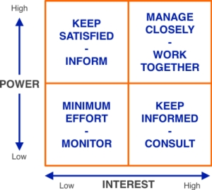
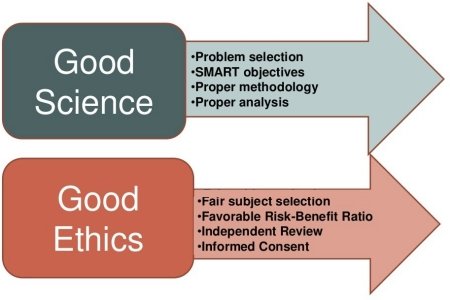
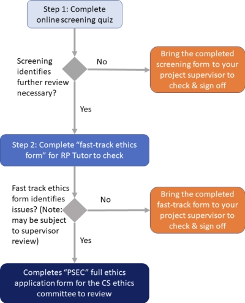

#### COM00150M Research Proposal
# **Week 5 - Research Ethics**

## **5.0 Table of Contents**

- [**5.0 Table of Contents**](#50-table-of-contents)
- [**5.1 Learning Objectives**](#51-learning-objectives)
- [**5.2 Summary**](#52-summary)
- [**5.3 Stakeholders and Ethical Practice**](#53-stakeholders-and-ethical-practice)
  * [**5.3.0 Reading**](#530-reading)
  * [**5.3.1 Types of Stakeholders**](#531-types-of-stakeholders)
    + [**Supervisors:**](#supervisors)
    + [**Clients and Users:**](#clients-and-users)
    + [**Funders:**](#funders)
    + [**Examiners:**](#examiners)
    + [**Evaluators:**](#evaluators)
  * [**5.3.2 Identifying Stakeholders and Their Influence**](#532-identifying-stakeholders-and-their-influence)
  * [**5.3.3 Ethical Practice**](#533-ethical-practice)
    + [**Methodology and Methods:**](#methodology-and-methods)
    + [**Ethical Implication:**](#ethical-implication)
    + [**Data Gathering and Data Analysis:**](#data-gathering-and-data-analysis)
    + [**Ethical Writing:**](#ethical-writing)
- [**5.4 University Ethics Framework**](#54-university-ethics-framework)
  * [**5.4.0 Reading**](#540-reading)
  * [**5.4.1 University Research Integrity**](#541-university-research-integrity)
    + [**Key Policies:**](#key-policies)
  * [**5.4.2 Ethics at Department Level**](#542-ethics-at-department-level)
    + [**Principle of Do No Harm:**](#principle-of-do-no-harm)
    + [**Principle of Informed Consent:**](#principle-of-informed-consent)
    + [**Principle of Data Confidentiality:**](#principle-of-data-confidentiality)
- [**5.5 Ethical Implications of Your Study**](#55-ethical-implications-of-your-study)
  * [**5.5.0 Reading**](#550-reading)
  * [**5.5.1 Seeking Ethical Approval**](#551-seeking-ethical-approval)
    + [**Submission Points:**](#submission-points)
  * [**5.5.2 Ethics Review Process**](#552-ethics-review-process)

---
&emsp;
## **5.1 Learning Objectives**

* **MLO5** - Develop a critical awareness of ethical norms in computer science research
* **MLO5** - Understand university ethical research protocols
* **MLO5** - Critically evaluate the ethical implications of potential research topics 
* **MLO5** - Identify ethical issues associated with a specific piece of research and attain ethical approval

---
&emsp;
## **5.2 Summary**

Stakeholders in research range from direct to indirect contributors, with varying levels of influence and interest. They must be identified and their influence assessed.

In conducting research, the university principles of no harm, informed consent, and data confidentiality are paramount. Respect for these principles ensures physical safety, legal adherence, and protects individual rights and interests. The university requires ethical clearance for all research, insisting on accountability, integrity, and transparency. 

The ethics review process has three stages and includes reflection on elements such as data handling and risk identification. Project approval comes only after successful ethics review and supervisor sign-off.

---
&emsp;
## **5.3 Stakeholders and Ethical Practice**

### **5.3.0 Reading**
* *Required: Chapter 1, Projects In Computing And Information Systems: A Student's Guide, Dawson*
* *Extension: none*

&emsp;
### **5.3.1 Types of Stakeholders**

When discussing ethics, the **stakeholders** and the influence they have over the project should be considered.
* Anyone with a vested interest in the **success** or **failure** of a project is a stakeholder
* Depending on the level of interest, they could classified as **primary**, **secondary** or **tertiary** stakeholders
* Therefore, in resesarch, this could include volunteers, supervisors, and examiners.

  

&emsp;
#### **Supervisors:**

The role of the **supervisor** is to guide and motivate the researcher through the project. 

They can provide:
* Initial **project momentum**
* Directional guidance
* Emotional support
* A strategic view of the project

&emsp;
#### **Clients and Users:**

Where a **client** sponsors a project, a **user** uses the results or the system developed from it. 

They can be the same entity. Furthermore, in some cases the supervisor may both fulfill both roles, potentially leading to **conflicts of interest**.

Generally, conflicts arise when these two groups have different expectations or requirements.

&emsp;
#### **Funders:**

**Funders** are a type of stakeholder that provide financial support.

This introduces a potential source of influence and bias:
* **Funding bias** describes a tendency for research to support the interests of the sponsor
* Studies without this type of funding often find evidence of harm or other uncomfortable results
* Assessing the level of independence and integrity is therefore crucial to properly evaluating research studies

&emsp;
#### **Examiners:**

**Examiners** assess various aspects of the project, such as methods used or the contribution made.

Institutions typically have strict procedures for examination and evaluation which must be followed.

&emsp;
#### **Evaluators:**

**Evaluators** are needed when the project involves developing a software system or prototype. 

As testing and evaluation of the software should not be done solely by the developer, evaluators are external individuals who can provide useful feedback.

&emsp;
### **5.3.2 Identifying Stakeholders and Their Influence**

The following questions can help to identify stakeholders in a research project:
* Who has a **vested interest** in your project, either directly or indirectly?
* Will anyone **benefit** from your research?  
* Will anyone be **adversely affected** by your research?
* Who directly or indirectly **supports** your research?
* Is there any **opposition** to your research?
* Is there any **conflict** between your stakeholders?
* Is there a **positive relationship** between your stakeholders?
* Who can affect your project?
* What are the **ethical implications** for your stakeholders?

&emsp;
### **5.3.3 Ethical Practice**

**Ethical considerations** are present throughout the research process. This includes phases such as planning, context setting, literature review, research design, data analysis, and presentation of findings.

  

&emsp;
#### **Methodology and Methods:**

**Research ethics** are the responsibility of everyone involved in the research process. 

Furthermore, **ethical practice** extents to all types of research, both qualitative and quantitative.
* For example, the use of secondary data sets carry ethical implications
* This could include obtaining **consent** to cover all potential uses of the data

It should be noted that research ethics may vary among cultures and communities; it is important to be clear and not to assume implicit understanding.

&emsp;
#### **Ethical Implication:**

Questions regarding the **ethical implication** of research begin as soon as the **research question** itself is formed.
* Could the results be misused by someone with a different agenda?
* Will the research make a positive difference or just advance the researcher's career?

&emsp;        
#### **Data Gathering and Data Analysis:**

Ethical **data gathering** is build upon **informed consent**, **confidentiality**, and **anonymity**.
* Confidentiality and anonymity may not always be necessary or desired by participants
* Researcher safety should also be considered

Similarly, the **data analysis** stage carries ethical concerns:
* Researchers must resist the temptation to manipulate data to create more interesting results
* Research findings must be grounded in data, not invention

&emsp;
#### **Ethical Writing:**

**Written research results** should be a fair and accurate representation of the findings.

When using **direct quotes**:
 * Care should be taken to avoid compromising the anonymity of participants
 * Quotes from a different language should be provided in both the **original** and **translated** forms

The **presentation** and **dissemination** of research findings also require consideration:
* Ethical presentation involves providing a fair representation of the research
* Researchers should seek to present their research to the participants
* If possible, findings should be disseminated as widely as is feasible

Ethical dilemmas may continue after the research has been completed, such as in the reactions of participants or participant aftercare.

---
&emsp;
## **5.4 University Ethics Framework**

### **5.4.0 Reading**
* *Required: [Research Integrity and Ethics](https://www.york.ac.uk/staff/research/governance/research-integrity-and-ethics/), University of York*
* *Required: [Departmental Guidance on the Participant Information Sheet and Informed Consent](https://docs.google.com/document/d/1Z29mLFQ1nEZsA-ouHb5zbHljq1-w9-oSjE5Y_VBEhEc/edit), University of York*
* *Required: [BCS Code of Conduct](https://www.bcs.org/membership/become-a-member/bcs-code-of-conduct/), British Computer Society*
* *Required: [ACM Code of Ethics and Professional Conduct](https://www.acm.org/code-of-ethics), Association for Computing Machinery*
* *Extension: none*

&emsp;
### **5.4.1 University Research Integrity**

The University of York expects the highest standards of any research conducted in its name and adheres to the principle of **research integrity**, meaning high quality and robust practice throughout the entire research process. 

**Research ethics**, focusing on the **avoidance of harm**, are considered a subset of research integrity.

&emsp;
#### **Key Policies:**

[Code of Practice on Research Integrity](https://www.york.ac.uk/staff/research/governance/research-policies/research-code/) - outlines the standards expected and the responsibilities for upholding these standards.
    
[Code of Practice and Principles for Good Ethical Governance](https://www.york.ac.uk/staff/research/governance/research-policies/ethics-code/) - provides principles and standards to identify and address ethical considerations.

[Research Misconduct Policy and Procedure](http://www.york.ac.uk/admin/hr/policies/hr-procedures/research-misconduct/policy/) - defines research misconduct, outlines routes for reporting concerns.

&emsp;
### **5.4.2 Ethics at Department Level**

The **Computer Science Ethics Policy** at the University of York is administered at the faculty level, specifically by the Faculty of Sciences. 

The policy is based on three basic principles: do no harm, informed consent, and data confidentiality. However, this should not be treated as an exhaustive list.

&emsp;
#### **Principle of Do No Harm:**

The principle of **do no harm** seeks to ensure the safety of all participants involved in any project. 

Participants should not be exposed to **physical danger**, **illegal activities**, or **acts against their interests**.

Note that even if studies do not involve participants, there may be **harmful effects** of the produced research.

The following areas must also be considered:
* Effects of automated data collection
* Handling of data related to sensitive topics
* Potential harm to the reputation of the university 
* Potential misuse of the research

&emsp;
#### **Principle of Informed Consent:**

The principle of **informed consent** is necessary for all projects, even those that do not involve human participants.

It involves clear explanations of the **purpose**, **expectations**, and **consequences** to participants, who must explicitly agree to the conditions and retain a right to withdraw at any point. Model [consent forms](https://onlinestudy.york.ac.uk/courses/1034/files/374774?wrap=1) and [participant information sheets](https://onlinestudy.york.ac.uk/courses/1034/files/374775?wrap=1) exist for use.

Compliance with terms and conditions for data collection tools, such as  **APIs** and **web scraping**, is necessary.

Further considerations include:
* Explicit agreement is required in advance from participants
* Consent must be obtained for recording during interviews or focus groups
* Information regarding the study and consent must be at the start of any questionnaire or survey
* Mechanisms must exist for participants to withdraw from studies

&emsp;
#### **Principle of Data Confidentiality:**

 The principle of **data confidentiality** states that all information collected regarding individuals must remain confidential.
 * Individual data should be anonymised if presented in any form
 * Data should be stored securely to prevent unauthorised access
 * Explicit permission must be obtained for identifiable representation, such as in pictures

In many cases this is achieved through treating data in a purely statistical manner.

---
&emsp;
## **5.5 Ethical Implications of Your Study**

### **5.5.0 Reading**
* *Required: Chapter 3, Projects In Computing And Information Systems: A Student's Guide, Dawson*
* *Chapters 12, Dissertations and Project Reports: A Step by Step Guide, Cottrell*
* *Extension: Chapter 4, Research Design: Qualitative, Quantitative, and Mixed Methods Approaches, Creswell and Creswell*

&emsp;
### **5.5.1 Seeking Ethical Approval**

Project approval is given by the **departmental ethics committee** upon reviewing the submitted ethics form. The **Physical Sciences Ethics Committee** will be consulted for complex ethical issues.

It is common for students to overlook the **ethical implications** of their projects. The university ethics form seeks to address this by focusing on:
* Accountability
* Integrity 
* Principles
* Values

This form must be completed by anyone conducting research at the university. It includes:
* A detailed **overview** of the project
* Any identified **ethical issues** and potential **risks**
* The handling of **data**, including informed consent, secure storage, and data removal

University documents relating to [Ethics Guidance](https://docs.google.com/document/d/1MH5Trd4SUL2osaSh_W5D8t82NifDE6q6eSi1a4OaqTU/edit?usp=sharing) and [Data Gathering](https://docs.google.com/document/d/1emsG5AXmfUJQi5HnRdtx1QvF1wMNXVJ__BPYKY50hzo/edit?usp=sharing) are available online.

Data collection through **web scraping** raises ethical concerns. Other data sources or public APIs should be used where possible.

&emsp;
#### **Submission Points:**

MSc Online students have two submission points for ethics:
* A fast track ethics **online quiz**
* A final **ethics form** with the Research Proposal module summative assessment

Decisions are made by the committee a few weeks following submission. This may require **changes** and a **resubmission** to be made.

Using the appropriate submission points, including detail, and addressing all issues and risks will help avoid unnecessary delays.

&emsp;
### **5.5.2 Ethics Review Process**

The **ethics review process** has three stages, designed to identify projects that require additional documentation or review as early as possible.
* Ethic reviews are specific to the project
* A new review is needed following any change that may affect an ethical factor

  

Note that the project is not formally approved until the **IRP Project Supervisor** signs it off at the start of the **IRP module**. 
* This is true even no issues have been identified in the project
* **Data collection** may not begin until the project has been approved