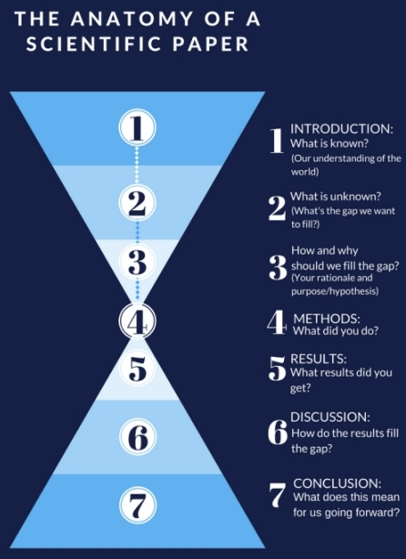

#### COM00150M Research Proposal
# **Week 6 - Writing A Research Proposal**

## **6.0 Table of Contents**

- 

---
&emsp;
## **6.1 Learning Objectives**

* **MLO1, MLO2, MLO3, MLO4, MLO5** - Critically reflect on different writing practices 
* **MLO1, MLO2, MLO3, MLO4, MLO5** - Develop an understanding of your own writing habits
* **MLO1, MLO2, MLO3, MLO4, MLO5** - Develop a proposal for a research project 

---
&emsp;
## **6.2 Summary**

---
&emsp;
## **6.3 Research Writing and Academic Support**

### **6.3.0 Reading**
* *Required: Chapter 5, Writing For Computer Science, Zobel*
* *Required: Chapters 4, Research Design: Qualitative, Quantitative, and Mixed Methods Approaches, Creswell and Creswell*
* *Extension: Chapters 6-8, Writing For Computer Science, Zobel*

&emsp;
### **6.3.1 Key Considerations for Writing Up Research**

With research data collected and analysed, the process of writing up research can begin. This requires both **reflection** and **planning**.

  

&emsp;
#### **Purpose:**

Academic writing can be considered a guided tour, with the **purpose** being to guide readers through the research completed and pass on the knowledge gained.

Presenting this tour in written form serves several purposes:
* **Knowledge dissemination** - it allows researchers to share findings and contribute to the body of knowledge in the field
* **Critical thinking** - it requires and promotes crticial thinking, as arguments need to be presented clearly and with evidence
* **Academic dialogue** - it facilitates academic dialogue and discussion, leading to refinement and development of new understanding
* **Record keeping** - it serves as a record of scientific, scholarly, or academic advancement over time

&emsp;
#### **Audience:**

The audience for academic writing can be separated into two broad groupings.

Firstly, there are the **academically** oriented audiences. This includes:
* **Peers** and **fellow researchers** -  essentially professionals in the same field who are interested in the latest research, ideas, theories, and findings
* **Students** and **academics** -  individuals studying or teaching in the field that use academic writing as a resource for education and research

Secondly, there are the **practical** audiences. This is typically made up of **policy makers** and **practitioners** who use academic writing to inform their decisions, practices, and policies.

&emsp;
#### **Ethics:**

The **ethical** considerations in academic writing include:
* **Honesty** and **integrity** - researchers should accurately report their findings, methods, and data, as misrepresentation or falsification is unethical
* **Confidentiality** - if the research involves human subjects, their confidentiality and privacy must be respected
* **Objectivity** - researchers should aim to avoid bias in their study design, data analysis, and interpretation
* **Authorship** - only those who have made a significant contribution to the research should be listed as authors

**Plagiarism** involves incorporating other work without proper citation or acknowledgement, effectively presenting it as the researchers' own. This can include: words, ideas, images, or data.

It is considered a serious **academic offense** at most, if not all, institutions.

&emsp;
#### **Different Forms:**

Academic writing can be in several different forms depending on the intentions and needs of the researcher:
* **Research papers** - detailed analysis of a specific topic or question, usually involving original research
* **Reviews** - summaries and evaluations of existing work on a specific topic, for example literature reviews, systematic reviews, and meta analyses
* **Theses** and **dissertations** - in depth research projects often required for higher level academic degrees
* **Conference papers** - presentations given at academic conferences, typically shorter and less detailed than full research papers
* **Book chapters** - sections of a larger work that focus on a specific aspect of the overall topic
* **Reports** - formal and structured documents describing the process, findings, and implications of a research project
* **Essays** - shorter pieces of writing that make an argument or analysis about a specific topic 

&emsp;
### **6.3.2 Academic Writing Support**

The university also provides several resources to support the writing process.

The [Academic Writing Guide](https://subjectguides.york.ac.uk/academic-writing) offers useful techniques and approaches for academic writing, and provides links to bookable one-to-one support sessions. 

Within this guide, the [Structuring A Response](https://subjectguides.york.ac.uk/academic-writing/structure) section provides specific information regarding the writing of introductions, paragraphs, and conclusions.

There is also a more general guide to [Planning Academic Writing Projects](https://subjectguides.york.ac.uk/skills/planning), which mostly relates to essay writing but still contains useful guidance. 

---
&emsp;
## **6.4 Writing Practices**

### **6.4.0 Reading**
* *Required: Chapters 22-24, Dissertations and Project Reports: A Step by Step Guide, Cottrell*
* *Extension: Chapter 8, Projects In Computing And Information Systems: A Student's Guide, Dawson*

&emsp;
### **6.4.1 Reflection on Own Writing Practices**

&emsp;
### **6.4.2 Writing Style**