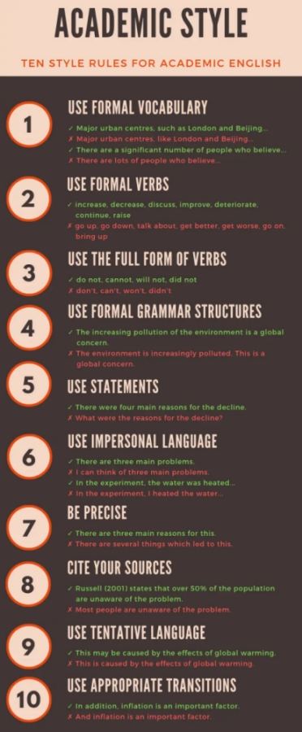
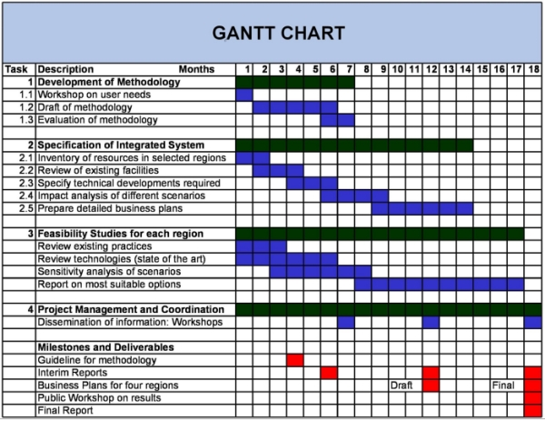
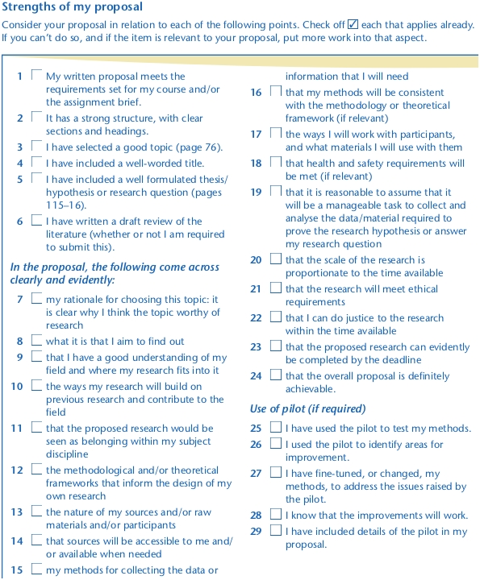

#### COM00150M Research Proposal
# **Week 6 - Writing A Research Proposal**

## **6.0 Table of Contents**

- [**6.0 Table of Contents**](#60-table-of-contents)
- [**6.1 Learning Objectives**](#61-learning-objectives)
- [**6.2 Summary**](#62-summary)
- [**6.3 Research Writing and Academic Support**](#63-research-writing-and-academic-support)
  * [**6.3.0 Reading**](#630-reading)
  * [**6.3.1 Key Considerations for Writing Up Research**](#631-key-considerations-for-writing-up-research)
    + [**Purpose**](#purpose)
    + [**Audience**](#audience)
    + [**Ethics**](#ethics)
    + [**Different Forms**](#different-forms)
  * [**6.3.2 Academic Writing Support**](#632-academic-writing-support)
- [**6.4 Writing Practices**](#64-writing-practices)
  * [**6.4.0 Reading**](#640-reading)
  * [**6.4.1 Guidance on Style**](#641-guidance-on-style)
    + [**Drafts and Revisions**](#drafts-and-revisions)
- [**6.5 How to Write a Research Proposal**](#65-how-to-write-a-research-proposal)
  * [**6.5.0 Reading**](#650-reading)
  * [**6.5.1 Developing a Proposal**](#651-developing-a-proposal)
    + [**Formulating the Thesis Statement**](#formulating-the-thesis-statement)
    + [**Formulating the Hypothesis**](#formulating-the-hypothesis)
    + [**Practical Aspects**](#practical-aspects)
    + [**General Wording**](#general-wording)
  * [**6.5.2 Evaluating a Proposal**](#652-evaluating-a-proposal)

---
&emsp;
## **6.1 Learning Objectives**

* **MLO1, MLO2, MLO3, MLO4, MLO5** - Critically reflect on different writing practices 
* **MLO1, MLO2, MLO3, MLO4, MLO5** - Develop an understanding of your own writing habits
* **MLO1, MLO2, MLO3, MLO4, MLO5** - Develop a proposal for a research project 

---
&emsp;
## **6.2 Summary**

Research writing requires careful consideration of purpose, audience, forms, and ethics. To aid this, the university provides various methods of support for the academic writing process.

Clarity and simplicity of writing is essential to ensure clear communication. This should be something explicitly checked for when redrafting and revising work.

When developing a research proposal, strong thesis statements, justified hypotheses, clear research methods, and detailed project plans are needed. Checklists exist to help ensure the quality of drafts and proposals.

---
&emsp;
## **6.3 Research Writing and Academic Support**

### **6.3.0 Reading**
* *Required: Chapter 5, Writing For Computer Science, Zobel*
* *Required: Chapters 4, Research Design: Qualitative, Quantitative, and Mixed Methods Approaches, Creswell and Creswell*
* *Extension: Chapters 6-8, Writing For Computer Science, Zobel*

&emsp;
### **6.3.1 Key Considerations for Writing Up Research**

With research data collected and analysed, the process of writing up research can begin. This requires both **reflection** and **planning**.

  

&emsp;
#### **Purpose:**

Academic writing can be considered a guided tour, with the **purpose** being to guide readers through the research completed and pass on the knowledge gained.

Presenting this tour in written form serves several purposes:
* **Knowledge dissemination** - it allows researchers to share findings and contribute to the body of knowledge in the field
* **Critical thinking** - it requires and promotes crticial thinking, as arguments need to be presented clearly and with evidence
* **Academic dialogue** - it facilitates academic dialogue and discussion, leading to refinement and development of new understanding
* **Record keeping** - it serves as a record of scientific, scholarly, or academic advancement over time

&emsp;
#### **Audience:**

The audience for academic writing can be separated into two broad groupings.

Firstly, there are the **academically** oriented audiences. This includes:
* **Peers** and **fellow researchers** -  essentially professionals in the same field who are interested in the latest research, ideas, theories, and findings
* **Students** and **academics** -  individuals studying or teaching in the field that use academic writing as a resource for education and research

Secondly, there are the **practical** audiences. This is typically made up of **policy makers** and **practitioners** who use academic writing to inform their decisions, practices, and policies.

&emsp;
#### **Ethics:**

The **ethical** considerations in academic writing include:
* **Honesty** and **integrity** - researchers should accurately report their findings, methods, and data, as misrepresentation or falsification is unethical
* **Confidentiality** - if the research involves human subjects, their confidentiality and privacy must be respected
* **Objectivity** - researchers should aim to avoid bias in their study design, data analysis, and interpretation
* **Authorship** - only those who have made a significant contribution to the research should be listed as authors

**Plagiarism** involves incorporating other work without proper citation or acknowledgement, effectively presenting it as the researchers' own. This can include: words, ideas, images, or data.

It is considered a serious **academic offense** at most, if not all, institutions.

&emsp;
#### **Different Forms:**

Academic writing can be in several different forms depending on the intentions and needs of the researcher:
* **Research papers** - detailed analysis of a specific topic or question, usually involving original research
* **Reviews** - summaries and evaluations of existing work on a specific topic, for example literature reviews, systematic reviews, and meta analyses
* **Theses** and **dissertations** - in depth research projects often required for higher level academic degrees
* **Conference papers** - presentations given at academic conferences, typically shorter and less detailed than full research papers
* **Book chapters** - sections of a larger work that focus on a specific aspect of the overall topic
* **Reports** - formal and structured documents describing the process, findings, and implications of a research project
* **Essays** - shorter pieces of writing that make an argument or analysis about a specific topic 

&emsp;
### **6.3.2 Academic Writing Support**

The university also provides several resources to support the writing process.

The [Academic Writing Guide](https://subjectguides.york.ac.uk/academic-writing) offers useful techniques and approaches for academic writing, and provides links to bookable one-to-one **support sessions**. 

Within this guide, the [Structuring A Response](https://subjectguides.york.ac.uk/academic-writing/structure) section provides specific information regarding the writing of **introductions**, **paragraphs**, and **conclusions**.

There is also a more general guide to [Planning Academic Writing Projects](https://subjectguides.york.ac.uk/skills/planning), which mostly relates to **essay writing** but still contains useful guidance. 

---
&emsp;
## **6.4 Writing Practices**

### **6.4.0 Reading**
* *Required: Chapters 22-24, Dissertations and Project Reports: A Step by Step Guide, Cottrell*
* *Extension: Chapter 8, Projects In Computing And Information Systems: A Student's Guide, Dawson*

&emsp;
### **6.4.1 Guidance on Style**

Simple, clear grammar should be used to avoid obscuring meaning. The aim is to **communicate**, not obfuscate. This can be aided by:
* Avoiding **slang**, **jargon**, **abbreviations** and needlessly **complex words**
* Using **third person** to maintain a professional tone
* Staying in the **past tense**, although present tense can be used when referring to the work of others
* Keeping **sentences** short and avoiding making several points in a single sentence

**Gender netural language** should be used where possible.

**Beginnings**, **middles**, and **ends** should be identifiable in paragraphs, chapters, and the overall text.

Care should be taken using automated **spelling** and **grammar checking** tools, as corrections to American spellings and the alteration of well constructed sentences can occur.

Ten useful style rules are presented below:

  

&emsp;
#### **Drafts and Revisions:**

Adequate time should be left between the first and submission drafts to critically reflect and improve what has been written.

**Revising** a draft could include:
* Checking for clarity of writing, potentially making sentences clearer by simplifying them
* Removing sentences that do not contribute to the section or overall text
* Ensuring referencing is accurate
* Adding information if anything is clearly missing or it helps communicate ideas

---
&emsp;
## **6.5 How to Write a Research Proposal**

### **6.5.0 Reading**
* *Required: Chapters 13, Dissertations and Project Reports: A Step by Step Guide, Cottrell*
* *Extension: Chapter 3, Projects In Computing And Information Systems: A Student's Guide, Dawson*

&emsp;
### **6.5.1 Developing a Proposal**

Before beginning, it is crucial that the researcher has good **knowledge** of the topic underpinned by extensive **background reading**.

The **purpose** of the research project and the **questions** to be addressed should both be clearly stated. Similarly, the **type** of project being proposed, such as research, development,or evaluation, should be stated to set expectations.

Anticipate logical questions or issues a supervisor or approval panel may have, and attempt to answer these within the proposal.

&emsp;
#### **Formulating the Thesis Statement:**

The **thesis statement** should fit the assignment brief and:
* Be short, precise, and clearly worded
* Show a clear stance on the issue
* Allow for the development of a strong line of reasoning
* Match the anticipated conclusions of the report

&emsp;
#### **Formulating the Hypothesis:**

A hypothesis can be considered a **best guess** as to what will happen in relation to the research question and for what reasons. Although these tentative answers can't be proven at this stage, the reasoning should be strongly supported by evidence.

The hypothesis serves as the **focus** for the research and as a **spine** for the written report.

Note that it is acceptable if the research findings do no support the hypothesis: it still contributes to wider knowledge of the topic.

&emsp;
#### **Practical Aspects:**

It is crucial to clearly define the intended **research methods**. This should be a detailed explanation of the methods that will actually be used, not the ones being considered or investigated.

Additionally, a detailed **project plan** is needed. This helps illustrate that the project is achievable in the allotted time and that there is an established path. Visual representations, like a **Gantt chart**, can be beneficial.

  

&emsp;
#### **General Wording:**

The proposal should be written using **verbs** that express action, for example explore, interview, analyse.

It is important that there is no room for doubt regarding the purpose of the research project: avoid **hesitancy** and **vagueness**.

An objective approach is supported by use of the **passive voice** or writing in the **third person**.

&emsp;
### **6.5.2 Evaluating a Proposal**

Always proofread the proposal thoroughly, checking for spelling mistakes, grammatical errors, and omissions. The overall text should be well presented with a logical flow.

Cottrell provides a useful **checklist** to help evaluate a draft research proposal:

  

