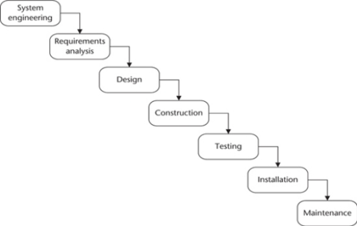
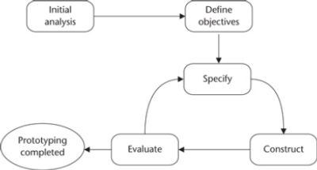
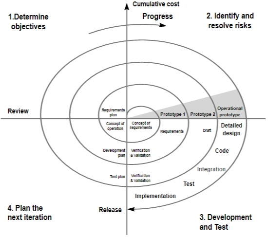
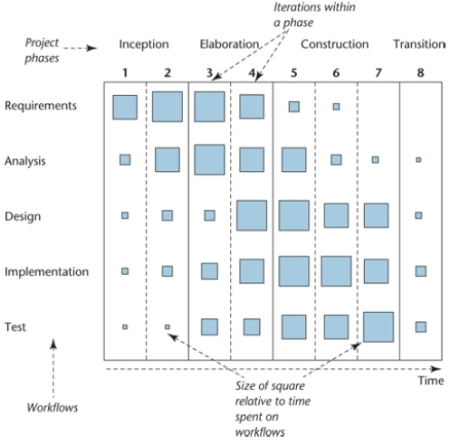
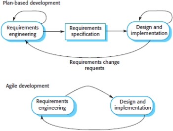
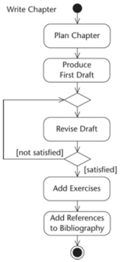
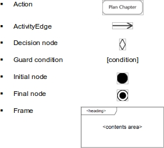

#### COM00144M Software Engineering
# **Week 1 - Software Development Process and Models**

## **1.0 Table of Contents**

- [**1.0 Table of Contents**](#10-table-of-contents)
- [**1.1 Learning Objectives**](#11-learning-objectives)
- [**1.2 Summary**](#12-summary)
- [**1.3 What Is Software Engineering?**](#13-what-is-software-engineering)
  * [**1.3.0 Reading**](#130-reading)
  * [**1.3.1 Programming Versus Engineering**](#131-programming-versus-engineering)
  * [**1.3.2 Project Lifecycles**](#132-project-lifecycles)
    + [**Waterfall**](#waterfall)
    + [**Incremental**](#incremental)
    + [**Prototyping**](#prototyping)
    + [**Spiral**](#spiral)
  * [**1.3.3 Methodological Approaches**](#133-methodological-approaches)
    + [**Unified Process**](#unified-process)
- [**1.4 Agile Development**](#14-agile-development)
  * [**1.4.0 Reading**](#140-reading)
  * [**1.4.1 Plan Versus Agile Approaches**](#141-plan-versus-agile-approaches)
    + [**Differences**](#differences)
  * [**1.4.2 Agile Core Values**](#142-agile-core-values)
  * [**1.4.3 Agile Techniques**](#143-agile-techniques)
    + [**User Stories**](#user-stories)
    + [**Refactoring**](#refactoring)
    + [**Test First**](#test-first)
    + [**Pair Programming**](#pair-programming)
  * [**1.4.4 Agile Practical Problems**](#144-agile-practical-problems)
- [**1.5 Software Models in UML**](#15-software-models-in-uml)
  * [**1.5.0 Reading**](#150-reading)
  * [**1.5.1 Models and Diagrams**](#151-models-and-diagrams)
    + [**Models**](#models)
    + [**Diagrams**](#diagrams)
    + [**Activity Diagrams**](#activity-diagrams)
  * [**1.5.2 Development Process**](#152-development-process)
    + [**USDP**](#usdp)

---
&emsp;
## **1.1 Learning Objectives**

* **MLO1, MLO2** - Understand and apply software process models in a given context
* **MLO1** - Distinguish and explain details in UML models and diagrams

---
&emsp;
## **1.2 Summary**

Software engineering is broader than software programming: it includes documentation, modelling, and teamwork.

Multiple lifecycle models exist, with the most important including the waterfall, incremental, spiral, unified process, prototyping and agile development. 

Unified Modelling Language can be used to express software models and can be quickly constructed using online tools such as Visual Paradigm.

---
&emsp;
## **1.3 What Is Software Engineering?**

### **1.3.0 Reading**
* *Required: Chapter 3, Object Oriented Systems Analysis And Design, Bennett*
* *Extension: [Software Development Process](en.wikipedia.org/wiki/Software_development_process), Wikipedia*

&emsp;
### **1.3.1 Programming Versus Engineering**

**Software** is not the same as a computer **program**. It includes the program but also documentation such as a requirement model, design model, test specification, user manual, and maintenance manual.

Equally, software **engineering** is not the same as **programming**. It is a discipline that includes all aspects of software production and aims to develop high quality software in a systematic manner.

&emsp;
### **1.3.2 Project Lifecycles**

A systematic approach is appropriate when developing information systems, loosely divided into three main tasks: **understanding** the problem, **designing** the solution, and **building** the solution.

Dividing development into increasingly smaller tasks facilitates project and budget management.

&emsp;
#### **Waterfall:**

In a **waterfall lifecycle**, each step is finished to completion before progressing:
* Note that retirement or decommissioning are omitted 
* Each phase passes one or more documents to the next for clear communication

  

The waterfall lifecycle has been used for many years and is appropriate in certain situations:
* Projects where the requirements are **stable** and unlikely to change during the process
* Where there is less need for user involvement 
* Prototypes or incremental updates are not intended to be delivered 

However, it also has criticisms and shortcomings:
* Some tasks will inevitably need to be repeated due to discoveries during design 
* Time lapse between steps may mean output does not match current requirements
* It is **unresponsive** to changes, developments, and new technology

&emsp;
#### **Incremental:**

An **incremental** approach is made up of a series of development activities that are repeated: each new repetition is an **iteration**, successively producing better or more complete outputs.

Analysis of the problem identifies major requirements, with those delivering most benefit to the client prioritised in the first increment of development.

This approach can be useful where:
* The initial requirements are established but the whole project is not
* Staff availability is inconsistent across the whole project
* There is a need to quickly respond to a business issue

However, disadvantages also exist:
* It requires lots of involvement from the customer
* When to stop iterating is not necessarily clear

&emsp;
#### **Prototyping:**

The **prototype** approach helps users visualise how their requirements will become a working system. 

It is a system, or partially complete system, built to **explore** or **test** some aspect of the requirements. It is:
* Less resilient than a completed system
* Discarded when it has fulfilled its objectives
* Lacking in functionality
* Limited in its data processing capacity
* Poor performing

The prototype lifecycle can be represented through the following model:
* **Initial analysis** – determine general requirements of the system
* **Define objectives** – establish a success criteria to decide if the process should continue 
* **Specify** – incorporate good design practises relevant to type of operation
* **Construct** – a rapid development environment is appropriate
* **Evaluate** – compare to objectives and specify modifications for the next design cycle

  

Prototyping has the following advantages:
* Early demonstration of functionality alleviates any misunderstandings
* Requirements that are missing can be identified
* Difficulties can be addressed
* Feasibility of the system can be tested

However, there are some known problems:
* Incorrect perception of the prototype by the client
* Interface issues may draw focus and resources from functional issues
* It requires significant **user involvement**, which may not be available
* Managing the lifecycle requires careful, informed decision making

&emsp;
#### **Spiral:**

The **spiral** approach enables a gradual **release** and **refinement** of a product through an iterative approach:
* The focus is on minimising project risk by breaking a project into smaller segments
* Each trip around the spiral traverses four quadrants, beginning with the success criteria

  

This approach has several advantages:
* Changes to requirements can be accommodated
* **Risk** is constantly considered, reducing chances of failure 
* A client can see and evaluate the product as it is built up

However, disadvantages include:
* Potentially high cost and therefore not suitable for every project
* Due to the unknown number of loops, time management is difficult 
* The **end point** of a project can be hard to define

&emsp;
### **1.3.3 Methodological Approaches**

A methodology is made up of an approach to software development, a set of techniques and notations, a lifecycle model to structure the process, and a set of procedures and philosophy.

&emsp;
#### **Unified Process:**

The **Unified Software Development Process** (USDP) is a result of efforts to produce a single common methodological approach for object orientated software development. 

USDP incorporates the **Unified Modelling Language** (UML).

The development cycle for USDP can be exemplified through the following model:
* **Inception** – concerns the scope and purpose of the project
* **Elaboration** – focuses on requirements and structure of the system
* **Construction** – construct the software system
* **Transition** – involves product installation and rollout
* Note that the number of iterations within each phase can vary between projects

  

This approach combines many **best practises**:
* Iterative approach
* Visual modelling software such as UML
* Verifies software quality as testing is part of the development process

---
&emsp;
## **1.4 Agile Development**

### **1.4.0 Reading**
* *Required: Chapter 3, Software Engineering, Sommerville*
* *Extension: none*

&emsp;
### **1.4.1 Plan Versus Agile Approaches**

**Plan driven software development processes** are not suited to the dynamic and rapid software development demands of modern businesses: by the time it is completed, the environment has changed.

The high planning cost is suitable for large, dispersed teams, but dominates the focus of smaller teams.

They remain appropriate in safety critical systems, where a complete analysis of the system is required.

Rapid software development became known as **agile development**, which aims to producing useful software quickly. Examples of the method include E**xtreme Programming**, **Scrum**, and **DSDM**.

All agile methodologies share common **characteristics**:
* Specification, design, and implementation are **interleaved** – no detailed specification, documentation is minimised, user requirement document outlines the important parts
* The system is developed in **increments** – end users and stakeholders informally review at each increment, with small increments released every 2-3 weeks
* Development process is aided by **tools** – examples include automated testing tools, tools to support confirmation management, tools to automate user interface production

&emsp;
#### **Differences:**

There are essential distinctions between plan based and agile development processes:
* **Plan based approaches** see iteration occurring within activities, with formal documents used to communicate between stages
* **Agile approaches** see iteration occur across activities, meaning requirements and design are developed together not separately

  

An agile approach is not code focused: developers may decide that an iteration may produce models and documentation instead of new code.

&emsp;
### **1.4.2 Agile Core Values**

**Agile methods** are most suited to development where the system requirements usually change rapidly. 

They deliver working software quickly, which can be revised and adjusted in later iterations.

The agile manifesto reflects the **core values**, preferring:
* Individuals and interactions over processes and tools
* Working software over comprehensive documentation
* Customer collaboration over contract negotiation
* Responding to change over following a plan

Therefore, agile methods are most successful where there can be continuous **informal communication**.

&emsp;
### **1.4.3 Agile Techniques**

Extreme programming introduced a set of **development techniques** which the agile community adopted.

&emsp;
#### **User Stories:**

**User stories** are presented as story cards which detail scenarios that may be experienced by a system user. The customer prioritises the stories for implementation with a target of about two weeks.

Stories are typically no more than **three sentences** long, written by the customer, and can be edited or deleted. If the story requires more than 3 development weeks, it needs to be broken down further.

**Completeness** is a problem: it is difficult to judge if enough user stories have been created to cover all the essential requirements of the system or whether a single story gives a true picture of the activity.

&emsp;
#### **Refactoring:**

Attempt to **generalise** code to deal with future changes is viewed as futile.

Instead, code should constantly be **refactored**: possible improvements should be constantly identified and implemented promptly. If code is unable to be improved, generalisation can occur.

However, local changes affect the software as a whole: more changes mean future changes are increasingly harder to implement. Workarounds and inappropriate reuse of code degrades the system.

Refactoring aims to reduce this by including **reorganisation**, **tidying**, **renaming**, and **replacement** as activities.

&emsp;
#### **Test First:**

In **test first development**, testing is central to the development process and development cannot proceed until all tests have been passed. 

Tests are usually written before the code, allowing the code to be properly tested as it is being written. 

Potential problems exist around the completeness of tests:
* Staff prefer programming to tests, resulting in shortcuts and incomplete tests
* Some tests can be difficult to write incrementally

&emsp;
#### **Pair Programming:**

In **pair programming**, programmers work in pairs to develop software and dynamically change as needed.

This approach means:
* Collective ownership and responsibility are promoted: egoless programming
* Code is constantly reviewed by two people, reducing errors
* Encourages refactoring, as code must be clear to both, and therefore improvement

&emsp;
### **1.4.4 Agile Practical Problems**

**Practical problems** with an agile approach commonly occur in the development of larger, long-life systems:
* Informality of agile development is incompatible with legal contract definitions. Agile development is better suited to contracts based on development time not requirements
* In larger companies, resources are spent maintaining systems not creating new ones. The lack of focus on formal documentation affects assessment of any proposed changes
* Distributed teams are increasingly common. Communication and problem solving is inherently better when teams are located together. 

---
&emsp;
## **1.5 Software Models in UML**

### **1.5.0 Reading**
* *Required: Chapter 5, Object Oriented Systems Analysis And Design, Bennett*
* *Extension: none*

&emsp;
### **1.5.1 Models and Diagrams**

**Software development** is a complex activity, and it is difficult to hold all the details in one person’s memory. Models and diagrams therefore benefit both individual and teams of developers.

The general approaches to expressing software are:
* English – expressive but ambiguous
* Mathematics – Accurate but often scares those involved
* Graphical – combines strengths of language with rigor of maths 

&emsp;
#### **Models:**

A **model** is an **abstract** representation of something: some details are included, some ignored. They are:
* Quick and easy to build
* Used in simulations to learn more
* Able to evolve as more is learnt
* Able to represent real or imaginary things from any domain

A good model has just enough detail and structure as is relevant to the current task, which can change.

&emsp;
#### **Diagrams:**

A **diagram** is a **graphic** view of part of a model for set purpose. Commonly confused with models, they:
* Communicate ideas
* Generate new ideas
* Test ideas and make predictions
* Understand structure and relationships

A simple system may be a model with a single annotated diagram, but most require multiple.

UML diagrams can be classified as:
* **Structure diagrams**, eg class, object, component, package, deployment
* **Behaviour diagrams**, eg use case, activity, state machine
* **Interaction diagrams**, eg sequential, communication
* **Object Constraint Language** (OCL) for expressions

&emsp;
#### **Activity Diagrams:**

An **activity diagram** is essentially a flow chart of activities in an object orientated context:
* This example could be considered an expansion of part of a larger ‘write book’ diagram
* Unnecessary activities, such as turning on the computer, have been abstracted away

  

UML documentation can be found [here](https://www.omg.org/spec/UML/). Pertinent **UML notations** include:

  

&emsp;
### **1.5.2 Development Process**
 
A development process should specify what must be done, when, how, and by whom 

The **Unified Software Development Process** (USDP) was developed by the team that created UML and embodies many of the accepted best practices in the industry. It is often referred to as Unified Process.

&emsp;
#### **USDP:**

Unlike in a waterfall lifecycle where activities and phases are the same, in USDP activities are **independent** of phases: the mix of activities being performed change as the project proceeds.
* It employs an iterative approach across four main phases
* Each workflow defines a series of activities to be performed

  

The main activities of the development process are:
* Requirements capture and modelling
* Requirements analysis
* System architecture and design
* Class design
* Interface design
* Data management design
* Construction 
* Testing
* Implementation 