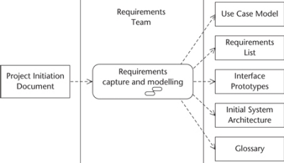
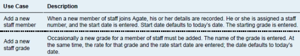

#### COM00144M Software Engineering
# **Week 2 - Requirement Capture and Use Case Modelling**

## **2.0 Table of Contents**

- [**2.0 Table of Contents**](#20-table-of-contents)
- [**2.1 Learning Objectives**](#21-learning-objectives)
- [**2.2 Summary**](#22-summary)
- [**2.3 Requirement Capture**](#23-requirement-capture)
  * [**2.3.0 Reading**](#230-reading)
  * [**2.3.1 Requirement Types**](#231-requirement-types)
  * [**2.3.2 Fact Finding Techniques**](#232-fact-finding-techniques)
    + [**Background Reading**](#background-reading)
    + [**Interviews**](#interviews)
    + [**Observations**](#observations)
    + [**Document Sampling**](#document-sampling)
    + [**Questionnaires**](#questionnaires)
- [**2.4 Use Case Model**](#24-use-case-model)
  * [**2.4.0 Reading**](#240-reading)
  * [**2.4.1 Use Case Models**](#241-use-case-models)
    + [**Use Case Diagram**](#use-case-diagram)
    + [**Use Case Description**](#use-case-description)
    + [**Prototypes**](#prototypes)
- [**2.5 Use Case Modelling**](#25-use-case-modelling)
  * [**2.5.0 Reading**](#250-reading)
  * [**2.5.1 Working With Requirements**](#251-working-with-requirements)
    + [**Documents**](#documents)
    + [**Requirement List**](#requirement-list)
    + [**Actors**](#actors)
    + [**Use Cases**](#use-cases)
    + [**Initial Architecture**](#initial-architecture)

---
&emsp;
## **2.1 Learning Objectives**

* **MLO1** - Apply appropriate requirement elicitation techniques
* **MLO1** - Create appropriately detailed use case models

---
&emsp;
## **2.2 Summary**

Requirement engineering is a difficult task and as there are many requirement capturing approaches, it is important to recognise when each are appropriate. The system analyst’s role in the process is aided by a high degree of interpersonal skills.

Use cases are tools to communicate with customers and ensure the system satisfies user needs. They typically contain use case diagrams, use case descriptions, and prototypes. 

Use case modelling is an iterative process and is good for modelling functional requirements.

---
&emsp;
## **2.3 Requirement Capture**

### **2.3.0 Reading**
* *Required: Chapter 6, Object Oriented Systems Analysis And Design, Bennett*
* *Extension: none*

&emsp;
### **2.3.1 Requirement Types**

The aim of developing a new system is to produce something that meets the **needs** of people that will use it.

**Functional requirements** describe what a system does or is expected to do:
* Descriptions of the **processing** the system will need to do
* Details of the **inputs** ranging from paper forms to interactions such as phone calls
* Details of the expected **outputs**, such as printed reports and data transfers 
* Details of **data** that must be held in the system

**Non-functional requirements** describe parts concerned with how well it provides functional requirements:
* Performance criteria such as desired **response times** for updating data
* Ability of the system to cope with high levels of **simultaneous** users
* **Availability** of the system and minimal downtime
* Time taken to **recover** from system failure
* Anticipated **data volume** such as transactional or stored
* **Security** considerations such as resistance to attacks

&emsp;
### **2.3.2 Fact Finding Techniques**

**Stakeholders** describe all the people who have an interest in the successful development of a project: such as managers, department leaders, budget-holders, users, and IT staff delivering the project.

There are five **fact-finding techniques** used by analysts to investigate requirements:
* Background reading
* Interviewing
* Observation
* Document sampling
* Questionnaires
* **SQIRO** (samples, questionnaires, interviews, reading, observation) can aid recall

&emsp;
#### **Background Reading:**

An outside analyst will need to develop an **understanding** of the organisation through various sources: 
* Company reports
* Organisation charts
* Policy manuals
* Job descriptions
* Reports
* Documents of existing systems

**Advantages** include:
* Provides understanding prior to meeting staff
* Properly prepares for the following fact-finding steps
* Existing system documentation may aid in defining requirements for the new system

**Disadvantages** include:
* Written documents may not accurately reflect company culture or practices

This approach is most appropriate for projects where the analyst is not familiar with the organisation.

&emsp;
#### **Interviews:**

**Interviews** are used to gather information about **objectives**, information **needs**, and potential **users**.

**Advantages** include:
* Personal contact allows an analyst to respond and adapt to information given
* Potentially provides greater information depth
* Process can be terminated if there is nothing more to say

**Disadvantages** include:
* Interviewing is time consuming 
* Additional work is required after an interview, transcribing or typing notes
* The interview can be affected by bias on either side
* Conflicting information across interviews can be difficult to resolve afterwards

This approach is appropriate in most projects and can provide depth of understanding.

&emsp;
#### **Observations:**

**Observation** can help capture information that would not emerge from interviews. People are not good at estimating **quantitative** data about their tasks or accurately judging time spent on them.

**Advantages** include:
* Provides first hand experience of current system usage
* Real time data can be collected with high validity
* Can verify other sources of information or look for exceptions
* Baseline data can be collected regarding system performance

**Disadvantages** include
* Most people do not welcome observation and change their behaviour
* Requires skilled observers to be most effective
* Logistical problems may exist
* Ethical problems may also exist, for example in a doctor’s surgery

This approach is essential for gathering data about behaviours and aid in resolving conflicting information.

&emsp;
#### **Document Sampling:**

Document sampling helps determine the **inputs** and **outputs** of processes within the organisation, and allowing **statistical analysis** of data resulting in patterns, volume of data, and storage needs being identified.

**Advantages** include:
* Provides useful quantitative data
* Can be used to identify error rates in paper documents

**Disadvantages** include:
* Existing documents may not reflect how the new system will be used in the future

Sampling leading to inputs and outputs is always appropriate. However, statistical analysis is appropriate where large volumes of data are being processed or there is a need to reduce error rates.

&emsp;
#### **Questionnaires:**

**Questionnaires** are wide-reaching and gather large volumes of **subjective** and **objective** facts.

**Advantages** include:
* An economical way to gather data from large amounts of people
* Good design can facilitate results being analysed by a computer

**Disadvantages** include:
* Good questionnaires are hard to develop
* Probing deeper into answers is difficult
* Postal questionnaires suffer from low response rates

They are appropriate when lots of **views** are sought, staff are **physically dispersed**, or involving the **public**.

A questionnaire should:
* Have a meaningful title
* Clearly show who produced it
* Give clear instructions as to how to complete
* Clearly state who it is intended for
* Provide return instructions
* Clearly state the deadline for responses
* Thank the respondent for their time
* State the objective of the survey
* A sizeable comments box for any other comments
* Use closed questions with no more than five choices
* Provide enough space for open ended questions
* Ambiguity free questions
* Show no bias in explanatory comments
* Not overuse open ended questions
* Group questions by subject

Further guidance is available from Bennett. Some sample question structures are shown below:

  

---
&emsp;
## **2.4 Use Case Model**

### **2.4.0 Reading**
* *Required: Chapter 6, Object Oriented Systems Analysis And Design, Bennett*
* *Extension: none*

&emsp;
### **2.4.1 Use Case Models**

Requirements elicited need to be transformed into a **UML case model**, which could involve: **use case diagrams**, **use case descriptions**, and **prototypes**.

&emsp;
#### **Use Case Diagram:**

A **use case diagram** shows three aspects: **actors**, **use cases**, and the **system boundary**:
* A use case describes the functionality of the system from the user’s perspective
* Actors represent the roles taken on while communicating with the use cases 

  

**Use case names** should be short, active verb phrases.

&emsp;
#### **Use Case Description:**

The **use case description** explains the intended action to be taken and can be detailed in two forms:
* A simple **summary** as shown above
* A step-by-step **breakdown** of the interaction as below:

  

Each use case description represents the generic way the actor goes through the function from start to finish. **Scenarios** are possible alternate routes, specific routes worked out in detail.

Two forms of use case exist. They usually begin as essential during system design:
* **Essential use cases** describe the abstract action, free of technological detail
* **Real use cases** describe the concrete detail of the use case in terms of its design

Use cases can have **relationships** added through keywords in **guillemets**. They should not be overused:
* **<<extend>>** adds additional, optional functionality to a use case, calling the behaviour of another use case subject to conditions. It must be meaningful on its own
* **<<include>>** allows repeat behaviour to be separated and reused, rather than repeatedly needing to add the same description of it into each use case
* **Generalisation** of actors allows actors to have their designated use cases, but also inherit those of another. This is simply shown with an arrow.

  

&emsp;
#### **Prototypes:**

Prototypes do not need to be developed as programs: screen design and steps can be sketched out in a **prototype storyboard** and shown to a user:

  

---
&emsp;
## **2.5 Use Case Modelling**

### **2.5.0 Reading**
* *Required: Chapters 6, A2, Object Oriented Systems Analysis And Design, Bennett*
* *Extension: none*

&emsp;
### **2.5.1 Working With Requirements**

The process for developing the use cases from the elicited requirements is called **use case modelling**.

&emsp;
#### **Documents:**

Eliciting requirements of the system can **output** several possible documents:
* Use case model
* Requirements list
* Interface prototypes
* Initial system architecture
* Glossary

  

Requirements are built up over iterations. They are prioritised by **MoSCoW**: **must**, **should**, **could**, **want**. 

As use cases focus on functionality, they are **not suitable** for documenting non-functional requirements. 

&emsp;
#### **Requirement List:**

A separate **list of requirements** should be kept, listing both functional and non-functional requirements: 
* Non-functional requirements won’t have use cases, and this is shown above
* Very high-level units of behaviour can be broken down into clearer low-level units

  

&emsp;
#### **Actors:**

**Actors** should be listed at the start of the use case model document:
* Roles are clearly described, and **generalisations** included as appropriate

  

&emsp;
#### **Use Cases:**

**Use cases** can be listed after:
* Successive iterations may require this to be updated following prototyping and feedback
* Use case descriptions may be simple as above or step by step breakdowns

  

&emsp;
#### **Initial Architecture:**

The requirement list and case model inform the development of the **initial system architecture**:

  

 ss