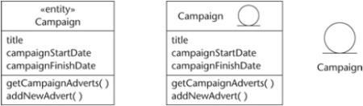

#### COM00144M Software Engineering
# **Week 3 - Requirement Analysis and Interaction Modelling**

## **3.0 Table of Contents**

- [**3.0 Table of Contents**](#30-table-of-contents)
- [**3.1 Learning Objectives**](#31-learning-objectives)
- [**3.2 Summary**](#32-summary)
- [**3.3 Requirement Analysis and Class Diagram**](#33-requirement-analysis-and-class-diagram)
  * [**3.3.0 Reading**](#330-reading)
  * [**3.3.1 Requirement Analysis**](#331-requirement-analysis)
    + [**Analysis Model**](#analysis-model)
    + [**Requirement Analysis**](#requirement-analysis)
    + [**Class Diagram**](#class-diagram)
  * [**3.3.2 Class Diagram Notation**](#332-class-diagram-notation)
    + [**Links and Associations**](#links-and-associations)
    + [**Multiplicity**](#multiplicity)
  * [**3.3.3 Special Associations**](#333-special-associations)
- [**3.4 Class Modelling**](#34-class-modelling)
  * [**3.4.0 Reading**](#340-reading)
  * [**3.4.1 Analysis Class Stereotypes**](#341-analysis-class-stereotypes)
    + [**Boundary Classes**](#boundary-classes)
    + [**Entity Classes**](#entity-classes)
    + [**Control Classes**](#control-classes)
  * [**3.4.2 Identifying Classes**](#342-identifying-classes)
- [**3.5 Interaction Modelling**](#35-interaction-modelling)
  * [**3.5.0 Reading**](#350-reading)
  * [**3.5.1 Sequence Notation**](#351-sequence-notation)
  * [**3.5.2 Preparing A Diagram**](#352-preparing-a-diagram)

---
&emsp;
## **3.1 Learning Objectives**

* **MLO1** - Conduct requirement analysis and create analysis class models
* **MLO1** - Conduct interaction modelling and create communication diagrams

---
&emsp;
## **3.2 Summary**

Requirement analysis immediately follows use case modelling. 

The Class Diagram is the central UML diagram which supports the development lifecycle. An initial class diagram can be formed after the initial requirement analysis. 

This can then be refined by interaction modelling: interaction diagrams and CRC cards help identify more operations and allocate to appropriate classes.

---
&emsp;
## **3.3 Requirement Analysis and Class Diagram**

### **3.3.0 Reading**
* *Required: Chapters 7-8, Object Oriented Systems Analysis And Design, Bennett*
* *Extension: [Class Diagram Tutorial](https://online.visual-paradigm.com/diagrams/tutorials/class-diagram-tutorial/), Visual Paradigm*

&emsp;
### **3.3.1 Requirement Analysis**

Unlike the **use case model**, which is constructed from the user’s perspective, requirement analysis goes beneath the surface to explore the logical structure of the system. It produces an **analysis model**.

The core diagram of requirement analysis is the **class diagram**.

&emsp;
#### **Analysis Model:**

The analysis model is the **output** of requirement analysis. It consists of a set of analysis classes, contained in a diagram, that collectively model the **behaviour** of the system.

It is more complete than the use case model as it contains **detail**, **logical structure**, and **object interaction**.

&emsp;
#### **Requirement Analysis:**

Requirement analysis is needed because use case models are not sufficient for the design. They may contain repetition, include parts that exist as standard components, and are essentially language based.

Requirement analysis creates the **analysis model** which is both correct and understandable for users. 

There are three major activities for requirement analysis, each stage involves revising the class diagram:
* **Class modelling **– identifying likely classes, adding associations and operations, analysing inheritance and reusable components 
* **Interaction modelling** – composing sequence and/or communication diagrams for selected use cases
* **Attributes and operations specification** – utilise OCL, activity diagrams and state machines

&emsp;
#### **Class Diagram:**

The class diagram describes the types of objects in the system and their relationships. Detail varies:
* **Conceptual stage** – less detailed
* **Analysis stage** – detailed with typed data
* **Design stage** – more detailed with language code

Class diagrams are the richest notation in **UML** and refine structures and state interactions.

&emsp;
### **3.3.2 Class Diagram Notation**

A class is shown with a **class diagram** that is divided into three compartments:
* Top – the class name, which should be unique and relevant. Written as one word with each first letter capitalised
* Middle – attributes, which specify what information a class can store. Written as one word with a lower case first letter and others capitalised 
* Bottom – operations, which are actions that manipulate the stored information. Written as one word with a lower case first letter and others capitalised followed by brackets ( )

  

Note that primary operations, such as constructor, get and set, are omitted from the diagram.

An object created from a class can be depicted with an **instance diagram** with two compartments:
* Top – the class name preceded by a colon
* Bottom – the attribute name along with the specific attribute value

  

&emsp;
#### **Links and Associations:**

If a **logical connection** between classes or instances exists, they can be connected:
* A **link** is a logical connection between two instances: these can be instances of the same or different classes and rarely themselves
* An **association** is a connection between two classes: it represents the possibility of links between their subsequent instances.
* Generally, if a link exists there must be a corresponding association between the classes

Like object instances, links are not usually modelled explicitly on class diagrams.

Every association should have two **descriptive labels** to make the connection clear:
* **Association name** – written below the line and describes the relationship between the two instances
* **Association role** – written above the line and describes the role the instance plays in relation to the connected instance. Both roles can be labelled, unlike above

  

&emsp;
#### **Multiplicity:**

**Multiplicity** describes the number of objects that can engage with the association. For example, a bank account would have only one account holder, but an account holder may have more than one account. 
* This is denoted by a number along with or in place of the association name
* Zero or more can be represented by the notation 0..*

  

&emsp;
### **3.3.3 Special Associations**

Certain special associations facilitate reuse of objects.

A persistence of a class can be **dependant** or **independent** of its association:
* With **aggregation**, the child can exist independently of the parent. If the class with the unfilled diamond is deleted, its children remain
* With **composition**, the child cannot exist independently of the parent. If the class with the filled diamond is deleted, so are its children

  

  
**Generalisation** applies to associations as well, allowing creation of more specialised types of objects:
* For example, the general superclass of Pet could have generic attributes and its subclasses of Dog and Cat could have more specialised attributes 
* The superclass can be abstract and only its specialised versions created as objects

  

---
&emsp;
## **3.4 Class Modelling**

### **3.4.0 Reading**
* *Required: Chapter 7, Object Oriented Systems Analysis And Design, Bennett*
* *Extension: none*

&emsp;
### **3.4.1 Analysis Class Stereotypes**

**Stereotyped classes** have a shared focus on similar kinds of tasks. They can be indicated on class models.
* For example, the type of film starring Schwarzenegger can be anticipated even though plot changes

Stereotypes should only be shown on diagrams when they add meaning to the model: they are **not obligatory**.

&emsp;
#### **Boundary Classes:**

**Boundary classes** model **interactions** between the system and its actors.
* They identify the main logical interfaces with **users**, such as GUI components
* Similarly, they may also include interfacing with other software and physical devices
* Their main task is to transfer information across **system boundaries**
* Notation can be in one of three styles:

  

&emsp;
#### **Entity Classes:**

**Entity classes** model **information** and **behaviour** of an individual or real-life concepts.
* From the **application domain**, **external** to the system, but needs information **stored**
* They can be abstract, like a campaign, or concrete, like a member of staff
* Instances usually require persistent information storage: a useful test to decide on use
* Notation can be in one of three styles:

  

&emsp;
#### **Control Classes:**

**Control classes** represent **coordination**, **sequencing**, **transactions**, and **control** of other objects.
* They handle **events** from the GUI and **update** information in stored entity classes
* This does not include behaviours specific to entity classes
* Notation can be in one of three styles:

  

&emsp;
### **3.4.2 Identifying Classes**

Class modelling involves:
* Identifying possible classes
* Adding associations, attributes, and some operations
* Analysing possible inheritance, reusable components and updating the class diagram

Boundary and control classes may not be addressed until the system design phase. 

Therefore, the analysis stage focused on finding entity classes: use cases are the best place to start.

Guidelines for **identifying classes** can be listed as follows:
* Pick physical things or abstract concepts which store information to achieve a goal
* Actors do not normally need to be modelled
* It is not necessary to create a class to represent the entire system 
* Model entity as a class when it has different attributes and many instances
* Operations and associations maybe better modelled as a class
* Avoid names that express physical implementation

---
&emsp;
## **3.5 Interaction Modelling**

### **3.5.0 Reading**
* *Required: Chapters 7, 9, Object Oriented Systems Analysis And Design, Bennett*
* *Extension: [Sequence Diagram Tutorial ](https://online.visual-paradigm.com/diagrams/tutorials/sequence-diagram-tutorial/), Visual Paradigm*

&emsp;
### **3.5.1 Sequence Notation**

**UML sequence diagrams** can be used to visualise interactions for a particular use case and display how each object interacts to deliver the intended functionality.

**Object interaction** describes message passing between objects: an object sends a message, and an operation is invoked in the receiving object.

The **aim** of modelling object interactions is to determine the most appropriate scheme of messaging between objects to support a particular user requirement.

In a **sequence diagram**, time proceeds down the page. Horizontal object ordering is arbitrary, but readability is improved if messages move from left to right.
* Each object in the diagram has a **lifeline**: a vertical dashed line extending downwards
* A **message** is shown with a solid horizontal arrow from one lifeline to another
* However, an **object creation message** is shown by a dashed line instead
* A rectangular block on the lifeline shows an operation activated by receipt of a message
* **Object destruction** is indicated at the point of occurrence by a large X on the lifeline
* **Reflexive messages** are shown with an arrow that starts/finishes at the same lifeline
* Alternative pathways are indicated with **Alt** as a box label
* Reference to other sequence diagrams is indicated with **Ref** as a box label
* Loops are indicated with Loop as a box title, along with the conditions
* **Return messages** are shown with a dashed arow in the opposite direction to the sent
* **Asynchronous messages** allow the invoking object to continue while waiting for a response, and is shown with an open arrowhead for message sending and any return 

  

&emsp;
### **3.5.2 Preparing A Diagram**

Designing a sequence diagram is like telling a good story: it should be clear, organised, and make progress.

**Class Responsibility Collaboration** (CRC) cards help model interactions between objects.

  

Communication diagrams are semantically equivalent to sequence diagrams. Which to use:
* **Sequence**: emphasising the sequence of calls or communicating with clients
* **Communication**: emphasising the links or early analysis