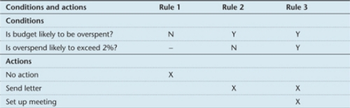
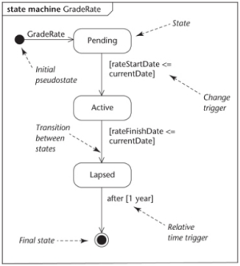
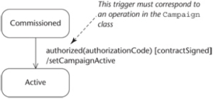
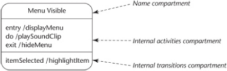
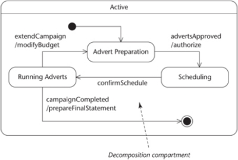
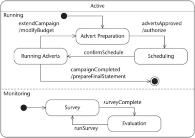
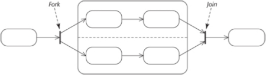

#### COM00144M Software Engineering
# **Week 4 - Operation Specification and State Machines**

## **4.0 Table of Contents**

- [**4.0 Table of Contents**](#40-table-of-contents)
- [**4.1 Learning Objectives**](#41-learning-objectives)
- [**4.2 Summary**](#42-summary)
- [**4.3 Operation Specification**](#43-operation-specification)
  * [**4.3.0 Reading**](#430-reading)
  * [**4.3.1 Operation Specification**](#431-operation-specification)
    + [**Operational Logic**](#operational-logic)
    + [**Decision Tables**](#decision-tables)
    + [**Pre and Post Conditions**](#pre-and-post-conditions)
- [**4.4 Object Constraint Language**](#44-object-constraint-language)
  * [**4.4.0 Reading**](#440-reading)
  * [**4.4.1 OCL Keywords**](#441-ocl-keywords)
    + [**Operations**](#operations)
    + [**Collections**](#collections)
    + [**Type**](#type)
- [**4.5 State Machines**](#45-state-machines)
  * [**4.5.0 Reading**](#450-reading)
  * [**4.5.1 State Machine Notation**](#451-state-machine-notation)
    + [**Transitions**](#transitions)
    + [**Internal States**](#internal-states)
  * [**4.5.2 Advanced Notations**](#452-advanced-notations)
  * [**4.5.3 Preparing State Machines**](#453-preparing-state-machines)

---
&emsp;
## **4.1 Learning Objectives**

* **MLO1** - Specify constraints and operations for a class diagram using OCL
* **MLO1** - Model state-related behaviour using state machines

---
&emsp;
## **4.2 Summary**

Accurate requirement models are needed before we move onto design. 

OCL formally specifies the constraints and operations that cannot be expressed clearly in a UML model. It is considered side-effect free as it cannot change anything in the model. 

For heavy messaging classes, UML state diagrams can outline their behaviour. This could be a behaviour, lifecycle, or hybrid approach.

---
&emsp;
## **4.3 Operation Specification**

### **4.3.0 Reading**
* *Required: Chapter 10, Object Oriented Systems Analysis And Design, Bennett*
* *Extension: none*

&emsp;
### **4.3.1 Operation Specification**

Before proceeding to design, a stabilised **class diagram** needs the operations to be specified by:
* Completing the **signature** of the operations
* Identifying what the **operation** intends to do, using operation specifications

**Operation specifications** describe the detailed behaviour of an operation. They:
* Allow a user to confirm the **correctness** of the proposed behaviour
* Guide a programmer in the appropriate **implementation** of the operation

Operations are defined primarily in terms of the services they deliver and inputs they receive. This is known as **specification by contract** and is like real world contractual agreements.
* Focus is on what the operation should achieve: black box, ie irrelevant details hidden
* This is different to focusing on how the operation should work: white box 
* Typically, they are written as pre and post condition pairs

&emsp;
#### **Operational Logic:**

Logic of an operations can be described using **algorithmic** or **non-algorithmic** approaches.
* Non-algorithmic approaches concentrate on describing the logic as a **black box**, hiding the details of the implementation 
* Algorithmic approaches describe the **internal logic** of a process, specifying the sequence of steps which are performed

In **object-oriented programming**, non-algorithmic approaches are preferred because:
* Only programmers responsible for a class need to focus on its internal implementation
* Even distribution of effort across classes should result in small, simple classes 

Algorithmic approaches use **activity diagrams**, **pseudocode**, or **structured English** to describe internal logic.

Non-algorithmic approaches may use methods such as **decision tables** and **pre** and **post conditions**. 

&emsp;
#### **Decision Tables:**

A **decision table** is a matrix that shows the conditions under which actions are taken. They work best when different combinations of inputs can produce multiple alternate outcomes.

  

&emsp;
#### **Pre and Post Conditions:**

**Pre** and **post conditions** answer the following questions:
* What conditions must be satisfied for an operation to execute?
* What is the result of the operation completing?

---
&emsp;
## **4.4 Object Constraint Language**

### **4.4.0 Reading**
* *Required: Chapter 10, Object Oriented Systems Analysis And Design, Bennett*
* *Extension: [Object Constraint Language Environment (OCLE)](http://lci.cs.ubbcluj.ro/ocle/), Babes-Bolyai University*

&emsp;
### **4.4.1 OCL Keywords**

Natural language is expressive but suffers from ambiguities due to interpretation. 

**Object Constraint Language** (OCL) provides a language where all constructs have precise and defined meaning. This avoids issues with natural language expression and constraints difficult to diagram. 

The specification for OCL 2.4 can be found [here](https://www.omg.org/spec/OCL/2.4/PDF).

**Mutation** operations are not used in OCL as it is side effect free and cannot change anything in the model.

**Context** (context) defines the domain within which the expression is valid. 
* context Customer		

**Invariants** (inv) are properties which are always true. The context is usually a class.
* context Customer
	        inv: age >=18	

**Pre** and **post conditions** (pre, post) . The context is always an operation.
* context Account::withdraw(amount:Integer)
	        pre: amount > 0 and
	               balance-amount >= odLimit and
	               accessor = holder
	        post: balance = balance@pre-amount

**Self** (self) is used to refer the context object if there is the possibility of confusion across classes.
* context Customer
        inv: self.age >= 18

**Result** (result) is like the return statement in Java: it indicates the value returned from an operation.
* context: Account::balanceEnquiry():Integer
        pre: accessor = holder
        post: result = balance

&emsp;
#### **Operations:**

OCL supports four basic data types each with valid operations: 
* **Real**: + - * / >= <= > <
* **Integer**: + - * / >= <= > <
* **String**: size() this returns the number of characters in the string
* **Boolean**: and or not implies if then else endif

&emsp;
#### **Collections:**

OCL also offers **collection** data types (set, orderedset, bag, sequence) and valid operations:
* size(): integer
* isEmpty(), notEmpty
* sum()
* count(object): integer
* includes(object): Boolean
* excludes(object): Boolean
* including(object): collection
* excluding(objects): collection
* select(condition): collection
* exists(condition), forAll(condition): Boolean

Operations on collections are indicated using arrow notation (->).
* Context Customer
        Inv: self.heldAccount->size() <= 5

&emsp;
#### **Type:**

The **object type** can be checked through the oclIsTypeOf operation.
* context Customer
        inv: self.oclIsTypeOf(Customer)

---
&emsp;
## **4.5 State Machines**

### **4.5.0 Reading**
* *Required: Chapter 11, Object Oriented Systems Analysis And Design, Bennett*
* *Extension: [State Machine Tutorial](https://online.visual-paradigm.com/diagrams/tutorials/state-machine-diagram-tutorial/), Visual Paradigm*

&emsp;
### **4.5.1 State Machine Notation**

All objects have a **state**. For example, a library book may have both a checked out and available state.

**State related behaviour **results in the same object behaving differently depending on its state.

A **state machine** therefore is a depiction of all the possible lifecycles that single class might follow:
* An object must immediately move from the **initial pseudostate** to a named state
* An object cannot leave the **final state** once it has been entered
* All other states are shown as rounded rectangular boxes with meaningful labels

  

&emsp;
#### **Transitions:**

**Transitions** between states are triggered by one of four types:
* Boolean **change triggers **
* A **call trigger** (synchronus) or **signal trigger** (asynchronous)
* Time needed to pass for a **relative time trigger** should be in brackets 
* **Guard conditions** can be added to annotations and are indicated by square brackets
* **Actions** caused by the trigger such as sending signals are indicated by /

  

&emsp;
#### **Internal States:**

**Internal state activities** are not associated with transitions, but it can be useful to model internal activities associated with the state. The state rectangle is divided into two or three components:
* **Entry**, **Exit** and **Do** are reserved keywords
* Note that Entry and Exit cannot have guard conditions as they are always invoked
* Internal transitions do not invoke exit and entry actions

  

&emsp;
### **4.5.2 Advanced Notations**

In a **composite state** the rectangle becomes its own state diagram, to allow modelling of substates.

  

**Concurrent states** contain multiple independent substates that may run and complete at different times:

  

**Synchronised concurrent states** use forks and joins to create parallel nested submachines:
* A **fork** will create a **pseudostate**, splitting progression into a concurrent substate
* This state will not be exited until both complete and **merge** at the **join** pseudostate

  

&emsp;
### **4.5.3 Preparing State Machines**

In a **behavioural approach**, events are collected from all interaction diagrams. A first draft will show actions designed to respond to the events, which will correspond to the operations needed to be coded.

A **lifecycle approach **is less formal and does not consider interaction diagrams but instead works directly from use cases. It considers the lifecycles of objects of each class.

A combination of both approaches is usually recommended, as each informs the other.