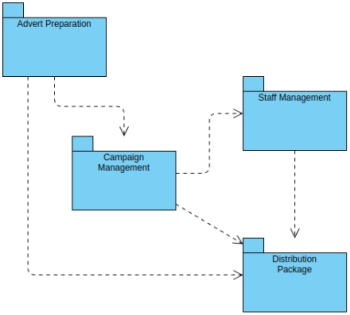
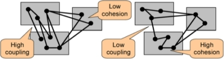
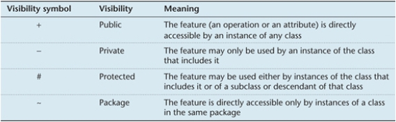

#### COM00144M Software Engineering
# **Week 5 - Software Design and Design Patterns**

## **5.0 Table of Contents**

- [**5.0 Table of Contents**](#50-table-of-contents)
- [**5.1 Learning Objectives**](#51-learning-objectives)
- [**5.2 Summary**](#52-summary)
- [**5.3 High Level Design**](#53-high-level-design)
  * [**5.3.0 Reading**](#530-reading)
  * [**5.3.1 Analysis and Design**](#531-analysis-and-design)
    + [**Quality Design Criteria**](#quality-design-criteria)
  * [**5.3.2 Package Diagrams**](#532-package-diagrams)
    + [**Package Coupling**](#package-coupling)
    + [**Package Cohesion**](#package-cohesion)
  * [**5.3.3 Architecture Patterns**](#533-architecture-patterns)
    + [**Closed Architectures**](#closed-architectures)
    + [**Open Architectures**](#open-architectures)
    + [**Repository Architectures**](#repository-architectures)
    + [**Client Server Architectures**](#client-server-architectures)
    + [**Peer to Peer Architectures**](#peer-to-peer-architectures)
    + [**Broker Architectures**](#broker-architectures)
    + [**Model View Controller Architectures**](#model-view-controller-architectures)
- [**5.4 Low Level Design**](#54-low-level-design)
  * [**5.4.0 Reading**](#540-reading)
  * [**5.4.1 Good Class Design**](#541-good-class-design)
  * [**5.4.2 Attributes and Operations**](#542-attributes-and-operations)
    + [**Visibility Flags**](#visibility-flags)
  * [**5.4.3 Associations and Constraints**](#543-associations-and-constraints)
    + [**Associations**](#associations)
    + [**Constraints**](#constraints)
- [**5.5 Software Design Patterns**](#55-software-design-patterns)
  * [**5.5.0 Reading**](#550-reading)
  * [**5.5.1 Pattern Overview**](#551-pattern-overview)
    + [**Frameworks and Patterns**](#frameworks-and-patterns)
    + [**Documentation**](#documentation)
  * [**5.5.2 Development Patterns**](#552-development-patterns)
    + [**Creational Patterns**](#creational-patterns)
    + [**Structural Patterns**](#structural-patterns)
    + [**Behavioural Patterns**](#behavioural-patterns)

---
&emsp;
## **5.1 Learning Objectives**

* **MLO2** - Assess software architecture patterns and their applicable situations
* **MLO1** - Produce suitably detailed design class models
* **MLO2** - Apply design patterns to the class design

---
&emsp;
## **5.2 Summary**

At a high level, package diagrams help control a system's overall architecture. Well-structured packages are very cohesive and loosely coupled, and reuse common architecture patterns: closed, open, repository, client-server, peer-peer, broker and MVC architectures.

Furthermore, coupling and cohesion are a key part of good class design at a low level too.

Frameworks and patterns facilitate reuse. One common pattern type from each category have been introduced: creational singleton patterns, structural composite pattern, and behaviour state pattern. These are documented with a pattern template.

---
&emsp;
## **5.3 High Level Design**

### **5.3.0 Reading**
* *Required: Chapter 12, Object Oriented Systems Analysis And Design, Bennett*
* *Extension: [Package Diagram Tutorial](https://online.visual-paradigm.com/diagrams/tutorials/package-diagram-tutorial/), Visual Paradigm*
* *Extension: Chapter 13, Object Oriented Systems Analysis And Design, Bennett*

&emsp;
### **5.3.1 Analysis and Design**

**Analysis** is about the what? and focuses on understanding. **Design** about the how? and focuses on implementation.
* *eg. What happens in the current system?*
* *eg. What is required in the new system?*
* *eg. How will the new system meet the requirements?*

In **OOP** approaches, analysis identifies needed classes, which then are refined in design. This close relationship between the stages is referred to as the **seamlessness of objected orientated methods**.
* The analysis stage produces an abstract model of what to do
* The design stage details precisely how to do it 

Design can be divided into two stages.
* **Logical design** – implementation independent in that it is concerned with the aspects of a system that can be designed without knowledge of the intended platform
* **Physical design** – implementation dependant in that is focuses on aspects of the system that are dependent on the platform to be used
	
**Model Driven Architecture** (MDA) is an approach where a system can be modelled in UML to create a **platform independent model** (PIM), which can be transformed into a **platform dependant model** (PDM) if needed.

System design takes place at two levels.
* **System design** – overall architecture, subsystem communications, company standards
* **Detail design** – inputs, outputs, database structures, user interfaces

&emsp;
#### **Quality Design Criteria:**

Bennett proposes 12 criteria for quality design, although it may not be possible to achieve everyone.
* **Functional** – meets documented requirements and performs functions correctly
* **Efficient** – performs tasks efficiently in terms of time and resources
* **Economical** – the design seeks to minimise running costs
* **Reliable** – not prone to hardware or software failure and protects data integrity
* **Secure** – secure against malicious attacks by outsiders or unauthorised insiders
* **Flexible** – can adapt to changing business requirements over time
* **General** – the extent to which a system is general purpose, such as portability
* **Buildable** – important design is clear and not unnecessarily complex
* **Manageable** – a project manager should be able to estimate the required work 
* **Maintainable** – a well designed documented system that is easy to maintain
* **Useable** – boosts productivity and is enjoyable to use
* **Reusable** – utilises inheritance, reusable patterns, and reuse in other projects

&emsp;
### **5.3.2 Package Diagrams**

The most important part of system design is that of the overall **architecture** of the system. 

**Packages** are organised elements into related groups, such as grouping classes together.
* Classes for engines, cars, wheels could be grouped into a vehicle parts package 
* This allows vehicle parts to be discussed as a whole: a higher level of **abstraction**

**Dependent classes** use methods from other classes: these could be in the same or different package. 
* Arrows denote where the called methods reside; the non-arrowed side are dependant
* For example, changes in the Distribution Package would need Staff Management, Advert Preparation and Campaign Management packages to be updated

  

**Robustness** to change is a good criteria: a design which minimises the subsequent changes incurred as a result of modifying something. This gives two further criteria: **loosely coupled** and **highly cohesive**. 

&emsp;
#### **Package Coupling:**

In the **coupling** examples below, robustness decreases left to right.
* **Uncoupled** is unlikely to happen in a software system due to good design principles
* As **highly coupled** is the lease robust, loosely coupled is the ideal choice

  

&emsp;
#### **Package Cohesion:**

**Cohesion** refers to interfaces and classes within a package that fulfil a similar purpose or function.
* This can be quantified as: RC = numberOfInternalRelations / numberOfTypes
* Internal relations are the number of messages passed between classes
* Types are the number of classes in the package
* The bigger the RC the higher the cohesion

  

&emsp;
### **5.3.3 Architecture Patterns**

The purpose of architecture patterns is **reuse**: this avoids needing to start from scratch for each project.

Generally, a system can be divided into subsystems horizontally and vertically.
* Horizontal divisions are called **partitions**
* Vertical divisions are called **layers**

&emsp;
#### **Closed Architectures:**

**Closed architectures** typically have between 3-5 layers and each layer only depends on the layer below.
* This results in low coupling
* However, each layer might introduce a speed and storage overhead

  

&emsp;
#### **Open Architectures:**

**Open architectures** are like closed architectures in structure, but high layers might access layers below.
* This can avoid performance bottlenecks
* However, increased coupling is incurred due to extra dependencies

  

&emsp;
#### **Repository Architectures:**

**Repository architectures** allow multiple components to access the same package or share data. 
* It is easy to add subsystems
* However, the repository itself can become a bottleneck due to queuing of requests

  

&emsp;
#### **Client Server Architectures:**

**Client-server architectures** are a network model, where multiple clients interact with a centralised server
* Clients need to know the server, but not vice versa
* Server systems are not impacted by changes to the client interface

  

&emsp;
#### **Peer to Peer Architectures:**

**Peer to peer architectures** are another network model, where each subsystem has the same capabilities. 
* This incurs more coupling and control flow hazards
* Therefore it is more difficult to implement and maintain

  

&emsp;
#### **Broker Architectures:**

**Broker architectures** are similar to a client-server, but a middleman facilitates their communication.
* The client can, but doesn’t need to, know the server

  

&emsp;
#### **Model View Controller Architectures:**

**Model View Controller** (MVC) separates the system into the three named components.
* A model only knows which views and controllers are registered with it, not their function
* A propagation mechanism enables a model to inform the view about changed data

  

---
&emsp;
## **5.4 Low Level Design**

### **5.4.0 Reading**
* *Required: Chapter 14, Object Oriented Systems Analysis And Design, Bennett*
* *Extension: none*

&emsp;
### **5.4.1 Good Class Design**

**High level** design focuses on the big picture of the system, whereas **low level** design concerns the input, output, processes, and any files or databases included.

Good class design ensures programs are easy to develop and maintain and involves coupling and cohesion.

**Coupling** describes the **interconnectedness** of components and is reflected by the number of links an object has with other objects. It includes:
* **Interaction coupling** is a measure of the number of messages and parameters an object sends to others. It should be kept low to reduce impact of change made elsewhere
* **Inheritance coupling** is the degree to which a subclass needs the features it inherits.
Low inheritance would be a class inheriting lots of irrelevant or unnecessary methods

**Cohesion** describes the degree to which an element **contributes** to a single purpose. It includes:
* **Operation cohesion** measures the degree to which an operation is focused on a single functional requirement
* **Class cohesion** is the degree to which a class is focused on a single requirement. The class should be a recognisable object and not a blur of various entities
* **Specialisation cohesion** is the semantic cohesion of inheritance hierarchies. Low specialisation could be a person subclass deriving from an address class
 
&emsp;
### **5.4.2 Attributes and Operations**

One task at this level is to add detail to the **attributes** and **operations** in classes identified during analysis. 

On the class diagram, **attributes** can be:
* **Initialised**, eg balance:Money = 0.00
* **Forced** to have a value and not be empty, eg accountName: String {not null}
* **Derived** from other attributes in the same or other classes, eg. /availableBalance: Money
* **Static** attributes or operations are underlined, eg. nextAccountNumber:Integer

  

**Primary operations** are the **constructor**, **destructor**, **get** and **set** operations expected in a class. 
* These are normally not included on the class diagram to reduce clutter
* Include if multiple constructors are present or functionality needs to be explicit

Each operation must be specified in terms of the parameters it passes and returns. A signature contains:
* The operations **name**
* The **number** and types of its **parameters** 
* The type of **return** value if any
* eg. credit(amount: Money): Boolean

  

Naming conventions to be aware of:
* Class – singular unabbreviated nouns, eg. Customer
* Attributes – unabbreviated names with a noun from the context, eg. firstName
* Operations – include a strong verb, eg validateNumber()

&emsp;
#### **Visibility Flags:**

Decisions need to be made regarding the accessibility of attributes and operations. The visibility flags are:
* eg. - balance:Money
* Attributes of a class are usually designated **private** for enforce **encapsulation**
* Operations are initially set as **public** but can be changed depending on the context

  

Therefore, a sample class diagram after this stage may look like:

  

&emsp;
### **5.4.3 Associations and Constraints**

**Associations** and **constraints** need to be designed.

&emsp;
#### **Associations:**

**One to one association**, the simplest association: 
* Messages can only flow in the direction of the arrow
* A reference being added to the sending object allows this
* This allows the initial class to invoke methods in the subsequent class

  

**One to many associations**, requiring a redesign from the original design:
* The initial design for one to many associations needs a slight adjustment in practise 
* A separate collection class is added to access and manage the many objects
* Communication is again facilitated by the addition of references to the next class

  

**Many to many associations**, the most complicated association requiring a detailed redesign:
* The two way communication is broken down into two one way communications
* This minimises two way communications and keeps coupling as low as possible
* Two collection classes are introduced to facilitate this

  

&emsp;
#### **Constraints:**

**Referential integrity** ensures an object identifier refers to an object that exists. In the example of a single campaign object needing a single manager object:
* This can be ensured by assigning a manager when the campaign is created
* If a manager is removed from a campaign, a replacement manager should be assigned
* If there is no replacement available, then a temporary dummy manager can be assigned

**Dependency constraints** ensures derived attributes are maintained consistently. In the campaign example:
* This can be ensured by updating derived attribute when adverts are added or removed

**Domain integrity** ensures that attributes only hold allowed values. For example, a cost should be a float.
* If this relates to a type, then can be accomplished by checking the set method is correct
* If this relates to a condition, then the value can be checked when being created 

---
&emsp;
## **5.5 Software Design Patterns**

### **5.5.0 Reading**
* *Required: Chapter 15, Object Oriented Systems Analysis And Design, Bennett*
* *Extension: [What Are Software Anti-Patterns](https://www.lucidchart.com/blog/what-are-software-anti-patterns), Lucid Chart*

&emsp;
### **5.5.1 Pattern Overview**

Design patterns allow for successful solutions to problems in system design to be captured and reused.

&emsp;
#### **Frameworks and Patterns:**

**Frameworks** are partially completed software systems that can be targeted at a specific issue or context.
* Patterns are more **abstract** and general than frameworks
* Unlike frameworks, patterns cannot be implemented directly
* A framework can use several patterns, but a pattern cannot incorporate a framework

**Patterns** provide a mechanism for the reuse of generic solutions; it is a description of how a problem can be solved, not the solution itself. However, they may limit the creativity of the developer.

Patterns are grouped into catalogues and languages.
* A **pattern catalogue** is a group of related patterns that may or may not be used together
* A **pattern language** is a closely related group used to solve problems in a specific domain

&emsp;
#### **Documentation:**

Patterns may be documented using a template. A **pattern template** determines the style and structure of the description but vary in the emphasis placed on different aspects. Generally, this should be:
* **Name** – a meaningful name reflecting the knowledge of the pattern
* **Problem** – a description of the problem addressed, and objectives achieved
* **Context** – the circumstances under which the pattern is applicable
* **Forces** – the constraints or issues that must be addressed 
* **Solution** – the relationship between parts of the pattern and resolves the forces

&emsp;
### **5.5.2 Development Patterns**

The **Gang of Four** patterns refer to a catalogue of 23 design patterns still in use today. 
* Aim is to increase the ease of modification by **reducing coupling**, **maximising cohesion**
* They incorporate good design and so maximise **encapsulation**
* There are categorised as **creational**, **structural**, and **behavioural**

**Changeability** involves several different aspects:
* Maintainability – ease of correcting errors
* Extensibility – inclusion of new features, updating components, and removal of features
* Restructuring – reorganisation of the components and relationships
* Portability – modifying the system for different platforms

&emsp;
#### **Creational Patterns:**

**Creational patterns** are concerned with the construction of object instances. They separate the operation of an application from how its objects are created to give the designer flexibility.

One example is the **Singleton pattern**, which ensures that only one instance of class is created.
* Name – Singleton (creational)
* Problem – How do you ensure only one instance of a class is created?
* Context – The need for exactly one instance of a class. For example, processing orders from a company: only one instance of that company, with its details, should exist
* Forces – Normally, multiple instances can be created using the public constructor
* Solution – Restrict access to the constructor. The class contains a getInstance() operation which creates an instance and an ID when first accessed, but subsequent access returns only the ID.

  

&emsp;
#### **Structural Patterns:**

**Structural patterns** address issues with the way in which classes and objects are organised. They offer effective ways of using inheritance, aggregation, and composition to fulfil requirements.

An example of a structural pattern is the **composite pattern**:
* Name – Composite (structural)
* Problem – How can composite structures be incorporated with the same interface?
* Context – Both composite and component objects exist, and a client should be able to treat both in the same way. For example, singular or grouped items in a design package
* Forces – Objects need to belong to the same inheritance hierarchy 
* Solution - The solution resolves the issues by combining inheritance and aggregation hierarchies. Both subclasses, Leaf and Composite, have a polymorphically redefined operation anOperation(). In Composite this redefined operation invokes the relevant operation from its components using a simple loop construct

  

&emsp;
#### **Behavioural Patterns:**

**Behavioural patterns** address problems stemming from responsibilities being assigned to classes.  They suggest particular static relationships between classes but also indicate how they should communicate.

**State patterns** are one example of this type:
* Name – State (behavioural)
* Problem – An object behaves differently at run time when its internal state changes
* Context – Applications may have complex state related behaviour resulting in objects behaviour varying depending on its state.
* Forces – Variety of alternative behaviours make the operation hard to maintain and test
* Solution – Allocate each state related behaviour to an individual state class. These state objects then have sole responsibility for that state’s behaviour. The original object

  

