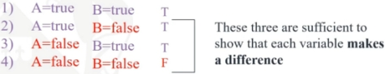

#### COM00144M Software Engineering
# **Week 6 - Software Testing and Refactoring**

## **6.0 Table of Contents**

- [**6.0 Table of Contents**](#60-table-of-contents)
- [**6.1 Learning Objectives**](#61-learning-objectives)
- [**6.2 Summary**](#62-summary)
- [**6.3 Specification Testing**](#63-specification-testing)
  * [**6.3.0 Reading**](#630-reading)
  * [**6.3.1 Software Testing Overview**](#631-software-testing-overview)
  * [**6.3.2 Software Test Types**](#632-software-test-types)
    + [**Unit Testing**](#unit-testing)
    + [**Integration Testing**](#integration-testing)
    + [**System Testing**](#system-testing)
    + [**Acceptance Testing**](#acceptance-testing)
  * [**6.3.3 Specification Testing**](#633-specification-testing)
- [**6.4 Structural Testing**](#64-structural-testing)
  * [**6.4.0 Reading**](#640-reading)
  * [**6.4.1 Control Flow Graphs**](#641-control-flow-graphs)
  * [**6.4.2 Testing Adequacy**](#642-testing-adequacy)
    + [**Statement Coverage**](#statement-coverage)
    + [**Branch Coverage**](#branch-coverage)
    + [**Condition Coverage**](#condition-coverage)
    + [**Modified Condition and Decision Coverage**](#modified-condition-and-decision-coverage)
- [**6.5 JUnit and Refactoring**](#65-junit-and-refactoring)
  * [**6.5.0 Reading**](#650-reading)
  * [**6.5.1 Unit Testing**](#651-unit-testing)
  * [**6.5.2 Refactoring**](#652-refactoring)

---
&emsp;
## **6.1 Learning Objectives**

* **MLO3** - Design tests for both black-box and white-box testing
* **MLO3** - Design and conduct an appropriate JUnit test
* **MLO3** - Critically evaluate various approaches to software testing
* **MLO4** - Apply a range of refactoring techniques to improve code quality

---
&emsp;
## **6.2 Summary**

Specification testing uses a black box approach, namely utilising equivalence partitioning and boundary value analysis. It is a necessary approach but needs to be supplemented for completeness.

Structural testing is a powerful unit testing technique and supplements specification testing well. Many authors believe that structural testing will discover about 35% of bugs. The coverage measures can also be used to guide testing.

Structural testing, however, does not reveal missing functions and specification errors.

---
&emsp;
## **6.3 Specification Testing**

### **6.3.0 Reading**
* *Required: Chapter 19, Object Oriented Systems Analysis And Design, Bennett*
* *Extension: Chapter 18, Software Engineering - A Practical Approach, Pressman*

&emsp;
### **6.3.1 Software Testing Overview**

The overall testing process is as follows:
* Identify **parts** of the software to be tested: **Software Under Test Diagram** (SUT)
* Identify interesting **input values**
* Identify **expected** results (functional) and execution characteristics (non-functional)
* Run the software on the input values
* **Compare** results and execution characteristics to expectations

  

Testing is an **active** process: can show the presence of errors but never the absence of them.

&emsp;
### **6.3.2 Software Test Types**

Software testing is needed to **verify** software complies with the requirements and to **validate** that it has been written correctly and efficiently:
* **Verification** checks the right software has been written
* **Validation** checks that the software has been written right

The first type of approach is called **black box testing**. It ignores the process and focuses on the **output**. 
* Test data is entered, and some output is examined
* Testing does not investigate how the processing is carried out
* Overall, it checks the performance of the software

The second type of approach is called **white box testing**. It focuses on how well the process is **designed**.
* It tests the internal workings of the software
* It also examines whether the software works as specified 
* Overall, it checks the quality of the software

Testing can take place at multiple levels:
* Unit testing
* Integration testing
* System testing
* Acceptance testing

&emsp;
#### **Unit Testing:**

With **unit testing** in an OOP system, units are likely to be **individual classes**. 
* A **desk check** is completed: a manual check of the class source code
* A **harness** is used to check the running of the class. It is a test program that will create instances of classes, populate with data, and invoke operations

&emsp;
#### **Integration Testing:**

**Integration testing** tests multiple units together to ensure their correct working and interactions.

**Top down testing** starts with the highest level element and replaces the connected lower elements with **dummy stubs** that simulate their operations: these are coded to return useful values. Once tested, the appropriate module replaces the stub, and the process repeats.

  

**Bottom up testing** starts with the lowest level element and progressively combines into larger subsystems until the final system is reached. This requires a **driver**: a dummy class at a higher level to call the operations in the element for testing.

  

**Big bang testing** is only appropriate for small to moderate size projects. All modules are compiled and run together, possibly revealing errors or unexpected interactions

  

&emsp;
#### **System Testing:**

One form of **system testing** involves testing **subsystems** that concurrently access the same persistent data. Like integration testing, these should be tested together to ensure they work correctly. 

If significant changes are made to a system following the results of tests, some tests must be run again to ensure these changes have not impacted the system negatively. This is called **regression testing**.

&emsp;
#### **Acceptance Testing:**

**Acceptance testing** is the final stage: the system is evaluated against the original requirements.

&emsp;
### **6.3.3 Specification Testing**

Specification testing is a **black box** approach which seeks to know when an element has been tested reasonably considering the specification: or simply, when to stop.

It is usually impossible to test a program with all possible inputs. Therefore, a set of test inputs that represent the wider range need to be chosen: this is subjective, a mixture of **feeling** and **confidence**.

These representative inputs can be derived from **equivalence classes**.
* The entire input space can be divided to show inputs to be handled in the same way
* Values can be then chosen from these regions, the total number being subjective
* For efficiency, sometimes only one input per class will be chosen 

  

Misplacement of coded boundaries between classes may be missed using equivalence classes. This can be corrected by use of **boundary values**: selecting values around where the behaviour should change.

In an example where an input returns 0 if <=4 and input*input if greater than 4:
* 0-4 is one equivalence class: 1 can be chosen as a representative value
* 5-* is one equivalence class: 7 can be chosen as a representative value
* As the behaviour changes at 4, 3-5 can be chosen as boundary values
* These would then be run through the module and the output compared to the value specified in the specification, resulting in a pass or fail

---
&emsp;
## **6.4 Structural Testing**

### **6.4.0 Reading**
* *Required: none*
* *Extension: Chapter 18, Software Engineering - A Practical Approach, Pressman*

&emsp;
### **6.4.1 Control Flow Graphs**

Structural testing is a **white box** approach. Despite the name, it still tests against the specification but based on the structure of the program itself.

Structural testing relies on using **control flow graphs** (CFG) to represent the code. An example: 
* Rectangles represent program statements, code uninterrupted by decisions or junctions
* Diamonds represent decisions, such as if and loop
* Circles represent junctions, where control flow merges such as end if

  

&emsp;
### **6.4.2 Testing Adequacy**

**Testing adequacy** is defined in terms of **graph coverage**:
* Statement coverage
* Branch coverage
* Condition coverage
* Path coverage

&emsp;
#### **Statement Coverage:**

**Statement coverage** aims to execute each **statement block** in the CFG at least once.
* Typically, 100% statement coverage is a commonly specified requirement
* In the example, the test set T1 = (B=7,X=4), Z=9 gives 100% statement coverage
* However, it will not detect if B>6 is incorrect compared to the specification

  

&emsp;
#### **Branch Coverage:**

**Branch coverage** aims to execute each **branch** of the CFG at least once.
* In this example the decision diamond creates two branches: true and false
* A test set of T1 = (X=0,Y=0),Z=0, and T2 = (X=1,Y=1),Z=1 will test both
* This would provide 100% statement and branch coverage

  

The **IEEE Unit Test Standard** accepts statement and branch testing as **minimum mandatory requirements**.

Generally, choose functionally sensible paths first, then small variations on those paths.

&emsp;
#### **Condition Coverage:**

**Condition coverage** tests each variable in a **Boolean expression** as true and false.
* eg. A=True, B=False, C=False

With **multiple condition coverage**, test cases are written to cover all possible combinations of outcomes.
* The truth table above shows four possible combinations and two possible outcomes
* This approach also satisfies branch coverage and condition coverage
* However, this approach scales poorly

  

&emsp;
#### **Modified Condition and Decision Coverage:**

Sets of tests in **modified condition and decision coverage** (MC/DC) must satisfy: branch coverage, condition coverage, and each condition must impact the outcome.
* Tests 2 and 4 give coverage, changing a variable affects the outcome
* Tests 1 and 3 would not give coverage, as changing variable A does not impact outcome
* It achieves a good balance of thoroughness and test size 

  

---
&emsp;
## **6.5 JUnit and Refactoring**

### **6.5.0 Reading**
* *Required: [JUnit Tutorial](https://help.eclipse.org/kepler/index.jsp?topic=%2Forg.eclipse.jdt.doc.user%2FgettingStarted%2Fqs-junit.htm%C2%A0), Eclipse*
* *Extension: [Refactoring Catalogue](https://www.refactoring.com/catalog/), Refactoring.com*

&emsp;
### **6.5.1 Unit Testing**

**Units** are typically **modules** or **components** produced by a single programmer.

**Unit testing** is the lowest level of testing: each is tested individually to ensure it meets the specification.

Tests are usually conducted under a test harness, such as **JUnit** in **Java**:
* A **test class** is created to test the original: eg, TestList will test List
* @Test methods are flagged as JUnit test cases and will be run when JUnit is started

  

These pass/fail tests are populated by the tester through JUnit [**assert commands**](http://junit.sourceforge.net/javadoc/).

  

&emsp;
### **6.5.2 Refactoring**

**Refactoring** involves redesigning code without changing its **observable behaviour**: it is supported by unit tests.

It aims to replace code that *smells*, which can include:
* Duplicated code
* Large methods
* Classes with too many variables
* Classes with too much code
* High coupling between many objects
* Long parameter lists

There are roughly 100 refactoring methods named by Fowler in his book, some which include:
* **Extract method:** create shorter methods by changing a portion into a private helper method
* **Extract a constant**: replace literal constants with a constant variable