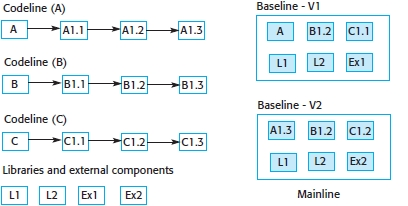
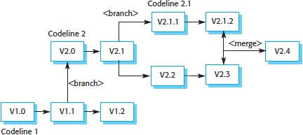

#### COM00144M Software Engineering
# **Week 7 - Quality and Configuration Management**

## **7.0 Table of Contents**

- [**7.0 Table of Contents**](#70-table-of-contents)
- [**7.1 Learning Objectives**](#71-learning-objectives)
- [**7.2 Summary**](#72-summary)
- [**7.3 Quality Management**](#73-quality-management)
  * [**7.3.0 Reading**](#730-reading)
  * [**7.3.1 Quality and Standards**](#731-quality-and-standards)
    + [**Non-Functional Attributes**](#non-functional-attributes)
    + [**Software Standards**](#software-standards)
    + [**Quality Assurance**](#quality-assurance)
- [**7.4 Configuration Management**](#74-configuration-management)
  * [**7.4.0 Reading**](#740-reading)
  * [**7.4.1 Version Management**](#741-version-management)
    + [**Centralised Control Systems**](#centralised-control-systems)
    + [**Distributed Control Systems**](#distributed-control-systems)
  * [**7.4.2 Change Management**](#742-change-management)

---
&emsp;
## **7.1 Learning Objectives**

* **MLO5** - Apply and evaluate quality assurance techniques, including reviews and inspections
* **MLO6** - Understand change management and theory behind configuration management

---
&emsp;
## **7.2 Summary**

Quality assurance involves the use of small team quality reviews and error finding peer inspections to deliver quality software. 

Version control involves keeping track of the different versions of software components that are created as changes are made to them.  There are two commonly used version control types: distributed systems such as GIT, and centralised systems such as Subversion.

Change management involves assessing proposals for changes from system customers and other stakeholders and deciding if it is cost-effective to implement these changes in a new release of a system.

---
&emsp;
## **7.3 Quality Management**

### **7.3.0 Reading**
* *Required: Chapter 24, Software Engineering, Sommerville*
* *Extension: none*

&emsp;
### **7.3.1 Quality and Standards**

Assessing quality of software is largely a **subjective** process. A separate quality management team would decide if an acceptable standard has been reached and whether the software is fit for purpose.

&emsp;
#### **Non-Functional Attributes:**

**Software quality** therefore involves review system tests and consideration of **non-functional attributes**:
* Safety
* Security
* Reliability
* Testability
* Usability
* Portability
* Efficiency
* Complexity

Note that is it not possible to be optimised in all attributes: eg, increasing security could impact efficiency.

&emsp;
#### **Software Standards:**

There are two types of software standard used in software quality management:
* **Product standards** – apply to the product being developed and include document, documentation, and coding standards. They should be designed to be applied and checked in a **cost-effective way**
* **Process standards** – define good software development practice and include, descriptions of required documents, support tools, and design processes. They should include processes to check if product standards have been followed

Good development processes lead to good quality software. However, **standardisation** of processes can sometimes stifle developer creativity and subsequently produce poorer quality software.

&emsp;
#### **Quality Assurance:**

**Quality assurance** involves independent review and inspections of project deliverables:
* **Reviews** – small teams make judgements on the quality of the software and documentation, without the presence of the code authors, in order to improve quality
* **Inspections** – peer reviews focused on finding errors in the program. A domain and language relevant list of common programming errors is often used as a checklist

Where quality assurance is the detailing of processes leading to high quality products, **quality control** is the application of these processes to the product being developed.
	
As issues found in reviews are inevitably shared with the whole team, it is important to develop a **quality culture** where everyone is committed to high product quality and individuals are supported without blame.

A good **quality assurance manager** therefore should have skills such as:
* Attention to detail
* Analytical thinking
* Qualitative writing
* Organisation

---
&emsp;
## **7.4 Configuration Management**

### **7.4.0 Reading**
* *Required: Chapter 25, Software Engineering, Sommerville*
* *Extension: none*

&emsp;
### **7.4.1 Version Management**

**Version management** is about tracking different software versions and managing codelines and baselines:
* **Codeline** – a sequence of source code versions, with each step having modified code
* **Baseline** – a definition of a system, specifying the component versions included

  

Two types of version control system exist, both allowing storage of and access to **component versions**.

&emsp;
#### **Centralised Control Systems:**

The first type are **centralised systems**, where a single **master repository** maintains all versions.
* Developers check out components from the **project repository**
* When changes are completed, developers check in their updated components
* Different version numbers are given to multiple check ins of the same component

&emsp;
#### **Distributed Control Systems:**

The second type are **distributed systems**, where multiple versions of the repository exist **concurrently**.
* A master repository exists on a server which developers **clone** to a private repository
* Developers commit any changes to their **private repository**
* Push these changes from the private repository to their **public repository**
* An integration manager can then pull these into the **definitive project repository** 

A consequence of independent development is the **branching** of codelines. These can be intentional, or a result of a **non-linear** sequence of changes made by multiple developers.
* **Branches** can be created when modifying code to avoid breaking a working system
* **Merges** create a new version of a component by merging branches

  

&emsp;
### **7.4.2 Change Management**

**Change management** controls the evolution of the system by:
* Analysing the benefits and costs of proposed changes
* Approving cost effective changes
* Tracking which components have been changed
* Prioritising urgent changes

The process is started by the submission of **change request form** by a system stakeholder.
* As the request is processed, information is added to it, documenting decisions made
* It also details any recommendations, estimated costs, and relevant dates
* The structure and formality depend on size and type of organisation

Problems and changes are recorded in an **issue tracking system** and discussed in daily meetings.

A **change control board** ultimately decides if it is a cost-effective change to make. Consideration is made regarding the impact of the change from a strategic and organisational perspective:
* Consequence of not making the change
* Any benefits of making the change
* The number of users affected by the change
* Time and cost of making the change
* Impact on the product release cycle

The **derivation** history is a comment at the beginning of a component source code that documents the change request that triggered the change, which additional scripts can process into change reports.